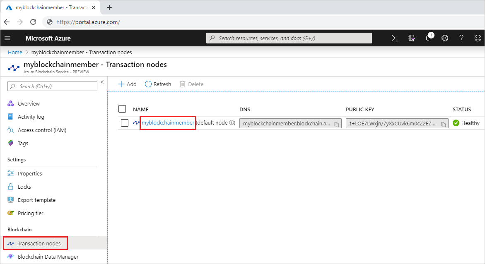
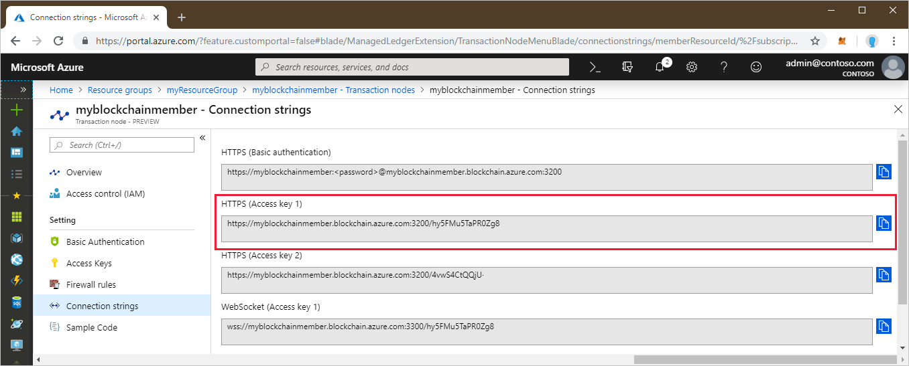
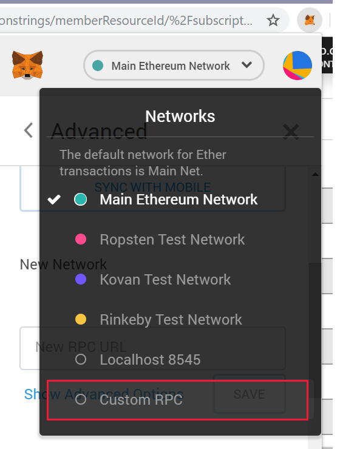
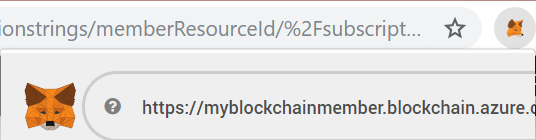
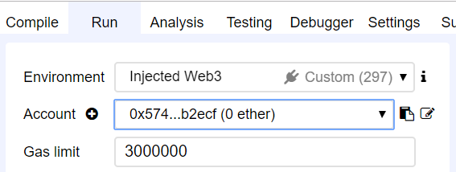
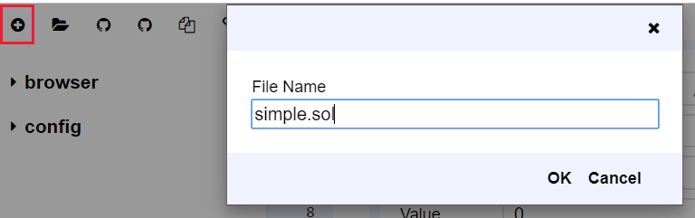
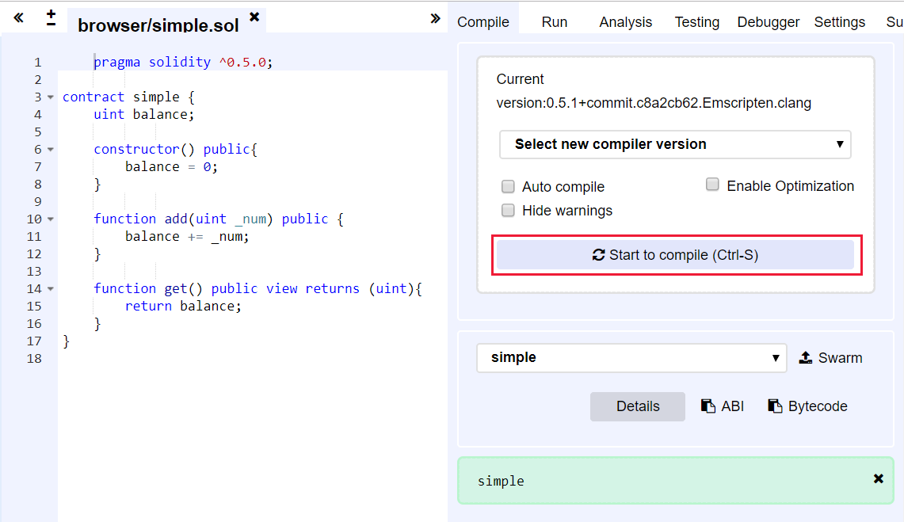
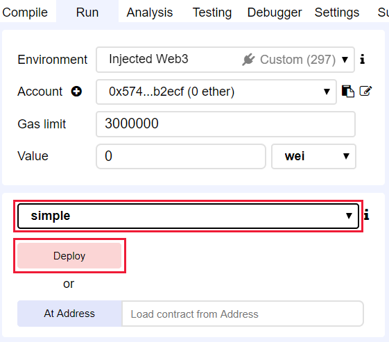
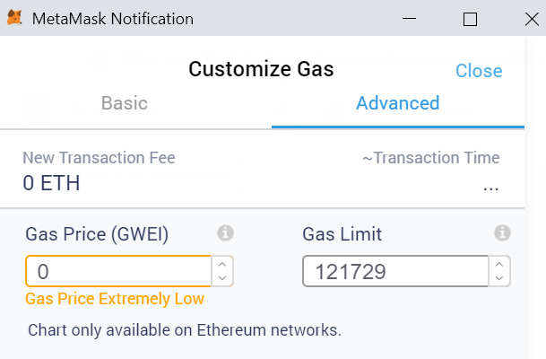
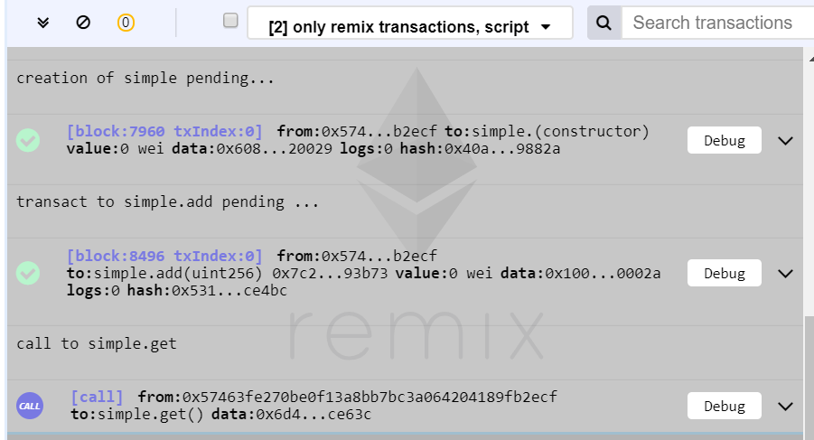

# Quickstart: Use MetaMask to connect and deploy a smart contract

In this quickstart, you'll use MetaMask to connect to an Azure Blockchain Service network and use Remix to deploy a smart contract. Metamask is a browser extension to manage an Ether wallet and perform smart contract actions.

[!INCLUDE [quickstarts-free-trial-note](../../../includes/quickstarts-free-trial-note.md)]

## Prerequisites

* [Create an Azure Blockchain member](create-member.md)
* Install [MetaMask browser extension](https://metamask.io)
* Generate a MetaMask [wallet](https://metamask.zendesk.com/hc/en-us/articles/360015488971-New-to-MetaMask-Learn-How-to-Setup-MetaMask-the-First-Time)

## Get endpoint address

You need the Azure Blockchain Service endpoint address to connect to the blockchain network. You can find the endpoint address and access keys in the Azure portal.

1. Sign in to the [Azure portal](https://portal.azure.com).
1. Navigate to your Azure Blockchain Service member. Select **Transaction nodes** and the default transaction node link.

    

1. Select **Connection strings > Access keys**.
1. Copy the endpoint address from **HTTPS (Access key 1)**. You need the address for the next section.

    

## Connect MetaMask

1. Open MetaMask browser extension and sign in.
1. In the network dropdown, select  **Custom RPC**.

    

1. In **New Network > New RPC URL**, enter your endpoint address copied from the previous section.
1. Select **Save**.

    If connection was successful, the private network is displayed in the network dropdown.

    

## Deploy smart contract

Remix is a browser-based Solidity development environment. Using MetaMask and Remix together, you can deploy and take actions on smart contracts.

1. In your browser, navigate to `https://remix.ethereum.org`.
1. Select **Run**. 

    MetaMask sets your **Environment** to **Injected Web3** and **Account** to your network.

    

1. Select **Create new file**.

    Name the new file `simple.sol`.

    

    Select **OK**.

1. In the Remix editor, paste in the following **simple smart contract** code.

    ```solidity
    pragma solidity ^0.5.0;
             
    contract simple {
        uint balance;
                 
        constructor() public{
            balance = 0;
        }
                 
        function add(uint _num) public {
            balance += _num;
        }
                 
        function get() public view returns (uint){
            return balance;
        }
    }
    ```

    The **simple contract** declares a state variable named **balance**. There are two functions defined. The **add** function adds a number to **balance**. The **get** function returns the value of **balance**.

1. To compile the contract, select the  **Compile > Start to compile**. If successful, a green box with contract name is displayed.

    

1. To execute the contract, select the **Run** tab. Select the **simple** contract then **Deploy**.

    

1. A MetaMask notification is displayed alerting you of insufficient funds to perform the transaction.

    For a public blockchain network, you would need Ether to pay for the transaction cost. Since this is a private network in a consortium, you can set gas price to zero.

1.  Select **Gas Fee > Edit > Advanced**,  set the **Gas Price** to 0.

    

    Select **Save**.

1. Select **Confirm** to deploy the smart contract to the blockchain.
1. In the **Deployed Contracts** section, expand the **simple** contract.

    

    There are two actions **add** and **get** that map to the functions defined in the contract.

1. To perform an **add** transaction on the blockchain, enter a number to add then select **add**.
1. Similar to when you deployed the contract, a MetaMask notification is displayed alerting you of insufficient funds to perform the transaction.

    Since this is a private network in a consortium, we can set gas price to zero.

1.  Select **Gas Fee > Edit > Advanced**,  set the **Gas Price** to 0, and select **Save**.
1. Select **Confirm** to perform the transaction on the blockchain.
1. Select **get** action. This is a call to query node data. A transaction isn't needed.
1. In the debug pane of Remix, you can see details about the transactions on the blockchain.

    

    You can see the **simple** contract creation, transaction for **simple.add**, and call to **simple.get**.

1. You can also see transaction history in MetaMask. Open the MetaMask browser extension.
1. In the **History** section, you can see a log of the deployed contract and transactions.

## Next steps

In this quickstart, you used the MetaMask browser extension to connect to an Azure Blockchain Service transaction node, deploy a smart contract, and send a transaction to the blockchain. Try the next tutorial to deploy and send a transaction using Truffle.

> [!div class="nextstepaction"]
> [Send a transaction](send-transaction.md)