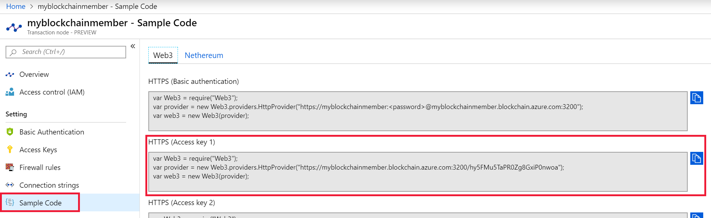

# Quickstart: Use Truffle to connect to a an Azure Blockchain Service network

Truffle is a blockchain development environment you can use to connect to an Azure Blockchain Service node.

[!INCLUDE [quickstarts-free-trial-note](../../../includes/quickstarts-free-trial-note.md)]

## Prerequisites

* [Create an Azure Blockchain member](create-member.md)
* Truffle requires several tools to be installed including [Node.js](https://nodejs.org), [Git](https://git-scm.com/book/en/v2/Getting-Started-Installing-Git), and [Truffle](https://github.com/trufflesuite/truffle).

    To set up quickly on Windows 10, install [Ubuntu on Windows](https://www.microsoft.com/p/ubuntu/9nblggh4msv6) for a Unix Bash shell terminal then install [Truffle](https://github.com/trufflesuite/truffle). The Ubuntu on Windows distribution includes Node.js and Git.

## Create Truffle project

1. Open a Bash shell terminal.
1. Change directory to where you want to create the Truffle project directory. For example,

    ``` bash
    cd /mnt/c
    ```

1. Create a directory for the project and change your path to the new directory. For example,

    ``` bash
    mkdir truffledemo
    cd truffledemo
    ```

1. Install Ethereum JavaScript API web3 in the project folder. Currently, version web3 version 1.0.0-beta.37 is required.

    ``` bash
    npm install web3@1.0.0-beta.37
    ```

    You may receive npm warnings during installation.

1. Initialize the Truffle project.

    ``` bash
    truffle init
    ```

1. Launch Truffle's interactive development console.

    ``` bash
    truffle develop
    ```

    Truffle creates a local development blockchain and provides an interactive console.

## Connect to transaction node

We'll use Web3 to connect to the transaction node. You can get the Web3 connection string from the Azure portal.

1. Sign in to the [Azure portal](https://portal.azure.com).
1. Navigate to your Azure Blockchain service member default transaction node and select **Sample Code > Web3**.
1. Copy the JavaScript from **HTTPS (Access key 1)**. You need the code for Truffle's interactive development console.

    

1. Paste the JavaScript code from the previous step into the Truffle interactive development console. The code creates a web3 object that is connected to your Azure Blockchain Service transaction node.

    Example output:

    ```bash
    truffle(develop)> var Web3 = require("Web3");
    truffle(develop)> var provider = new Web3.providers.HttpProvider("https://myblockchainmember.blockchain.azure.com:3200/hy5FMu5TaPR0Zg8GxiPwned");
    truffle(develop)> var web3 = new Web3(provider);
    truffle(develop)>
     ```

    You can call methods on the **web3** object to interact with your transaction node.

1. Call the **getBlockNumber** method to return the current block number.

    ```bash
    web3.eth.getBlockNumber();
    ```

    Example output:

    ```bash
    truffle(develop)> web3.eth.getBlockNumber();
    18567
    ```
1. Exit the Truffle development console.

    ```bash
    .exit
    ```

## Next steps

In this quickstart, you created a Truffle project to connect to your Azure Blockchain Service default transaction node.

Try the next tutorial to use Truffle to send a transaction to your consortium blockchain network.

> [!div class="nextstepaction"]
> [Send a transaction](send-transaction.md)