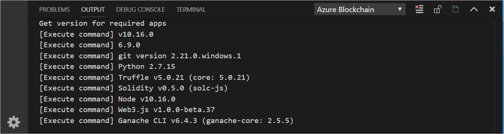
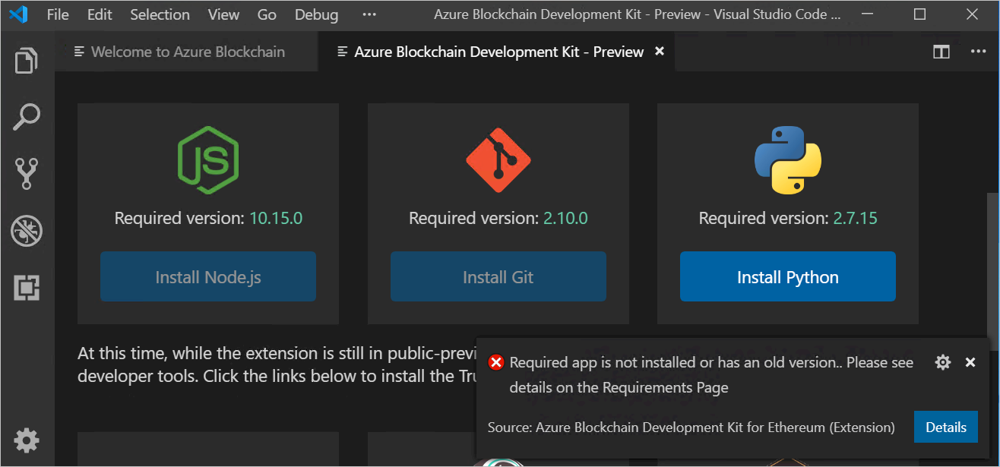
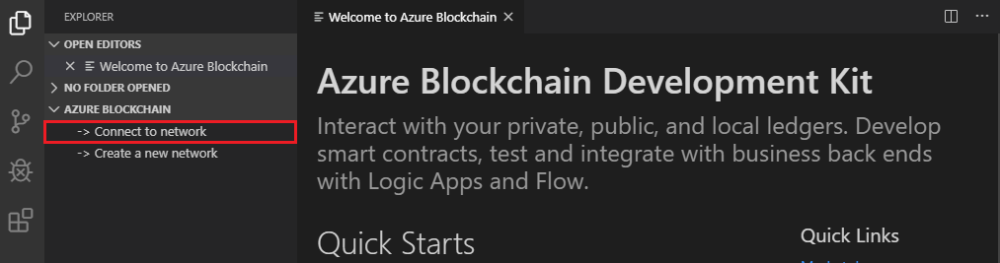
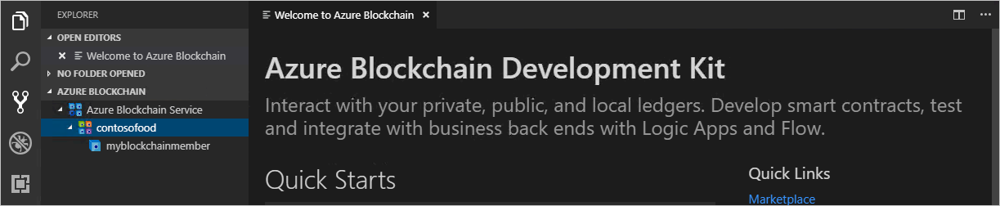

# Quickstart: Use Visual Studio Code to connect to an Azure Blockchain Service consortium network

In this quickstart, you install and use the Azure Blockchain Development Kit for Ethereum Visual Studio Code (VS Code) extension to attach to a consortium on Azure Blockchain Service. The Azure Blockchain Development Kit simplifies how you create, connect, build, and deploy smart contracts on Ethereum blockchain ledgers.

[!INCLUDE [quickstarts-free-trial-note](../../../includes/quickstarts-free-trial-note.md)]

## Prerequisites

* Complete [Quickstart: Create a blockchain member using the Azure portal](create-member.md) or [Quickstart: Create an Azure Blockchain Service blockchain member using Azure CLI](create-member-cli.md)
* [Visual Studio Code](https://code.visualstudio.com/Download)
* [Azure Blockchain Development Kit for Ethereum extension](https://marketplace.visualstudio.com/items?itemName=AzBlockchain.azure-blockchain)
* [Node.js 10.15.x or higher](https://nodejs.org)
* [Git 2.10.x or higher](https://git-scm.com)
* [Python 2.7.15](https://www.python.org/downloads/release/python-2715/) Add python.exe to your path. Having Python version 2.7.15 in your path is required for Azure Blockchain Development Kit.
* [Truffle 5.0.0](https://www.trufflesuite.com/docs/truffle/getting-started/installation)
* [Ganache CLI 6.0.0](https://github.com/trufflesuite/ganache-cli)

On Windows, an installed C++ compiler is required for the node-gyp module. You can use the MSBuild tools:

* If Visual Studio 2017 is installed, configure npm to use the MSBuild tools with the command `npm config set msvs_version 2017 -g`
* If Visual Studio 2019 is installed, set the MS build tools path for npm. For example, `npm config set msbuild_path "C:\Program Files (x86)\Microsoft Visual Studio\2019\Community\MSBuild\Current\Bin\MSBuild.exe"`
* Otherwise, install the stand-alone VS Build tools using `npm install --global windows-build-tools` in an elevated *Run as administrator* command shell.

For more information about node-gyp, see the [node-gyp repository on GitHub](https://github.com/nodejs/node-gyp).

### Verify Azure Blockchain Development Kit environment

Azure Blockchain Development Kit verifies your development environment prerequisites have been met. To verify your development environment:

From the VS Code command palette, choose **Azure Blockchain: Show Welcome Page**.

Azure Blockchain Development Kit runs a validation script that takes about a minute to complete. You can view the output by selecting **Terminal > New Terminal**. In the terminal menu bar, select the **Output** tab and **Azure Blockchain** in the dropdown. Successful validation looks like the following image:

 If you are missing a required tool, a new tab named **Azure Blockchain Development Kit - Preview** lists the required tools with download links.

Install any missing prerequisites before continuing with the quickstart.

## Connect to consortium member

You can connect to consortium members using the Azure Blockchain Development Kit VS Code extension. Once connected to a consortium, you can compile, build, and deploy smart contracts to an Azure Blockchain Service consortium member.

If you don't have access to an Azure Blockchain Service consortium member, complete the prerequisite [Quickstart: Create a blockchain member using the Azure portal](create-member.md) or [Quickstart: Create an Azure Blockchain Service blockchain member using Azure CLI](create-member-cli.md).

1. In the VS Code explorer pane, expand the **Azure Blockchain** extension.
1. Select **Connect to network**.

   

    If prompted for Azure authentication, follow the prompts to authenticate using a browser.
1. Choose **Azure Blockchain Service** in the command palette dropdown.
1. Choose the subscription and resource group associated with your Azure Blockchain Service consortium member.
1. Choose your consortium from the list.

The consortium and blockchain members are listed in the VS Code explorer side bar.

## Next steps

In this quickstart, you used Azure Blockchain Development Kit for Ethereum VS Code extension to attach to a consortium on Azure Blockchain Service. Try the next tutorial to use Azure Blockchain Development Kit for Ethereum to create, build, deploy, and execute a smart contract function via a transaction.

> [!div class="nextstepaction"]
> [Create, build, and deploy smart contracts on Azure Blockchain Service](send-transaction.md)