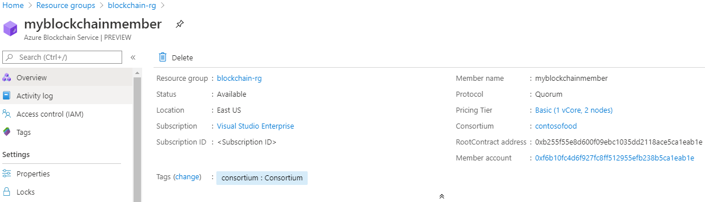

# Quickstart: Create an Azure Blockchain Service member using an Azure Resource Manager template

In this quickstart, you deploy a new blockchain member and consortium in Azure Blockchain Service using an Azure Resource Manager template. An Azure Blockchain Service member is a blockchain node in a private consortium blockchain network. When provisioning a member, you can create or join a consortium network. You need at least one member for a consortium network. The number of blockchain members needed by participants depends on your scenario. Consortium participants may have one or more blockchain members or they may share members with other participants. For more information on consortia, see [Azure Blockchain Service consortium](consortium.md).

[!INCLUDE [About Azure Resource Manager](../../../includes/resource-manager-quickstart-introduction.md)]

If you don't have an Azure subscription, create a [free](https://azure.microsoft.com/free/) account before you begin.

## Prerequisites

None.

## Create a Blockchain Service member

### Review the template

The template used in this quickstart is from [Azure Quickstart Templates](https://azure.microsoft.com/resources/templates/201-blockchain-asaservice/).

:::code language="json" source="~/quickstart-templates/201-blockchain-asaservice/azuredeploy.json" range="1-84" highlight="52-80":::

Azure resources defined in the template:

* [**Microsoft.Blockchain/blockchainMembers**](/azure/templates/microsoft.blockchain/blockchainmembers)

### Deploy the template

1. Select the following link to sign in to Azure and open a template.

    

1. Specify the settings for the Azure Blockchain Service member.

    Setting | Description
    --------|------------
    Subscription | Select the Azure subscription that you want to use for your service. If you have multiple subscriptions, choose the subscription in which you get billed for the resource.
    Resource group | Create a new resource group name or choose an existing one from your subscription.
    Location | Choose a location to create the member. All members of the consortium must be in the same location. Available locations for the deployment are *westeurope, eastus, southeastasia, westeurope, northeurope, westus2*, and *japaneast*.
    Member name | Choose a unique name for the Azure Blockchain Service member. The blockchain member name can only contain lowercase letters and numbers. The first character must be a letter. The value must be between 2 and 20 characters long.
    Consortium name | Enter a unique name. For more information on consortia, see [Azure Blockchain Service consortium](consortium.md).
    Member password | The member account password is used to encrypt the private key for the Ethereum account that is created for your member. You use the member account and member account password for consortium management.
    Sku tier | The pricing tier for your new service. Choose between **Standard** and **Basic** tiers. Use the *Basic* tier for development, testing, and proof of concepts. Use the *Standard* tier for production grade deployments. You should also use the *Standard* tier if you are using Blockchain Data Manager or sending a high volume of private transactions. Changing the pricing tier between basic and standard after member creation is not supported.
    Sku name | The node configuration and cost for your new service.

1. Select **Purchase** to deploy the template.

  The Azure portal is used here to deploy the template. You can also use the Azure PowerShell, Azure CLI, and REST API. To learn other deployment methods, see [Deploy templates](../../azure-resource-manager/templates/deploy-powershell.md).

## Review deployed resources

You can use the Azure portal to view details of the deployed Azure Blockchain Service member. In the portal, go to the resource group containing your Azure Blockchain Service member. Select the blockchain member you created.

## Clean up resources

You can use the blockchain member you created for the next quickstart or tutorial. When no longer needed, you can delete the resources by deleting the resource group you created for the quickstart.

To delete the resource group:

1. In the Azure portal, navigate to **Resource group** in the left navigation pane and select the resource group you want to delete.
2. Select **Delete resource group**. Verify deletion by entering the resource group name and select **Delete**.

## Next steps

In this quickstart, you deployed an Azure Blockchain Service member and a new consortium. Try the next quickstart to use Azure Blockchain Development Kit for Ethereum to attach to an Azure Blockchain Service member.

> [!div class="nextstepaction"]
> [Use Visual Studio Code to connect to Azure Blockchain Service](connect-vscode.md)