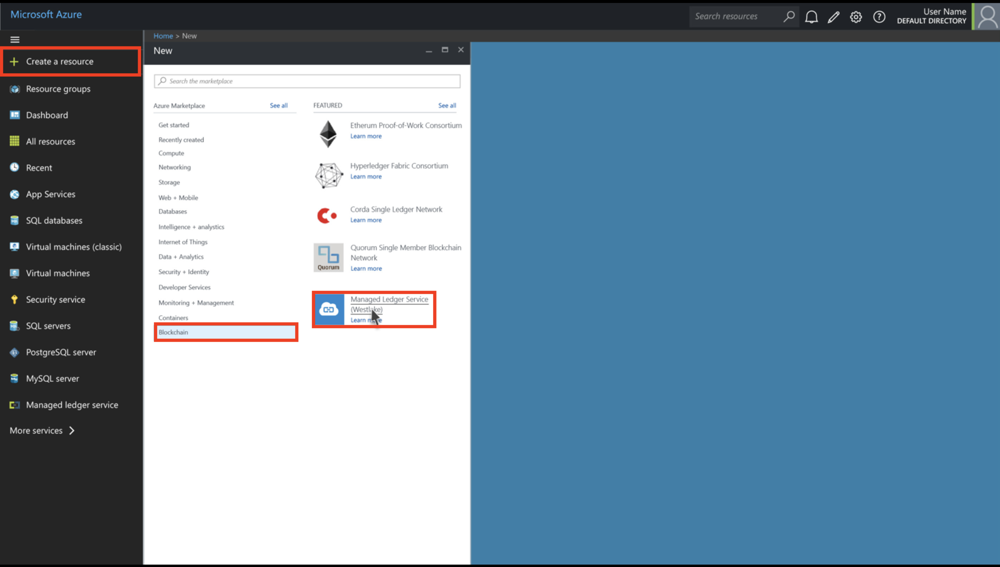
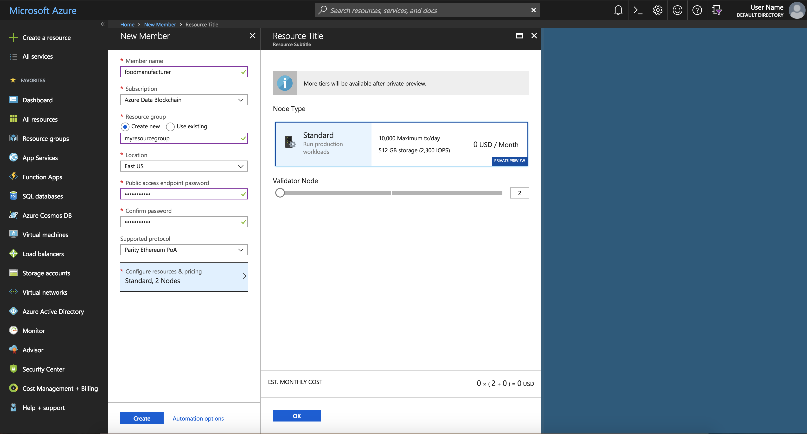
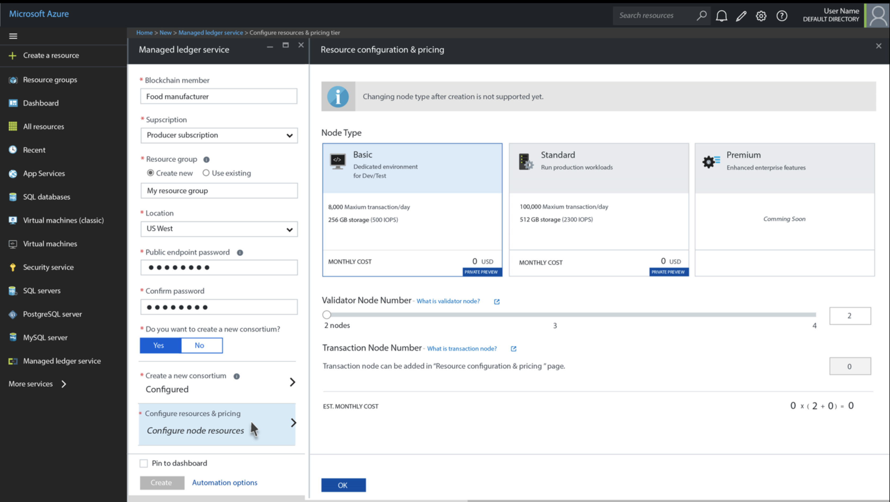

# Quickstart: Create an Azure Blockchain Service using the Azure portal

Azure Blockchain Service is a blockchain platform that you can execute your business logic within a smart contract. This quickstart shows you how to get started by creating a managed ledger using the Azure portal.

[!INCLUDE [quickstarts-free-trial-note](../../../includes/quickstarts-free-trial-note.md)]

## Create a managed ledger

Azure Blockchain Service is created with a defined set of compute and storage resources.

1. Sign in to the [Azure portal](https://portal.azure.com).
1. Select **Create a resource** in the upper left-hand corner of the Azure portal.
1. Select **Blockchain** > **Managed Ledger Service**.

    

1. Fill out the new service details form with the following information:

    

    **Setting** | **Suggested value** | **Field description**
    ------------|---------------------|----------------------
    Blockchain Member | mymanagedledger | Choose a unique name that identifies your Azure Managed Ledger Service. For example, `myblockchain`. The blockchain member name can only contain lowercase letters and numbers. The first character must be a letter. The value must be between 2 and 20 characters long.
    Subscription | Your subscription | Select the Azure subscription that you want to use for your service. If you have multiple subscriptions, choose the subscription in which you get billed for the resource. 
    Resource group | myresourcegroup | A new resource group name or an existing one from your subscription.
    Location | US West | Choose the location that is closest to your users or your other Azure applications.
    Public endpoint password | password123 | Provide a new password for the public endpoint.
    Confirm password | password123 | Confirm the public endpoint password.
    Do you want to create a new consortium? | Yes | Select whether you want to create a new consortium. 
    Consortium name| Food tracking chain | Choose a unique name for the consortium. 
    Description | This is to track the source, transportation, selling of organic food from manufacturer | Description of the consortium. 
    Protocol | Parity POA | Select which protocol you want to use to connect to your blockchain.
    Node type | **Standard, 3 Nodes** | The node configuration for your new service. Select **Standard**. 2 validator nodes is the default setting. Select **OK**.

    

1. Select **Create** to provision the service. Provisioning takes about 10 minutes.
1. Select **Notifications** on the toolbar (the bell icon) to monitor the deployment process.
1. After deployment is successful, you can find the recourse in the **Notifications**, or by typing the blockchain member name in the search box.
1. Click **Overview**, you can check the basic information about your service.(Image here to be added)

    **Name** | **Explanation**
    --- | ---
    Status | The status of the service shows whether if it is deployed successfully
    Node Credential | The public key of the transaction node
    Service DNS | The RPC endpoint address of your service. You may use it to connect your service to third-party application such as MetaMask

## Clean up resources

You can use the member you created for the next quickstart or tutorial. When no longer needed, you can delete the resources by deleting the `myresourcegroup` resource group you created by the Azure Blockchain Service.

To delete the resource group:

1. In the Azure portal, navigate to **Resource group** in the left navigation pane and select the resource group you want to delete.
2. Select **Delete resource group**. Verify deletion by entering the resource group name and select **Delete**.

## Next steps

> [!div class="nextstepaction"]
> [Send a transaction](send-transaction.md)