# Tutorial: Use Blockchain Data Manager to send data to Azure Cosmos DB

In this tutorial, you use Blockchain Data Manager for Azure Blockchain Service to record blockchain transaction data in Azure Cosmos DB. Blockchain Data Manager captures, transforms, and delivers blockchain ledger data to Azure Event Grid Topics. From Azure Event Grid, you use an Azure Logic App connector to create documents in an Azure Cosmos DB database. When finished with tutorial, you can explore blockchain transaction data in Azure Cosmos DB Data Explorer.

[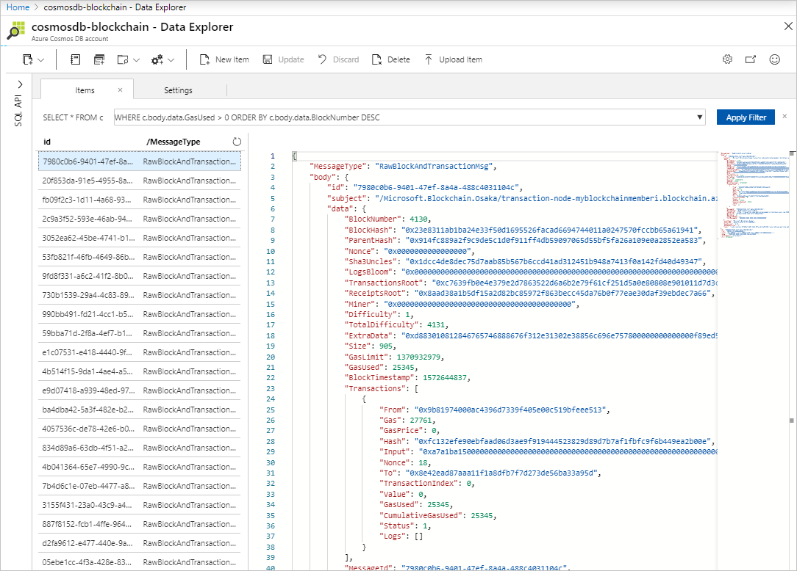](./media/data-manager-cosmosdb/raw-msg.png#lightbox)

In this tutorial, you:

> [!div class="checklist"]
> * Create a Blockchain Data Manager instance
> * Add a blockchain application to decode transaction properties and events
> * Create an Azure Cosmos DB account and database to store transaction data
> * Create an Azure Logic App to connect an Azure Event Grid Topic to Azure Cosmos DB
> * Send a transaction to a blockchain ledger
> * View the decoded transaction data in Azure Cosmos DB

[!INCLUDE [quickstarts-free-trial-note](../../../includes/quickstarts-free-trial-note.md)]

## Prerequisites

* Complete [Quickstart: Create a blockchain member using the Azure portal](create-member.md) or [Quickstart: Create an Azure Blockchain Service blockchain member using Azure CLI](create-member-cli.md)
* Complete [Quickstart: Use Visual Studio Code to connect to an Azure Blockchain Service consortium network](connect-vscode.md). The quickstart guides you though installing [Azure Blockchain Development Kit for Ethereum](https://marketplace.visualstudio.com/items?itemName=AzBlockchain.azure-blockchain) and setting up your blockchain development environment.
* Complete [Tutorial: Use Visual Studio Code to create, build, and deploy smart contracts](send-transaction.md). The tutorial walks through creating a sample smart contract.
* Create an [Event Grid Topic](../../event-grid/custom-event-quickstart-portal.md#create-a-custom-topic)
* Learn about [Event handlers in Azure Event Grid](../../event-grid/event-handlers.md)

## Create instance

A Blockchain Data Manager instance connects and monitors an Azure Blockchain Service transaction node. An instance captures all raw block and raw transaction data from the transaction node. An outbound connection sends blockchain data to Azure Event Grid. You configure a single outbound connection when you create the instance.

1. Sign in to the [Azure portal](https://portal.azure.com).
1. Go to the Azure Blockchain Service member you created in the prerequisite [Quickstart: Create a blockchain member using the Azure portal](create-member.md). Select **Blockchain Data Manager**.
1. Select **Add**.

    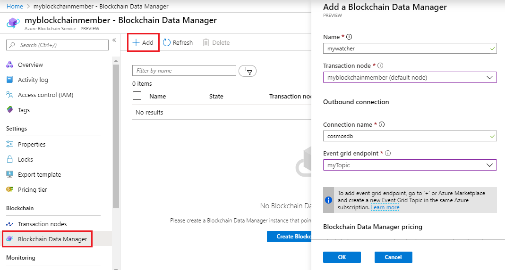

    Enter the following details:

    Setting | Example | Description
    --------|---------|------------
    Name | mywatcher | Enter a unique name for a connected Blockchain Data Manager.
    Transaction node | myblockchainmember | Choose the default transaction node of the Azure Blockchain Service member you created in the prerequisite.
    Connection name | cosmosdb | Enter a unique name of the outbound connection where blockchain transaction data is sent.
    Event grid endpoint | myTopic | Choose an event grid topic you created in the prerequisite. Note: The Blockchain Data Manager instance and the event grid topic must be in the same subscription.

1. Select **OK**.

    It takes less than a minute to create a Blockchain Data Manager instance. After the instance is deployed, it is automatically started. A running Blockchain Data Manager instance captures blockchain events from the transaction node and sends data to event grid.

## Add application

Add the **helloblockchain** blockchain application so that Blockchain Data Manager decodes event and property state. Blockchain Data Manager requires the smart contract ABI and bytecode file to add the application.

### Get contract ABI and bytecode

The contract ABI defines the smart contract interfaces. It describes how to interact with the smart contract. You can use the [Azure Blockchain Development Kit for Ethereum extension](https://marketplace.visualstudio.com/items?itemName=AzBlockchain.azure-blockchain) to copy the contract ABI to the clipboard.

1. In the Visual Studio Code explorer pane, expand the **build/contracts** folder of the **helloblockchain** Solidity project you created in the prerequisite [Tutorial: Use Visual Studio Code to create, build, and deploy smart contracts](send-transaction.md).
1. Right-click the contract metadata JSON file. The file name is the smart contract name followed by the **.json** extension.
1. Select **Copy Contract ABI**.

    

    The contract ABI is copied to the clipboard.

1. Save the **abi** array as a JSON file. For example, *abi.json*. You use the file in a later step.

Blockchain Data Manager requires the deployed bytecode for the smart contract. The deployed bytecode is different than the smart contract bytecode. You use the Azure blockchain development kit extension to copy the bytecode to the clipboard.

1. In the Visual Studio Code explorer pane, expand the **build/contracts** folder of your Solidity project.
1. Right-click the contract metadata JSON file. The file name is the smart contract name followed by the **.json** extension.
1. Select **Copy Transaction Bytecode**.

    

    The bytecode is copied to the clipboard.

1. Save the **bytecode** value as a JSON file. For example, *bytecode.json*. You use the file in a later step.

The following example shows *abi.json* and *bytecode.json* files open in the VS Code editor. Your files should look similar.

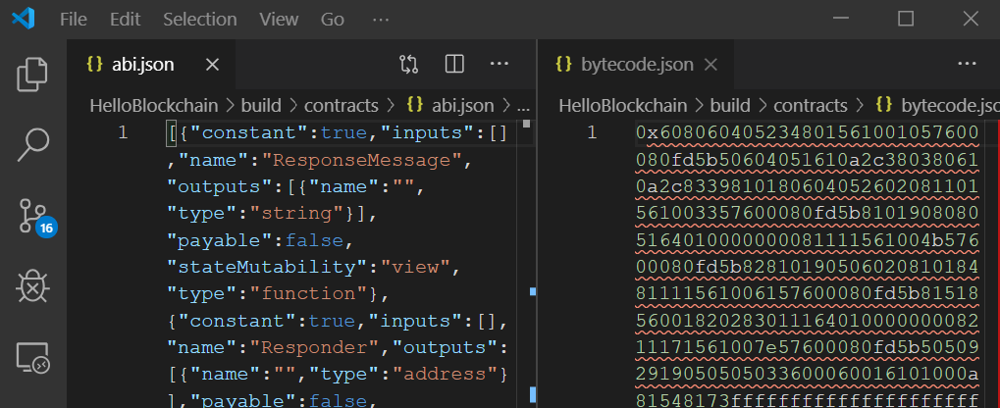

### Create contract ABI and bytecode URL

Blockchain Data Manager requires the contract ABI and bytecode files to be accessible by a URL when adding an application. You can use an Azure Storage account to provide a privately accessible URL.

#### Create storage account

[!INCLUDE [storage-create-account-portal-include](../../../includes/storage-create-account-portal-include.md)]

#### Upload contract files

1. Create a new container for the storage account. Select **Containers > Container**.

    

    | Setting | Description |
    |---------|-------------|
    | Name  | Name the container. For example, *smartcontract* |
    | Public access level | Choose *Private (no anonymous access)* |

1. Select **OK** to create the container.
1. Select the container then select **Upload**.
1. Choose both JSON files you created in the [Get Contract ABI and bytecode](#get-contract-abi-and-bytecode) section.

    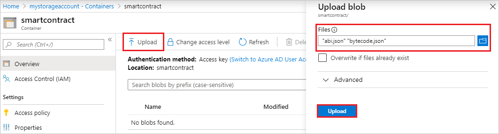

    Select **Upload**.

#### Generate URL

For each blob, generate a shared access signature.

1. Select the ABI JSON blob.
1. Select **Generate SAS**
1. Set desired access signature expiration then select **Generate blob SAS token and URL**.

    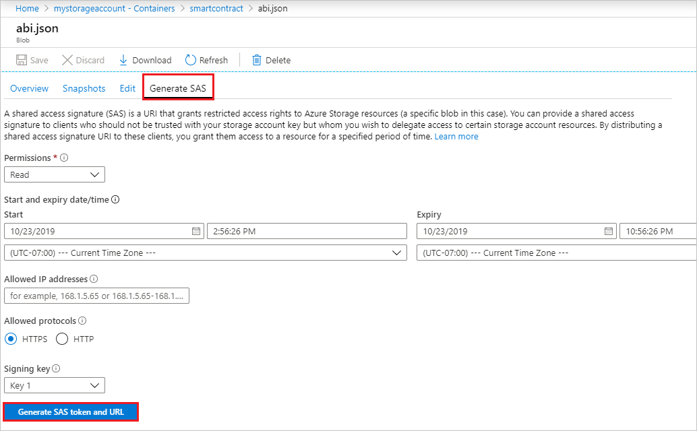

1. Copy the **Blob SAS URL** and save it for the next section.
1. Repeat the [Generate URL](#generate-url) steps for the bytecode JSON blob.

### Add helloblockchain application to instance

1. Select your Blockchain Data Manager instance from the instance list.
1. Select **Blockchain applications**.
1. Select **Add**.

    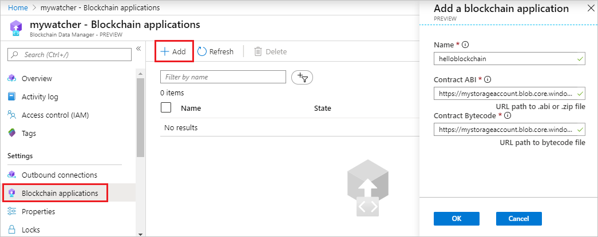

    Enter the name of the blockchain application and the smart contract ABI and bytecode URLs.

    Setting | Description
    --------|------------
    Name | Enter a unique name for the blockchain application to track.
    Contract ABI | URL path to the Contract ABI file. For more information, see [Create contract ABI and bytecode URL](#create-contract-abi-and-bytecode-url).
    Contract Bytecode | URL path to bytecode file. For more information, see [Create contract ABI and bytecode URL](#create-contract-abi-and-bytecode-url).

1. Select **OK**.

    Once the application is created, the application appears in the list of blockchain applications.

    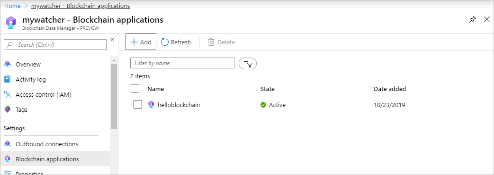

You can delete the Azure Storage account or use it to configure more blockchain applications. If you wish to delete the Azure Storage account, you can delete the resource group. Deleting the resource group also deletes the associated storage account, and any other resources associated with the resource group.

## Create Azure Cosmos DB

[!INCLUDE [cosmos-db-create-storage-account](../../../includes/cosmos-db-create-dbaccount.md)]

### Add a database and container

You can use the Data Explorer in the Azure portal to create a database and container.

1. Select **Data Explorer** from the left navigation on your Azure Cosmos DB account page, and then select **New Container**.
1. In the **Add container** pane, enter the settings for the new container.

    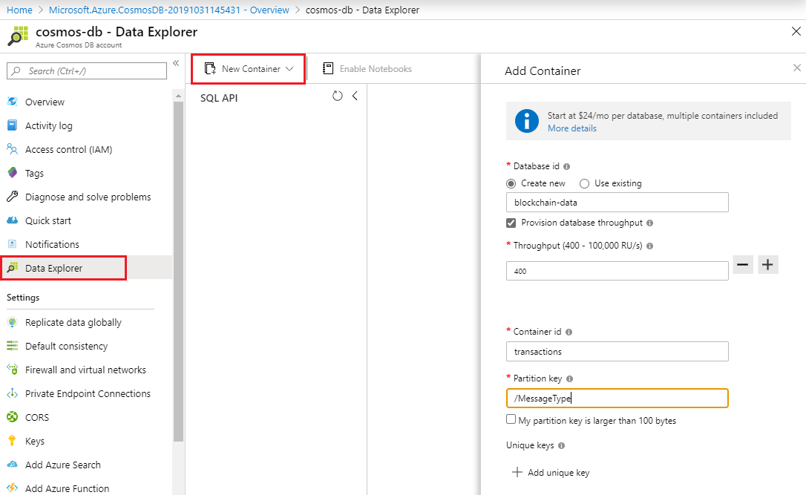

    | Setting | Description
    |---------|-------------|
    | Database ID | Enter **blockchain-data** as the name for the new database. |
    | Throughput | Leave the throughput at **400** request units per second (RU/s). If you want to reduce latency, you can scale up the throughput later.|
    | Container ID | Enter **Messages** as the name for your new container. |
    | Partition key | Use **/MessageType** as the partition key. |

1. Select **OK**. The Data Explorer displays the new database and the container that you created.

## Create Logic App

Azure Logic Apps helps you schedule and automate business processes and workflows when you need to integrate systems and services. You can use a logic app to connect Event Grid to Azure Cosmos DB.

1. In the [Azure portal](https://portal.azure.com), select **Create a resource** > **Integration** > **Logic App**.
1. Provide details on where to create your logic app. After you're done, select **Create**.

    For more information on creating logic apps, see [Create automated workflows with Azure Logic Apps](../../logic-apps/quickstart-create-first-logic-app-workflow.md).

1. After Azure deploys your app, select your logic app resource.
1. In the Logic Apps Designer, under **Templates**, select **Blank Logic App**.

### Add Event Grid trigger

Every logic app must start with a trigger, which fires when a specific event happens or when a specific condition is met. Each time the trigger fires, the Logic Apps engine creates a logic app instance that starts and runs your workflow. Use an Azure Event Grid trigger to sends blockchain transaction data from Event Grid to Cosmos DB.

1. In the Logic Apps Designer, search for and select the **Azure Event Grid** connector.
1. From the **Triggers** tab, select **When a resource event occurs**.
1. Create an API connection to your Event Grid Topic.

    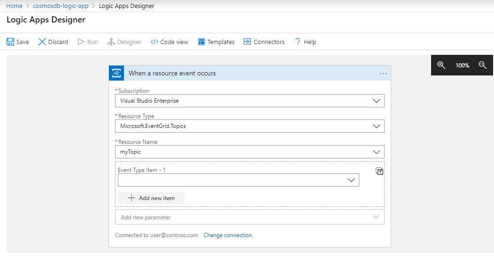

    | Setting | Description
    |---------|-------------|
    | Subscription | Choose the subscription that contains the Event Grid Topic. |
    | Resource Type | Choose **Microsoft.EventGrid.Topics**. |
    | Resource Name | Choose the name of the Event Grid Topic where Blockchain Data Manager is sending transaction data messages. |

### Add Cosmos DB action

Add an action to create a document in Cosmos DB for each transaction. Use the transaction message type as the partition key to categorize the messages.

1. Select **New step**.
1. On **Choose an action**, search for **Azure Cosmos DB**.
1. Choose **Azure Cosmos DB > Actions > Create or update document**.
1. Create an API connection to your Cosmos DB database.

    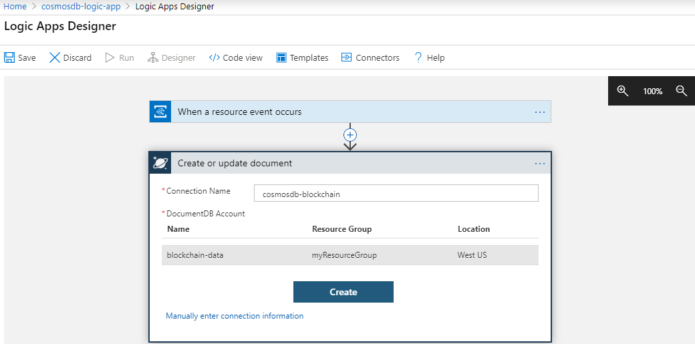

    | Setting | Description
    |---------|-------------|
    | Connection Name | Choose the subscription that contains the Event Grid Topic. |
    | DocumentDB Account | Choose the DocumentDB account you created in the [Create Azure Cosmos DB account](#create-azure-cosmos-db) section. |

1. Enter the **Database ID** and **Collection ID** for your Azure Cosmos DB that you created previously in the [Add a database and container](#add-a-database-and-container) section.

1. Select the **Document** setting. In the *Add dynamic content* pop-out, select **Expression** and copy and paste the following expression:

    ```
    addProperty(triggerBody()?['data'], 'id', utcNow())
    ```

    The expression gets the data portion of the message and sets the ID  to a timestamp value.

1. Select **Add new parameter** and choose **Partition key value**.
1. Set the **Partition key value** to `"@{triggerBody()['data']['MessageType']}"`. The value must be surrounded by double quotes.

    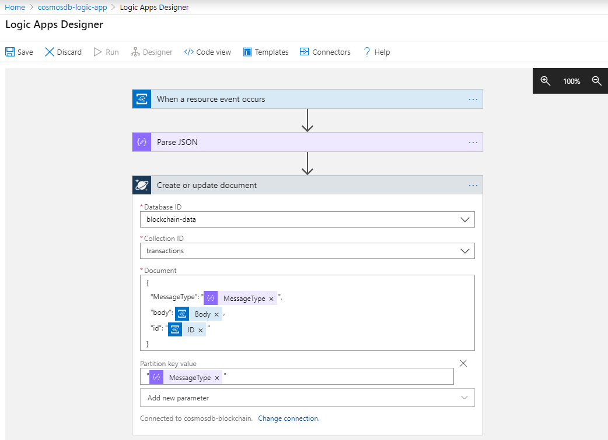

    The value sets the partition key to the transaction message type.

1. Select **Save**.

The logic app monitors the Event Grid Topic. When a new transaction message is sent from Blockchain Data Manager, the logic app creates a document in Cosmos DB.

## Send a transaction

Next, send a transaction to the blockchain ledger to test what you created. Use the **HelloBlockchain** contract's **SendRequest** function you created in the prerequisite [Tutorial: Use Visual Studio Code to create, build, and deploy smart contracts](send-transaction.md).

1. Use the Azure Blockchain Development Kit smart contract interaction page to call the **SendRequest** function. Right-click **HelloBlockchain.sol** and choose **Show Smart Contract Interaction Page** from the menu.

    

1. Choose **SendRequest** contract action and enter **Hello, Blockchain!** for the **requestMessage** parameter. Select **Execute** to call the **SendRequest** function via a transaction.

    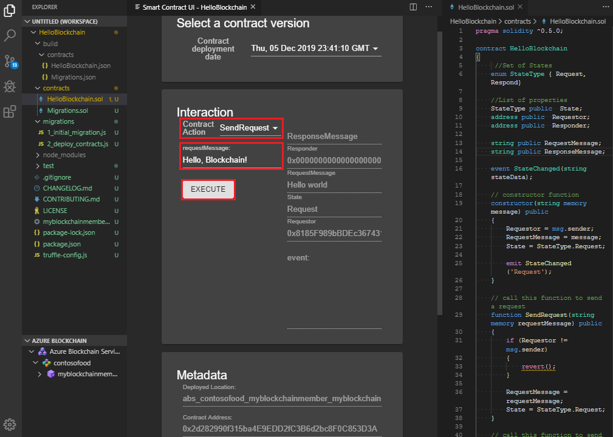

The SendRequest function sets the **RequestMessage** and **State** fields. The current state for **RequestMessage** is the argument you passed **Hello, Blockchain**. The **State** field value remains **Request**.

## View transaction data

Now that you have connected your Blockchain Data Manager to Azure Cosmos DB, you can view the blockchain transaction messages in Cosmos DB Data Explorer.

1. Go to the Cosmos DB Data Explorer view. For example, **cosmosdb-blockchain > Data Explorer > blockchain-data > Messages > Items**.

    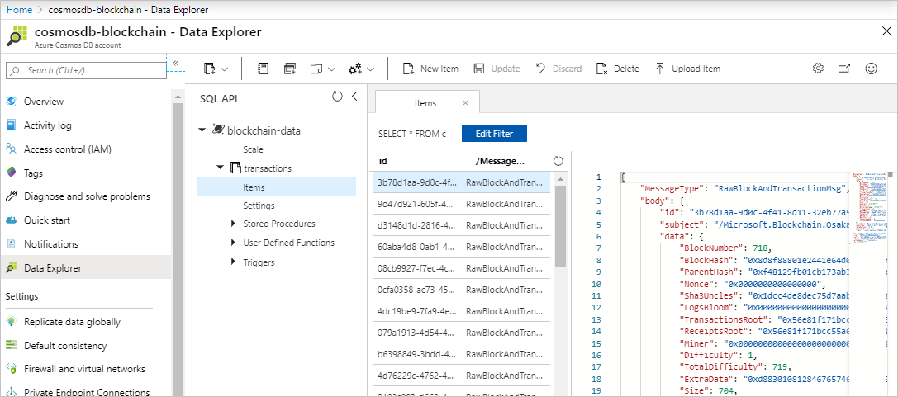

    Data Explorer lists the blockchain data messages that were created in the Cosmos DB database.

1. Browse through the messages by selecting item ID and find the message with the matching transaction hash.

    [](./media/data-manager-cosmosdb/raw-msg.png#lightbox)

    The raw transaction message contains detail about the transaction. However, the property information is encrypted.

    Since you added the HelloBlockchain smart contract to the Blockchain Data Manager instance, a **ContractProperties** message type is also sent that contains decoded property information.

1. Find the **ContractProperties** message for the transaction. It should be the next message in the list.

    [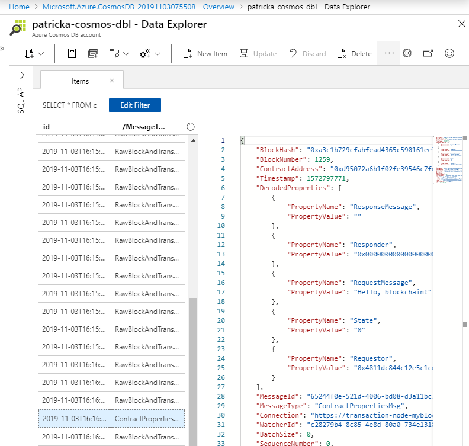](./media/data-manager-cosmosdb/properties-msg.png#lightbox)

    The **DecodedProperties** array contains the properties of the transaction.

Congratulations! You have successfully created a transaction message explorer using Blockchain Data Manager and Azure Cosmos DB.

## Clean up resources

When no longer needed, you can delete the resources and resource groups you used for this tutorial. To delete a resource group:

1. In the Azure portal, navigate to **Resource group** in the left navigation pane and select the resource group you want to delete.
1. Select **Delete resource group**. Verify deletion by entering the resource group name and select **Delete**.

## Next steps

Learn more about integrating with blockchain ledgers.

> [!div class="nextstepaction"]
> [Using the Ethereum Blockchain connector with Azure Logic Apps](ethereum-logic-app.md)
