# Configure Blockchain Data Manager using the Azure portal

Configure Blockchain Data Manager for Azure Blockchain Service to capture blockchain data send it to an Azure Event Grid Topic.

To configure a Blockchain Data Manager instance, you:

* [Create a Blockchain Data Manager instance](#create-instance) for an Azure Blockchain Service transaction node
* [Create an outbound connection](#create-outbound-connection) to an Azure Event Grid Topic
* [Add a blockchain application](#add-blockchain-application)
* [Start the Blockchain Data Manager instance](#start-instance)

## Prerequisites

* Complete [Quickstart: Create a blockchain member using the Azure portal](create-member.md) or [Quickstart: Create an Azure Blockchain Service blockchain member using Azure CLI](create-member-cli.md)
* Learn about [Event handlers in Azure Event Grid](../../event-grid/event-handlers.md)

## Create instance

A Blockchain Data Manager instance connects and monitors an Azure Blockchain Service transaction node. Only users with access to the transaction node can create a connection. An instance captures all raw block and raw transaction data from the transaction node.

1. Sign in to the [Azure portal](https://portal.azure.com).
1. Go to the Azure Blockchain Service member you want to connect to Blockchain Data Manager. Select **Blockchain Data Manager**.
1. Select **Add**.

    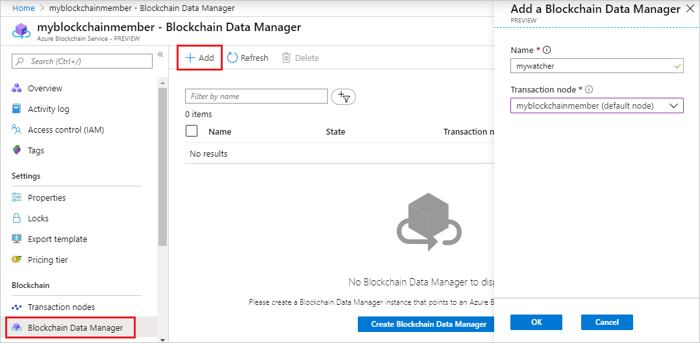

    Enter the name for the instance and select the Azure Blockchain Service transaction node.

    Setting | Description
    --------|------------
    Name | Enter a unique name for a connected Blockchain Data Manager. The Blockchain Data Manager name can contain lower case letters and numbers and has a maximum length of 20 characters.
    Transaction node | Choose a transaction node. Only transaction nodes you have read access are listed.

1. Select **OK**.

    It takes less than a minute to create a Blockchain Data Manager instance. The new instance appears in the list of Blockchain Data Manager instances for the Azure Blockchain Service member.

    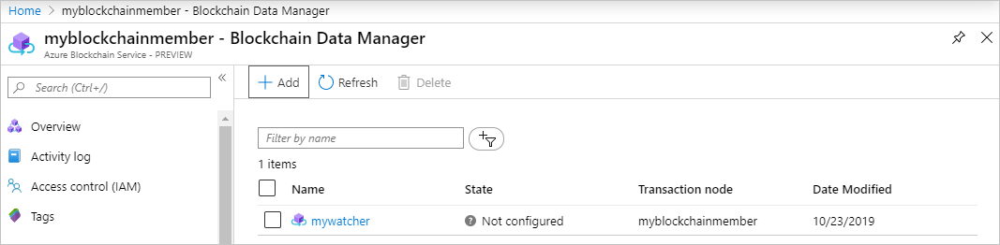

## Create outbound connection

An outbound connection sends blockchain data to Azure Event Grid. Blockchain Data Manager supports multiple Event Grid Topic outbound connections for any given Blockchain Data Manager instance. You can send blockchain data to a single destination or send blockchain data to multiple destinations.

1. Select your Blockchain Data Manager instance from the instance list.
1. Select **Outbound connections**.
1. Select **Add**.

    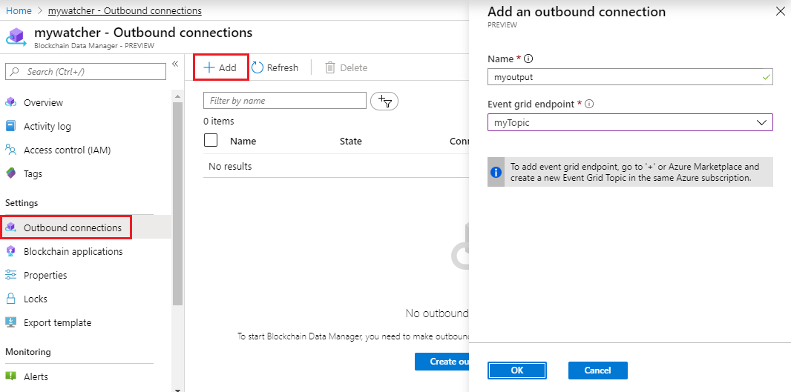

    Enter the name for the outbound connection and select the Event Grid endpoint from the dropdown list.

    Setting | Description
    --------|------------
    Name | Enter a unique name of the outbound connection where blockchain transaction data is sent.
    Event grid endpoint | Choose an event grid topic in the same subscription as the Blockchain Data Manager instance.

1. Select **OK**.

    The new outbound connection appears in the list of outbound connections for the Blockchain Data Manager instance.

    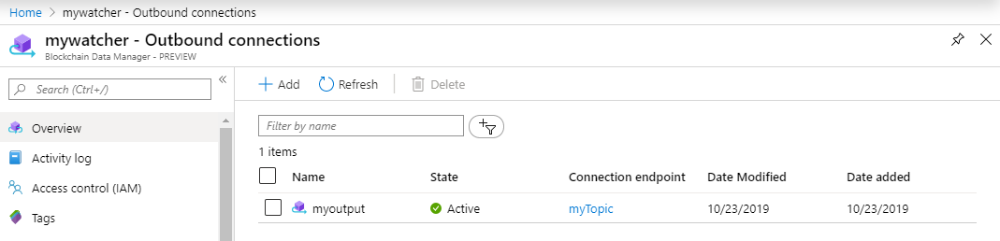

## Add blockchain application

If you add a blockchain application, Blockchain Data Manager decodes event and property state for the application. Otherwise, only raw block and raw transaction data is sent. Blockchain Data Manager also discovers contract addresses when the contract is deployed. You can add multiple blockchain applications to a Blockchain Data Manager instance.

Blockchain Data Manager requires a smart contract ABI and bytecode file to add the application.

### Get Contract ABI and bytecode

The contract ABI defines the smart contract interfaces. It describes how to interact with the smart contract. You can use the [Azure Blockchain Development Kit for Ethereum extension](https://marketplace.visualstudio.com/items?itemName=AzBlockchain.azure-blockchain) to copy the contract ABI to the clipboard.

1. In the Visual Studio Code explorer pane, expand the **build/contracts** folder of your Solidity project.
1. Right-click the contract metadata JSON file. The file name is the smart contract name followed by the **.json** extension.
1. Select **Copy Contract ABI**.

    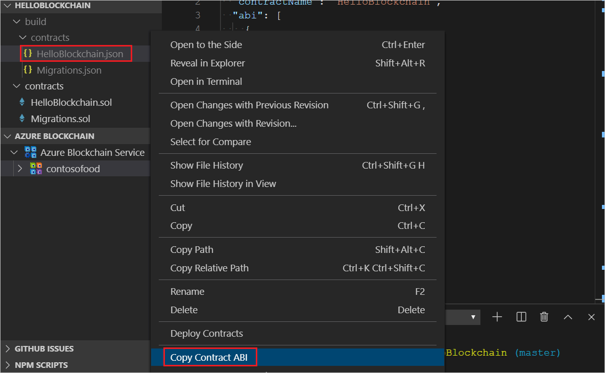

    The contract ABI is copied to the clipboard.

1. Save the **abi** array as a JSON file. For example, *abi.json*. You use the file in a later step.

The contract bytecode is the compiled smart contract executed by the Ethereum virtual machine. You can use the extension to copy the contract bytecode to the clipboard.

1. In the Visual Studio Code explorer pane, expand the **build/contracts** folder of your Solidity project.
1. Right-click the contract metadata JSON file. The file name is the smart contract name followed by the **.json** extension.
1. Select **Copy Contract Bytecode**.

    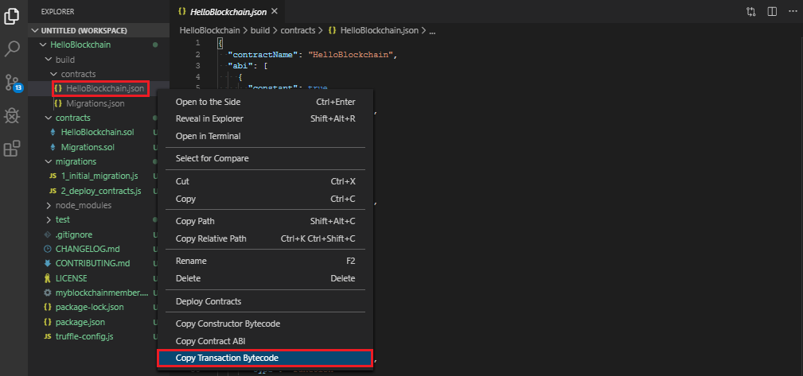

    The contract bytecode is copied to the clipboard.

1. Save the **bytecode** value as a JSON file. For example, *bytecode.json*. Save only the hexadecimal value. You use the file in a later step.

### Create contract ABI and bytecode URL

Blockchain Data Manager requires the contract ABI and bytecode files to be accessible by a URL when adding an application. You can use an Azure Storage account to provide a privately accessible URL.

#### Create storage account

[!INCLUDE [storage-create-account-portal-include](../../../includes/storage-create-account-portal-include.md)]

#### Upload contract files

1. Create a new container for the storage account. Select **Containers > Container**.

    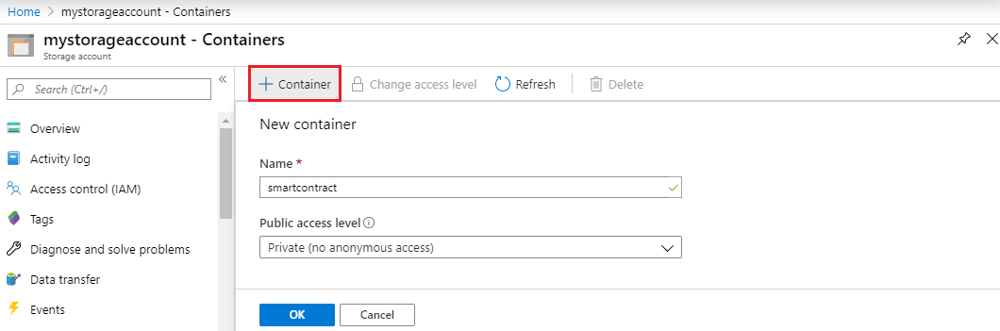

    | Field | Description |
    |-------|-------------|
    | Name  | Name the container. For example, *smartcontract* |
    | Public access level | Choose *Private (no anonymous access)* |

1. Select **OK** to create the container.
1. Select the container then select **Upload**.
1. Choose both JSON files you created in the [Get Contract ABI and bytecode](#get-contract-abi-and-bytecode) section.

    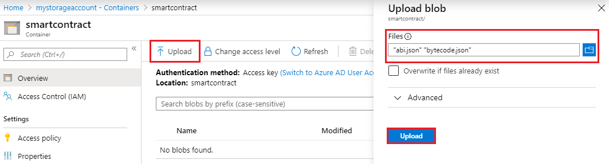

    Select **Upload**.

#### Generate URL

For each blob, generate a shared access signature.

1. Select the ABI JSON blob.
1. Select **Generate SAS**
1. Set desired access signature expiration then select **Generate blob SAS token and URL**.

    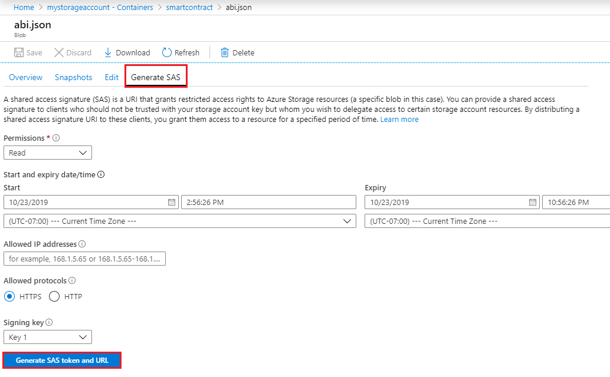

1. Copy the **Blob SAS URL** and save it for the next section.
1. Repeat the [Generate URL](#generate-url) steps for the bytecode JSON blob.

### Add application to instance

1. Select your Blockchain Data Manager instance from the instance list.
1. Select **Blockchain applications**.
1. Select **Add**.

    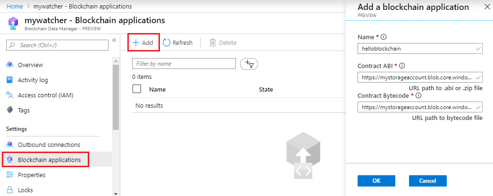

    Enter the name of the blockchain application and the smart contract ABI and bytecode URLs.

    Setting | Description
    --------|------------
    Name | Enter a unique name for the blockchain application to track.
    Contract ABI | URL path to the Contract ABI file. For more information, see [Create contract ABI and bytecode URL](#create-contract-abi-and-bytecode-url).
    Contract Bytecode | URL path to bytecode file. For more information, see [Create contract ABI and bytecode URL](#create-contract-abi-and-bytecode-url).

1. Select **OK**.

    Once the application is created, the application appears in the list of blockchain applications.

    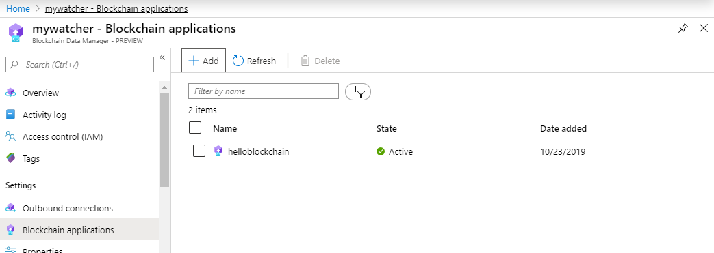

You can delete the Azure Storage account or use it to configure more blockchain applications. If you wish to delete the Azure Storage account, you can delete the resource group. Deleting the resource group also deletes the associated storage account, and any other resources associated with the resource group.

## Start instance

When running, a Blockchain Manager instance captures blockchain events from the defined inputs and sends data to the outbound connections.

1. Go to **Overview** and select **Start**.

    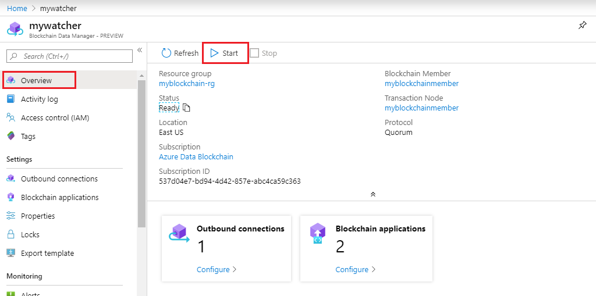

    Once started, the **Status** changes to **Running**.

## Next steps

Learn more about [Event handlers in Azure Event Grid](../../event-grid/event-handlers.md).
