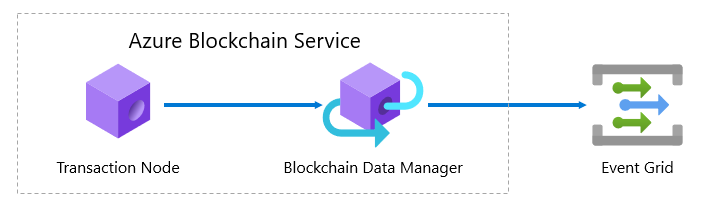

# What is Blockchain Data Manager for Azure Blockchain Service?

Blockchain Data Manager captures, transforms, and delivers Azure Blockchain Service transaction data to Azure Event Grid Topics providing reliable and scalable blockchain ledger integration with Azure services.

In most enterprise blockchain scenarios, a blockchain ledger is one part of a solution. For example, to transfer an asset from one entity to another, you need a mechanism for submitting the transaction. You then need a mechanism for reading ledger data to ensure the transaction occurred, was accepted, and the resulting state changes are then integrated with your end-to-end solution. In this example, if you write a smart contract to transfer assets, you can use Blockchain Data Manager to integrate off-chain applications and data stores. For the asset transfer example, when an asset is transferred on the blockchain, events and property state changes are delivered by Blockchain Data Manager via Event Grid. You can then use multiple possible event handlers for Event Grid to store blockchain data off-chain or react to state changes in real time.

Blockchain Data Manager performs three main functions: capture, transform, and deliver.

## Capture

Each Blockchain Data Manager instance connects to one Azure Blockchain Service member transaction node. Only users with access to the transaction node can create a connection ensuring proper access control to customer data. A Blockchain Data Manager instance reliably captures all raw block and raw transaction data from the transaction node and can scale to support enterprise workloads.

## Transform

You can use Blockchain Data Manager to decode event and property state by configuring smart contract applications within Blockchain Data Manager. To add a smart contract, you provide the contract ABI and bytecode. Blockchain Data Manager uses the smart contract artifacts to decode and discover contract addresses. After adding the blockchain application to the instance, Blockchain Data Manager dynamically discovers the smart contract address when the smart contract is deployed to the consortium and sends decoded event and property state to configured destinations.

## Deliver

Blockchain Data Manager supports multiple Event Grid Topic outbound connections for any given Blockchain Data Manager instance. You can send blockchain data to a single destination or send blockchain data to multiple destinations. Using Blockchain Data Manager, you can build a scalable event-based data publishing solution for any blockchain deployment.

## Configuration options

You can configure Blockchain Data Manager to meet the needs of your solution. For example, you can provision:

* A single Blockchain Data Manager instance for an Azure Blockchain Service member.
* A Blockchain Data Manager instance per Azure Blockchain Service transaction node. For example, private transaction nodes can have their own Blockchain Data Manager instance to maintain confidentiality.
* A Blockchain Data Manager instance can support multiple output connections. One Blockchain Data Manager instance can be used to manage all data publishing integration points for an Azure Blockchain Service member.

## Next steps

Try [creating a Blockchain Data Manager instance](data-manager-portal.md) for an Azure Blockchain Service member.
