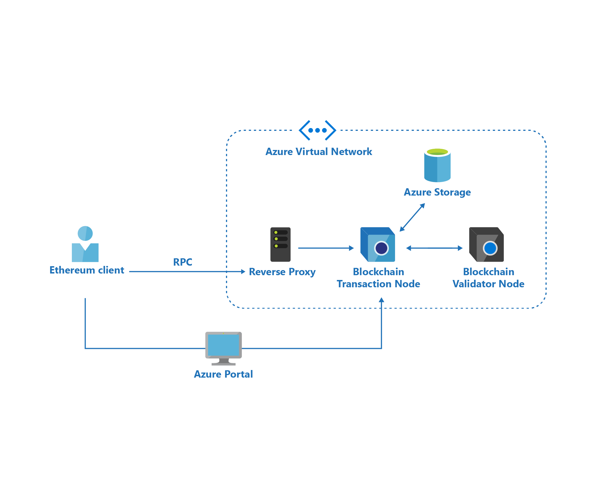
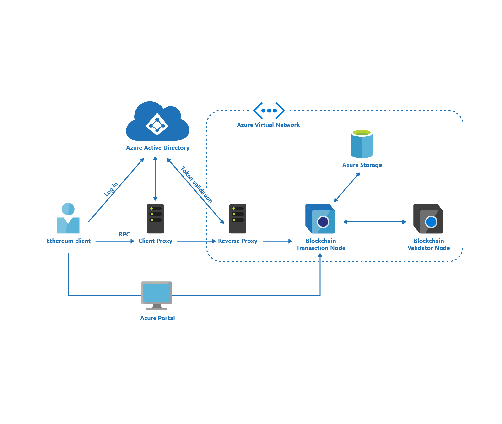

# Azure Blockchain Service security

Azure Blockchain Service uses several Azure capabilities to keep your data secure and available. Data is secured using isolation, encryption, and authentication.

## Isolation

Azure Blockchain Service resources are isolated in a private virtual network. Each transaction and validation node is a virtual machine (VM). VMs in one virtual network cannot communicate directly to VMs in a different virtual network. Isolation ensures communication remains private within the virtual network. For more information on Azure virtual network isolation, see [isolation in the Azure Public Cloud](../../security/azure-isolation.md#networking-isolation).

## Encryption

User data is stored in Azure storage. User data is encrypted in motion and at rest for security and confidentiality. For more information, see: [Azure Storage security guide](../../storage/common/storage-security-guide.md).

## Authentication

Transactions can be sent to blockchain nodes via an RPC endpoint. Clients communicate with a transaction node using a reverse proxy server that handles user authentication and encrypts data over SSL.

There are three modes of authentication for RPC access.

### Basic authentication

Basic authentication uses an HTTP authentication header containing the user name and password. User name is the name of the blockchain node. Password is set during provisioning of a member or node. The password can be changed using the Azure portal or CLI.

### Access keys

Access keys use a randomly generated string included in the endpoint URL. Two access keys help enable key rotation. Keys can be regenerated from the Azure portal and CLI.

### Azure Active Directory

Azure Active Directory (Azure AD) uses a claim-based authentication mechanism where the user is authenticated by Azure AD using Azure AD user credentials. Azure AD provides cloud-based identity management and allows customers to use a single identity across an entire enterprise and access applications on the cloud. Azure Blockchain Service integrates with Azure AD enabling ID federation, single sign-on and multi-factor authentication. You can assign users, groups, and application roles in your organization for blockchain member and node access.

The Azure AD client proxy is available on [GitHub](https://github.com/Microsoft/azure-blockchain-connector/releases). The client proxy directs the user to the Azure AD sign-in page and obtains a bearer token upon successful authentication. Subsequently, the user connects an Ethereum client application such as Geth or Truffle to the client proxy's endpoint. Finally, when a transaction is submitted, the client proxy injects the bearer token in the http header and the reverse proxy validates the token using OAuth protocol.

## Keys and Ethereum accounts

When provisioning an Azure Blockchain Service member, an Ethereum account and a public and private key pair is generated. The private key is used to send transactions to the blockchain. The Ethereum account is the last 20 bytes of the public key's hash. The Ethereum account is also called a wallet.

The private and public key pair is stored as a keyfile in JSON format. The private key is encrypted using the password entered when the blockchain ledger service is created.

Private keys are used to digitally sign transactions. In private blockchains, a smart contract signed by a private key represents the
signer's identity. To verify the validity of the signature, the receiver can compare the public key of the signer with the address
computed from the signature.

Constellation keys are used to uniquely identify a Quorum node. Constellation keys are generated at the time of node provisioning and are specified in the privateFor parameter of a private transaction in Quorum.

## Next steps

[Configure Azure Blockchain Service transaction nodes](configure-transaction-nodes.md)
