# How to use the Ethereum Blockchain connector with Azure Logic Apps

Use the [Ethereum Blockchain connector](https://docs.microsoft.com/connectors/blockchainethereum/) with [Azure Logic Apps](https://docs.microsoft.com/azure/logic-apps/) to perform smart contract actions and respond to smart contract events. For example, let's say you want to create a REST-based microservice that returns information from a blockchain ledger. Using a logic app, you can accept HTTP requests that query information stored in a blockchain ledger.

## Prerequisites

* Complete the optional prerequisite [Quickstart: Use Visual Studio Code to connect to an Azure Blockchain Service consortium network](connect-vscode.md). The quickstart guides you though installing the [Azure Blockchain Development Kit for Ethereum](https://marketplace.visualstudio.com/items?itemName=AzBlockchain.azure-blockchain) and setting up your blockchain development environment.

## Create a logic app

Azure Logic Apps helps you schedule and automate business processes and workflows when you need to integrate systems and services. First, you create a logic that uses the Ethereum Blockchain connector.

1. In the [Azure portal](https://portal.azure.com), choose **Create a resource** > **Integration** > **Logic App**.
1. Under **Create logic app**, provide details on where to create your logic app. After you're done, select **Create**.

    For more information on creating logic apps, see [Quickstart: Create your first automated workflow with Azure Logic Apps - Azure portal](../../logic-apps/quickstart-create-first-logic-app-workflow.md).

1. After Azure deploys your app, select your logic app resource.
1. In the Logic Apps Designer, under **Templates**, choose **Blank Logic App**.

Every logic app must start with a trigger, which fires when a specific event happens or when a specific condition is met. Each time the trigger fires, the Logic Apps engine creates a logic app instance that starts and runs your workflow.

The Ethereum Blockchain connector has one trigger and several actions. Which trigger or action you use depends on your scenario.

Choose one of the following sections if your workflow:

* Triggers when an event occurs on the blockchain, [use the event trigger](#use-the-event-trigger).
* Queries or deploys a smart contract, [use actions](#use-actions).
* Follows a common scenario, [generate a workflow using the developer kit](#generate-a-workflow).

## Use the event trigger

Use Ethereum Blockchain event triggers when you want a logic app to run after a smart contract event occurs. For example, you want to send an email when a smart contract function is called.

1. In the Logic App designer, choose the Ethereum Blockchain connector.
1. From the **Triggers** tab, choose **When a smart contract event occurs**.
1. Change or [create an API connection](#create-an-api-connection) to your Azure Blockchain Service.
1. Enter the details about the smart contract you want to check for events.

    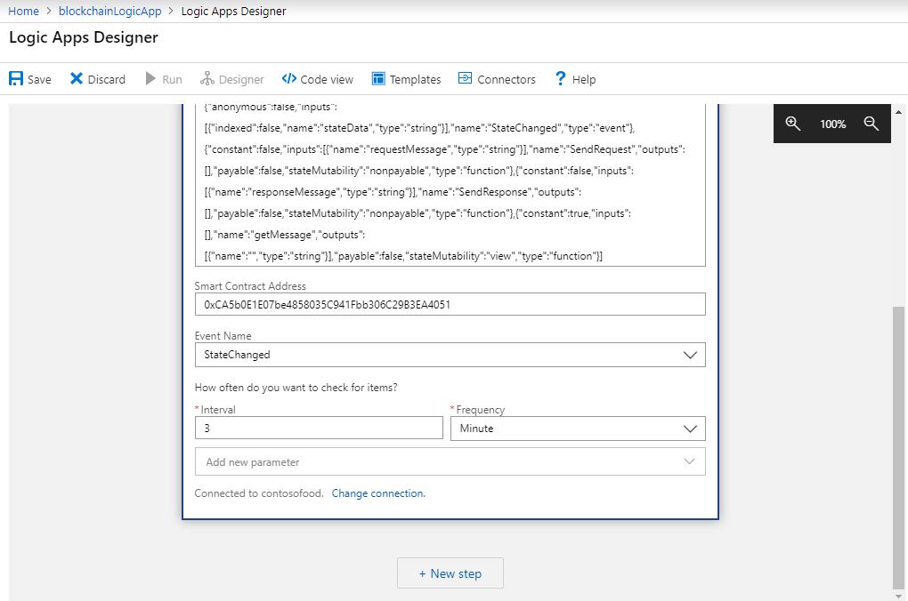

    | Property | Description |
    |----------|-------------|
    | **Contract ABI** | The contract application binary interface (ABI) defines the smart contract interfaces. How to [get the contract ABI](#get-contract-abi). |
    | **Smart contract address** | The contract address is the smart contract destination address on the Ethereum blockchain. How to [get the contract address](#get-contract-address). |
    | **Event name** | Choose a smart contract event to check. The event triggers the logic app. |
    | **Interval** and **Frequency** | Choose how often you want to check for the event. |

1. Select **Save**.

To complete your logic app, you can add a new step that performs an action based on the Ethereum Blockchain event trigger. For example, send an email.

## Use actions

Use the Ethereum Blockchain actions when you want a logic app to perform an action on the blockchain ledger. For example, you want to create a REST-based microservice that calls a smart contract function when an HTTP request is made to a logic app.

Connector actions require a trigger. You can use an Ethereum Blockchain connector action as the next step after a trigger. For example, an HTTP request trigger for a microsservice.

1. In the Logic App designer, select **New step** following a trigger.
1. Choose the Ethereum Blockchain connector.
1. From the **Actions** tab, choose one of the available actions.

    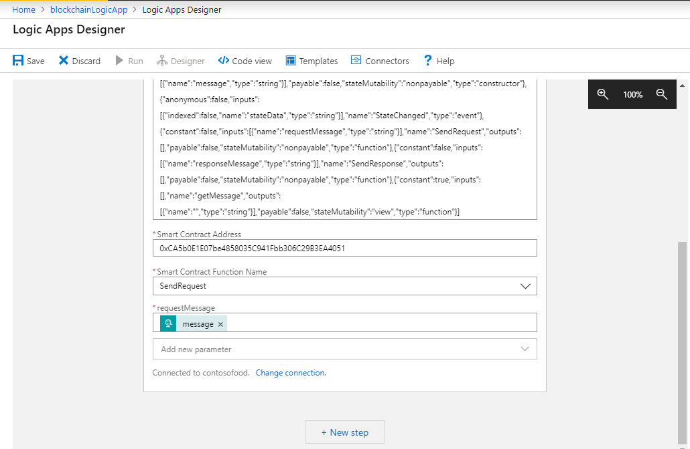

1. Change or [create an API connection](#create-an-api-connection) to your Azure Blockchain Service.
1. Depending on the action you chose, provide the following details about your smart contract function.

    | Property | Description |
    |----------|-------------|
    | **Contract ABI** | The contract application binary interface (ABI) defines the smart contract interfaces. How to [get the contract ABI](#get-contract-abi). |
    | **Contract bytecode** | The compiled smart contract bytecode. How to [get the contract bytecode](#get-contract-bytecode). |
    | **Smart contract address** | The contract address is the smart contract destination address on the Ethereum blockchain. How to [get the contract address](#get-contract-address). |
    | **Smart contract function name** | Choose the smart contract function name for the action. The list is populated from the details in the contract ABI. |

    After choosing a smart contract function name, you may see required fields for function parameters. Enter the values or dynamic content required for your scenario.

You can now use your logic app. When the logic app event is triggered, the Ethereum Blockchain action runs. For example, an HTTP request trigger runs an Ethereum blockchain action to query a smart contract state value resulting in an HTTP response that returns the value.

## Generate a workflow

The Azure Blockchain Development Kit for Ethereum Visual Studio Code extension can generate logic app workflows for common scenarios. There are four scenarios available:

* Data publishing to an Azure SQL Database
* Event publishing to an Azure Event Grid or Azure Service Bus
* Report publishing
* REST-based microservice

 The Azure Blockchain development kit uses Truffle to simplify blockchain development. To generate a logic app based on a smart contract, you need a Truffle solution for the smart contract. You also need a connection to your Azure Blockchain Service consortium network. For more information, see [use Visual Studio Code to connect to an Azure Blockchain Service consortium network quickstart](connect-vscode.md).

For example, the following steps generate a REST-based microservice logic app based on the quickstart **HelloBlockchain** smart contract:

1. In the VS Code explorer sidebar, expand the **contracts** folder in your solution.
1. Right-click **HelloBlockchain.sol** and choose **Generate Microservices for Smart Contracts** from the menu.

    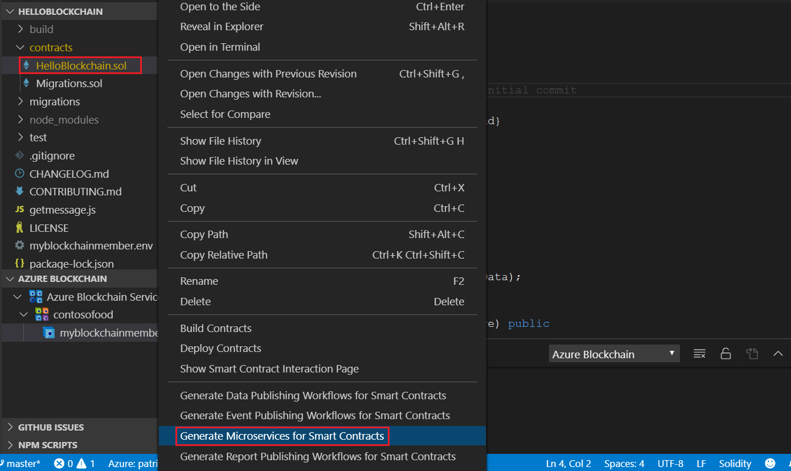

1. In the command palette, choose **Logic App**.
1. Enter the **contract address**. For more information, see [how to get the contract address](#get-contract-address).
1. Choose the Azure subscription and resource group for the logic app.

    The logic app configuration and code files are generated in the **generatedLogicApp** directory.

1. View the **generatedLogicApp/HelloBlockchain** directory. There's a logic app JSON file for each smart contract function, event, and property.
1. Open the **generatedLogicApp/HelloBlockchain/Service/property.RequestMessage.logicapp.json** file and copy the contents.

    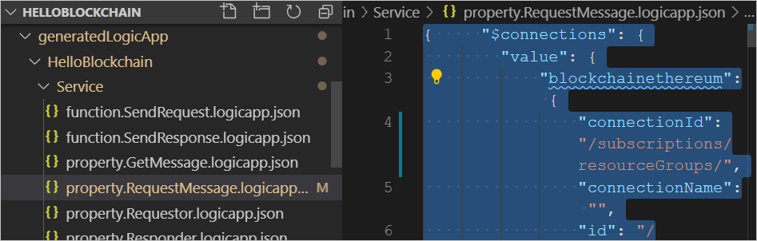

1. In your logic app, select **Logic app code view**. Replace the existing JSON with the generated logic app JSON.

    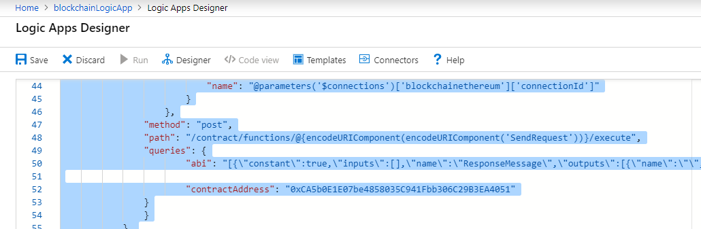

1. Select **Designer** to switch to the designer view.
1. The logic app includes the basic steps for the scenario. However, you need to update the configuration details for the Ethereum Blockchain connector.
1. Select the **Connections** step and change or [create an API connection](#create-an-api-connection) to your Azure Blockchain Service.

    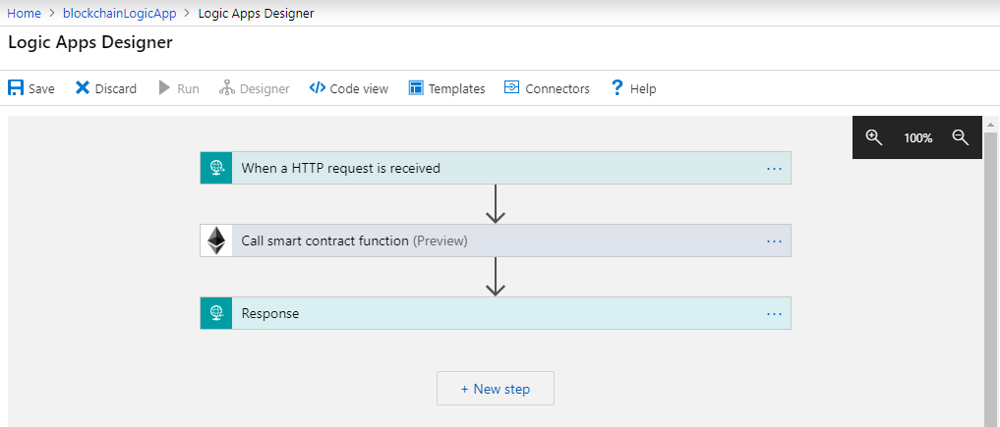

1. You can now use your logic app. To test the REST-based microservice, issue an HTTP POST request to the logic app request URL. Copy the **HTTP POST URL** from the **When a HTTP request is received** step.

    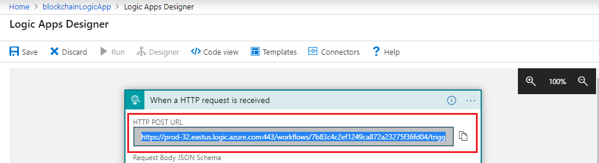

1. Use cURL to create an HTTP POST request. Replace the placeholder text **\<HTTP POST URL\>** with the URL from the previous step.

    ``` bash
    curl -d "{}" -H "Content-Type: application/json" -X POST "<HTTP POST URL>"
    ```

    The cURL command returns a response from the logic app. In this case, the output from the **RequestMessage** smart contract function.

    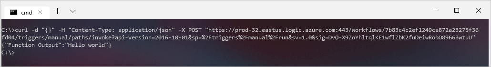

For more information about using the development kit, see the [Azure Blockchain Development Kit for Ethereum wiki](https://github.com/Microsoft/vscode-azure-blockchain-ethereum/wiki) page.

## Create an API connection

An API connection to a blockchain is required for the Ethereum Blockchain connector. You can use the API connector for multiple logic apps. Some properties are required and others depend on your scenario.

> [!IMPORTANT]
> A private key or account address and password are required for creating transactions on a blockchain. Only one form of authentication is needed. You don't need to provide both the private key and account details. Querying contracts does not require a transaction. If you are using actions that query contract state, the private key or account address and password are not required.

To set up a connection to an Azure Blockchain Service member, the following list has possible properties you may need depending on your scenario.

| Property | Description |
|----------|-------------|
|**Connection name** | Name of the API connection. Required. |
|**Ethereum RPC endpoint** | HTTP address of the Azure Blockchain Service transaction node. Required. How to [get the RPC endpoint](#get-rpc-endpoint). |
|**Private key** | Ethereum account private key. Private key or account address and password are required for transactions. How to [get the private key](#get-private-key). |
|**Account address** | Azure Blockchain Service member account address. Private key or account address and password are required for transactions. How to [get the account address](#get-account-address). |
|**Account password** | The account password is set when you create the member. For information on resetting the password, see [Ethereum account](consortium.md#ethereum-account).|

## Get the RPC endpoint

The Azure Blockchain Service RPC endpoint address is required to connect to a blockchain network. You can get the endpoint address using the Azure Blockchain Development Kit for Ethereum or the Azure portal.

**To use the development kit:**

1. Under **Azure Blockchain Service** in Visual Studio Code, right-click the consortium.
1. Select **Copy RPC Endpoint Address**.

    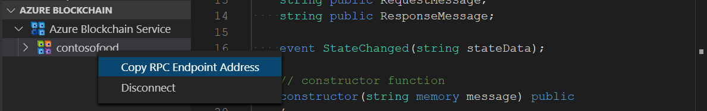

    The RPC endpoint is copied to your clipboard.

**To use the Azure portal:**

1. Sign in to the [Azure portal](https://portal.azure.com).
1. Navigate to your Azure Blockchain Service member. Select **Transaction nodes** and the default transaction node link.

    

1. Select **Connection strings** > **Access keys**.
1. Copy the endpoint address from **HTTPS (Access key 1)** or **HTTPS (Access key 2)**.

    

    The RPC endpoint is the HTTPS URL including the address and access key of your Azure Blockchain Service member transaction node.

## Get the private key

The Ethereum account private key can be used to authenticate when sending a transaction to the blockchain. Your Ethereum account public and private keys are generated from a 12-word mnemonic. The Azure Blockchain Development Kit for Ethereum generates a mnemonic when you connect to an Azure Blockchain Service consortium member. You can get the endpoint address using the development kit extension.

1. In Visual Studio Code, open the command palette (F1).
1. Choose **Azure Blockchain: Retrieve private key**.
1. Select the mnemonic you saved when connecting to the consortium member.

    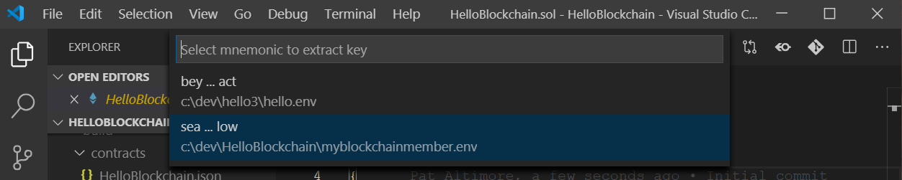

    The private key is copied to your clipboard.

## Get the account address

The member account and password can be used to authenticate when sending a transaction to the blockchain. The password is set when you create the member.

1. In the Azure portal, go to your Azure Blockchain Service overview page.
1. Copy the **Member account** address.

    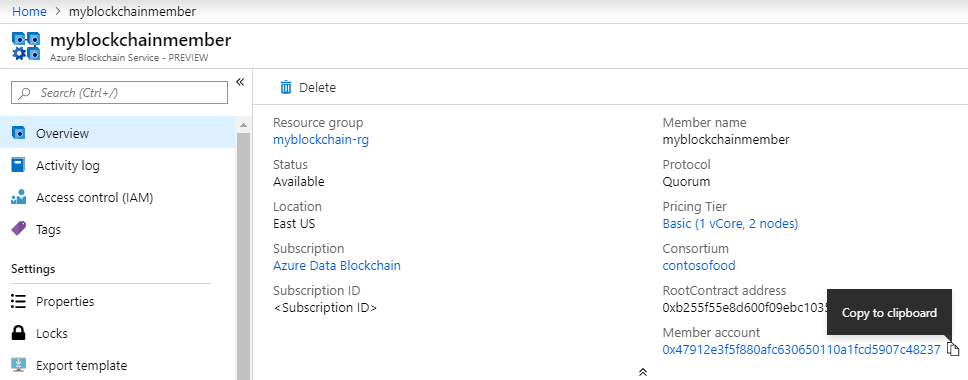

For more information on the account address and password, see [Ethereum account](consortium.md#ethereum-account).

## Get the contract ABI

The contract application binary interface (ABI) defines the smart contract interfaces. It describes how to interact with the smart contract. You can get the contract ABI using the Azure Blockchain Development Kit for Ethereum or from the Solidity compiler contract metadata file.

**To use the development kit:**

If you used the development kit or Truffle to build your smart contract, you can use the extension to copy the contract ABI to the clipboard.

1. In Visual Studio Code explorer pane, expand the **build/contracts** folder of your Solidity project.
1. Right-click the contract metadata JSON file. The file name is the smart contract name followed by the **.json** extension.
1. Choose **Copy Contract ABI**.

    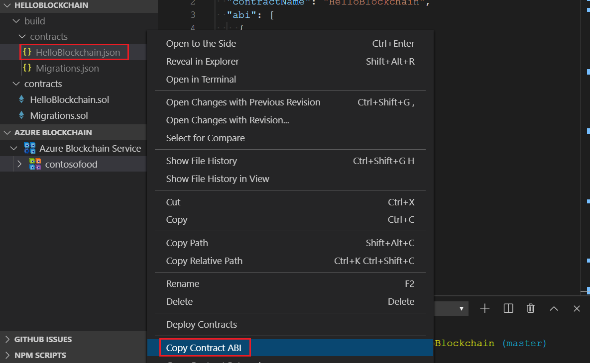

    The contract ABI is copied to the clipboard.

**To use the contract metadata file:**

1. Open the contract metadata file contained in the **build/contracts** folder of your Solidity project. The file name is the smart contract name followed by the **.json** extension.
1. Find the **abi** section in the JSON file.
1. Copy the **abi** JSON array.

    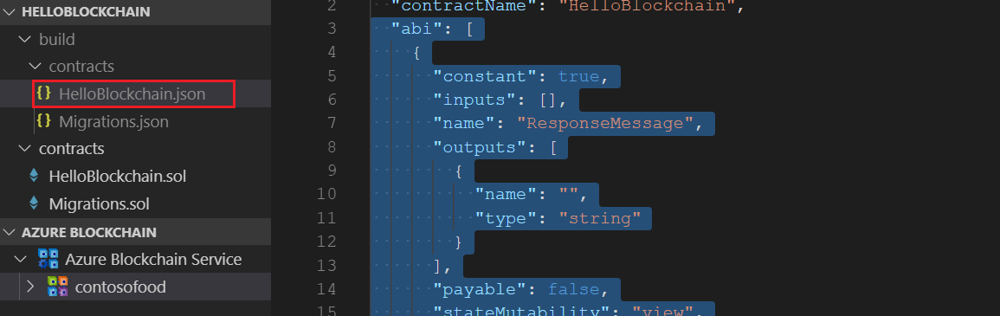

## Get the contract bytecode

The contract bytecode is the compiled smart contract executed by the Ethereum virtual machine. You can get the contract bytecode using the Azure Blockchain Development Kit for Ethereum or from the Solidity compiler.

**To use the development kit:**

If you used the development kit or Truffle to build your smart contract, you can use the extension to copy the contract bytecode to the clipboard.

1. In Visual Studio Code explorer pane, expand the **build/contracts** folder of your Solidity project.
1. Right-click the contract metadata JSON file. The file name is the smart contract name followed by the **.json** extension.
1. Choose **Copy Contract Bytecode**.

    

    The contract bytecode is copied to the clipboard.

**To use the contract metadata file:**

1. Open the contract metadata file contained in the **build/contracts** folder of your Solidity project. The file name is the smart contract name followed by the **.json** extension.
1. Find the **bytecode** element in the JSON file.
1. Copy the **bytecode** value.

    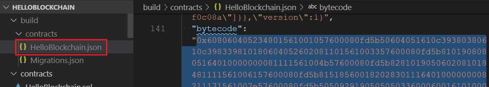

**To use the Solidity compiler:**

Use the command `solc --bin <smart contract>.sol` to generate the contract bytecode.

## Get the contract address

The contract address is the smart contract destination address on the Ethereum blockchain. You use this address to send a transaction or query state of a smart contract. You can get the contract address from the Truffle migration output or the contract metadata file.

**To use the Truffle migrate output:**

Truffle displays the contract address after deployment of the smart contract. Copy the **contract address** from the output.

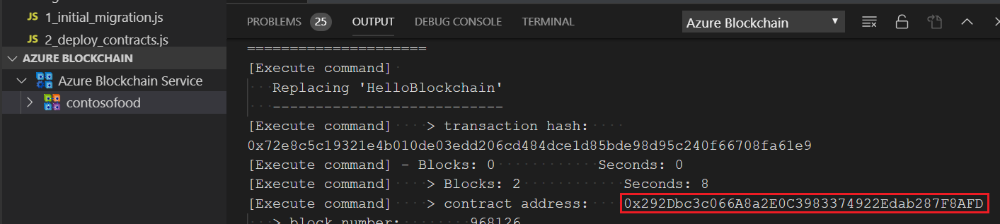

**To use the contract metadata file:**

1. Open the contract metadata file contained in the **build/contracts** folder of your Solidity project. The file name is the smart contract name followed by the **.json** extension.
1. Find the **networks** section in the JSON file.
1. Private networks are identified by an integer network ID. Find the address value within the network section.
1. Copy the **address** value.

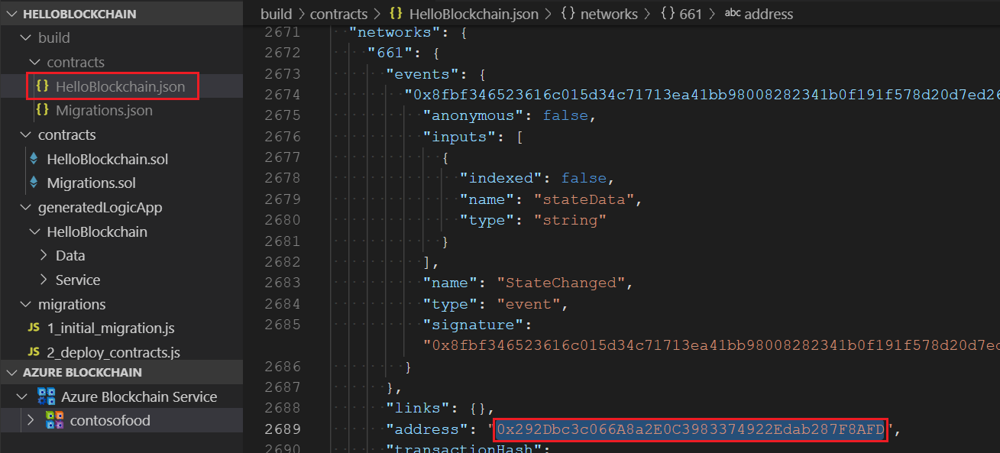

## Next steps

Watch common [scenarios connecting blockchain using Azure Logic Apps](https://channel9.msdn.com/Shows/Blocktalk/Doing-more-with-Logic-Apps?term=logic%20apps%20blockchain&lang-en=true).
