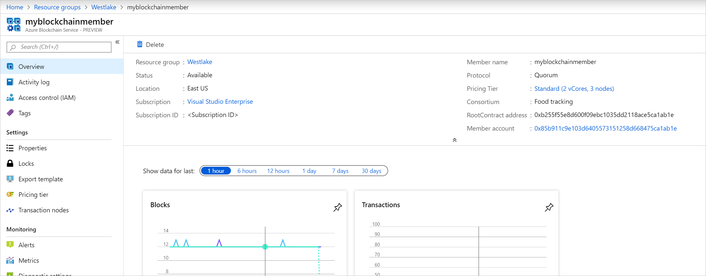
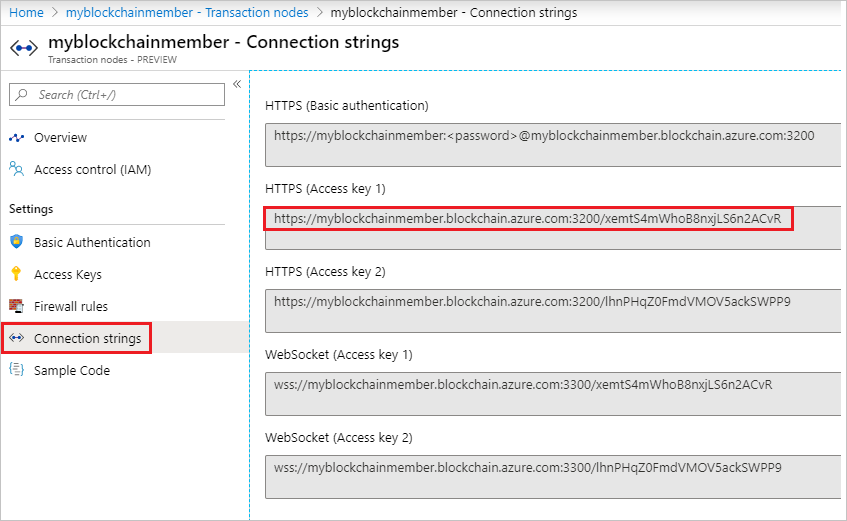

# Manage consortium members in Azure Blockchain Service using PowerShell

You can use PowerShell to manage blockchain consortium members for your Azure Blockchain Service. Members who have administrator privileges can invite, add, remove, and change roles for all participants in the blockchain consortium. Members who have user privileges can view all participants in the blockchain consortium and change their member display name.

## Prerequisites

* Create a blockchain member by using the [Azure portal](create-member.md).
* For more information about consortia, members, and nodes, see [Azure Blockchain Service consortium](consortium.md).

## Open Azure Cloud Shell

Azure Cloud Shell is a free interactive shell that you can use to run the steps in this article. It has common Azure tools preinstalled and configured to use with your account.

You can also open Cloud Shell in a separate browser tab by going to [shell.azure.com/powershell](https://shell.azure.com/powershell). Select **Copy** to copy the blocks of code, paste it into Cloud Shell, and select **Enter** to run it.

## Install the PowerShell module

Install the Microsoft.AzureBlockchainService.ConsortiumManagement.PS package from the PowerShell Gallery.

```powershell-interactive
Install-Module -Name Microsoft.AzureBlockchainService.ConsortiumManagement.PS -Scope CurrentUser
Import-Module Microsoft.AzureBlockchainService.ConsortiumManagement.PS
```

## Set the information preference

You can get more information when executing the cmdlets by setting the information preference variable. By default, *$InformationPreference* is set to *SilentlyContinue*.

For more verbose information from cmdlets, set the preference in the PowerShell as follows:

```powershell-interactive
$InformationPreference = 'Continue'
```

## Establish a Web3 connection

To manage consortium members, establish a Web3 connection to your Blockchain Service member endpoint. You can use this script to set global variables for calling the consortium management cmdlets.

```powershell-interactive
$Connection = New-Web3Connection -RemoteRPCEndpoint '<Endpoint address>'
$MemberAccount = Import-Web3Account -ManagedAccountAddress '<Member account address>' -ManagedAccountPassword '<Member account password>'
$ContractConnection = Import-ConsortiumManagementContracts -RootContractAddress '<RootContract address>' -Web3Client $Connection
```

Replace *\<Member account password\>* with the member account password that you used when you created the member.

Find the other values in the Azure portal:

1. Sign in to the [Azure portal](https://portal.azure.com).
1. Go to your default Blockchain Service member **Overview** page.

    

    Replace *\<Member account\>* and *\<RootContract address\>* with the values from the portal.

1. For the endpoint address, select **Transaction nodes**, and then select the **default transaction node**. The default node has the same name as the blockchain member.
1. Select **Connection strings**.

    

    Replace *\<Endpoint address\>* with the value from **HTTPS (Access key 1)** or **HTTPS (Access key 2)**.

## Manage the network and smart contracts

Use the network and smart contract cmdlets to establish a connection to the blockchain endpoint's smart contracts responsible for consortium management.

### Import-ConsortiumManagementContracts

Use this cmdlet to connect to the consortium management's smart contracts. These contracts are used to manage and enforce members within the consortium.

`Import-ConsortiumManagementContracts -RootContractAddress <String> -Web3Client <IClient>`

| Parameter | Description | Required |
|-----------|-------------|:--------:|
| RootContractAddress | Root contract address of the consortium management smart contracts | Yes |
| Web3Client | Web3Client object obtained from New-Web3Connection | Yes |

#### Example

```powershell-interactive
Import-ConsortiumManagementContracts -RootContractAddress '<RootContract address>'  -Web3Client $Connection
```

### Import-Web3Account

Use this cmdlet to create an object to hold the information for a remote node's management account.

`Import-Web3Account -ManagedAccountAddress <String> -ManagedAccountPassword <String>`

| Parameter | Description | Required |
|-----------|-------------|:--------:|
| ManagedAccountAddress | Blockchain member account address | Yes |
| ManagedAccountPassword | Account address password | Yes |

#### Example

```powershell-interactive
Import-Web3Account -ManagedAccountAddress '<Member account address>'  -ManagedAccountPassword '<Member account password>'
```

### New-Web3Connection

Use this cmdlet to establish a connection to the RPC endpoint of a transaction node.

`New-Web3Connection [-RemoteRPCEndpoint <String>]`

| Parameter | Description | Required |
|-----------|-------------|:--------:|
| RemoteRPCEndpoint | Blockchain member endpoint address | Yes |

#### Example

```powershell-interactive
New-Web3Connection -RemoteRPCEndpoint '<Endpoint address>'
```

## Manage the consortium members

Use consortium member management cmdlets to manage members within the consortium. The available actions depend on your consortium role.

### Get-BlockchainMember

Use this cmdlet to get member details or list members of the consortium.

`Get-BlockchainMember [[-Name] <String>] -Members <IContract> -Web3Client <IClient>`

| Parameter | Description | Required |
|-----------|-------------|:--------:|
| Name | The name of the Blockchain Service member that you want to retrieve details about. When a name is entered, it returns the member's details. When a name is omitted, it returns a list of all consortium members. | No |
| Members | Members object obtained from Import-ConsortiumManagementContracts | Yes |
| Web3Client | Web3Client object obtained from New-Web3Connection | Yes |

#### Example

[Establish a Web3 connection](#establish-a-web3-connection) to set the $ContractConnection variable.

```powershell-interactive
$ContractConnection | Get-BlockchainMember -Name <Member Name>
```

#### Example output

```
Name           : myblockchainmember
CorrelationId  : 0
DisplayName    : myCompany
SubscriptionId : <Azure subscription ID>
AccountAddress : 0x85b911c9e103d6405573151258d668479e9ebeef
Role           : ADMIN
```

### Remove-BlockchainMember

Use this cmdlet to remove a blockchain member.

`Remove-BlockchainMember -Name <String> -Members <IContract> -Web3Account <IAccount> -Web3Client <IClient>`

| Parameter | Description | Required |
|-----------|-------------|:--------:|
| Name | Member name to remove | Yes |
| Members | Members object obtained from Import-ConsortiumManagementContracts | Yes |
| Web3Account | Web3Account object obtained from Import-Web3Account | Yes |
| Web3Client | Web3Client object obtained from New-Web3Connection | Yes |

#### Example

[Establish a Web3 connection](#establish-a-web3-connection) to set the $ContractConnection and $MemberAccount variables.

```powershell-interactive
$ContractConnection | Remove-BlockchainMember -Name <Member Name> -Web3Account $MemberAccount
```

### Set-BlockchainMember

Use this cmdlet to set blockchain member attributes, including the display name and the consortium role.

Consortium administrators can set **DisplayName** and **Role** for all members. A consortium member with the user role can change only their own member's display name.

```
Set-BlockchainMember -Name <String> [-DisplayName <String>] [-AccountAddress <String>] [-Role <String>]
 -Members <IContract> -Web3Account <IAccount> -Web3Client <IClient>
```

| Parameter | Description | Required |
|-----------|-------------|:--------:|
| Name | Name of the blockchain member | Yes |
| DisplayName | New display name | No |
| AccountAddress | Account address | No |
| Members | Members object obtained from Import-ConsortiumManagementContracts | Yes |
| Web3Account | Web3Account object obtained from Import-Web3Account | Yes |
| Web3Client |  Web3Client object obtained from New-Web3Connection| Yes |

#### Example

[Establish a Web3 connection](#establish-a-web3-connection) to set the $ContractConnection and $MemberAccount variables.

```powershell-interactive
$ContractConnection | Set-BlockchainMember -Name <Member Name> -DisplayName <Display name> -Web3Account $MemberAccount
```

## Manage the consortium members' invitations

Use the consortium member invitation management cmdlets to manage consortium members' invitations. The available actions depend on your consortium role.

### New-BlockchainMemberInvitation

Use this cmdlet to invite new members to the consortium.

```
New-BlockchainMemberInvitation -SubscriptionId <String> -Role <String> -Members <IContract>
 -Web3Account <IAccount> -Web3Client <IClient>
```

| Parameter | Description | Required |
|-----------|-------------|:--------:|
| SubscriptionId | Azure subscription ID of the member to invite | Yes |
| Role | The consortium role. Values can be ADMIN or USER. ADMIN is the consortium administrator role. USER is the consortium member role. | Yes |
| Members | Members object obtained from Import-ConsortiumManagementContracts | Yes |
| Web3Account | Web3Account object obtained from Import-Web3Account | Yes |
| Web3Client | Web3Client object obtained from New-Web3Connection | Yes |

#### Example

[Establish a Web3 connection](#establish-a-web3-connection) to set the $ContractConnection and $MemberAccount variables.

```powershell-interactive
$ContractConnection | New-BlockchainMemberInvitation -SubscriptionId <Azure Subscription ID> -Role USER -Web3Account $MemberAccount
```

### Get-BlockchainMemberInvitation

Use this cmdlet to retrieve or list a consortium member's invitation status.

`Get-BlockchainMemberInvitation [[-SubscriptionId] <String>] -Members <IContract> -Web3Client <IClient>`

| Parameter | Description | Required |
|-----------|-------------|:--------:|
| SubscriptionId | The Azure subscription ID of the member to invite. If the subscription ID is provided, it returns the subscription ID's invitation details. If the subscription ID is omitted, it returns a list of all member invitations. | No |
| Members | Members object obtained from Import-ConsortiumManagementContracts | Yes |
| Web3Client | Web3Client object obtained from New-Web3Connection | Yes |

#### Example

[Establish a Web3 connection](#establish-a-web3-connection) to set the $ContractConnection variable.

```powershell-interactive
$ContractConnection | Get-BlockchainMemberInvitation –SubscriptionId <Azure subscription ID>
```

#### Example output

```
SubscriptionId                       Role CorrelationId
--------------                       ---- -------------
<Azure subscription ID>              USER             2
```

### Remove-BlockchainMemberInvitation

Use this cmdlet to revoke a consortium member's invitation.

```
Remove-BlockchainMemberInvitation -SubscriptionId <String> -Members <IContract> -Web3Account <IAccount>
 -Web3Client <IClient>
```

| Parameter | Description | Required |
|-----------|-------------|:--------:|
| SubscriptionId | Azure subscription ID of the member to revoke | Yes |
| Members | Members object obtained from Import-ConsortiumManagementContracts | Yes |
| Web3Account | Web3Account object obtained from Import-Web3Account | Yes |
| Web3Client | Web3Client object obtained from New-Web3Connection | Yes |

#### Example

[Establish a Web3 connection](#establish-a-web3-connection) to set the $ContractConnection and $MemberAccount variables.

```powershell-interactive
$ContractConnection | Remove-BlockchainMemberInvitation -SubscriptionId <Subscription ID> -Web3Account $MemberAccount
```

### Set-BlockchainMemberInvitation

Use this cmdlet to set the **Role** for an existing invitation. Only consortium administrators can change invitations.

```
Set-BlockchainMemberInvitation -SubscriptionId <String> -Role <String> -Members <IContract>
 -Web3Account <IAccount> -Web3Client <IClient>
```

| Parameter | Description | Required |
|-----------|-------------|:--------:|
| SubscriptionId | Azure subscription ID of the member to invite | Yes |
| Role | New consortium role for invitation. Values can be **USER** or **ADMIN**. | Yes |
| Members |  Members object obtained from Import-ConsortiumManagementContracts | Yes |
| Web3Account | Web3Account object obtained from Import-Web3Account | Yes |
| Web3Client | Web3Client object obtained from New-Web3Connection | Yes |

#### Example

[Establish a Web3 connection](#establish-a-web3-connection) to set the $ContractConnection and $MemberAccount variables.

```powershell-interactive
$ContractConnection | Set-BlockchainMemberInvitation -SubscriptionId <Azure subscription ID> -Role USER -Web3Account $MemberAccount
```

## Next steps

For more information about consortia, members, and nodes, see [Azure Blockchain Service consortium](consortium.md)
