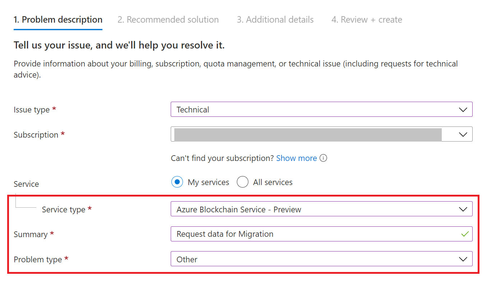
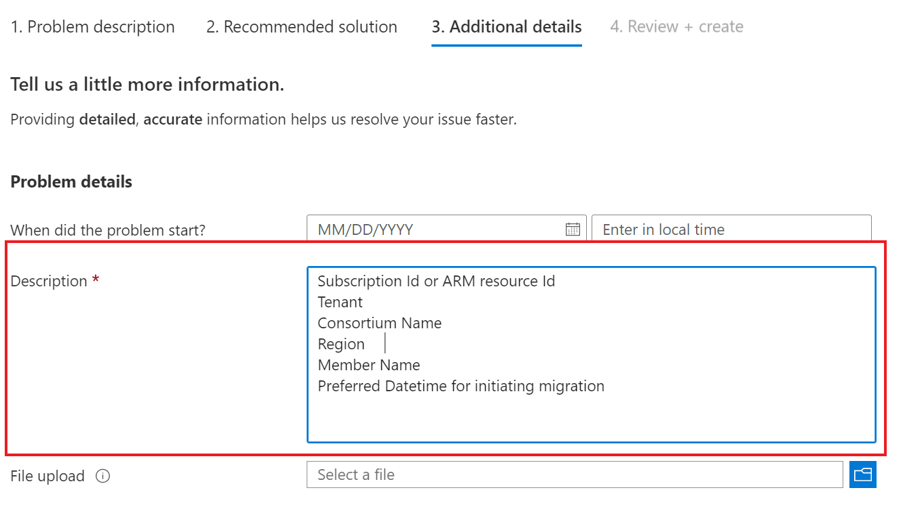

# Migrate Azure Blockchain Service

You can migrate ledger data from Azure Blockchain Service to an alternate offering.

> [!IMPORTANT]
> On **September 10, 2021**, Azure Blockchain will be retired. Please migrate ledger data from Azure Blockchain Service to an alternative offering based on your development status in production or evaluation.

## Evaluate alternatives

The first step when planning a migration is to evaluate alternative offerings. Evaluate the following alternatives based on your development status of being in production or evaluation.

### Production or pilot phase

If you have already deployed and developed a blockchain solution that is in the production or pilot phase, consider the following alternatives.

#### Quorum Blockchain Service

Quorum Blockchain Service is a managed offering by ConsenSys on Azure that supports Quorum as ledger technology.

- **Managed offering** - Quorum Blockchain Service has no extra management overhead compared to Azure Blockchain Service.
- **Ledger technology** - Based on ConsenSys Quorum which is an enhanced version of the GoQuorum Ledger technology used in Azure Blockchain Service. No new learning is required. For more information, see the [Consensys Quorum FAQ](https://consensys.net/quorum/faq).
- **Continuity** - You can migrate your existing data on to Quorum Blockchain Service by ConsenSys. For more information, see [Export data from Azure Blockchain Service](#export-data-from-azure-blockchain-service)

For more information, see [Quorum Blockchain Service](https://consensys.net/QBS).

#### Azure VM-based deployment

There are several blockchain resource management templates you can use to deploy blockchain on IaaS VMs.

- **Ledger technology** - You can continue to use Quorum ledger technology including the new ConsenSys Quorum.
- **Self-management** - Once deployed, you manage the infrastructure and blockchain stack.

### New deployment or evaluation phase

If you are starting to develop a new solution or are in an evaluation phase, consider the following alternatives based on your scenario requirements.

- [Quorum template from Azure Marketplace](https://azuremarketplace.microsoft.com/marketplace/apps/consensys.quorum-dev-quickstart)
- [Besu template from Azure Marketplace](https://azuremarketplace.microsoft.com/marketplace/apps/consensys.hyperledger-besu-quickstart)

### How to migrate to an alternative

To migrate a production workload, first [export your data from Azure Blockchain Service](#export-data-from-azure-blockchain-service). Once you have a copy of your data, you can transition this data to your preferred alternative.

The recommended migration destination is ConsenSys Quorum Blockchain Service. To onboard to this service, register at the [Quorum Blockchain Service](https://consensys.net/QBS) page.

To self-manage your blockchain solution using virtual machines in Azure, see [Azure VM-based Quorum guidance](#azure-vm-based-quorum-guidance) to set up transaction and validator nodes.
## Export data from Azure Blockchain Service

Based on your current development state, you can either opt to use existing ledger data on Azure Blockchain Service or start a new network and use the solution of your choice. We recommend creating a new consortium based on a solution of your choice in all scenarios where you do not need or intend to use existing ledger data on Azure Blockchain Service.

### Open support case

If you have a paid support plan, open a Microsoft Support ticket to pause the consortium and export your blockchain data.

1. Use the Azure portal to open a support ticket. In *Problem description*, enter the following details:

    

    | Field | Response |
    |-------|--------- |
    | Issue type | Technical |
    | Service | Azure Blockchain Service - Preview |
    | Summary | Request data for migration |
    | Problem type | other |

1. In *Additional details*, include the following details:

    

    - Subscription ID or Azure Resource Manager resource ID
    - Tenant
    - Consortium name
    - Region
    - Member name
    - Preferred Datetime for initiating migration

If your consortium has multiple members, each member is required to open a separate support ticket for respective member data.

### Pause consortium

You are required to coordinate with members of consortium to data export since the consortium will be paused for data export and transactions during this time will fail.

Azure Blockchain Service team pauses the consortium, exports a snapshot of data, and makes the data available through short-lived SAS URL for download in an encrypted format. The consortium is resumed after taking the snapshot.

> [!IMPORTANT]
> You should stop all applications initiating new
> blockchain transactions on to the network. Active applications may lead to data loss or your original and migrated networks being out of sync.

### Download data

Download the data using the Microsoft Support provided short-lived SAS URL link.

> [!IMPORTANT]
> You are required to download your data within seven days.

Decrypt the data using the API access key. You can [get the key from the Azure portal](configure-transaction-nodes.md#access-keys) or [through the REST API](/rest/api/blockchain/2019-06-01-preview/blockchainmembers/listapikeys).

> [!CAUTION]
> Only the default transaction node API access key 1 is used to encrypt all the nodes data of that member.
>
> Do not reset the API access key in between of the migration.

You can use the data with either ConsenSys Quorum Blockchain service or your IaaS VM-based deployment.

For ConsenSys Quorum Blockchain Service migration, contact ConsenSys at [qbsmigration@consensys.net](mailto:qbsmigration@consensys.net).

For using the data with your IaaS VM-based deployment, follow the steps in the [Azure VM based Quorum guidance](#azure-vm-based-quorum-guidance) section of this article.

### Delete resources

Once you have completed your data copy, it is recommended that you delete the Azure Blockchain member resources. You will continue to get billed while these resources exist.

## Azure VM-based Quorum guidance

Use the following the steps to create transaction nodes and validator nodes.

### Transaction node

A transaction node has two components. Tessera is used for the private transactions and Geth is used for the Quorum application. Validator nodes require only the Geth component.

#### Tessera

1. Install Java 11. For example, `apt install default-jre`.
1. Update paths in `tessera-config.json`. Change all references of `/working-dir/**` to `/opt/blockchain/data/working-dir/**`.
1. Update the IP address of other transaction nodes as per new IP address. HTTPS won't work since it is not enabled in the Tessera configuration. For information on how to configure TLS, see the [Tessera configure TLS](https://docs.tessera.consensys.net/en/stable/HowTo/Configure/TLS/) article.
1. Update NSG rules to allow inbound connections to port 9000.
1. Run Tessera using the following command:

    ```bash
    java -Xms512M -Xmx1731M -Dlogback.configurationFile=/tessera/logback-tessera.xml -jar tessera.jar -configfile /opt/blockchain/data/working-dir/tessera-config.json > tessera.log 2>&1 &
    ```

#### Geth

1. Update IPs in enode addresses in `/opt/blockchain/data/working-dir/dd/static-nodes.json`. Public IP address is allowed.
1. Make the same IP address changes under StaticNodes key in `/geth/config.toml`.
1. Update NSG rules to allow inbound connections to port 30303.
1. Run Geth using the following commands:

    ```bash
    export NETWORK_ID='' # Get network ID from metadata. The network ID is the same for consortium.

    PRIVATE_CONFIG=tm.ipc geth --config /geth/config.toml --datadir /opt/blockchain/data/working-dir/dd --networkid $NETWORK_ID --istanbul.blockperiod 5 --nodiscover --nousb --allow-insecure-unlock --verbosity 3 --txpool.globalslots 80000 --txpool.globalqueue 80000 --txpool.accountqueue 50000 --txpool.accountslots 50000 --targetgaslimit 700000000 --miner.gaslimit 800000000 --syncmode full --rpc --rpcaddr 0.0.0.0 --rpcport 3100 --rpccorsdomain '*' --rpcapi admin,db,eth,debug,net,shh,txpool,personal,web3,quorum,istanbul --ws --wsaddr 0.0.0.0 --wsport 3000 --wsorigins '*' --wsapi admin,db,eth,debug,net,shh,txpool,personal,web3,quorum,istanbul
    ```

### Validator Node

Validator node steps are similar to the transaction node except that Geth startup command will have the additional flag `-mine`. Tessera is not started on a validator node. To run Geth without a paired Tessera, you pass `PRIVATE_CONFIG=ignore` in the Geth command. Run Geth using the following commands:

```bash
export NETWORK_ID=`j q '.APP_SETTINGS | fromjson | ."network-id"' env.json`

PRIVATE_CONFIG=ignore geth --config /geth/config.toml --datadir /opt/blockchain/data/working-dir/dd --networkid $NETWORK_ID --istanbul.blockperiod 5 --nodiscover --nousb --allow-insecure-unlock --verbosity 3 --txpool.globalslots 80000 --txpool.globalqueue 80000 --txpool.accountqueue 50000 --txpool.accountslots 50000 --targetgaslimit 700000000 --miner.gaslimit 800000000 --syncmode full --rpc --rpcaddr 0.0.0.0 --rpcport 3100 --rpccorsdomain '*' --rpcapi admin,db,eth,debug,net,shh,txpool,personal,web3,quorum,istanbul --ws --wsaddr 0.0.0.0 --wsport 3000 --wsorigins '*' --wsapi admin,db,eth,debug,net,shh,txpool,personal,web3,quorum,istanbul –mine
```

## Upgrading Quorum

Azure Blockchain Service may be in running one of the following listed versions of Quorum. You can choose to use the same Quorum version or follow the below steps to use latest version of ConsenSys Quorum.

### Upgrade Quorum version 2.6.0 or 2.7.0 to ConsenSys 21.1.0

Upgrading from Quorum version 2.6 or 2.7 version is straightforward. Download and update using the following links.
1. Download [ConsenSys Quorum and related binaries v21.1.0](https://github.com/ConsenSys/quorum/releases/tag/v21.1.0).
1. Download the latest version of Tessera [tessera-app-21.1.0-app.jar](https://github.com/ConsenSys/tessera/releases/tag/tessera-21.1.0).

### Upgrade Quorum version 2.5.0 to ConsenSys 21.1.0

1. Download [ConsenSys Quorum and related binaries v21.1.0](https://github.com/ConsenSys/quorum/releases/tag/v21.1.0).
1. Download the latest version of Tessera [tessera-app-21.1.0-app.jar](https://github.com/ConsenSys/tessera/releases/tag/tessera-21.1.0).
For versions 2.5.0, there are some minor genesis file changes. Make the following changes in the genesis file.

1. The value `byzantiumBlock` was set to 1 and it cannot be less than `constantinopleBlock` which is 0. Set the `byzantiumBlock` value to 0.
1. Set `petersburgBlock`, `istanbulBlock` to a future block. This value should be same across all nodes.
1. This step is optional. `ceil2Nby3Block` was incorrectly placed in Azure Blockchain Service Quorum 2.5.0 version. This needs to be inside the istanbul config and set the value future block. This value should be same across all nodes.
1. Run geth to reinitialize genesis block using following command:

    ```bash
    geth --datadir "Data Directory Path" init "genesis file path"
    ```

1.  Run Geth.

## Exported data reference

This section describes the metadata, and folder structure to help import the data into your IaaS VM deployment.

### Metadata info

| Name               | Sample                | Description           |
|--------------------|-----------------------|-----------------------|
| consortium_name    | \<ConsortiumName\>    | Consortium name (unique across Azure Blockchain Service). |
| Consortium_Member_Count || Number of members in the consortium |
| member_name        | \<memberName\>        | Blockchain member name (unique across Azure Blockchain Service). |
| node_name          | transaction-node      | Node name (each member has multiple nodes). |
| network_id         | 543                   | Geth network ID.      |
| is_miner           | False                 | Is_Miner == true (Validator Node), Is_Miner == false (Transaction node) |
| quorum_version     | 2.7.0                 | Version of Quorum     |
| tessera_version    | 0.10.5                | Tessera version      |
| java_version       | java-11-openjdk-amd64 | Java version Tessera uses |
| CurrentBlockNumber |                       | Current block number for the blockchain network |

## Migrated Data Folder structure

At the top level, there are folders that correspond to each of the nodes of the members.

- **Standard SKU** - Two validator nodes (validator-node-0
and validator-node-1)
- **Basic SKU** - One validator node (validator-node-0)
- **Transaction Node** - Default transaction node named transaction-node.

Other transaction node folders are named after the transaction node name.

### Node level folder structure

Each node level folder contains a zip file that is encrypted using the encryption key. For details on the obtaining the encryption key, see the [Download data](#download-data) section of this article.

| Directory/File | Description |
|----------------|--------------|
| /config/config.toml | Geth parameters. Command line parameters take precedence |
| /config/genesis.json | Genesis file |
| /config/logback-tessera.xml | Logback configuration for Tessera |
| /config/static-nodes.json | Static nodes. Bootstrap nodes are removed and auto-discovery is disabled. |
| /config/tessera-config.json | Tessera configuration |
| /data/c/ | Tessera DB |
| /data/dd/ | Geth data directory |
| /env/env | Metadata |
| /keys/ | Tessera keys |
| /scripts/ | Startup scripts (provided for reference only) |

## Frequently asked questions

### What does service retirement mean for existing customers?

The existing Azure Blockchain Service deployments cannot be continued beyond September 10, 2021. Start evaluating alternatives suggested in this article before retirement based on your requirements.

### What happens to existing deployments after the announcement of retirement?

Existing deployments are supported until September 10, 2021. Evaluate the suggested alternatives, migrate the data to the alternate offering, operate your requirement on the alternative offering, and start migrating from the deployment on Azure Blockchain Service.

### How long will the existing deployments be supported on Azure Blockchain Service?

Existing deployments are supported until September 10, 2021.

### Will I be allowed to create new Azure Blockchain members while in retirement phase?

After May 10, 2021, no new member creation or deployments are supported.
