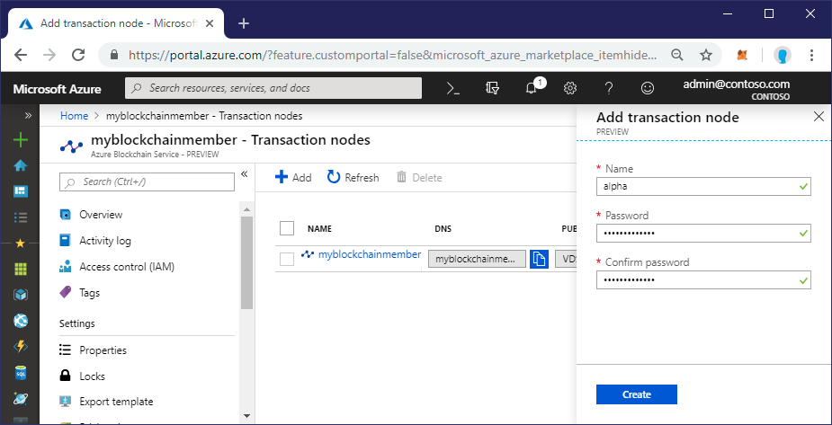
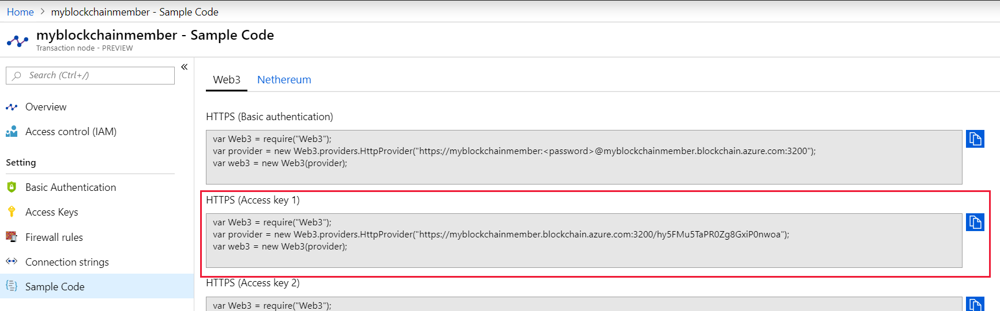
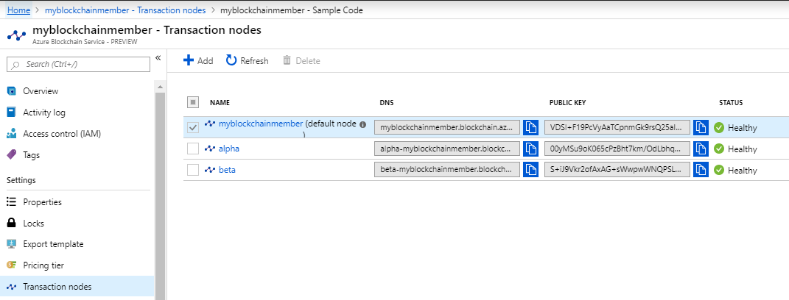
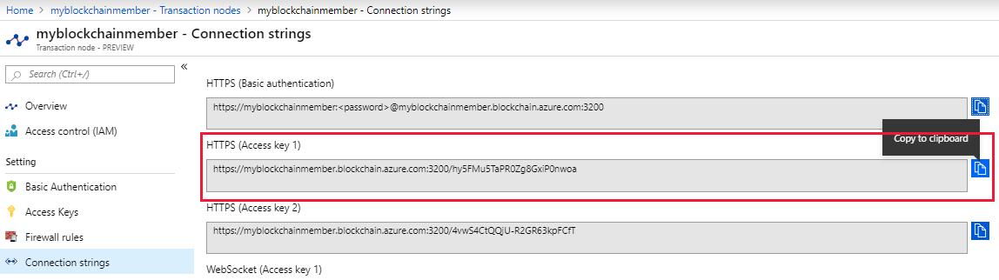

# Tutorial: Send transactions using Azure Blockchain Service

In this tutorial, you'll to create transaction nodes to test contract and transaction privacy.  You'll use Truffle to create a local development environment and deploy a smart contract and send a private transaction.

You'll learn how to:

> [!div class="checklist"]
> * Add transaction nodes
> * Use Truffle to deploy a smart contract
> * Send a transaction
> * Validate transaction privacy

[!INCLUDE [quickstarts-free-trial-note](../../../includes/quickstarts-free-trial-note.md)]

## Prerequisites

* Complete [Create a blockchain member using the Azure portal](create-member.md)
* Complete [Quickstart: Use Truffle to connect to a consortium network](connect-truffle.md)
* Install [Truffle](https://github.com/trufflesuite/truffle). Truffle requires several tools to be installed including [Node.js](https://nodejs.org), [Git](https://git-scm.com/book/en/v2/Getting-Started-Installing-Git).
* Install [Python 2.7.15](https://www.python.org/downloads/release/python-2715/). Python is needed for Web3.
* Install [Visual Studio Code](https://code.visualstudio.com/Download)
* Install [Visual Studio Code Solidity extension](https://marketplace.visualstudio.com/items?itemName=JuanBlanco.solidity)

## Create transaction nodes

By default, you have one transaction node. We're going to add two more. One of the nodes participates in the private transaction. The other is not included in the private transaction.

1. Sign in to the [Azure portal](https://portal.azure.com).
1. Navigate to your Azure Blockchain member and select **Transaction nodes > Add**.
1. Complete the settings for a new transaction node named `alpha`.

    

    | Setting | Value | Description |
    |---------|-------|-------------|
    | Name | `alpha` | Transaction node name. The name is used to create the DNS address for the transaction node endpoint. For example, `alpha-mymanagedledger.blockchain.azure.com`. |
    | Password | Strong password | The password is used to access the transaction node endpoint with basic authentication.

1. Select **Create**.

    Provisioning a new transaction node takes about 10 minutes.

1. Repeat steps 2 through 4 to add a transaction node named `beta`.

You can continue with the tutorial while the nodes are being provisioned. When provisioning is finished, you'll have three transaction nodes.

## Open Truffle console

1. Open a Node.js command prompt or shell.
1. Change your path to the Truffle project directory from the prerequisite [Quickstart: Use Truffle to connect to a consortium network](connect-truffle.md). For example,

    ```bash
    cd truffledemo
    ```

1. Launch Truffle's interactive development console.

    ``` bash
    truffle develop
    ```

    Truffle creates a local development blockchain and provides an interactive console.

## Create Ethereum account

Use Web3 to connect to the default transaction node and create an Ethereum account. You can get the Web3 connection string from the Azure portal.

1. In the Azure portal, navigate to the default transaction node and select **Transaction nodes > Sample code > Web3**.
1. Copy the JavaScript from **HTTPS (Access key 1)**
    

1. Paste the Web3 JavaScript code for the default transaction node into the Truffle interactive development console. The code creates a Web3 object that is connected to your Azure Blockchain Service transaction node.

    ```bash
    truffle(develop)> var Web3 = require("Web3");
    truffle(develop)> var provider = new Web3.providers.HttpProvider("https://myblockchainmember.blockchain.azure.com:3200/hy5FMu5TaPR0Zg8GxiPwned");
    truffle(develop)> var web3 = new Web3(provider);
    ```

    You can call methods on the Web3 object to interact with your transaction node.

1. Create a new account on the default transaction node. Replace the password parameter with your own strong password.

    ```bash
    web3.eth.personal.newAccount("1@myStrongPassword");
    ```

    Make note of the account address returned and password. You need the Ethereum account address and password in the next section.

1. Exit the Truffle development environment.

    ```bash
    .exit
    ```

## Configure Truffle project

To configure the Truffle project, you need some transaction node information from the Azure portal.

### Transaction node public key

Each transaction node has a public key. The public key enables you to send a private transaction to the node. In order to send a transaction from the default transaction node to the *alpha* transaction node, you need the *alpha* transaction node's public key.

You can get the public key from the transaction node list. Copy the public key for the alpha node and save the value for later in the tutorial.



### Transaction node endpoint addresses

1. In the Azure portal, navigate to each transaction node and select **Transaction nodes > Connection strings**.
1. Copy and save the endpoint URL from **HTTPS (Access key 1)** for each transaction node. You need the endpoint addresses for the smart contract configuration file later in the tutorial.

    

### Edit configuration file

1. Launch Visual Studio Code and open the Truffle project directory folder using the **File > Open Folder** menu.
1. Open the Truffle configuration file `truffle-config.js`.
1. Replace the contents of the file with the following configuration information. Add variables containing the endpoints addresses and account information. Replace the angle bracket sections with values you collected from previous sections.

    ``` javascript
    var defaultnode = "<default transaction node connection string>";
    var alpha = "<alpha transaction node connection string>";
    var beta = "<beta transaction node connection string>";
    
    var myAccount = "<Ethereum account address>";
    var myPassword = "<Ethereum account password>";
    
    var Web3 = require("web3");
    
    module.exports = {
      networks: {
        defaultnode: {
          provider:(() =>  {
          const AzureBlockchainProvider = new Web3.providers.HttpProvider(defaultnode);
    
          const web3 = new Web3(AzureBlockchainProvider);
          web3.eth.personal.unlockAccount(myAccount, myPassword);
    
          return AzureBlockchainProvider;
          })(),
    
          network_id: "*",
          gas: 0,
          gasPrice: 0,
          from: myAccount
        },
        alpha: {
          provider: new Web3.providers.HttpProvider(alpha),
          network_id: "*",
          gas: 0,
          gasPrice: 0
        },
        beta: {
          provider: new Web3.providers.HttpProvider(beta),
          network_id: "*",
          gas: 0,
          gasPrice: 0
        }
      }
    }
    ```

1. Save the changes to `truffle-config.js`.

## Create smart contract

1. In the **contracts** folder, create a new file named `SimpleStorage.sol`. Add the following code.

    ```solidity
    pragma solidity >=0.4.21 <0.6.0;
    
    contract SimpleStorage {
        string public storedData;
    
        constructor(string memory initVal) public {
            storedData = initVal;
        }
    
        function set(string memory x) public {
            storedData = x;
        }
    
        function get() view public returns (string memory retVal) {
            return storedData;
        }
    }
    ```
    
1. In the **migrations** folder, create a new file named `2_deploy_simplestorage.js`. Add the following code.

    ```solidity
    var SimpleStorage = artifacts.require("SimpleStorage.sol");
    
    module.exports = function(deployer) {
    
      // Pass 42 to the contract as the first constructor parameter
      deployer.deploy(SimpleStorage, "42", {privateFor: ["<alpha node public key>"], from:"<Ethereum account address>"})  
    };
    ```

1. Replace the values in the angle brackets.

    | Value | Description
    |-------|-------------
    | \<alpha node public key\> | Public key of the alpha node
    | \<Ethereum account address\> | Ethereum account address created in the default transaction node

    In this example, the initial value of the **storeData** value is set to 42.

    **privateFor** defines the nodes to which the contract is available. In this example, the default transaction node's account can cast private transactions to the **alpha** node. You add public keys for all private transaction participants. If you don't include **privateFor:** and **from:**, the smart contract transactions are public and can be seen by all consortium members.

1. Save all files by selecting **File > Save All**.

## Deploy smart contract

Use Truffle to deploy `SimpleStorage.sol` to default transaction node network.

```bash
truffle migrate --network defaultnode
```

Truffle first compiles and then deploys the **SimpleStorage** smart contract.

Example output:

```
admin@desktop:/mnt/c/truffledemo$ truffle migrate --network defaultnode

2_deploy_simplestorage.js
=========================

   Deploying 'SimpleStorage'
   -------------------------
   > transaction hash:    0x3f695ff225e7d11a0239ffcaaab0d5f72adb545912693a77fbfc11c0dbe7ba72
   > Blocks: 2            Seconds: 12
   > contract address:    0x0b15c15C739c1F3C1e041ef70E0011e641C9D763
   > account:             0x1a0B9683B449A8FcAd294A01E881c90c734735C3
   > balance:             0
   > gas used:            0
   > gas price:           0 gwei
   > value sent:          0 ETH
   > total cost:          0 ETH


   > Saving migration to chain.
   > Saving artifacts
   -------------------------------------
   > Total cost:                   0 ETH


Summary
=======
> Total deployments:   2
> Final cost:          0 ETH
```

## Validate contract privacy

Because of contract privacy, contract values can only be queried from nodes we declared in **privateFor**. In this example, we can query the default transaction node because the account exists in that node. 

1. Using the Truffle console, connect to the default transaction node.

    ```bash
    truffle console --network defaultnode
    ```

1. In the Truffle console, execute code that returns the value of the contract instance.

    ```bash
    SimpleStorage.deployed().then(function(instance){return instance.get();})
    ```

    If querying the default transaction node is successful, the value 42 is returned. For example:

    ```
    admin@desktop:/mnt/c/truffledemo$ truffle console --network defaultnode
    truffle(defaultnode)> SimpleStorage.deployed().then(function(instance){return instance.get();})
    '42'
    ```

1. Exit the Truffle console.

    ```bash
    .exit
    ```

Since we declared **alpha** node's public key in **privateFor**, we can query the **alpha** node.

1. Using the Truffle console, connect to the **alpha** node.

    ```bash
    truffle console --network alpha
    ```

1. In the Truffle console, execute code that returns the value of the contract instance.

    ```bash
    SimpleStorage.deployed().then(function(instance){return instance.get();})
    ```

    If querying the **alpha** node is successful, the value 42 is returned. For example:

    ```
    admin@desktop:/mnt/c/truffledemo$ truffle console --network alpha
    truffle(alpha)> SimpleStorage.deployed().then(function(instance){return instance.get();})
    '42'
    ```

1. Exit the Truffle console.

    ```bash
    .exit
    ```

Since we did not declare **beta** node's public key in **privateFor**, we won't be able to query the **beta** node because of contract privacy.

1. Using the Truffle console, connect to the **beta** node.

    ```bash
    truffle console --network beta
    ```

1. Execute a code that returns the value of the contract instance.

    ```bash
    SimpleStorage.deployed().then(function(instance){return instance.get();})
    ```

1. Querying the **beta** node fails since the contract is private. For example:

    ```
    admin@desktop:/mnt/c/truffledemo$ truffle console --network beta
    truffle(beta)> SimpleStorage.deployed().then(function(instance){return instance.get();})
    Thrown:
    Error: Returned values aren't valid, did it run Out of Gas?
        at XMLHttpRequest._onHttpResponseEnd (/mnt/c/truffledemo/node_modules/xhr2-cookies/xml-http-request.ts:345:8)
        at XMLHttpRequest._setReadyState (/mnt/c/truffledemo/node_modules/xhr2-cookies/xml-http-request.ts:219:8)
        at XMLHttpRequestEventTarget.dispatchEvent (/mnt/c/truffledemo/node_modules/xhr2-cookies/xml-http-request-event-target.ts:44:13)
        at XMLHttpRequest.request.onreadystatechange (/mnt/c/truffledemo/node_modules/web3-providers-http/src/index.js:96:13)
    ```

1. Exit the Truffle console.

    ```bash
    .exit
    ```
    
## Send a transaction

1. Create a file called `sampletx.js`. Save it in the root of your project.
1. The following script sets the contract **storedData** variable value to 65. Add the code to the new file.

    ```javascript
    var SimpleStorage = artifacts.require("SimpleStorage");
    
    module.exports = function(done) {
      console.log("Getting deployed version of SimpleStorage...")
      SimpleStorage.deployed().then(function(instance) {
        console.log("Setting value to 65...");
        return instance.set("65", {privateFor: ["<alpha node public key>"], from:"<Ethereum account address>"});
      }).then(function(result) {
        console.log("Transaction:", result.tx);
        console.log("Finished!");
        done();
      }).catch(function(e) {
        console.log(e);
        done();
      });
    };
    ```

    Replace the values in the angle brackets then save the file.

    | Value | Description
    |-------|-------------
    | \<alpha node public key\> | Public key of the alpha node
    | \<Ethereum account address\> | Ethereum account address created in the default transaction node.

    **privateFor** defines the nodes to which the transaction is available. In this example, the default transaction node's account can cast private transactions to the **alpha** node. You need to add public keys for all private transaction participants.

1. Use Truffle to execute the script for the default transaction node.

    ```bash
    truffle exec sampletx.js --network defaultnode
    ```

1. In the Truffle console, execute code that returns the value of the contract instance.

    ```bash
    SimpleStorage.deployed().then(function(instance){return instance.get();})
    ```

    If the transaction was successful, the value 65 is returned. For example:
    
    ```
    Getting deployed version of SimpleStorage...
    Setting value to 65...
    Transaction: 0x864e67744c2502ce75ef6e5e09d1bfeb5cdfb7b880428fceca84bc8fd44e6ce0
    Finished!
    ```

1. Exit the Truffle console.

    ```bash
    .exit
    ```
    
## Validate transaction privacy

Because of transaction privacy, transactions can only be performed on nodes we declared in **privateFor**. In this example, we can perform transactions since we declared **alpha** node's public key in **privateFor**. 

1. Use Truffle to execute the transaction on the **alpha** node.

    ```bash
    truffle exec sampletx.js --network alpha
    ```
    
1. Execute code that returns the value of the contract instance.

    ```bash
    SimpleStorage.deployed().then(function(instance){return instance.get();})
    ```
    
    If the transaction was successful, the value 65 is returned. For example:

    ```
    Getting deployed version of SimpleStorage...
    Setting value to 65...
    Transaction: 0x864e67744c2502ce75ef6e5e09d1bfeb5cdfb7b880428fceca84bc8fd44e6ce0
    Finished!
    ```
    
1. Exit the Truffle console.

    ```bash
    .exit
    ```

## Clean up resources

When no longer needed, you can delete the resources by deleting the `myResourceGroup` resource group you created by the Azure Blockchain Service.

To delete the resource group:

1. In the Azure portal, navigate to **Resource group** in the left navigation pane and select the resource group you want to delete.
1. Select **Delete resource group**. Verify deletion by entering the resource group name and select **Delete**.

## Next steps

In this tutorial, you added two transaction nodes to demonstrate contract and transaction privacy. You used the default node to deploy a private smart contract. You tested privacy by querying contract values and performing transactions on the blockchain.

> [!div class="nextstepaction"]
> [Developing blockchain applications using Azure Blockchain Service](develop.md)
