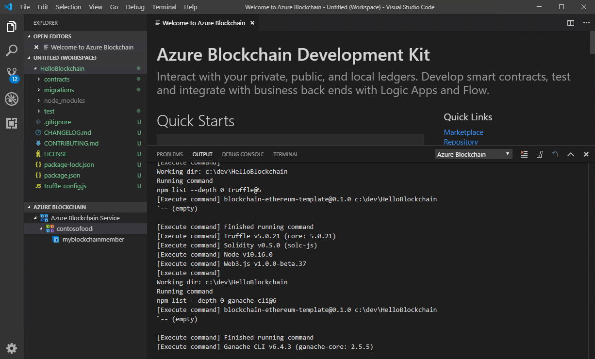
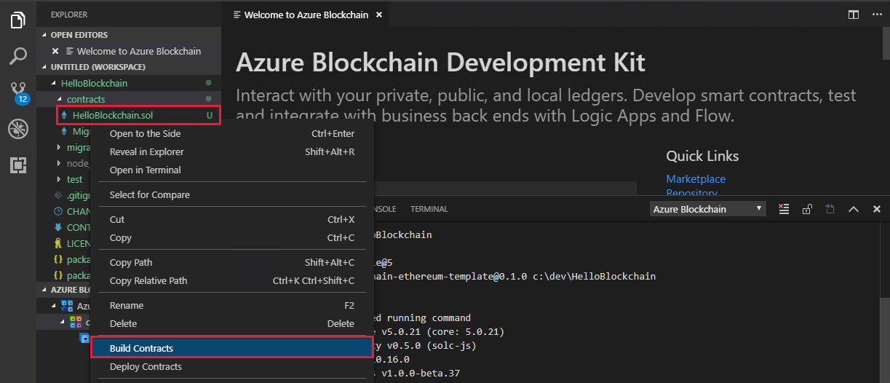
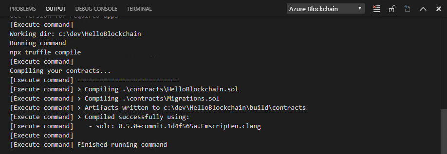
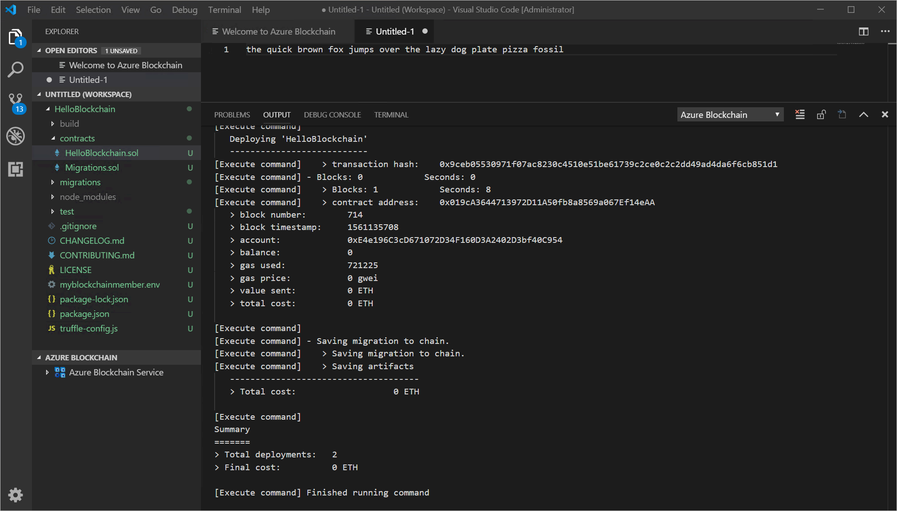
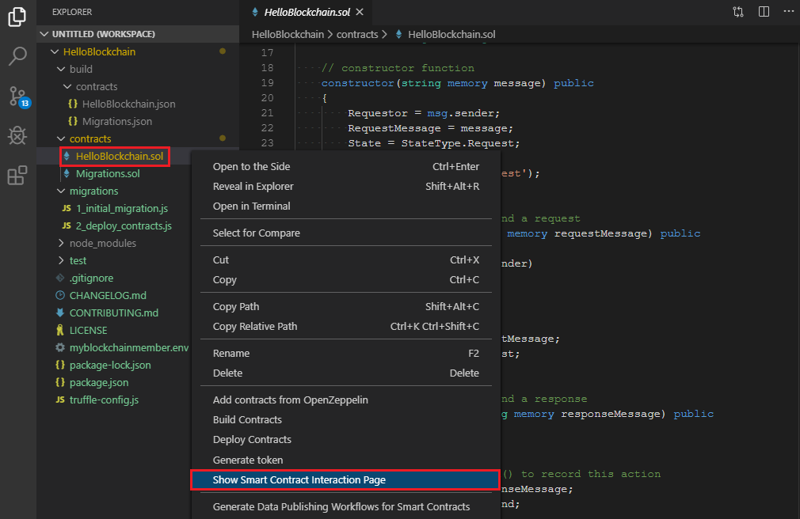
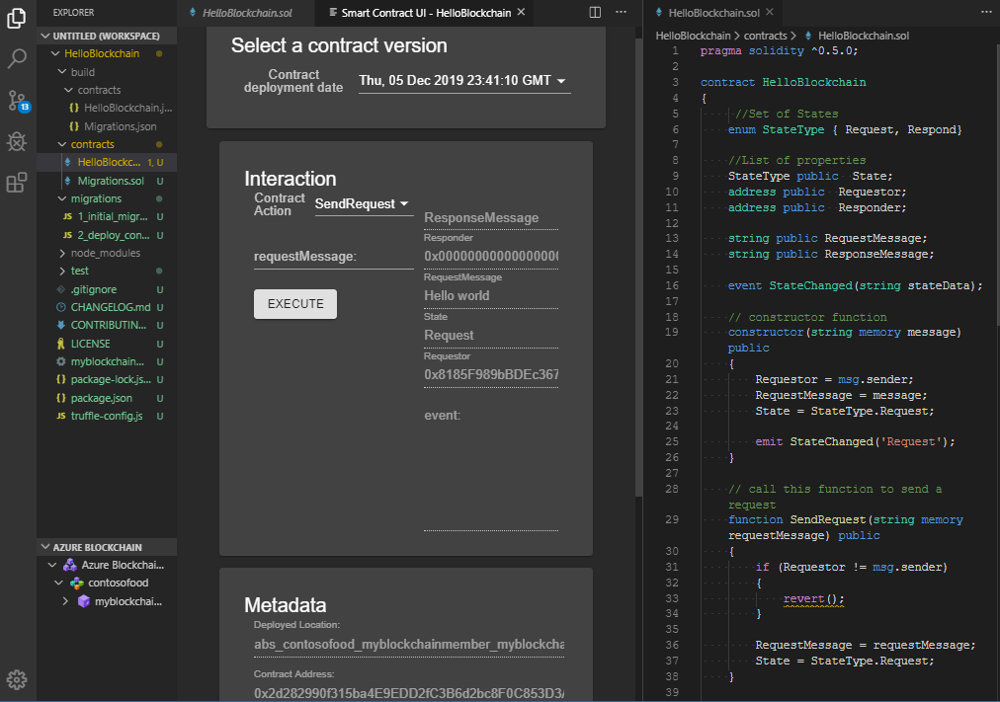
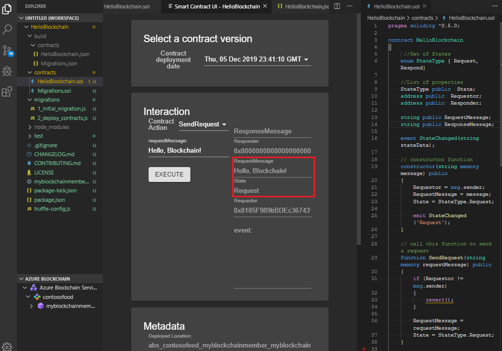

# Tutorial: Create, build, and deploy smart contracts on Azure Blockchain Service

In this tutorial, use the Azure Blockchain Development Kit for Ethereum extension in Visual Studio Code to create, build, and deploy a smart contract on Azure Blockchain Service. You also use the development kit to execute a smart contract function via a transaction.

You use Azure Blockchain Development Kit for Ethereum to:

> [!div class="checklist"]
> * Create a smart contract
> * Deploy a smart contract
> * Execute a smart contract function via a transaction

[!INCLUDE [quickstarts-free-trial-note](../../../includes/quickstarts-free-trial-note.md)]

## Prerequisites

* Complete [Quickstart: Use Visual Studio Code to connect to a Azure Blockchain Service consortium network](connect-vscode.md)
* [Visual Studio Code](https://code.visualstudio.com/Download)
* [Azure Blockchain Development Kit for Ethereum extension](https://marketplace.visualstudio.com/items?itemName=AzBlockchain.azure-blockchain)
* [Node.js 10.15.x or higher](https://nodejs.org/download)
* [Git 2.10.x or higher](https://git-scm.com)
* [Python 2.7.15](https://www.python.org/downloads/release/python-2715/) Add python.exe to your path. Python version 2.7.15 in your path is required for Azure Blockchain Development Kit.
* [Truffle 5.0.0](https://www.trufflesuite.com/docs/truffle/getting-started/installation)
* [Ganache CLI 6.0.0](https://github.com/trufflesuite/ganache-cli)

On Windows, an installed C++ compiler is required for the node-gyp module. You can use the MSBuild tools:

* If Visual Studio 2017 is installed, configure npm to use the MSBuild tools with the command `npm config set msvs_version 2017 -g`
* If Visual Studio 2019 is installed, set the MS build tools path for npm. For example, `npm config set msbuild_path "C:\Program Files (x86)\Microsoft Visual Studio\2019\Community\MSBuild\Current\Bin\MSBuild.exe"`
* Otherwise, install the stand-alone VS Build tools using `npm install --global windows-build-tools` in an elevated *Run as administrator* command shell.

For more information about node-gyp, see the [node-gyp repository on GitHub](https://github.com/nodejs/node-gyp).

## Create a smart contract

The Azure Blockchain Development Kit for Ethereum uses project templates and Truffle tools to help scaffold, build, and deploy contracts. Before you begin, complete the prerequisite [Quickstart: Use Visual Studio Code to connect to a Azure Blockchain Service consortium network](connect-vscode.md). The quickstart guides you through the installation and configuration of the Azure Blockchain Development Kit for Ethereum.

1. From the VS Code command palette, choose **Azure Blockchain: New Solidity Project**.
1. Choose **Create basic project**.
1. Create a new folder named `HelloBlockchain` and **Select new project path**.

The Azure Blockchain Development Kit creates and initializes a new Solidity project for you. The basic project includes a sample **HelloBlockchain** smart contract and all the necessary files to build and deploy to your consortium member in Azure Blockchain Service. It may take several minutes for the project to be created. You can monitor the progress in VS Code's terminal panel by selecting the output for Azure Blockchain.

The project structure looks like the following example:

   

## Build a smart contract

Smart contracts are located in the project's **contracts** directory. You compile smart contracts before you deploy them to a blockchain. Use the **Build Contracts** command to compile all the smart contracts in your project.

1. In the VS Code explorer sidebar, expand the **contracts** folder in your project.
1. Right-click **HelloBlockchain.sol** and choose **Build Contracts** from the menu.

    

Azure Blockchain Development Kit uses Truffle to compile the smart contracts.

## Deploy a smart contract

Truffle uses migration scripts to deploy your contracts to an Ethereum network. Migrations are JavaScript files located in the project's **migrations** directory.

1. To deploy your smart contract, right-click **HelloBlockchain.sol** and choose **Deploy Contracts** from the menu.
1. Choose your Azure Blockchain consortium network in the command palette. The consortium blockchain network was added to the project's Truffle configuration file when you created the project.
1. Choose **Generate mnemonic**. Choose a filename and save the mnemonic file in the project folder. For example, `myblockchainmember.env`. The mnemonic file is used to generate an Ethereum private key for your blockchain member.

Azure Blockchain Development Kit uses Truffle to execute the migration script to deploy the contracts to the blockchain.

## Call a contract function

The **HelloBlockchain** contract's **SendRequest** function changes the **RequestMessage** state variable. Changing the state of a blockchain network is done via a transaction. You can use the Azure Blockchain Development Kit smart contract interaction page to call the **SendRequest** function via a transaction.

1. To interact with your smart contract, right-click **HelloBlockchain.sol** and choose **Show Smart Contract Interaction Page** from the menu.

    

1. The interaction page allows you to choose a deployed contract version, call functions, view current state, and view metadata.

    

1. To call smart contract function, select the contract action and pass your arguments. Choose **SendRequest** contract action and enter **Hello, Blockchain!** for the **requestMessage** parameter. Select **Execute** to call the **SendRequest** function via a transaction.

    

Once the transaction is processed, the interaction section reflects the state changes.

The SendRequest function sets the **RequestMessage** and **State** fields. The current state for **RequestMessage** is the argument you passed **Hello, Blockchain**. The **State** field value remains **Request**.

## Clean up resources

When no longer needed, you can delete the resources by deleting the `myResourceGroup` resource group you created in the *Create a blockchain member* prerequisite quickstart.

To delete the resource group:

1. In the Azure portal, navigate to **Resource group** in the left navigation pane and select the resource group you want to delete.
1. Select **Delete resource group**. Verify deletion by entering the resource group name and select **Delete**.

## Next steps

In this tutorial, you created a sample Solidity project using Azure Blockchain Development Kit. You built and deployed a smart contract then called a function via a transaction on a blockchain consortium network hosted on Azure Blockchain Service.

> [!div class="nextstepaction"]
> [Developing blockchain applications using Azure Blockchain Service](develop.md)
