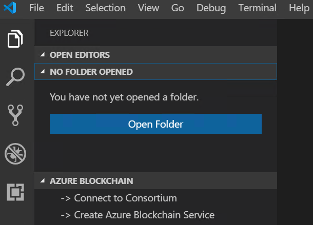

# Tutorial: Send a transaction to Azure Blockchain Service

In this tutorial, you'll use the Azure Blockchain Development Kit for Ethereum to create and deploy a smart contract then send a transaction to a consortium member blockchain in Azure Blockchain Service.

You use Azure Blockchain Development Kit to:

> [!div class="checklist"]
> * Connect to Azure Blockchain Service consortium member
> * Create a smart contract
> * Deploy a smart contract
> * Send a transaction

[!INCLUDE [quickstarts-free-trial-note](../../../includes/quickstarts-free-trial-note.md)]

## Prerequisites

* Complete [Quickstart: Create a blockchain member using the Azure portal](create-member.md) or [Quickstart: Create an Azure Blockchain Service blockchain member using Azure CLI](create-member-cli.md)
* [Visual Studio Code](https://code.visualstudio.com/Download)
* [Azure Blockchain Development Kit for Ethereum extension](https://marketplace.visualstudio.com/items?itemName=AzBlockchain.azure-blockchain)
* [Node.js (10.15.0)](https://nodejs.org)
* [Git (2.10.0)](https://git-scm.com)
* [Python (2.7.15)](https://www.python.org/downloads/release/python-2715/). Add python.exe to your path.
* [Truffle (5.0.0)](https://github.com/trufflesuite/truffle)
* [Ganache CLI (6.0.0)](https://github.com/trufflesuite/ganache-cli)

## Connect to consortium member

You can connect to consortium members using the Azure Blockchain Development Kit for Ethereum extension.

1. Complete the prerequisite [Quickstart: Create a blockchain member using the Azure portal](create-member.md) or [Quickstart: Create an Azure Blockchain Service blockchain member using Azure CLI](create-member-cli.md).
1. In the Visual Studio Code (VS Code) explorer pane, expand the **Azure Blockchain** extension.
1. Select **Connect to Consortium**.

   

    If prompted for Azure authentication, follow the prompts to authenticate using a browser.
1. Select the subscription and resource group associated with your Azure Blockchain Service consortium member.
1. Choose your consortium from the list.

## Create smart contract

The Azure Blockchain Development Kit for Ethereum uses the Truffle Suite of tools to help scaffold, build, and deploy contracts.

1. From the VS Code command palette, choose **Azure Blockchain: new Solidity Project**.
1. Choose **Create basic project**.
1. Create a new folder named `newcontract` and **Select new project path**.

    The Azure Blockchain Development Kit uses Truffle to create and initialize the Solidity project. It may take several minutes for the project to be created.

Your Solidity project includes a simple contract and all the necessary files to build and deploy a simple, working, contract to the Azure Blockchain Service.

The project structure looks like the following:

   

## Build smart contract

Your smart contracts are located in the project's **contracts** directory. Smart contracts need to be compiled before you deploy them to the blockchain. Use the **build** command to compile all the contracts in your project.

1. In VS Code, select **File > Open folder** and choose the **contracts** folder in your project.
1. Right-click **HelloBlockchain.sol** and choose **Build Contracts** from the menu.

    [screenshot]

Once compiled, your contract, contract metadata is stored in the **build** sub-directory.

## Deploy smart contract

Truffle uses migration scripts to deploy your contracts to an Ethereum network. Migrations are JavaScript files located in the project's **migrations** directory.

1. To deploy your smart contract, right-click **HelloBlockchain.sol** and choose **Deploy Contracts** from the menu.
1. Choose your Azure Blockchain consortium network under **From truffle-config.js**. The consortium network was added to the project's Truffle configuration file when you created the project.
1. Choose **Generate mnemonic** and name and save the mnemonic file in the project folder. For example `myblockchainmember.env`. The mnemonic file is used to generate an Ethereum private key for your blockchain member.

## Send a transaction

1. Create a file called `sendrequest.js`. Save it in the root of your project.
1. Add the following code to the new file. The script calls the **HelloBlockchain** contract's **SendRequest** function.

    ```javascript
    var HelloBlockchain = artifacts.require("HelloBlockchain");
        
    module.exports = function(done) {
      console.log("Getting deployed version of HelloBlockchain...")
      HelloBlockchain.deployed().then(function(instance) {
        console.log("Sending request");
        return instance.SendRequest("Hello");
      }).then(function(result) {
        console.log("Transaction:", result.tx);
        console.log("Finished!");
        done();
      }).catch(function(e) {
        console.log(e);
        done();
      });
    };
    ```

1. When Azure Blockchain Development Kit creates a project, the Truffle configuration file is generated with your consortium network endpoint details. Open **truffle-config.js** in your project. The configuration file lists two networks: one named development and one with the same name as the consortium.

1. In VS Code's Terminal pane, use Truffle to execute the script on your consortium network.

    ```bash
    truffle exec sendrequest.js --network <consortium network>
    ```

    Replace \<consortium network\> with the name of the consortium network defined in the **truffle-config.js**.

Truffle executes the script on your consortium network.


## Clean up resources

When no longer needed, you can delete the resources by deleting the `myResourceGroup` resource group you created by the Azure Blockchain Service.

To delete the resource group:

1. In the Azure portal, navigate to **Resource group** in the left navigation pane and select the resource group you want to delete.
1. Select **Delete resource group**. Verify deletion by entering the resource group name and select **Delete**.

## Next steps

In this tutorial, you added two transaction nodes to demonstrate contract and transaction privacy. You used the default node to deploy a private smart contract. You tested privacy by querying contract values and performing transactions on the blockchain.

> [!div class="nextstepaction"]
> [Developing blockchain applications using Azure Blockchain Service](develop.md)
