# Ethereum proof-of-work consortium solution template

The Ethereum Proof-of-Work Consortium solution template is designed to make it easier and quicker to deploy and configure a multi-member consortium Ethereum network with minimal Azure and Ethereum knowledge.

With a handful of user inputs and a single-click deployment through the Azure portal, each member can provision their network footprint, using Microsoft Azure Compute, networking, and storage services across the globe. Each member's network footprint consists of a set of load-balanced transaction nodes with which an application or user can interact to submit transactions, a set of mining nodes to record transactions, and a VPN gateway. A subsequent connection step connects the gateways to create a fully configured multi-member blockchain network.

## About blockchain

For those of you who are new to the blockchain community, the release of this solution is a great opportunity to learn about the technology in an easy and configurable manner on Azure. However, to get started, we recommend deploying the simpler standalone Ethereum network topology with this guided walkthrough, before building out multi-member consortium networks.

### Mining node details

Nodes that mine transactions are separated from the nodes that accept transactions to ensure that the two actions are not competing for the same resources.

A consortium member can provision up to five regions containing one or more mining nodes, backed by a managed disk. One or more nodes in the region are configured as a boot node to support dynamic discoverability of the nodes in the network. Mining nodes communicate with other mining nodes to come to consensus on the state of the underlying distributed ledger. There is no need for your application to be aware of or communicate with these nodes. By focusing on private networks, the mining nodes are isolated from inbound public internet traffic to add a secondary layer of protection. Outbound traffic is allowed, but not to the Ethereum discovery port.

All nodes have a stable version of the Go Ethereum (Geth) client and are configured to be mining nodes. If you did not supply a custom genesis block, all nodes use the same Ethereum address and key pair that is protected by the Ethereum account password. The Ethereum passphrase you provided is used to generate the default account (coinbase) for each mining node. As mining nodes, mine, they collect fees that are added to this account.

The number of mining nodes per consortium member depends on the overall size of the network desired and the amount of hashing power dedicated to each member. The larger the network, the more nodes that need to be compromised to gain an unfair advantage. The template supports up to 15 mining nodes per region provisioned using virtual machine scale sets.

### Transaction node details

A consortium member also has a set of load-balanced transaction nodes. These nodes are reachable from outside the virtual network, so that applications can use these nodes to submit transactions or execute smart contracts within the blockchain network. All nodes have a stable version of the Go Ethereum (Geth) client and are configured to maintain a complete copy of the distributed ledger. If a custom genesis block is not provided, these nodes use the same Ethereum account, protected by the Ethereum account password.

Transaction nodes are load-balanced within an availability set to maintain high availability. The template supports up to five transaction nodes provisioned using virtual machine scale sets.

### Log analytics details

Each deployment also creates a new Log Analytics instance or can join an existing instance. This allows the monitoring of various performance metrics of each virtual machine that makes up the deployed network.

## Deployment architecture

### Description

This solution template can deploy single or multi region-based multi member Ethereum consortium network. The virtual network of each region is connected to other region in a chain topology using the VNET gateways and connection resources. It also provisions a registrar, which contains required information of all the Miner and Transaction nodes deployed in each region.

### Standalone and consortium leader overview

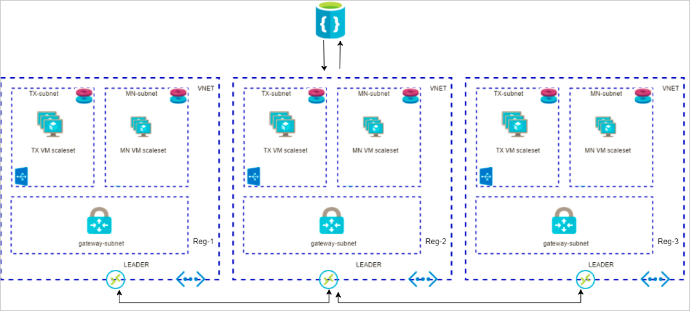

### Joining consortium member overview

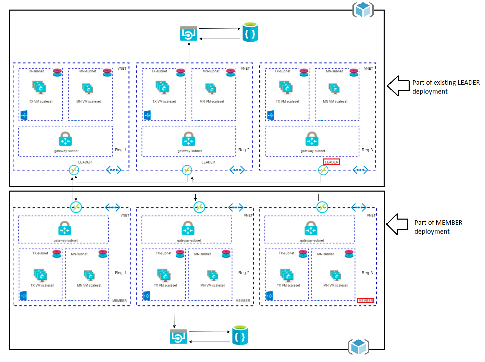

## Getting started

This process requires an Azure subscription that can support deploying several virtual machines scale sets and managed disks. If necessary, create a free Azure account to begin.

Once a subscription is secured, go to Azure portal. Select **+ Create a resource**, Marketplace (See all), and search for **Ethereum Proof-of-Work Consortium**.

The template deployment will walk you through configuring the first member's footprint in the network. The deployment flow is divided into five steps: Basics, Operations Management Suite, Deployment regions, Network size, and performance, Ethereum settings.

### Basics

Under **Basics**, specify values for standard parameters for any deployment, such as subscription, resource group, and basic virtual machine properties.

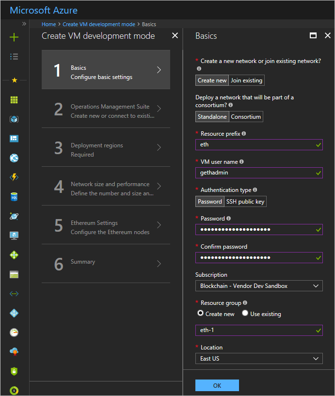

Parameter Name|Description| Allowed Values|Default Values
---|---|---|---
Create a new network or join existing network?|Create a new network or join a pre-existing consortium network|Create New Join Existing|Create New
Deploy a network that will be part of a consortium?|A consortium network allows future deployments to join this network (visible when *Create New* is selected above)|Standalone Consortium|Standalone
Resource Prefix |String used as a base for naming resources (2 to 4 alphanumeric characters). A unique hash is prepended to the string for some resources, while resource-specific information is appended.|Alphanumeric characters with length 2 to 4|NA
VM user name| Administrator username of each deployed VM (alphanumeric characters only)|1 - 64 characters |gethadmin
Authentication type|The method to authenticate to the virtual machine. |Password or SSH public key|Password
Password (Authentication type = Password)|The password for the administrator account for each of the virtual machines deployed. The password must contain 3 of the following requirements: 1 upper case character, 1 lower case character, 1 number, and 1 special character. <br />While all VMs initially have the same password, you can change the password after provisioning.|12 - 72 characters|NA
SSH Key(Authentication type = Public Key)|The secure shell key used for remote login.|| NA
Subscription| The subscription to which to deploy the consortium network||NA
Resource Group| The resource group to which to deploy the consortium network.||NA
Location| The Azure region for resource group. ||NA


### Operations Management Suite

The Operations Management Suite (OMS) blade allows you to configure an OMS resource for your network. OMS will collect and surface useful metrics and logs from your network, providing the ability to quickly check the network health or debug issues. The free offering of OMS will fail gracefully once capacity is reached.

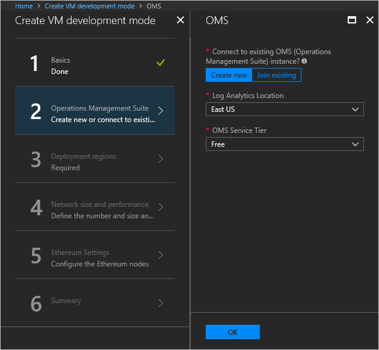

Parameter Name|Description| Allowed Values|Default Values
---|---|---|---
Connect to existing OMS|Create a new Log Analytics instance or join an existing instance|Create new Join existing|Create new Log Analytics Location|The region where the new Log Analytics will be deployed (Visible if *Create new* is selected)
Existing OMS Workspace Id|Workspace ID of the existing instance (Visible if *Join Existing* is selected) OMS Service Tier|Choose the pricing tier for the new instance. More Info at https://azure.microsoft.com/pricing/details/log-analytics/ (Visible if *Join Existing* is selected)|Free Standalone Per Node|Free
Existing OMS Primary Key|The primary key used to connect to the existing OMS instance (Visible if *Join Existing* is selected)

### Deployment regions

Next, under **Deployment regions**, specify inputs for **Number of region(s)** to deploy the consortium network and selection of Azure regions based on the number of regions given. User can deploy in maximum of five regions.


Parameter Name| Description| Allowed Values |Default Values
---|---|---|---
Number of region(s)| Number of regions to deploy the consortium network|1, 2, 3, 4, 5| 2
First region| First region to deploy the consortium network|All allowed Azure regions| West US
Second region |Second region to deploy the consortium network (Visible only when number of regions is selected as 2)|All allowed Azure regions| East US
Third region| Third region to deploy the consortium network (Visible only when number of regions is selected as 3)|All allowed Azure regions| Central US
Fourth region| Fourth region to deploy the consortium network (Visible only when number of regions is selected as 4)|All allowed Azure regions| East US 2
Fifth region| Fifth region to deploy the consortium network (Visible only when number of regions is selected as 5)|All allowed Azure regions| West US 2

### Network size and performance

Next, under **Network size and performance** specify inputs for the size of the consortium network, such as number and size of mining nodes and transaction nodes.

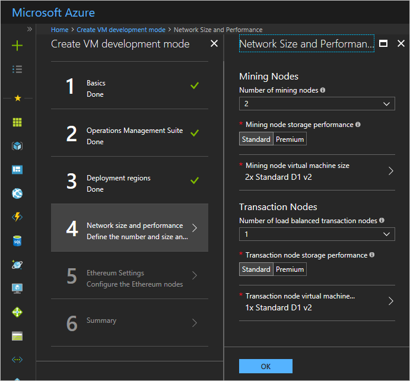

Parameter Name |Description |Allowed Values| Default Values
---|---|---|---
Number of mining nodes|The number of mining nodes deployed per region|2 - 15| 2
Mining node storage performance|The type of managed disk backing each of the deployed mining nodes.|Standard or Premium|Standard
Mining node virtual machine size|The virtual machine size used for mining nodes.|Standard A, <br />Standard D, <br />Standard D-v2, <br />Standard F series, <br />Standard DS, <br />and Standard FS|Standard D1v2
Number of load balanced transaction nodes|The number of transaction nodes to provision as part of the network.|1 - 5| 2
Transaction node storage performance|The type of managed disk backing each of the deployed transaction nodes.|Standard or Premium|Standard
Transaction node virtual machine size|The virtual machine size used for transaction nodes.|Standard A, <br />Standard D, <br />Standard D-v2, <br />Standard F series, <br />Standard DS, <br />and Standard FS|Standard D1v2

### Ethereum settings

Next, under **Ethereum settings**, specify Ethereum-related configuration settings, like the network ID and Ethereum account password or genesis block.

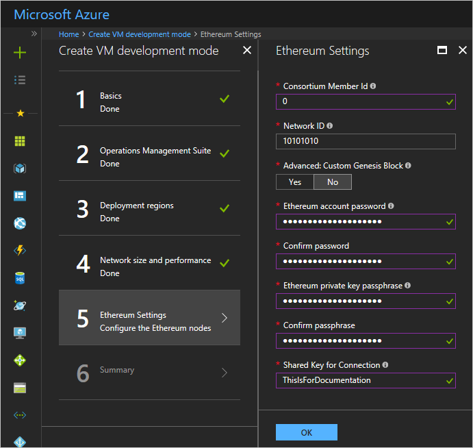

Parameter Name |Description |Allowed Values|Default Values
---|---|---|---
ConsortiumMember ID|The ID associated with each member participating in the consortium network used to configure IP address spaces to avoid collision. <br /><br />Member ID should be unique across different organizations in the same network. A unique member ID is needed even when the same organization deploys to multiple regions.<br /><br />Make note of the value of this parameter since you will need to share it with other joining members.|0 - 255
Ethereum Network ID|The network ID for the consortium Ethereum network being deployed. Each Ethereum network has its own Network ID, with 1 being the ID for the public network. While network access is restricted for mining nodes, we still recommend using a large number to prevent collisions.|5 - 999,999,999| 10101010
Custom genesis block|Option to either automatically generate a genesis block or provide a custom one.|Yes/No| No
Ethereum Account Password (Custom genesis block = No)|The administrator password used to secure the Ethereum account imported into each node. The password must contain the following: 1 upper case character, 1 lower case character, and 1 number.|12 or more characters|NA
Ethereum private key passphrase (Custom genesis block = No)|The passphrase used to generate the ECC private key associated with the default Ethereum account that is generated. A pre-generated private key does not need to be explicitly passed in.<br /><br />Consider a passphrase with sufficient randomness to ensure a strong private key and no overlap with other consortium members. The passphrase must contain the following at a minimum: 1 upper case character, 1 lower case character, and 1 number.<br /><br />Note if two members use the same passphrase the accounts generated will be the same. The same passphrase is useful if a single organization is trying to deploy across regions and wants to share a single account (coin base) across all nodes.|12 or more characters|NA
Genesis block(Custom genesis block = Yes)|JSON string representing custom genesis block. You can find more details on the format of the genesis block here, under Custom Networks.<br /><br />An Ethereum account is still created when providing a custom genesis block. Consider specifying a prefunded Ethereum account in the genesis block to not wait for mining.|Valid JSON |NA
Shared Key for Connection|A Shared key for connection between VNET gateways.| 12 or more characters|NA
Consortium Data URL|The URL pointing to the relevant consortium configuration data provided by another member's deployment. <br /><br />This information is provided by an already connected member who has a deployment. If you deployed the rest of the network, the URL is the template deployment output, named CONSORTIUM-DATA.||NA
VNet Gateway to Connect to|The resource path of the VNet Gateway to which to connect.<br />This information is provided by an already connected member who has a deployment. If you deployed the rest of the network, the URL is in template deployment output, named CONSORTIUM_MEMBER_GATEWAY_ID. Note: The same member's consortium data URL and VNet Gateway resource must be used.||NA
Endpoint of Peer information registrar|Peer info endpoint provided by another member's deployment|Valid endpoint of first member in consortium|NA
Key of Peer information registrar|Peer info primary key provided by another member's deployment|Valid primary key of first member in consortium|NA

### Summary

Click through the summary blade to review the inputs specified and to run basic pre-deployment validation.

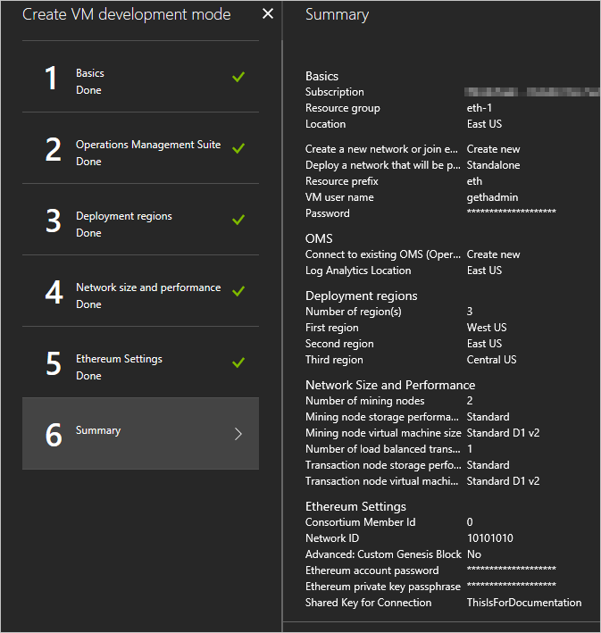

Review legal and privacy terms and click **Purchase** to deploy. If the deployment has more than one region, or is for a consortium network, then this template pre-deploys the necessary VPN gateways to support network connectivity with other members. Deployment of the gateway can take up to 45 to 50 minutes.

## Post deployment sanity checks

### Administrator page

Once the deployment has completed successfully and all resources have been provisioned, you can go to the administrator page to get a view of your blockchain network and sanity check the deployment state. The URL of the admin page is the DNS name of the load balancer; it is present in the output section of the template deployment named as ADMIN_SITE.

To find it, select the resource group that was deployed. Then, select **Overview**, and click on the link immediately under **Deployments** that shows the number that succeeded.

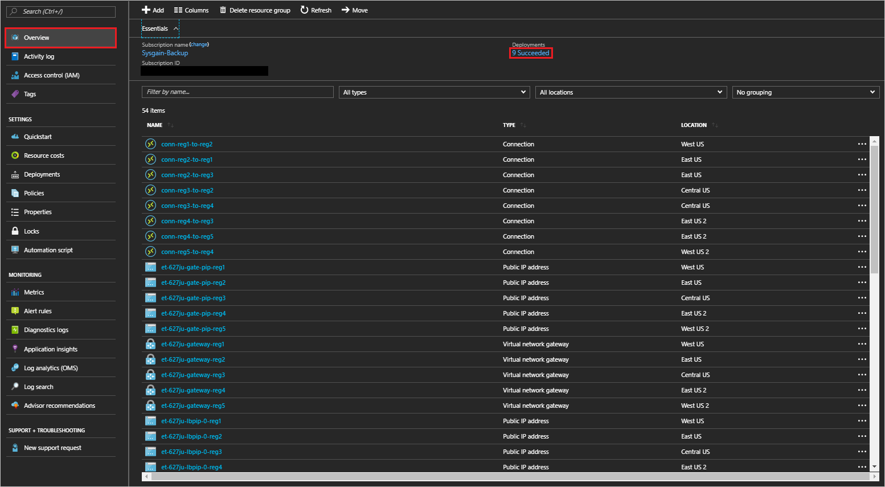

The new screen shows deployment history. Select the first deployment resource (For example, microsoft-azure-blockchain.azure-blockchain-servi...) and look for the **Outputs** section in the lower half of the page. You`ll see the URL for the admin page listed in the template deployment output parameter as ADMIN_SITE.


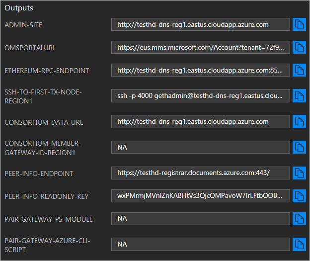

To get to the admin page, copy the **ADMIN-SITE** output and open it in another tab.

On the admin page, you can get a high-level overview of the topology you deployed by reviewing the Ethereum Node Status section. It includes all node hostnames, their peer count, and the latest block seen. The peer count for each node is between the minimum of one less than the *total node count* and the configured maximum peer count. Note, that the peer count does not restrict the number of nodes that can be deployed within the network.
Occasionally, you will see the peer count fluctuate and be less than the (total number of nodes - 1). The difference in the count is not always a sign that the nodes are unhealthy, since forks in the ledger can cause minor changes in peer count. Finally, you can inspect the latest block seen by each node in the network to determine forks or lags in the system.

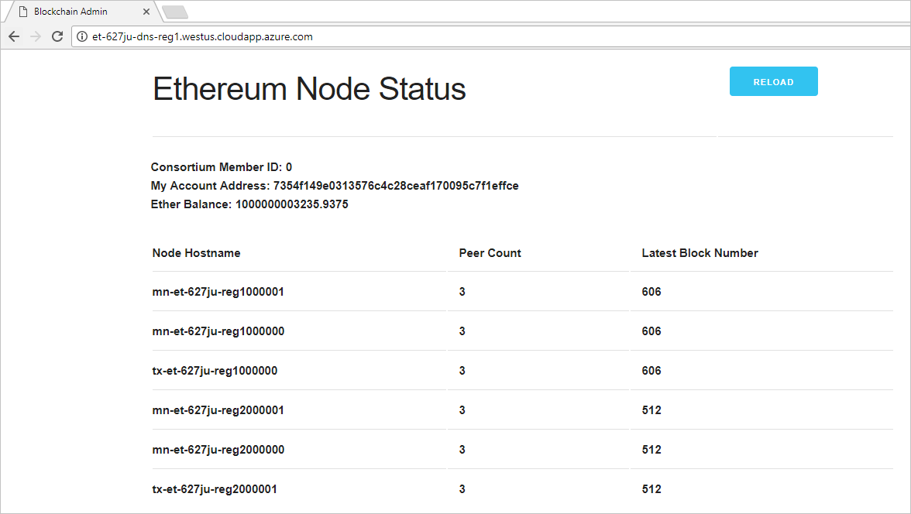

The node status is refreshed every 10 seconds. Reload the page via the browser or **Reload** button to update the view.

### OMS portal

You can locate your OMS portal either by following the link in the deployment output (OMSPORTALURL) or by selecting the OMS resource in your deployed resource group.

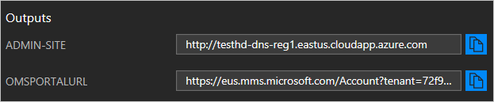

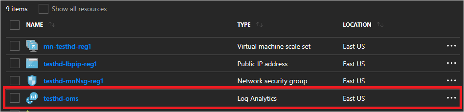

The portal will first display high-level network statistics as an overview.

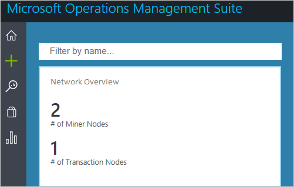

Clicking on the overview will direct you to a portal to view per-node statistics.

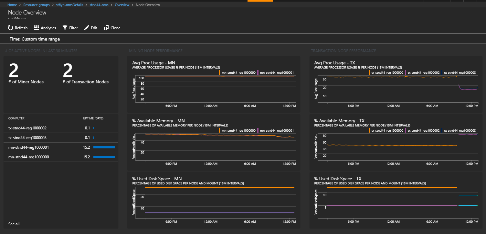

### Accessing nodes

You can remotely connect to the virtual machines for the transaction nodes via SSH with your provided admin username and password/SSH key. Since the transaction node VMs do not have their own public IP addresses, you will need to go through the load balancer and specify the port number. The SSH command to run to access the first transaction node is listed in the template deployment output parameter as, **SSH_TO_FIRST_TX_NODE** (for the sample deployment: ssh -p 4000 gethadmin@leader4vb.eastus.cloudapp.azure.com). To get to additional transaction nodes, increment the port number by one (For example, the first transaction node is on port 4000).

Since the virtual machines on which the mining nodes run are not externally accessible, you need to go through one of the transaction nodes. Once you have an SSH session to a transaction node, install your private key on the transaction node or use your password to start an SSH session into any of the mining nodes.

**Note**

The hostnames can be obtained from Admin Site or from the Azure portal. In Azure portal, the hostnames of nodes present in the virtual machine scale set (VMSS) resource is listed under **Instances**, which differs from the actual hostnames. For example, the hostname in Azure portal may look like **mn-asdfmv-reg1_0** but the actual hostname would be like **mn-asdfmv-reg**.

For example:

Azure portal hostname| Actual hostname
---|---
mn-ethwvu-reg1_0| mn-ethwvu-reg1000000
mn-ethwvu-reg1_1 |mn-ethwvu-reg1000001
mn-ethwvu-reg1_2 |mn-ethwvu-reg1000002

## Adding a new consortium member

### Sharing data

As the first member (or a connected member) of the consortium, you need to provide other members a few pieces of information so they can join and establish their connection. Specifically:

1. **Shared Consortium Configuration Data**: There is a set of data that is used to orchestrate
    the Ethereum connection between two members. The necessary information, including the
    genesis block, consortium network ID, and boot nodes, is written to a file on the transaction
    nodes of the leader or another deployed member. The location of this file is listed in the
    template deployment output parameter named **CONSORTIUM-DATA**.
2. **Peer Info endpoint**: The Peer info registrar endpoint to get information of all the nodes
    already connected to the Ethereum network from the Leaders or another member's
    deployment. The DB stores a set of information regarding each node connected in the
    network, information such as node's hostname, private IP address etc. This is the template
    deployment output parameter named **PEER_INFO_ENDPOINT**.
3. **Peer Info Primary Key**: The Peer info registrar Primary key is used to get access to the
    leader's or other member's Peer info primary key. This is the template deployment output
    parameter named **PEER_INFO_PRIMARY_KEY**.


4. **VNET Gateway**: Each member establishes a connection to the entire blockchain network
    through an existing member. To connect VNET, you need the resource path to the VNET
    Gateway of the member to which you are connecting. This is the template deployment output
    parameter named **CONSORTIUM_MEMBER_GATEWAY_ID**.
5. **Shared Key**: A pre-established secret between two members of the consortium network that
    are establishing a connection. This is an alphanumeric string (between 1 to 128 characters)
    that has been agreed upon outside the context of the deployment. (For example,
    **MySharedKeyAbc123**)

### Acceptance of new member

This step should be done after the joining member has deployed their network successfully. Before a member can join the network and see transaction traffic, an existing member must perform a final configuration on their VPN Gateway to accept the connection. This means the Ethereum nodes of the joining member will not run until a connection is established. This configuration can be done via PowerShell or xPlat CLI. A PowerShell module and xPlat CLI script are also stored on the transaction node, alongside the consortium data. The script location is the deployment output parameters named **PAIR-GATEWAY-PS-MODULE** and **PAIR-GATEWAY-AZURE-CLISCRIPT**, respectively.

**PowerShell/CLI Setup**

Additional information on how to get started with Azure PowerShell cmdlets and Azure xPlat CLI can be found in Azure documentation.

You will need the latest version of the Azure cmdlets installed locally and a session open. Make sure to log into the session with your Azure subscription credentials.

**PowerShell: Establish Connection**

Download the PowerShell module and store it locally. The location of the PowerShell module is specified as the **PAIR-GATEWAY-PS-MODULE** template deployment output parameter.

If not already enabled, use the **Set-ExecutionPolicy** cmdlet for the local session to allow running an unsigned module.

**Set-ExecutionPolicy Unrestricted CurrentUser**

Next, login to your Azure Subscription in which you deployed the Leader deployment using

**Login-AzureRmAccount**

Next, import the module:

**Import-Module <filepath to downloaded file>**

Finally, run the function with the appropriate input:

- **MyGatewayResourceId** : Resource path of your Gateway. This is the template deployment
    output parameter named **CONSORTIUM_MEMBER_GATEWAY_ID**.
- **OtherGatewayResourceId** : Resource path of the joining member's gateway. This is
    provided by the joining member and is the template deployment output parameter of also
    named **CONSORTIUM_MEMBER_GATEWAY_ID**.
- **ConnectionName** : A name for you to identify this Gateway connection.
- **Shared Key** : The pre-established secret between the two members of the consortium
    network that are establishing a connection.

**CreateConnection** - MyGatewayResourceId <resource path of your Gateway> -OtherGatewayResourceId
<resource path of the joining member's gateway> -ConnectionName myConnection -SharedKey
"MySharedKeyAbc123"

**xPlat CLI: Establish Connection**

Download the Azure CLI script and store it locally. The location of the Azure CLI script is specified in the template deployment parameter named **PAIR-GATEWAY-AZURE-CLI-SCRIPT**.

Run the script with the appropriate input:

- **MyGatewayResourceId** : Resource path of your Gateway. This is the template deployment
    output parameter named **CONSORTIUM_MEMBER_GATEWAY_ID**.
- **OtherGatewayResourceId** : Resource path of the joining member's gateway. This is
    provided by the joining member and is the template deployment parameter of their
    deployment also named **CONSORTIUM_MEMBER_GATEWAY_ID**.
- **ConnectionName** : A name for you to identify this Gateway connection.
- **Shared Key** : The pre-established secret between the two members of the consortium
    network that are establishing a connection.
- **Location** : The Azure region where your gateway resource is deployed.

``` powershell
az network vpn-connection create --name $ConnectionName --resource-group
$MyResourceGroup --vnet-gateway1 $MyGatewayResourceId --shared-key $SharedKey --vnet-
gateway2 $OtherGatewayResourceId --enable-bgp
```

The architecture will be as follows after you have successfully configured connection between **leader** and **member** deployments.


## Fund new member account

### Generated genesis block

As the first member, your Ethereum account is funded with one trillion ether if the deployment generates the genesis block (Custom Genesis Block = No). Other members will have an account that is not pre-funded and must wait to accumulate Ether as their mining nodes begin to mine blocks. To avoid having new members wait for Ether, you will need to explicitly fund joining members' Ethereum accounts.

To do so, joining members must provide you with the Ethereum account that is displayed on their admin website. You can then use your admin website to transfer Ether from your account to their account by entering the account provided.

### Custom genesis block

If a custom genesis block is provided with a specified Ethereum account, you can use MetaMask or another tool to transfer ether from that specified account to the pre-generated Ethereum account visible in the admin website. For instructions on how to use MetaMask, see [Creating Ethereum Account](#create-ethereum-account).

If a custom genesis block is provided without an account or you do not have access to any pre-allocated accounts, you will need to wait until your mining nodes begin to mine to generate Ether into your account (coin base). How quickly the funds are generated depends on the difficulty level you specify in the custom genesis block.

## Create Ethereum account

To create an additional account, you can use a variety of solutions. One such solution is MetaMask, a Chrome extension that provides an identity vault and connection to an Ethereum network, public, test, or custom. MetaMask formulates a transaction to register the account in the network.

This transaction, like any other transaction, will go to one of the transaction nodes, and eventually be mined into a block as illustrated below.

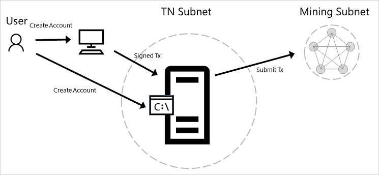

To install the extension in Chrome, go to Customize and control Google Chrome (overflow button) > More Tools > Extensions > Get More Extensions, and search for MetaMask.

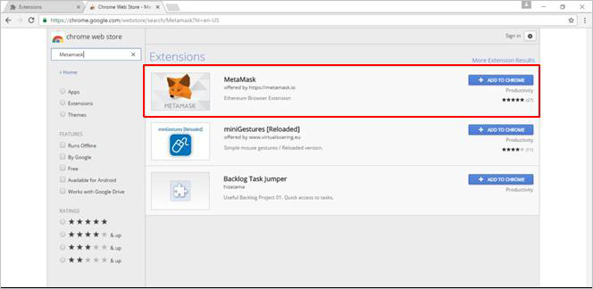

Once installed, open MetaMask and create a new vault. By default, the vault will be connected to the Morden Test Network. You will need to change this to connect to the deployed private consortium network, specifically to the load balancer in front of the transaction nodes. From the template output, retrieve the exposed Ethereum RPC endpoint at port 8545, named as `ETHEREUM-RPC-ENDPOINT`, and enter it in custom RPC as shown below.

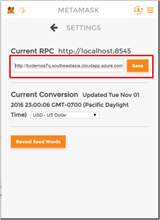

By creating the vault, you create a wallet containing an account. To create additional accounts, select **Switch Accounts** and then the **+** button.

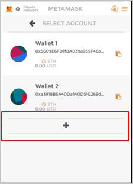

### Initiate initial Ether allocation

Through the administrator page, you can formulate a transaction to transfer Ether from the pre-allocated account to another Ethereum account. This Ether transfer is a transaction that is sent to the transaction node and mined into a block as illustrated below.


Via the clipboard icon in the MetaMask wallet, copy the address of the Ethereum account to which you want to transfer ether and go back to the administrator page. Paste the copied account into the input field to transfer 1000 ether from the pre-allocated Ethereum account to your newly created account. Click **Submit** and wait for the transaction to be mined into a block.

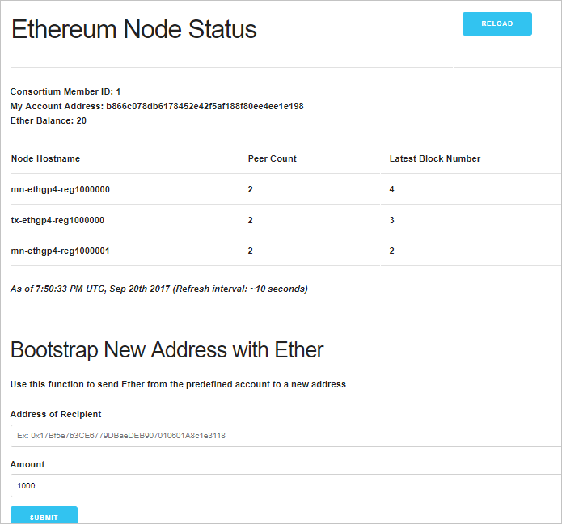

Once the transaction is committed into a mined block, the account balance in MetaMask for your account will reflect the transfer of 1000 Ether.

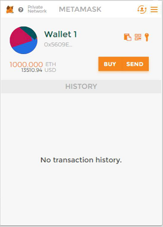

### Transfer of Ether between accounts

At this point, you are ready to execute transactions within your private consortium network. The simplest transaction is to transfer Ether from one account to another. To formulate such a transaction, you can use MetaMask once again, transferring money from the first account used above to a second account.

From **Wallet 1** in MetaMask, click on send. Copy the address of the second wallet created into **Recipient Address** input field and amount of Ether to transfer in the **Amount** input field. Click **Send** and accept the transaction.


Once again, when the transaction is mined and committed into a block, the account balances are reflected accordingly. Note, **Wallet 1**'s balance is deducted more than 15 Ether, since you had to pay a mining fee to process the transaction.

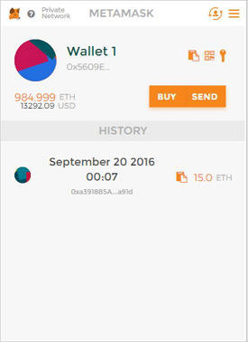

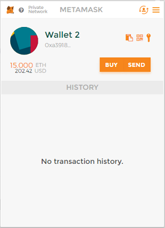

## Next steps

You are now ready to focus on application and smart contract development against your private consortium blockchain network.
