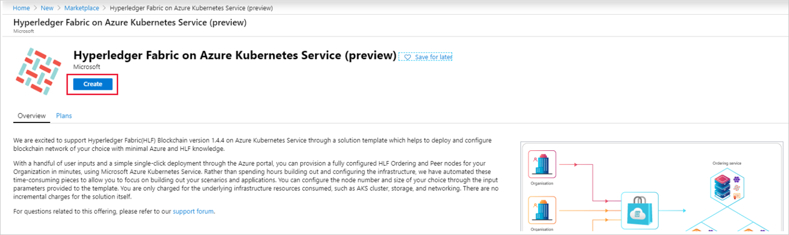
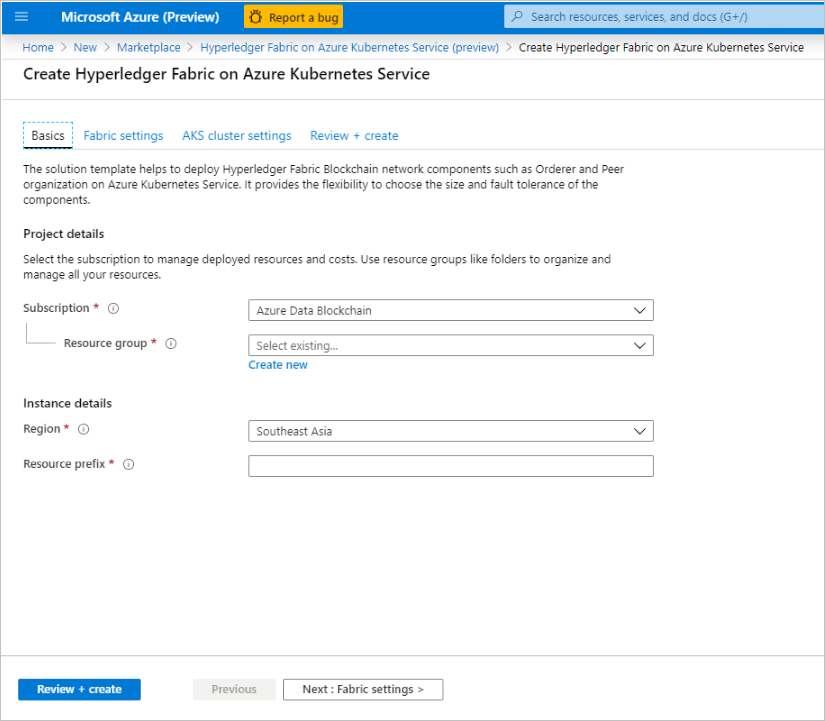
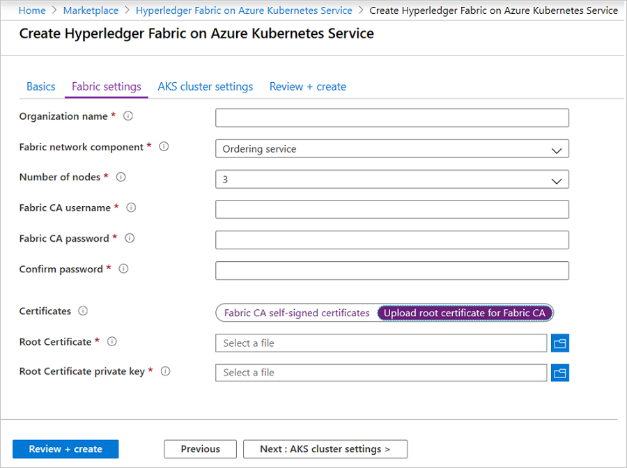
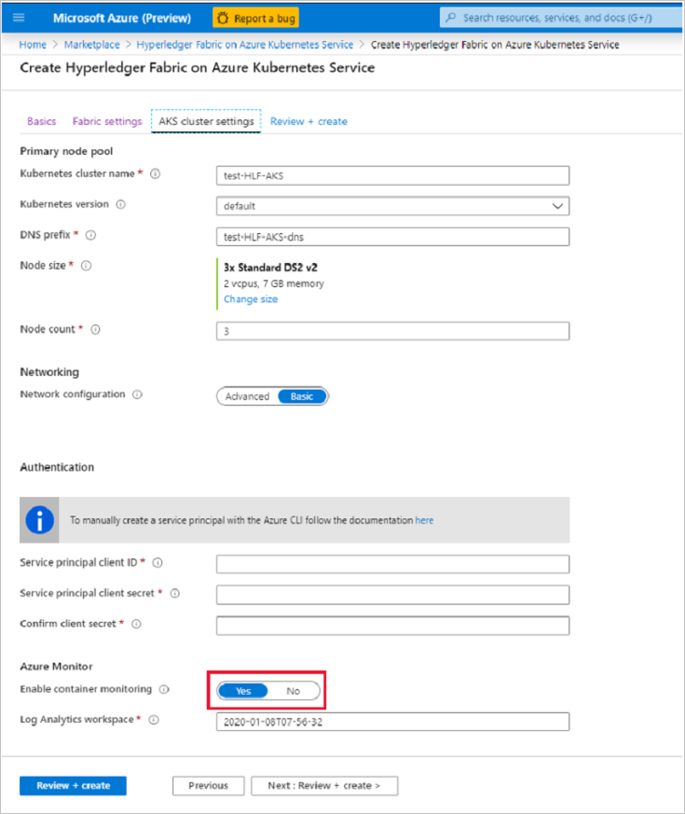
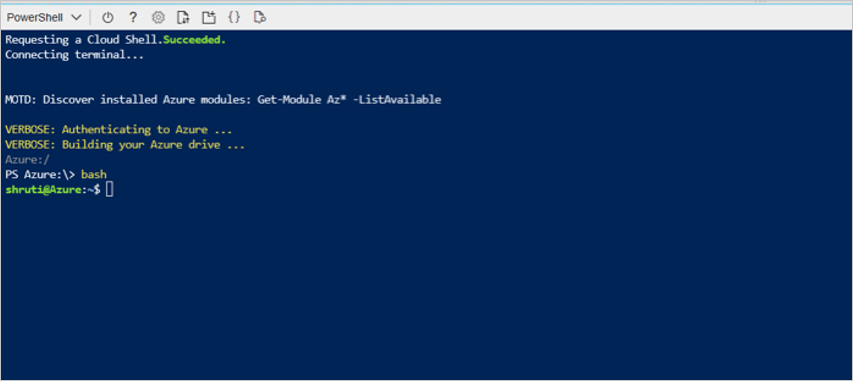
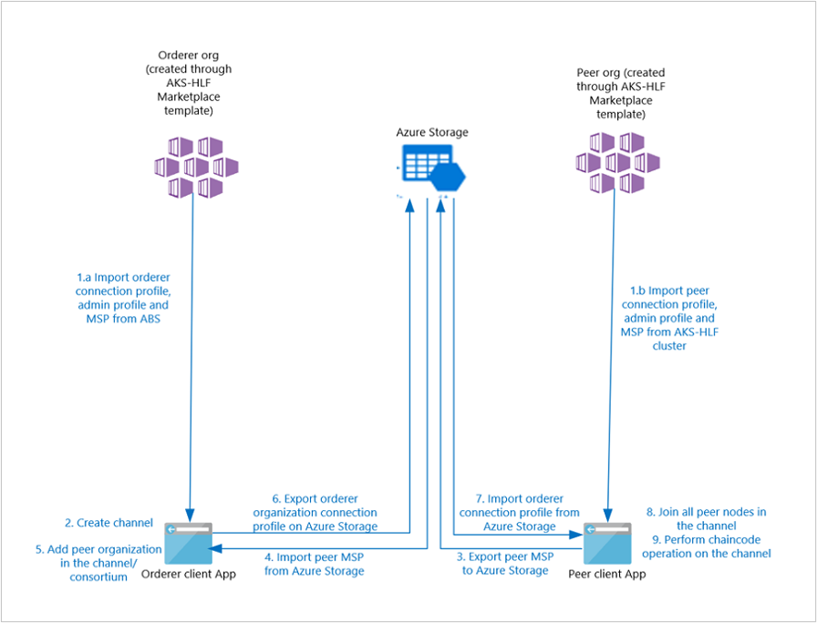

# Hyperledger Fabric consortium on Azure Kubernetes Service (AKS)

You can use the Hyperledger Fabric (HLF) on Azure Kubernetes Service (AKS) template to deploy and configure a Hyperledger Fabric consortium network on Azure.

After reading this article, you will:

- Obtain working knowledge of Hyperledger Fabric and the various components that form the building blocks of Hyperledger Fabric blockchain network.
- Learn how to deploy and configure a Hyperledger Fabric consortium on Azure Kubernetes Service for your production scenarios.

## Hyperledger Fabric Consortium architecture

To build Hyperledger Fabric network on Azure, you need to deploy Ordering Service and organization with peer nodes. The different fundamental components that are created as part of the template deployment are:

- **Orderer nodes**: A node that is responsible for transaction ordering in the ledger. Along with other nodes, the ordered nodes form the ordering service of the Hyperledger Fabric network.

- **Peer nodes**: A node that primarily host ledgers and smart contracts, these fundamental elements of the network.

- **Fabric CA**: Fabric CA is the Certificate Authority (CA) for Hyperledger Fabric. The Fabric CA allows you to initialize and start server process that hosts the certificate authority. It allows you to manage identities and certificates. Each AKS cluster deployed as part of the template will have a Fabric CA pod by default.

- **CouchDB or LevelDB**: World state database for the peer nodes can be stored either in LevelDB or CouchDB. LevelDB is the default state database embedded in the peer node and stores chaincode data as simple key-value pairs and supports key, key range, and composite key queries only. CouchDB is an optional alternate state database that supports rich queries when chaincode data values are modeled as JSON.

The template on deployment spins up various Azure resources in your subscription. The different Azure resources deployed are:

- **AKS cluster**: Azure Kubernetes cluster that is configured as per the input parameters provided by the customer. The AKS cluster has various pods configured for running the Hyperledger Fabric network components. The different pods created are:

  - **Fabric tools**: The fabric tool is responsible for configuring the Hyperledger Fabric components.
  - **Orderer/peer pods**: The nodes of the HLF network.
  - **Proxy**: An NGNIX proxy pod through which the client applications can interface with the AKS cluster.
  - **Fabric CA**: The pod that runs the Fabric CA.
- **PostgreSQL**: An instance of PostgreSQL is deployed to maintain the Fabric CA identities.

- **Azure Key vault**: A key vault instance is deployed to save the Fabric CA credentials and the root certificates provided by customer, which is used in case of template deployment retry, to handle the mechanics of the template.
- **Azure Managed disk**: Azure Managed disk is for persistent store for ledger and peer node world state database.
- **Public IP**: A public IP endpoint of the AKS cluster deployed for interfacing with the cluster.

## Hyperledger Fabric Blockchain network setup

To begin, you need an Azure subscription that can support deploying several virtual machines and standard storage accounts. If you do not have an Azure subscription, you can [create a free Azure account](https://azure.microsoft.com/free/).

Setup Hyperledger Fabric Blockchain network using the following steps:

- [Deploy the orderer/peer organization](#deploy-the-ordererpeer-organization)
- [Build the consortium](#build-the-consortium)

## Deploy the orderer/peer organization

To get started with the HLF network components deployment, navigate to the [Azure portal](https://portal.azure.com). Select **Create a resource > Blockchain** > search for **Hyperledger Fabric on Azure Kubernetes Service**.

1. Select **create** to start the template deployment. The **Create Hyperledger Fabric on Azure Kubernetes Service** displays.

    

2. Enter the project details in **Basics** page.

    

3. Enter the following details:
    - **Subscription**: Choose the subscription name where you want to deploy the HLF network components.
    - **Resource group**: Either create a new resource group or choose an existing empty resource group, the resource group will hold all resources deployed as part of the template.
    - **Region**: Choose the Azure region where you want to deploy the Azure Kubernetes cluster for the HLF components. The template is available in all regions where AKS is available Ensure to choose a region where your subscription is not hitting the Virtual Machine (VM) quota limit.
    - **Resource prefix**: Prefix for naming of resources that are deployed. Resource prefix must be less than six characters in length and the combination of characters must include both numbers and letters.
4. Select **Fabric Settings** tab to define the HLF network components that will be deployed.

    

5. Enter the following details:
    - **Organization name**: The name of the Fabric organization, which is required for various data plane operations. The organization name needs to be unique per deployment.
    - **Fabric network component**: Choose either Ordering Service or Peer nodes based on Blockchain network component you want to setup.
    - **Number of nodes** - The following are the two types of nodes:
        - Ordering service - select the number of nodes to provided fault tolerance to the network. Only 3,5 and 7 are the supported orderer node count.
        - Peer nodes - you can choose 1-10 nodes based on your requirement.
    - **Peer node world state database**: Choose between LevelDB and CoucbDB. This field is displayed when the user chooses peer node in Fabric network component drop-down.
    - **Fabric username**: Enter the username that is used for the Fabric CA authentication.
    - **Fabric CA password**: Enter the password for Fabric CA authentication.
    - **Confirm password**: Confirm the Fabric CA password.
    - **Certificates**: If you want to use your own root certificates to initialize the Fabric CA, then choose Upload root certificate for Fabric CA option, else by default Fabric CA creates self-signed certificates.
    - **Root Certificate**: Upload root certificate (public key) with which Fabric CA needs to be initialized. Certificates of .pem format are supported, the certificates should be valid in UTC time zone.
    - **Root Certificate private key**: Upload the private key of the root certificate. If you have a .pem certificate, which has both public and private key combined, upload it here as well.


6. Select **AKS cluster Settings** tab to define the Azure Kubernetes cluster configuration that is the underlying infrastructure on which the Fabric network components will be setup.

    

7. Enter the following details:
    - **Kubernetes cluster name**: The name of the AKS cluster that is created. This field is prepopulated based on the resource prefix provided, you can change if necessary.
    - **Kubernetes version**: The version of the Kubernetes that will be deployed on the cluster. Based on the region selected in the **Basics** tab, the supported versions available may change.
    - **DNS prefix**: Domain Name System (DNS) name prefix for AKS cluster. You'll use DNS to connect to the Kubernetes API when managing containers after creating the cluster.
    - **Node size**: The size of the Kubernetes node, you can choose from the list of VM Stock keeping unit (SKUs) available on Azure. For optimal performance, we recommend Standard DS3 v2.
    - **Node count**: The count of the number of Kubernetes nodes to be deployed in the cluster. We recommend keeping this node count at least equal or more than the number of HLF nodes specified in the Fabric settings.
    - **Service principal client ID**: Enter the client ID of an existing service principal or create a new, which is required for the AKS authentication. See, steps to [create service principal](https://docs.microsoft.com/powershell/azure/create-azure-service-principal-azureps?view=azps-3.2.0#create-a-service-principal).
    - **Service principal client secret**: Enter the client secret of the service principal provided in the service principal client ID.
    - **Confirm client secret**: Confirm the client secret provided in the service principal client secret.
    - **Enable container monitoring**: Choose to enable AKS monitoring, which enables the AKS logs to push to the Log Analytics workspace specified.
    - **Log Analytics workspace**: Log analytics workspace will be populated with the default workspace that is created if monitoring is enabled.

8. After providing all the above details, select **Review and create** tab. The review and create triggers the validation for the values you provided.
9. Once the validation passes, you can select **create**.
The deployment usually takes 10-12 minutes, might vary depending on the size and number of AKS nodes specified.
10. After the successful deployment, you're notified through Azure notifications on top-right corner.
11. Select **Go to resource group** to check all the resources created as part of the template deployment. All the resource names will start with the prefix provided in the **Basics** setting.

## Build the consortium

To build the blockchain consortium post deploying the ordering service and peer nodes, you need to carry out the below steps in sequence. Azure HLF script (azhlf), which helps you with setting up the consortium, creating channel, and chaincode operations.

> [!NOTE]
> There is an update in the script, this update is to provide more functionality with Azure HLF script. If you want to refer to the old script, [see here](https://github.com/Azure/Hyperledger-Fabric-on-Azure-Kubernetes-Service/blob/master/consortiumScripts/README.md). This script is compatible with Hyperledger Fabric on Azure Kubernetes Service template version 2.0.0 and above. To check the version of the deployment, follow the steps in [Troubleshoot](#troubleshoot).

> [!NOTE]
> Azure HLF (azhlf) script provided is to help with demo/DevTest scenarios only. Channel and consortium created by this script has basic HLF policies to simplify demo/DevTest scenario. For production setup, we recommend updating channel/consortium HLF policies in line with your organization compliance needs using the native HLF APIs.


All the commands to run the Azure HLF script can be executed through Azure Bash Command Line. Interface (CLI). You can login into Azure shell web version through   option at the top-right corner of the Azure portal. On the command prompt, type bash and enter to switch to bash CLI.

See [Azure shell](https://docs.microsoft.com/azure/cloud-shell/overview) for more information.




The following image shows the step-by-step process to build consortium between an orderer organization and peer organization. Detailed commands to execute these steps are captured in the following sections.



Follow the below commands for the initial setup of the client application: 

1.	[Download client application files](#download-client-application-files)
2.	[Setup environment variables](#setup-environment-variables)
3.	[Import organization connection profile, admin user, and MSP](#import-organization-connection-profile-admin-user-identity-and-msp)

After completing the initial setup, you can use the client application to achieve the below operations:  

- [Channel management commands](#channel-management-commands)
- [Consortium management commands](#consortium-management-commands)
- [Chaincode management commands](#chaincode-management-commands)

### Download client application files

The first setup is to download the client application files. Execute below command to download all the required files and packages:

```bash-interactive
curl https://raw.githubusercontent.com/Azure/Hyperledger-Fabric-on-Azure-Kubernetes-Service/master/azhlfToolSetup.sh | bash
cd azhlfTool
npm install
npm run setup

```
These commands will clone Azure HLF client application code from public GitHub repo followed by loading all the dependent npm packages. After successful execution of command, you can see a node_modules folder in the current directory. All the required packages are loaded in the node_modules folder.


### Setup environment variables

> [!NOTE]
> All environmental variables follow the Azure resource naming convention.


**Set below environment variables for orderer organization client**


```bash
ORDERER_ORG_SUBSCRIPTION=<ordererOrgSubscription>
ORDERER_ORG_RESOURCE_GROUP=<ordererOrgResourceGroup>
ORDERER_ORG_NAME=<ordererOrgName>
ORDERER_ADMIN_IDENTITY="admin.$ORDERER_ORG_NAME"
CHANNEL_NAME=<channelName>
```
**Set the below environment variables for peer organization client**

```bash
PEER_ORG_SUBSCRIPTION=<peerOrgSubscritpion>
PEER_ORG_RESOURCE_GROUP=<peerOrgResourceGroup>
PEER_ORG_NAME=<peerOrgName>
PEER_ADMIN_IDENTITY="admin.$PEER_ORG_NAME"
CHANNEL_NAME=<channelName>
```

> [!NOTE]
> Based on the number of Peer Orgs in your consortium, you might be required to repeat the Peer commands and set the environment variable accordingly.

**Set the below environment variables for setting up Azure Storage account**

```bash
STORAGE_SUBSCRIPTION=<subscriptionId>
STORAGE_RESOURCE_GROUP=<azureFileShareResourceGroup>
STORAGE_ACCOUNT=<azureStorageAccountName>
STORAGE_LOCATION=<azureStorageAccountLocation>
STORAGE_FILE_SHARE=<azureFileShareName>
```

Follow below steps for Azure Storage account creation. If you already have Azure Storage account created, skip these steps

```bash
az account set --subscription $STORAGE_SUBSCRIPTION
az group create -l $STORAGE_LOCATION -n $STORAGE_RESOURCE_GROUP
az storage account create -n $STORAGE_ACCOUNT -g  $STORAGE_RESOURCE_GROUP -l $STORAGE_LOCATION --sku Standard_LRS
```

Follow below steps for a file share creation in Azure Storage account. If you already have a file share created, skip these steps

```bash
STORAGE_KEY=$(az storage account keys list --resource-group $STORAGE_RESOURCE_GROUP  --account-name $STORAGE_ACCOUNT --query "[0].value" | tr -d '"')
az storage share create  --account-name $STORAGE_ACCOUNT  --account-key $STORAGE_KEY  --name $STORAGE_FILE_SHARE
```

Follow below steps for generating Azure file share connection string

```bash
STORAGE_KEY=$(az storage account keys list --resource-group $STORAGE_RESOURCE_GROUP  --account-name $STORAGE_ACCOUNT --query "[0].value" | tr -d '"')
SAS_TOKEN=$(az storage account generate-sas --account-key $STORAGE_KEY --account-name $STORAGE_ACCOUNT --expiry `date -u -d "1 day" '+%Y-%m-%dT%H:%MZ'` --https-only --permissions lruwd --resource-types sco --services f | tr -d '"')
AZURE_FILE_CONNECTION_STRING=https://$STORAGE_ACCOUNT.file.core.windows.net/$STORAGE_FILE_SHARE?$SAS_TOKEN

```

### Import organization connection profile, admin user identity, and MSP

Issue below commands to fetch organization’s connection profile, admin user identity, and MSP from Azure Kubernetes Cluster and store these identities in client application local store i.e. in “azhlfTool/stores” directory.

For orderer organization:

```bash
./azhlf adminProfile import fromAzure -o $ORDERER_ORG_NAME -g $ORDERER_ORG_RESOURCE_GROUP -s $ORDERER_ORG_SUBSCRIPTION
./azhlf connectionProfile import fromAzure -g $ORDERER_ORG_RESOURCE_GROUP -s $ORDERER_ORG_SUBSCRIPTION -o $ORDERER_ORG_NAME   
./azhlf msp import fromAzure -g $ORDERER_ORG_RESOURCE_GROUP -s $ORDERER_ORG_SUBSCRIPTION -o $ORDERER_ORG_NAME
```

For peer organization:

```bash
./azhlf adminProfile import fromAzure -g $PEER_ORG_RESOURCE_GROUP -s $PEER_ORG_SUBSCRIPTION -o $PEER_ORG_NAME
./azhlf connectionProfile import fromAzure -g $PEER_ORG_RESOURCE_GROUP -s $PEER_ORG_SUBSCRIPTION -o $PEER_ORG_NAME
./azhlf msp import fromAzure -g $PEER_ORG_RESOURCE_GROUP -s $PEER_ORG_SUBSCRIPTION -o $PEER_ORG_NAME
```

### Channel management commands

> [!NOTE]
> Before starting with any channel operation, ensure that the initial setup of the client application is done.  

The following are the two channel management commands:

1. [Create channel command](#create-channel-command)
2. [Setting anchor peer(s) command](#setting-anchor-peers-command)


#### Create channel command

From orderer organization client, issue command to create a new channel. This command will create a channel with only orderer organization in it.  

```bash
./azhlf channel create -c $CHANNEL_NAME -u $ORDERER_ADMIN_IDENTITY -o $ORDERER_ORG_NAME
```

#### Setting anchor peer(s) command
From peer organization client, issue below command to set anchor peer(s) for the peer organization on the specified channel.

>[!NOTE]
> Before executing this command, ensure that peer organization is added in the channel using Consortium management commands.

```bash
./azhlf channel setAnchorPeers -c $CHANNEL_NAME -p <anchorPeersList> -o $PEER_ORG_NAME -u $PEER_ADMIN_IDENTITY
```

`<anchorPeersList>` is a space separated list of peer nodes to be set as an anchor peer. For example,

  - Set `<anchorPeersList>` as “peer1” if you want to set only peer1 node as anchor peer.
  - Set `<anchorPeersList>` as “peer1” “peer3” if you want to set both peer1 and peer3 node as anchor peer.

### Consortium management commands

>[!NOTE]
> Before starting with any consortium operation, ensure that the initial setup of the client application is done.  

Execute below commands in the given order to add a peer organization in a channel and consortium
1.	From peer organization client, upload peer organization MSP on Azure Storage

      ```bash
      ./azhlf msp export toAzureStorage -f  $AZURE_FILE_CONNECTION_STRING -o $PEER_ORG_NAME
      ```
2.	From orderer organization client, download peer organization MSP from Azure Storage and then issue command to add peer organization in channel/consortium.

      ```bash
      ./azhlf msp import fromAzureStorage -o $PEER_ORG_NAME -f $AZURE_FILE_CONNECTION_STRING
      ./azhlf channel join -c  $CHANNEL_NAME -o $ORDERER_ORG_NAME  -u $ORDERER_ADMIN_IDENTITY -p $PEER_ORG_NAME
      ./azhlf consortium join -o $ORDERER_ORG_NAME  -u $ORDERER_ADMIN_IDENTITY -p $PEER_ORG_NAME
      ```

3.	From orderer organization client, upload orderer connection profile on Azure Storage so that peer organization can connect to orderer nodes using this connection profile

      ```bash
      ./azhlf connectionProfile  export toAzureStorage -o $ORDERER_ORG_NAME -f $AZURE_FILE_CONNECTION_STRING
      ```

4.	From peer organization client, download orderer connection profile from Azure Storage and then issue command to add peer nodes in the channel

      ```bash
      ./azhlf connectionProfile  import fromAzureStorage -o $ORDERER_ORG_NAME -f $AZURE_FILE_CONNECTION_STRING
      ./azhlf channel joinPeerNodes -o $PEER_ORG_NAME  -u $PEER_ADMIN_IDENTITY -c $CHANNEL_NAME --ordererOrg $ORDERER_ORG_NAME
      ```

Similarly, to add more peer organizations in the channel, update peer environment variables as per the required peer organization and execute the steps 1 to 4.


### Chaincode management commands

>[!NOTE]
> Before starting with any chaincode operation, ensure that the initial setup of the client application is done.  

**Set the below chaincode specific environment variables**

```bash
# peer organization name where chaincode operation is to be performed
ORGNAME=<PeerOrgName>
USER_IDENTITY="admin.$ORGNAME"  
# If you are using chaincode_example02 then set CC_NAME=“chaincode_example02”
CC_NAME=<chaincodeName>  
# If you are using chaincode_example02 then set CC_VERSION=“1” for validation
CC_VERSION=<chaincodeVersion>
# Language in which chaincode is written. Supported languages are 'node', 'golang' and 'java'  
# Default value is 'golang'  
CC_LANG=<chaincodeLanguage>  
# CC_PATH contains the path where your chaincode is place.
# If you are using chaincode_example02 to validate then CC_PATH=“/home/<username>/azhlfTool/chaincode/src/chaincode_example02/go”
CC_PATH=<chaincodePath>  
# Channel on which chaincode is to be instantiated/invoked/queried  
CHANNEL_NAME=<channelName>  
```

The below chaincode operations can be carried out:  

- [Install chaincode](#install-chaincode)  
- [Instantiate chaincode](#instantiate-chaincode)  
- [Invoke chaincode](#invoke-chaincode)
- [Query chaincode](#query-chaincode)


### Install chaincode  

Execute below command to install chaincode on the peer organization.  

```bash
./azhlf chaincode install -o $ORGNAME -u $USER_IDENTITY -n $CC_NAME -p $CC_PATH -l $CC_LANG -v $CC_VERSION  

```
It will install chaincode on all the peer nodes of the peer organization set in ORGNAME environment variable. If there are two or more peer organizations in your channel and you want to install chaincode on all of them, execute this command separately for each peer organization.  

Follow the steps:  

1.	Set `ORGNAME` and `USER_IDENTITY` as per peerOrg1 and issue `./azhlf chaincode install` command.  
2.	Set `ORGNAME` and `USER_IDENTITY` as per peerOrg2 and issue `./azhlf chaincode install` command.  

### Instantiate chaincode  

From peer client application, execute below command to instantiate chaincode on the channel.  

```bash
./azhlf chaincode instantiate -o $ORGNAME -u $USER_IDENTITY -n $CC_NAME -p $CC_PATH -v $CC_VERSION -l $CC_LANG -c $CHANNEL_NAME -f <instantiateFunc> --args <instantiateFuncArgs>  
```
Pass instantiation function name and space separated list of arguments in `<instantiateFunc>` and `<instantiateFuncArgs>` respectively. For example, in chaincode_example02.go chaincode, to instantiate the chaincode set `<instantiateFunc>` to `init`and `<instantiateFuncArgs>` to “a” “2000” “b” “1000”.

> [!NOTE]
> Execute the command for once from any one peer organization in the channel. Once the transaction is successfully submitted to the orderer, the orderer distributes this transaction to all the peer organizations in the channel. Hence, the chaincode is instantiated on all the peer nodes on all the peer organizations in the channel.  


### Invoke chaincode  

From peer organization client, execute the below command to invoke the chaincode function:  

```bash
./azhlf chaincode invoke -o $ORGNAME -u $USER_IDENTITY -n $CC_NAME -c $CHANNEL_NAME -f <invokeFunc> -a <invokeFuncArgs>  
```

Pass invoke function name and space separated list of arguments in `<invokeFunction>` and `<invokeFuncArgs>` respectively. Continuing with the chaincode_example02.go chaincode example, to perform invoke operation set `<invokeFunction>` to `invoke` and `<invokeFuncArgs>` to “a” “b” “10”.  

>[!NOTE]
> Execute the command for once from any one peer organization in the channel. Once the transaction is successfully submitted to the orderer, the orderer distributes this transaction to all the peer organizations in the channel. Hence, the world state is updated on all peer nodes of all the peer organizations in the channel.  


### Query chaincode  

Execute below command to query chaincode:  

```bash
./azhlf chaincode query -o $ORGNAME -u $USER_IDENTITY -n $CC_NAME -c $CHANNEL_NAME -f <queryFunction> -a <queryFuncArgs>  
```
Pass query function name and space separated list of arguments in `<queryFunction>` and `<queryFuncArgs>` respectively. Again, taking chaincode_example02.go chaincode as reference, to query value of “a” in the world state set `<queryFunction>` to `query` and `<queryArgs>` to “a”.  

## Troubleshoot

**To verify the running template version**

Run the below commands to find the version of your template deployment.

Set below environment variables as per the resource group where template has been deployed.

```bash

SWITCH_TO_AKS_CLUSTER() { az aks get-credentials --resource-group $1 --name $2 --subscription $3; }
AKS_CLUSTER_SUBSCRIPTION=<AKSClusterSubscriptionID>
AKS_CLUSTER_RESOURCE_GROUP=<AKSClusterResourceGroup>
AKS_CLUSTER_NAME=<AKSClusterName>
```
Run below command to print the template version
```bash
SWITCH_TO_AKS_CLUSTER $AKS_CLUSTER_RESOURCE_GROUP $AKS_CLUSTER_NAME $AKS_CLUSTER_SUBSCRIPTION
kubectl describe pod fabric-tools -n tools | grep "Image:" | cut -d ":" -f 3

```

## Support and feedback

For Azure Blockchain news, visit the [Azure Blockchain blog](https://azure.microsoft.com/blog/topics/blockchain/) to stay up to date on blockchain service offerings and information from the Azure Blockchain engineering team.

To provide product feedback or to request new features, post or vote for an idea via the [Azure feedback forum for blockchain](https://aka.ms/blockchainuservoice).

### Community support

Engage with Microsoft engineers and Azure Blockchain community experts.

- [Microsoft Q&A question page for Azure Blockchain Service](https://docs.microsoft.com/answers/topics/azure-blockchain-workbench.html). Engineering support for blockchain templates is limited to deployment issues.
- [Microsoft Tech Community](https://techcommunity.microsoft.com/t5/Blockchain/bd-p/AzureBlockchain)
- [Stack Overflow](https://stackoverflow.com/questions/tagged/azure-blockchain-workbench)