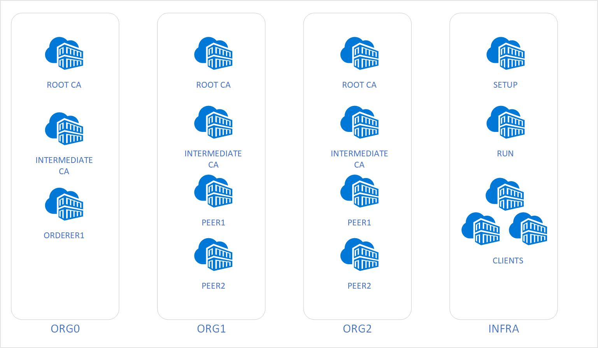
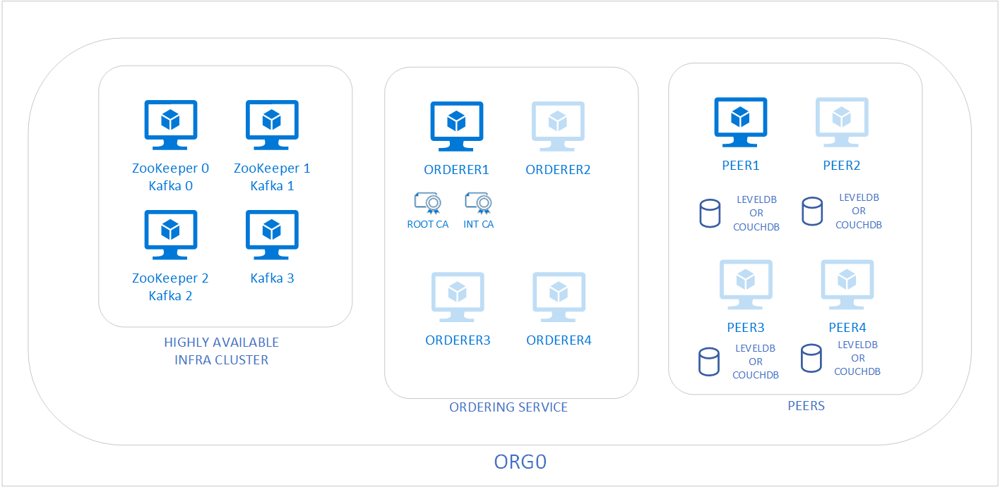
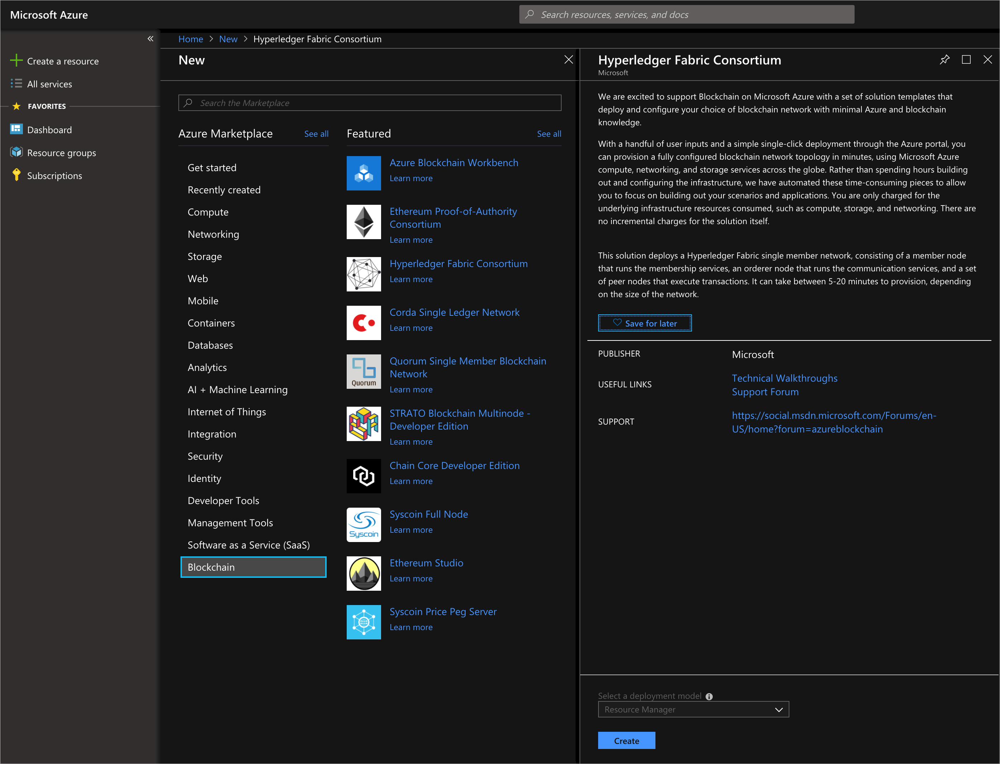
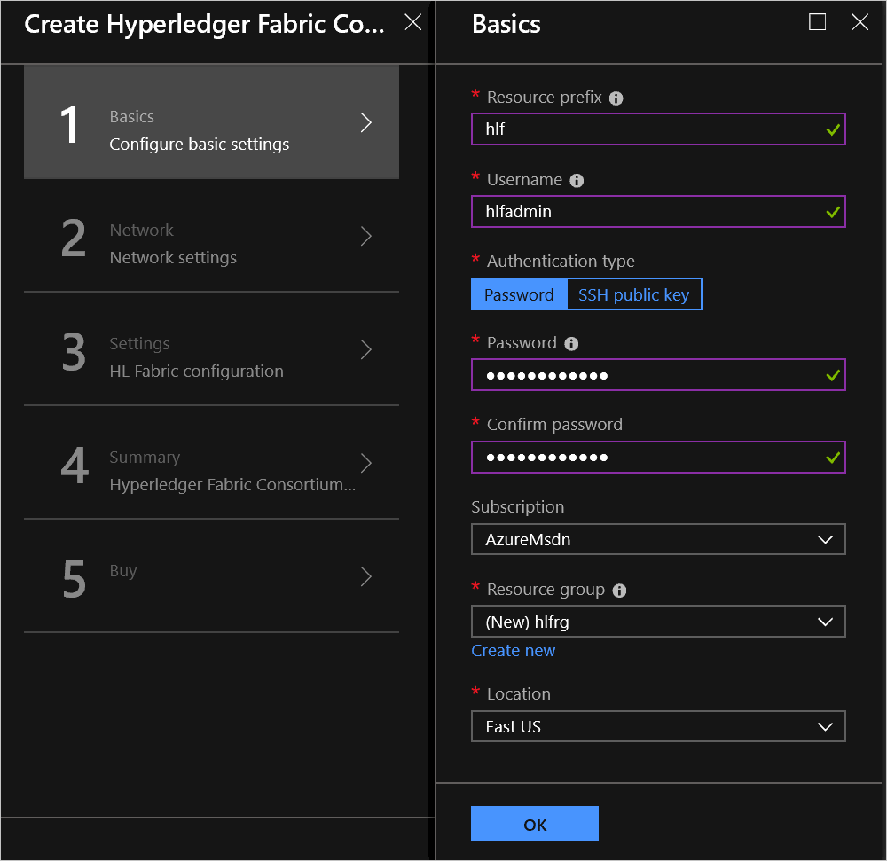
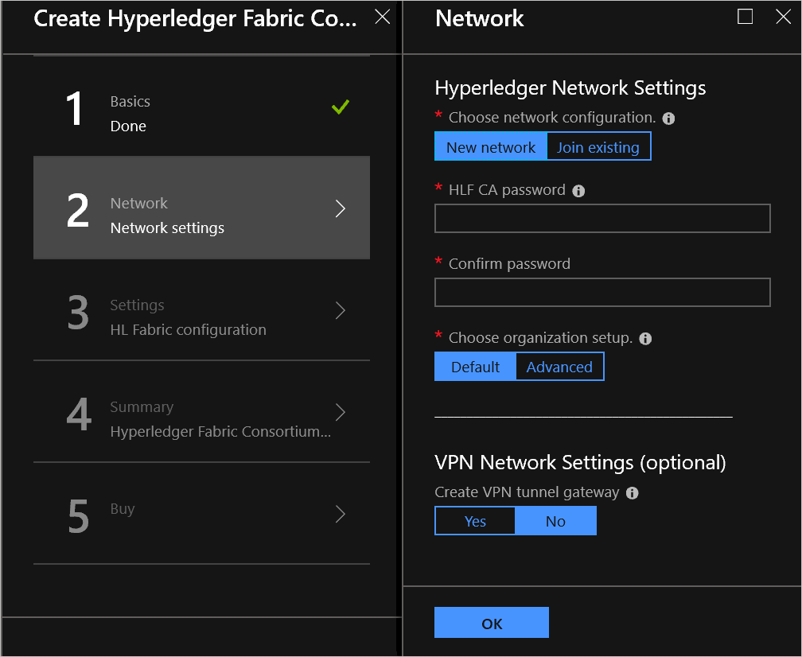
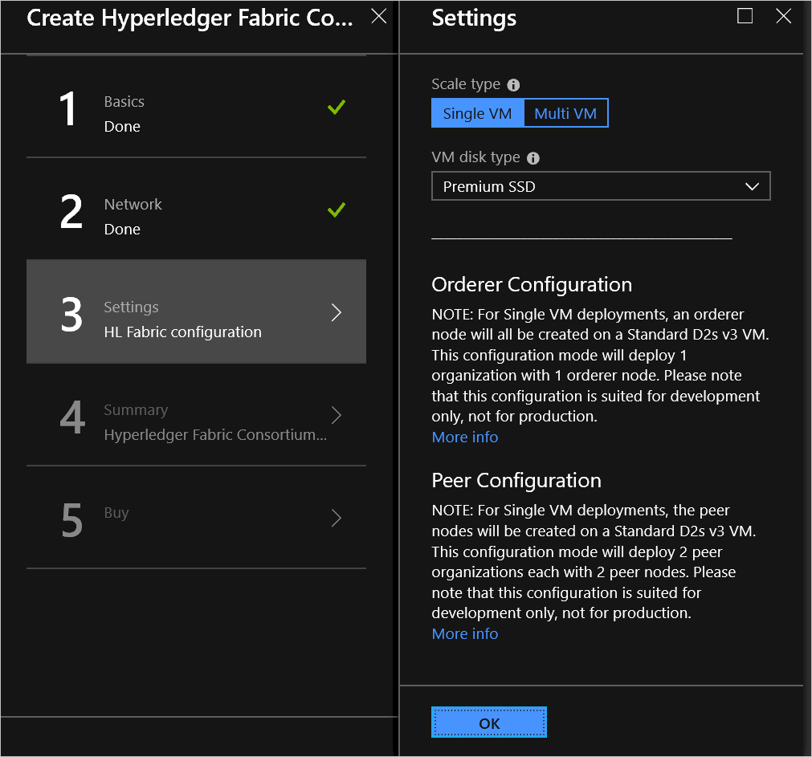
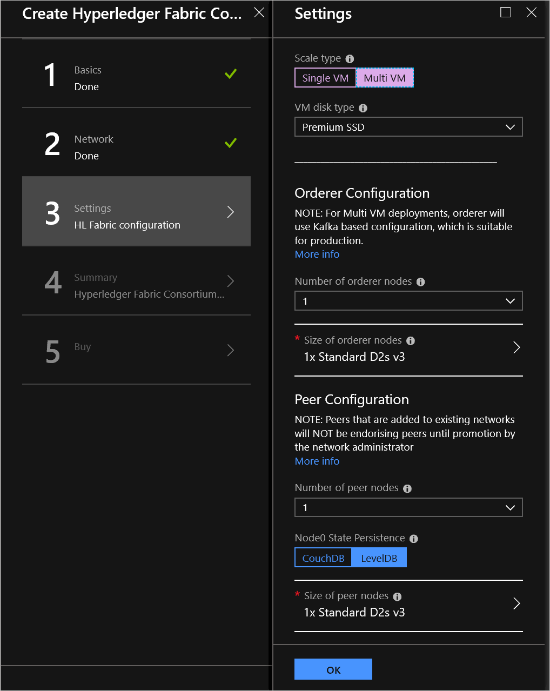
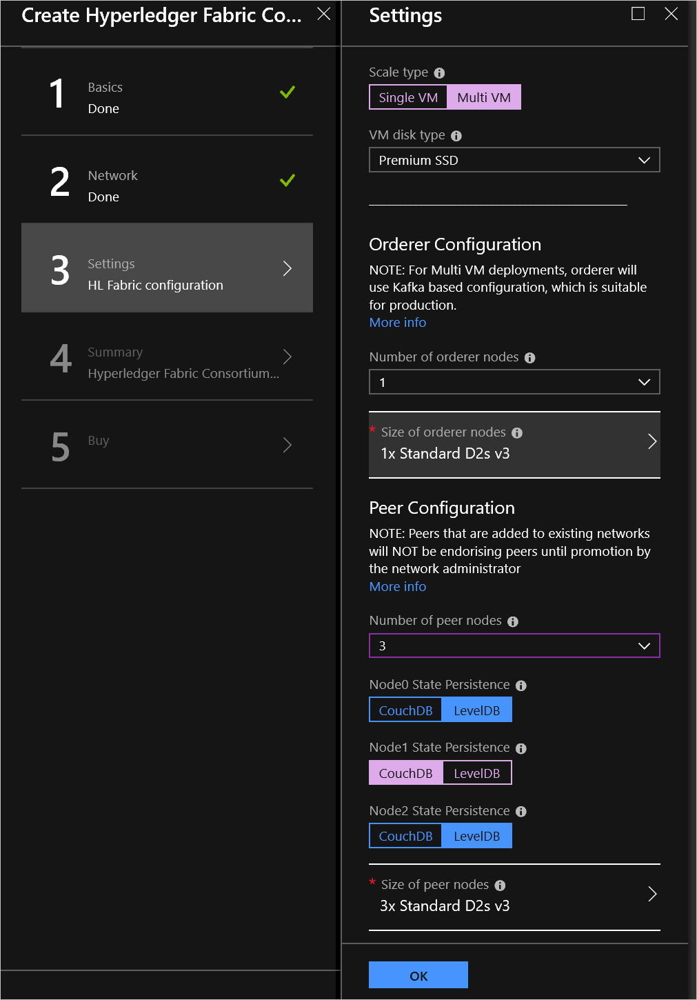
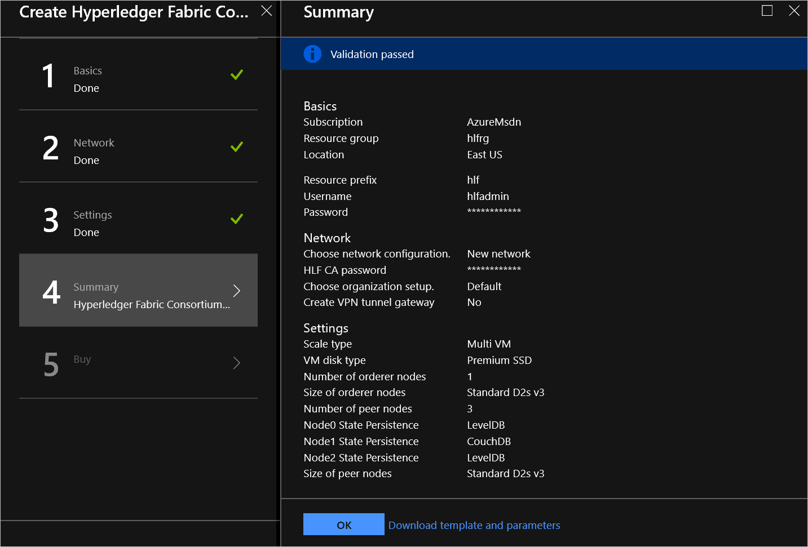

# Hyperledger Fabric consortium network

You can use the Hyperledger Fabric consortium solution template to deploy and configure a Hyperledger Fabric consortium network on Azure.

After reading this article, you will:

- Obtain working knowledge of blockchain, Hyperledger Fabric, and more complicated consortium network architectures
- Learn how to deploy and configure a Hyperledger Fabric consortium network from within the Azure portal

## About blockchain

If you are new to the blockchain community, this solution template is a great opportunity to learn about the technology in an easy and configurable manner on Azure. Blockchain is the underlying technology behind Bitcoin; however, it is much more than just an enabler for a virtual currency. It is a composite of existing database, distributed system, and cryptographic technologies that enables secure multi-party computation with guarantees around immutability, verifiability, auditability, and resiliency to attack. Different protocols employ different mechanisms to provide these attributes. [Hyperledger Fabric](https://github.com/hyperledger/fabric) is one such protocol.

## Consortium architecture on Azure

To enable Hyperledger Fabric in Azure, there are two primary deployment types that are supported. These deployments are designed to accommodate different topologies, based on desired target.

- **Single virtual machine, developer server** - This deployment type is designed as a development environment used to build and test solutions built on Hyperledger Fabric.
- **Multiple virtual machines, scale out deployment** - This deployment type is designed for environments that model a consortium of different participants leveraging a shared environment.

In either deployment, the building blocks that are make the core of Hyperledger Fabric are the same.  The differences in the deployments are how these components are scaled out.

- **CA nodes**: A node running Certificate Authority that is used to generate certificates that are used for identities in the network.
- **Orderer nodes**: A node running the communication service implementing a delivery guarantee, such as total order broadcast or atomic transactions.
- **Peer nodes**: A node that commits transactions and maintains the state and a copy of the distributed ledger.
- **CouchDB nodes**: A node that can run the CouchDB service that can hold the state database and provide rich querying of chaincode data, expanding from simple key/value to JSON type storage.

### Single virtual machine architecture

As mentioned previously the single virtual machine architecture is built for developers to have a low footprint server that is used to develop applications. All containers shown are running in a single virtual machine. The ordering service is using [SOLO](https://github.com/hyperledger/fabric/tree/master/orderer) for this configuration. This configuration is *not* a fault tolerant ordering service, but is designed to be lightweight for development purposes.

### Multiple virtual machine architecture

The multiple virtual machine, scale-out architecture, is built with high availability and scaling of each component at the core. This architecture is much more suitable for production grade deployments.

## Getting started

To begin, you need an Azure subscription that can support deploying several virtual machines and standard storage accounts. If you do not have an Azure subscription, you can [create a free Azure account](https://azure.microsoft.com/free/).

Once you have a subscription, go to the [Azure portal](https://portal.azure.com). Select **Create a resource > Blockchain > Hyperledger Fabric Consortium**.

## Deployment

In the **Hyperledger Fabric Consortium** template, select **Create**.

The template deployment will walk you through configuring the multi-node [Hyperledger 1.3](https://hyperledger-fabric.readthedocs.io/en/release-1.3/) network. The deployment flow is divided into four steps: Basics, Consortium Network Settings, Fabric configuration, and Optional components.

### Basics

In **Basics**, specify values for standard parameters for any deployment. Such as, subscription, resource group, and basic virtual machine properties.

| Parameter Name | Description | Allowed values |
|---|---|---|
**Resource prefix** | Name prefix for resources provisioned as part of the deployment |6 characters or less |
**Username** | The user name of the administrator for each of the virtual machines deployed for this member |1 - 64 characters |
**Authentication type** | The method to authenticate to the virtual machine |Password or SSH public key|
**Password (Authentication type = Password)** |The password for the administrator account for each of the virtual machines deployed. The password must contain three of the following character types: 1 upper case character, 1 lower case character, 1 number, and 1 special character  While all VMs initially have the same password, you can change the password after provisioning|12 - 72 characters|
**SSH key (Authentication type = SSH public key)** |The secure shell key used for remote login ||
**Subscription** |The subscription to which to deploy ||
**Resource group** |The resource group to which to deploy the consortium network ||
**Location** |The Azure region to which to deploy the first member in ||

Select **OK**.

### Consortium Network Settings

In **Network settings**, specify inputs for creating or joining an existing consortium network and configure your organization settings.

| Parameter Name | Description | Allowed values |
|---|---|---|
**Network configuration** |You can choose to create a new network or join an existing one. If you choose *Join existing*, you need to provide additional values. |New network   Join existing |
**HLF CA password** |A password used for the certificates generated by the certificate authorities that are created as part of the deployment. The password must contain three of the following character types: 1 upper case character, 1 lower case character, 1 number, and 1 special character.  While all virtual machines initially have the same password, you can change the password after provisioning.|1 - 25 characters |
**Organization setup** |You can customize your Organization's name and certificate or have default values to be used.|Default   Advanced |
**VPN network settings** | Provision a VPN tunnel gateway for accessing the VMs | Yes   No |

Select **OK**.

### Fabric-specific settings

In **Fabric configuration**, you configure network size and performance, and specify inputs for the availability of the network. Such as, number orderer and peer nodes, persistence engine used by each node, and the VM size.

| Parameter Name | Description | Allowed values |
|---|---|---|
**Scale type** |The deployment type of either a single virtual machine with multiple containers or multiple virtual machines in a scale-out model.|Single VM or Multi VM |
**VM Disk type** |The type of storage backing each of the deployed nodes.   To learn more about the available disk types, visit [select a disk type](../../virtual-machines/windows/disks-types.md).|Standard SSD   Premium SSD |

### Multiple VM deployment (additional settings)

| Parameter Name | Description | Allowed values |
|---|---|---|
**Number of orderer nodes** |The number of nodes that order (organize) transactions into a block.  For additional details on the ordering service, visit the Hyperledger [documentation](https://hyperledger-fabric.readthedocs.io/en/release-1.1/ordering-service-faq.html) |1-4 |
**Orderer node virtual machine size** |The virtual machine size used for orderer nodes in the network|Standard Bs, Standard Ds, Standard FS |
**Number of peer nodes** | Nodes that are owned by consortium members that execute transactions and maintain the state and a copy of the ledger. For additional details on the ordering service, visit the Hyperledger [documentation](https://hyperledger-fabric.readthedocs.io/en/latest/glossary.html).|1-4 |
**Node state persistence** |The persistence engine used by the peer nodes. You can configure this engine per peer node. See details below for multiple peer nodes.|CouchDB  LevelDB |
**Peer node virtual machine size** |The virtual machine size used for all nodes in the network|Standard Bs, Standard Ds, Standard FS |

### Multiple peer node configuration

This template allows you to pick your persistence engine per peer node. For example, if you have three peer nodes you can use CouchDB on one and LevelDB on the other two.

Select **OK**.

### Deploy

In **Summary**, review the inputs specified and to run basic pre-deployment validation.

Review legal and privacy terms and select **Purchase** to deploy. Depending on the number of VMs being provisioned, deployment time can vary from a few minutes to tens of minutes.

## Next steps

You are now ready to focus on application and chaincode development against your Hyperledger consortium blockchain network.
