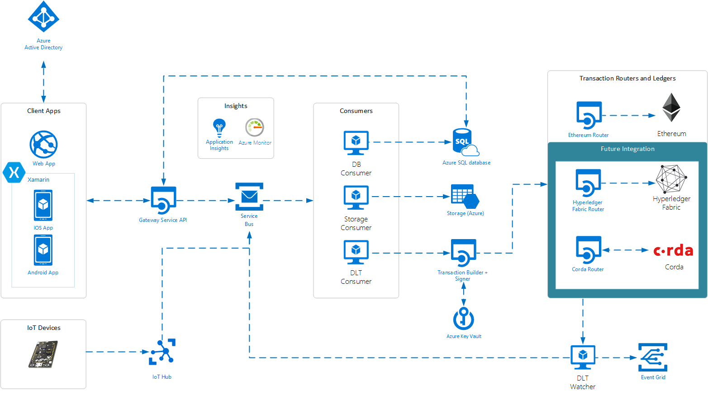

# Azure Blockchain Workbench architecture

Azure Blockchain Workbench Preview simplifies blockchain application development by providing a solution using several Azure components. Blockchain Workbench can be deployed using a solution template in the Azure Marketplace. The template allows you to pick modules and components to deploy including blockchain stack, type of client application, and support for IoT integration. Once deployed, Blockchain Workbench provides access to a web app, iOS app, and Android app.

## Identity and authentication

Using Blockchain Workbench, a consortium can federate their enterprise identities using Azure Active Directory (Azure AD). Workbench generates new user accounts for on-chain identities with the enterprise identities stored in Azure AD. The identity mapping facilitates authenticated login to client APIs and applications and uses the authentication policies of organizations. Workbench also provides the ability to associate enterprise identities to specific roles within a given smart contract. In addition, Workbench also provides a mechanism to identify the actions those roles can take and at what time.

After Blockchain Workbench is deployed, users interact with Blockchain Workbench either via the client applications, REST-based client API, or Messaging API. In all cases, interactions must be authenticated, either via Azure Active Directory (Azure AD) or device-specific credentials.

Users federate their identities to a consortium Azure AD by sending an email invitation to participants at their email address. When logging in, these users are authenticated using the name, password, and policies. For example, two-factor authentication of their organization.

Azure AD is used to manage all users who have access to Blockchain Workbench. Each device connecting to a smart contract is also associated with Azure AD.

Azure AD is also used to assign users to a special administrator group. Users associated with the administrator group are granted access to
rights and actions within Blockchain Workbench including deploying contracts and giving permissions to a user to access a contract. Users outside this group do not have access to administrator actions.

## Client applications

Workbench provides automatically generated client applications for web and mobile (iOS, Android), which can be used to validate, test, and view blockchain applications. The application interface is dynamically generated based on smart contract metadata and can accommodate any use case. The client applications deliver a user-facing front end to the complete blockchain applications generated by Blockchain Workbench. Client applications authenticate users via Azure Active Directory (Azure AD) and then present a user experience tailored to the business context of the smart contract. The user experience enables the creation of new smart contract instances by authorized individuals and then presents the ability to execute certain types of transactions at appropriate points in the business process the smart contract represents.

In the web application, authorized users can access the Administrator Console. The console is available to users in the Administrator group in Azure AD and provides access to the following functionality:

* Deploy Microsoft provided smart contracts for popular scenarios. For example, an asset transfer scenario.
* Upload and deploy their own smart contracts.
* Assign a user access to the smart contract in the context of a specific role.

For more information, see the [Azure Blockchain Workbench sample client applications on GitHub](https://github.com/Azure-Samples/blockchain-devkit/tree/master/connect/mobile).

## Gateway service API

Blockchain Workbench includes a REST-based gateway service API. When writing to a blockchain, the API generates and delivers messages to an event broker. When data is requested by the API, queries are sent to the off-chain SQL database. The SQL database contains a replica of on-chain data and metadata that provides context and configuration information for supported smart contracts. Queries return the required data from the off-chain replica in a format informed by the metadata for the contract.

Developers can access the gateway service API to build or integrate blockchain solutions without relying on Blockchain Workbench client apps.

> [!NOTE]
> To enable authenticated access to the API, two client applications are registered in Azure Active Directory. Azure Active Directory requires distinct application registrations each application type (native and web). 

## Message broker for incoming messages

Developers who want to send messages directly to Blockchain Workbench can send messages directly to Service Bus. For example, messages API could be used for system-to-system integration or IoT devices.

## Message broker for downstream consumers

During the lifecycle of the application, events occur. Events can be triggered by the Gateway API or on the ledger. Event notifications can initiate downstream code based on the event.

Blockchain Workbench automatically deploys two types of event consumers. One consumer is triggered by blockchain events to populate the off-chain SQL store. The other consumer is to capture metadata for events generated by the API related to the upload and storage of documents.

## Message consumers

 Message consumers take messages from Service Bus. The underlying eventing model for message consumers allows for extensions of additional services and systems. For example, you could add support to populate CosmosDB or evaluate messages using Azure Streaming Analytics. The following sections describe the message consumers included in Blockchain Workbench.

### Distributed ledger consumer

Distributed ledger technology (DLT) messages contain the metadata for transactions to be written to the blockchain. The consumer retrieves the messages and pushes the data to a transaction builder, signer, and router.

### Database consumer

The database consumer takes messages from Service Bus and pushes the data to an attached database, such as SQL database.

### Storage consumer

The storage consumer takes messages from Service Bus and pushes data to an attached storage. For example, storing hashed documents in Azure Storage.

## Transaction builder and signer

If a message on the inbound message broker needs to be written to the blockchain, it will be processed by the DLT consumer. The DLT consumer is a service, which retrieves the message containing metadata for a desired transaction to execute and then sends the information to the *transaction builder and signer*. The *transaction builder and signer* assembles a blockchain transaction based on the data and the desired blockchain destination. Once assembled, the transaction is signed. Private keys are stored in Azure Key Vault.

 Blockchain Workbench retrieves the appropriate private key from Key Vault and signs the transaction outside of Key Vault. Once signed, the transaction is sent to transaction routers and ledgers.

## Transaction routers and ledgers

Transaction routers and ledgers take signed transactions and route them to the appropriate blockchain. Currently, Blockchain Workbench supports Ethereum as its target blockchain.

## DLT watcher

A distributed ledger technology (DLT) watcher monitors events occurring on block chains attached to Blockchain Workbench.
Events reflect information relevant to individuals and systems. For example, the creation of new contract instances, execution of transactions, and changes of state. The events are captured and sent to the outbound message broker, so they can be consumed by downstream consumers.

For example, the SQL consumer monitors events, consumes them, and
populates the SQL database with the included values. The copy enables recreation of a replica of on-chain data in an off-chain store.

## Azure SQL database

The Azure SQL database attached to Blockchain Workbench stores contract definitions, configuration metadata, and a SQL-accessible replica of data stored in the blockchain. This data can easily be queried, visualized, or analyzed by directly
accessing the database. Developers and other users can use
the database for reporting, analytics, or other data-centric
integrations. For example, users can visualize transaction data using Power BI.

This off-chain storage provides the ability for enterprise organizations to query data in SQL rather than in a blockchain ledger. Also, by standardizing on a standard schema that's agnostic of blockchain technology stacks, the off-chain storage enables the reuse of reports and other artifacts across projects, scenarios, and organizations.

## Azure Storage

Azure Storage is used to store contracts and metadata associated with contracts.

From purchase orders and bills of lading, to images used in the news and medical imagery, to video originating from a continuum including police body cameras and major motion pictures, documents play a role in many blockchain-centric scenarios. Documents are not appropriate to place directly on the blockchain.

Blockchain Workbench supports the ability to add documents or other media content with blockchain business logic. A hash of the document or media content is stored in the blockchain and the actual document or media content is stored in Azure Storage. The associated transaction information is delivered to the inbound message broker, packaged up, signed, and routed to the blockchain. This process triggers events, which are shared via
the outbound message broker. The SQL DB consumes this information and sends it to the DB for later querying. Downstream systems could also consume these events to act as appropriate.

## Monitoring

Workbench provides application logging using Application Insights and Azure Monitor. Application Insights is used to store all logged information from Blockchain Workbench and includes errors, warnings, and successful operations. Application Insights can be used by developers to debug issues with Blockchain Workbench. 

Azure Monitor provides information on the health of the blockchain network. 

## Next steps

> [!div class="nextstepaction"]
> [Deploy Azure Blockchain Workbench](../../blockchain-workbench/blockchain-workbench-deploy.md)