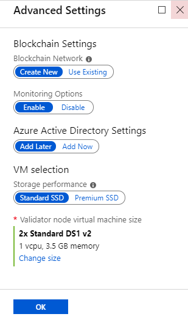
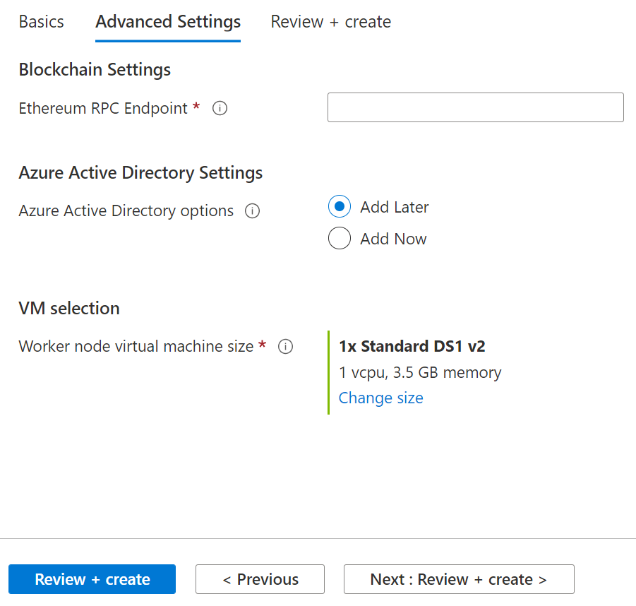
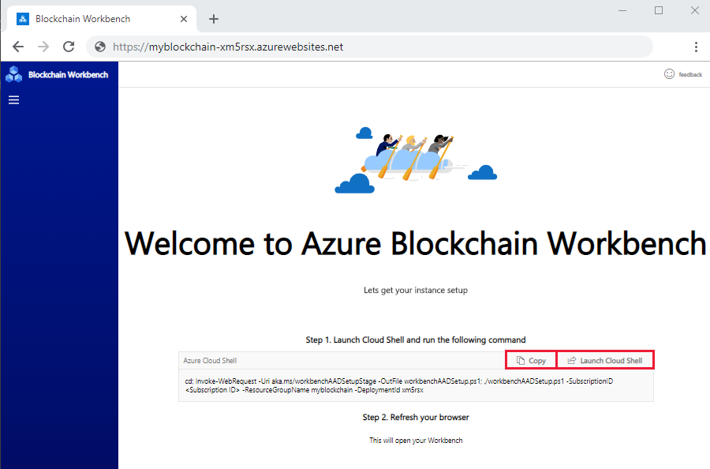
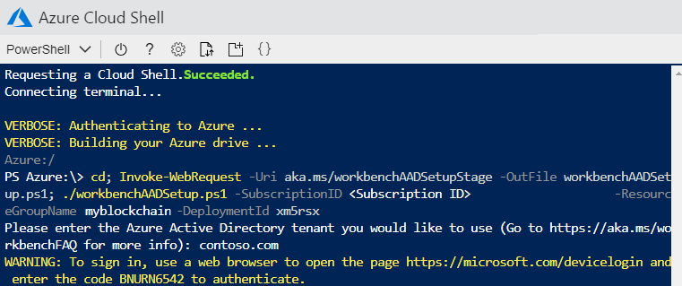
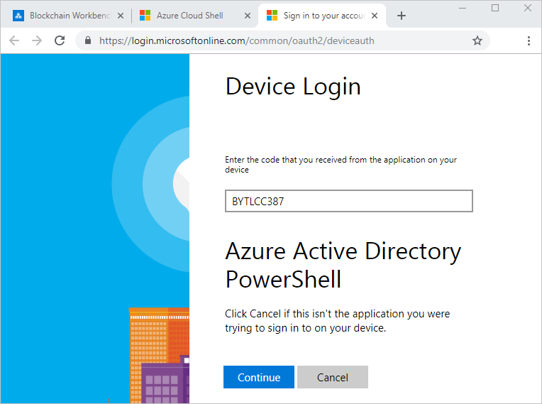
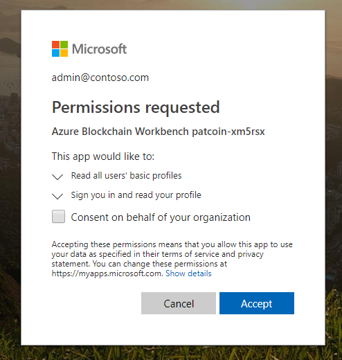
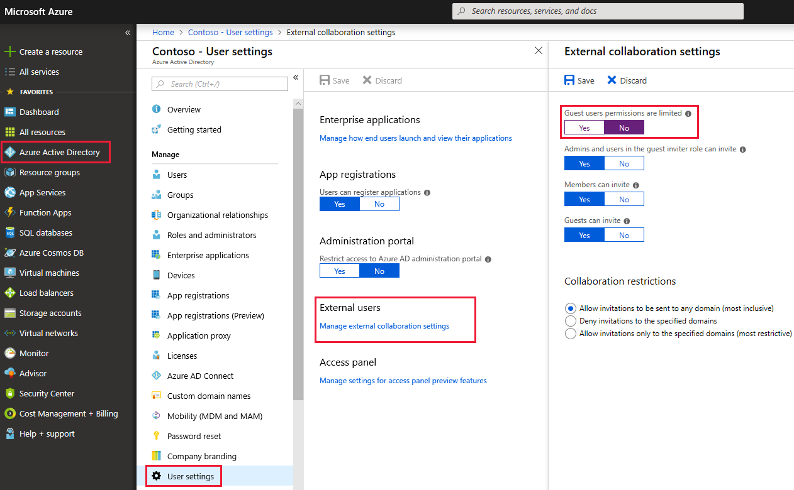

# Deploy Azure Blockchain Workbench

Azure Blockchain Workbench is deployed using a solution template in the Azure Marketplace. The template simplifies the deployment of components needed to create blockchain applications. Once deployed, Blockchain Workbench provides access to client apps to create and manage users and blockchain applications.

For more information about the components of Blockchain Workbench, see [Azure Blockchain Workbench architecture](architecture.md).

## Prepare for deployment

Blockchain Workbench allows you to deploy a blockchain ledger along with a set of relevant Azure services most often used to build a blockchain-based application. Deploying Blockchain Workbench results in the following Azure services being provisioned within a resource group in your Azure subscription.

* App Service Plan (Standard)
* Application Insights
* Event Grid
* Azure Key Vault
* Service Bus
* SQL Database (Standard S0) + SQL Logical Server
* Azure Storage account (Standard LRS)
* Virtual machine scale set with capacity of 1
* Virtual Network resource group (with Load Balancer, Network Security Group, Public IP Address, Virtual Network)
* Optional: Azure Blockchain Service (Basic B0 default)

The following is an example deployment created in **myblockchain** resource group.


The cost of Blockchain Workbench is an aggregate of the cost of the underlying Azure services. Pricing information for Azure services can be calculated using the [pricing calculator](https://azure.microsoft.com/pricing/calculator/).

## Prerequisites

Azure Blockchain Workbench requires Azure AD configuration and application registrations. You can choose to do the Azure AD [configurations manually](#azure-ad-configuration) before deployment or run a script post deployment. If you are redeploying Blockchain Workbench, see [Azure AD configuration](#azure-ad-configuration) to verify your Azure AD configuration.

> [!IMPORTANT]
> Workbench does not have to be deployed in the same tenant as the one you are using to register an Azure AD application. Workbench must be deployed in a tenant where you have sufficient permissions to deploy resources. For more information on Azure AD tenants, see [How to get an Active Directory tenant](../../active-directory/develop/quickstart-create-new-tenant.md) and [Integrating applications with Azure Active Directory](../../active-directory/develop/quickstart-v1-integrate-apps-with-azure-ad.md).

## Deploy Blockchain Workbench

Once the prerequisite steps have been completed, you are ready to deploy the Blockchain Workbench. The following sections outline how to deploy the framework.

1. Sign in to the [Azure portal](https://portal.azure.com).
2. Select your account in the top-right corner, and switch to the desired Azure AD tenant where you want to deploy Azure Blockchain Workbench.
3. In the left pane, select **Create a resource**. Search for `Azure Blockchain Workbench` in the **Search the Marketplace** search bar. 

    

4. Select **Azure Blockchain Workbench**.

    

5. Select **Create**.
6. Complete the basic settings.

    

    | Setting | Description  |
    |---------|--------------|
    | Resource prefix | Short unique identifier for your deployment. This value is used as a base for naming resources. |
    | VM user name | The user name is used as administrator for all virtual machines (VM). |
    | Authentication type | Select if you want to use a password or key for connecting to VMs. |
    | Password | The password is used for connecting to VMs. |
    | SSH | Use an RSA public key in the single-line format beginning  with **ssh-rsa** or use the multi-line PEM format. You can generate SSH keys using `ssh-keygen` on Linux and OS X, or by using PuTTYGen on Windows. More information on SSH keys, see [How to use SSH keys with Windows on Azure](../../virtual-machines/linux/ssh-from-windows.md). |
    | Database and Blockchain password | Specify the password to use for access to the database created as part of the deployment. The password must meet three of the following four requirements: length needs to be between 12 & 72 characters, 1 lower case character, 1 upper case character, 1 number, and 1 special character that is not number sign(#), percent(%), comma(,), star(*), back quote(\`), double quote("), single quote('), dash(-) and semicolumn(;) |
    | Deployment region | Specify where to deploy Blockchain Workbench resources. For best availability, this should match the **Location** setting. |
    | Subscription | Specify the Azure Subscription you wish to use for your deployment. |
    | Resource groups | Create a new Resource group by selecting **Create new** and specify a unique resource group name. |
    | Location | Specify the region you wish to deploy the framework. |

7. Select **OK** to finish the basic setting configuration section.

8. In **Advanced Settings**, choose if you want to create a new blockchain network or use an existing proof-of-authority blockchain network.

    For **Create new**:

    The *create new* option deploys an Azure Blockchain Service Quorum ledger with the default basic sku.

    

    | Setting | Description  |
    |---------|--------------|
    | Azure Blockchain Service pricing tier | Choose **Basic** or **Standard** Azure Blockchain Service tier that is used for Blockchain Workbench |
    | Azure Active Directory settings | Choose **Add Later**.</br>Note: If you chose to [pre-configure Azure AD](#azure-ad-configuration) or are redeploying, choose to *Add Now*. |
    | VM selection | Select preferred storage performance and VM size for your blockchain network. Choose a smaller VM size such as *Standard DS1 v2* if you are on a subscription with low service limits like Azure free tier. |

    For **Use existing**:

    The *use existing* option allows you to specify an Ethereum Proof-of-Authority (PoA) blockchain network. Endpoints have the following requirements.

   * The endpoint must be an Ethereum Proof-of-Authority (PoA) blockchain network.
   * The endpoint must be publicly accessible over the network.
   * The PoA blockchain network should be configured to have gas price set to zero.

     > [!NOTE]
     > Blockchain Workbench accounts are not funded. If funds are required, the transactions fail.

     

     | Setting | Description  |
     |---------|--------------|
     | Ethereum RPC Endpoint | Provide the RPC endpoint of an existing PoA blockchain network. The endpoint starts with https:// or http:// and ends with a port number. For example, `http<s>://<network-url>:<port>` |
     | Azure Active Directory settings | Choose **Add Later**.</br>Note: If you chose to [pre-configure Azure AD](#azure-ad-configuration) or are redeploying, choose to *Add Now*. |
     | VM selection | Select preferred storage performance and VM size for your blockchain network. Choose a smaller VM size such as *Standard DS1 v2* if you are on a subscription with low service limits like Azure free tier. |

9. Select **OK** to finish Advanced Settings.

10. Review the summary to verify your parameters are accurate.

    

11. Select **Create** to agree to the terms and deploy your Azure Blockchain Workbench.

The deployment can take up to 90 minutes. You can use the Azure portal to monitor progress. In the newly created resource group, select **Deployments > Overview** to see the status of the deployed artifacts.

> [!IMPORTANT]
> Post deployment, you need to complete Active Directory settings. If you chose **Add Later**, you need to run the [Azure AD configuration script](#azure-ad-configuration-script).  If you chose **Add now**, you need to [configure the Reply URL](#configuring-the-reply-url).

## Blockchain Workbench Web URL

Once the deployment of the Blockchain Workbench has completed, a new resource group contains your Blockchain Workbench resources. Blockchain Workbench services are accessed through a web URL. The following steps show you how to retrieve the web URL of the deployed framework.

1. Sign in to the [Azure portal](https://portal.azure.com).
2. In the left-hand navigation pane, select **Resource groups**
3. Choose the resource group name you specified when deploying Blockchain Workbench.
4. Select the **TYPE** column heading to sort the list alphabetically by type.
5. There are two resources with type **App Service**. Select the resource of type **App Service** *without* the "-api" suffix.

    

6. In the App Service **Essentials** section, copy the **URL** value, which represents the web URL to your deployed Blockchain Workbench.

    

To associate a custom domain name with Blockchain Workbench, see [configuring a custom domain name for a web app in Azure App Service using Traffic Manager](../../app-service/web-sites-traffic-manager-custom-domain-name.md).

## Azure AD configuration script

Azure AD must be configured to complete your Blockchain Workbench deployment. You'll use a PowerShell script to do the configuration.

1. In a browser, navigate to the [Blockchain Workbench Web URL](#blockchain-workbench-web-url).
2. You'll see instructions to set up Azure AD using Cloud Shell. Copy the command and launch Cloud Shell.

    

3. Choose the Azure AD tenant where you deployed Blockchain Workbench.
4. In Cloud Shell, paste and run the command.
5. When prompted, enter the Azure AD tenant you want to use for Blockchain Workbench. This will be the tenant containing the users for Blockchain Workbench.

    > [!IMPORTANT]
    > The authenticated user requires permissions to create Azure AD application registrations and grant delegated application permissions in the tenant. You may need to ask an administrator of the tenant to run the Azure AD configuration script or create a new tenant.

    

6. You'll be prompted to authenticate to the Azure AD tenant using a browser. Open the web URL in a browser, enter the code, and authenticate.

    

7. The script outputs several status messages. You get a **SUCCESS** status message if the tenant was successfully provisioned.
8. Navigate to the Blockchain Workbench URL. You are asked to consent to grant read permissions to the directory. This allows the Blockchain Workbench web app access to the users in the tenant. If you are the tenant administrator, you can choose to consent for the entire organization. This option accepts consent for all users in the tenant. Otherwise, each user is prompted for consent on first use of the Blockchain Workbench web application.
9. Select **Accept** to consent.

     

10. After consent, the Blockchain Workbench web app can be used.

## Azure AD configuration

If you choose to manually configure or verify Azure AD settings prior to deployment, complete all steps in this section. If you prefer to automatically configure Azure AD settings, use [Azure AD configuration script](#azure-ad-configuration-script) after you deploy Blockchain Workbench.

### Blockchain Workbench API app registration

Blockchain Workbench deployment requires registration of an Azure AD application. You need an Azure Active Directory (Azure AD) tenant to register the app. You can use an existing tenant or create a new tenant. If you are using an existing Azure AD tenant, you need sufficient permissions to register applications, grant Graph API permissions, and allow guest access within an Azure AD tenant. If you do not have sufficient permissions in an existing Azure AD tenant create a new tenant.


1. Sign in to the [Azure portal](https://portal.azure.com).
2. Select your account in the top-right corner, and switch to the desired Azure AD tenant. The tenant should be the subscription admin's tenant of the subscription where Workbench is deployed and you have sufficient permissions to register applications.
3. In the left-hand navigation pane, select the **Azure Active Directory** service. Select **App registrations** > **New application registration**.

    

4. Provide a **Name** and **Sign-on URL** for the application. You can use placeholder values since the values are changed during the deployment. 

    

    |Setting  | Value  |
    |---------|---------|
    |Name | `Blockchain API` |
    |Application type |Web app / API|
    |Sign-on URL | `https://blockchainapi` |

5. Select **Create** to register the Azure AD application.

### Modify manifest

Next, you need to modify the manifest to use application roles within Azure AD to specify Blockchain Workbench administrators.  For more information about application manifests, see [Azure Active Directory application manifest](../../active-directory/develop/reference-app-manifest.md).

1. For the application you registered, select **Manifest** in the registered application details pane.
2. Generate a GUID. You can generate a GUID using the PowerShell command [guid] :: NewGuid () or New-GUID cmdlet. Another option is to use a GUID generator website.
3. You are going to update the **appRoles** section of the manifest. In the Edit manifest pane, select **Edit** and replace `"appRoles": []` with the provided JSON. Be sure to replace the value for the **id** field with the GUID you generated. 

    

    ``` json
    "appRoles": [
         {
           "allowedMemberTypes": [
             "User",
             "Application"
           ],
           "displayName": "Administrator",
           "id": "<A unique GUID>",
           "isEnabled": true,
           "description": "Blockchain Workbench administrator role allows creation of applications, user to role assignments, etc.",
           "value": "Administrator"
         }
       ],
    ```

    > [!IMPORTANT]
    > The value **Administrator** is needed to identify Blockchain Workbench administrators.

4. In the manifest, also change the **Oauth2AllowImplicitFlow** value to **true**.

    ``` json
    "oauth2AllowImplicitFlow": true,
    ```

5. Select **Save** to save the manifest changes.

### Add Graph API required permissions

The API application needs to request permission from the user to access the directory. Set the following required permission for the API application:

1. In the Blockchain API app registration, select **Settings > Required permissions > Select an API > Microsoft Graph**.

    

    Click **Select**.

2. In **Enable Access** under **Delegated permissions**, choose **Read all users' basic profiles**.

    

    Select **Save** then select **Done**.

3. In **Required permissions**, select **Grant Permissions** then select **Yes** for the verification prompt.

   

   Granting permission allows Blockchain Workbench to access users in the directory. The read permission is required to search and add members to Blockchain Workbench.

### Get application ID

The application ID and tenant information are required for deployment. Collect and store the information for use during deployment.

1. For the application you registered, select **Settings** > **Properties**.
2. In the **Properties** pane, copy and store the following values for later use during deployment.

    

    | Setting to store  | Use in deployment |
    |------------------|-------------------|
    | Application ID | Azure Active Directory setup > Application ID |

### Get tenant domain name

Collect and store the Active Directory tenant domain name where the applications are registered. 

In the left-hand navigation pane, select the **Azure Active Directory** service. Select **Custom domain names**. Copy and store the domain name.


### Guest user settings

If you have guest users in your Azure AD tenant, follow the additional steps to ensure Blockchain Workbench user assignment and management works properly.

1. Switch you your Azure AD tenant and select **Azure Active Directory > User settings > Manage external collaboration settings**.
2. Set **Guest user permissions are limited** to **No**.
    

## Configuring the Reply URL

Once the Azure Blockchain Workbench has been deployed, you have to configure the Azure Active Directory (Azure AD) client application **Reply URL** of the deployed Blockchain Workbench web URL.

1. Sign in to the [Azure portal](https://portal.azure.com).
2. Verify you are in the tenant where you registered the Azure AD client application.
3. In the left-hand navigation pane, select the **Azure Active Directory** service. Select **App registrations**.
4. Select the Azure AD client application you registered in the prerequisite section.
5. Select **Settings > Reply URLs**.
6. Specify the main web URL of the Azure Blockchain Workbench deployment you retrieved in the **Get the Azure Blockchain Workbench Web URL** section. The Reply URL is prefixed with `https://`. For example, `https://myblockchain2-7v75.azurewebsites.net`

    

7. Select **Save** to update the client registration.

## Remove a deployment

When a deployment is no longer needed, you can remove a deployment by deleting the Blockchain Workbench resource group.

1. In the Azure portal, navigate to **Resource group** in the left navigation pane and select the resource group you want to delete. 
2. Select **Delete resource group**. Verify deletion by entering the resource group name and select **Delete**.

    

## Next steps

In this how-to article, you deployed Azure Blockchain Workbench. To learn how to create a blockchain application, continue to the next how-to article.

> [!div class="nextstepaction"]
> [Create a blockchain application in Azure Blockchain Workbench](create-app.md)
