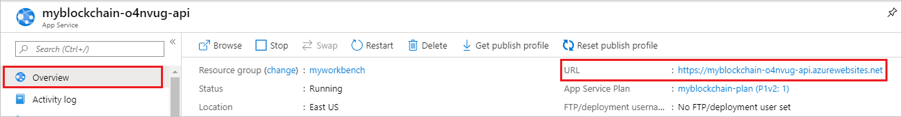

# Using the Azure Blockchain Workbench Preview REST API

Azure Blockchain Workbench Preview REST API provides developers and information workers a way to build rich integrations to blockchain applications. This article highlights several scenarios of how to use the Workbench REST API. For example, suppose you want to create a custom blockchain client that allows signed in users to view and interact with their assigned blockchain applications. The client can use the Blockchain Workbench API to view contract instances and take actions on smart contracts.

## Blockchain Workbench API endpoint

Blockchain Workbench APIs are accessed through an endpoint for your deployment. To get the API endpoint URL for your deployment:

1. Sign in to the [Azure portal](https://portal.azure.com).
1. In the left-hand navigation pane, select **Resource groups**.
1. Choose the resource group name your deployed Blockchain Workbench.
1. Select the **TYPE** column heading to sort the list alphabetically by type.
1. There are two resources with type **App Service**. Select the resource of type **App Service** *with* the "-api" suffix.
1. In the App Service **Overview**, copy the **URL** value, which represents the API endpoint URL to your deployed Blockchain Workbench.

    

## Authentication

Requests to the Blockchain Workbench REST API are protected with Azure Active Directory (Azure AD).

To make an authenticated request to the REST APIs, client code requires authentication with valid credentials before you can call the API. Authentication is coordinated between the various actors by Azure AD, and provides your client with an [access token](https://docs.microsoft.com/azure/active-directory/develop/active-directory-dev-glossary#access-token) as proof of the authentication. The token is then sent in the HTTP Authorization header of REST API requests. To learn more about Azure AD authentication, see [Azure Active Directory for developers](https://docs.microsoft.com/azure/active-directory/develop/active-directory-developers-guide).

See [REST API samples](https://github.com/Azure-Samples/blockchain/tree/master/blockchain-workbench/rest-api-samples) for examples of how to authenticate.

## Using Postman

If you want to test or experiment with Workbench APIs, you can use [Postman](https://www.postman.com) to make API calls to your deployment. [Download a sample Postman collection of Workbench API requests](https://github.com/Azure-Samples/blockchain/tree/master/blockchain-workbench/rest-api-samples/postman) from GitHub. See the README file for details on authenticating and using the example API requests.

## Create an application

You use two API calls to create a Blockchain Workbench application. This method can only be performed by users who are Workbench administrators.

Use the [Applications POST API](https://docs.microsoft.com/rest/api/azure-blockchain-workbench/applications/applicationspost) to upload the application's JSON file and get an application ID.

### Applications POST request

Use the **appFile** parameter to send the configuration file as part of the request body.

``` http
POST /api/v1/applications
Content-Type: multipart/form-data;
Authorization : Bearer {access token}
Content-Disposition: form-data; name="appFile"; filename="/C:/smart-contract-samples/HelloWorld.json"
Content-Type: application/json
```

### Applications POST response

The created application ID is returned in the response. You need the application ID to associate the configuration file with the code file when you call the next API.

``` http
HTTP/1.1 200 OK
Content-Type: "application/json"
1
```

### Contract code POST request

Use the [Applications contract code POST API](https://docs.microsoft.com/rest/api/azure-blockchain-workbench/applications/contractcodepost) by passing the application ID to upload the application's Solidity code file. The payload can be a single Solidity file or a zipped file containing Solidity files.

Replace the following values:

| Parameter | Value |
|-----------|-------|
| {applicationId} | Return value from the applications POST API. |
| {ledgerId} | Index of the ledger. The value is usually 1. You can also check the [Ledger table](data-sql-management-studio.md) for the value. |

``` http
POST /api/v1/applications/{applicationId}/contractCode?ledgerId={ledgerId}
Content-Type: multipart/form-data;
Authorization : Bearer {access token}
Content-Disposition: form-data; name="contractFile"; filename="/C:/smart-contract-samples/HelloWorld.sol"
```

### Contract code POST response

If successful, the response includes the created contract code ID from the [ContractCode table](data-sql-management-studio.md).

``` http
HTTP/1.1 200 OK
Content-Type: "application/json"
2
```

## Assign roles to users

Use the [Applications role assignments POST API](https://docs.microsoft.com/rest/api/azure-blockchain-workbench/applications/roleassignmentspost) by passing the application ID, user ID, and application role ID to create a user-to-role mapping in the specified blockchain application. This method can only be performed by users who are Workbench administrators.

### Role assignments POST request

Replace the following values:

| Parameter | Value |
|-----------|-------|
| {applicationId} | Return value from the Applications POST API. |
| {userId} | User ID value from the [User table](data-sql-management-studio.md). |
| {applicationRoleId} | Application role ID value associated to the application ID from the [ApplicationRole table](data-sql-management-studio.md). |

``` http
POST /api/v1/applications/{applicationId}/roleAssignments
Content-Type: application/json;
Authorization : Bearer {access token}

{
  "userId": {userId},
  "applicationRoleId": {applicationRoleId}
}
```

### Role assignments POST response

If successful, the response includes the created role assignment ID from the [RoleAssignment table](data-sql-management-studio.md).

``` http
HTTP/1.1 200
1
```

## List applications

Use the [Applications GET API](https://docs.microsoft.com/rest/api/azure-blockchain-workbench/applications/applicationsget) to retrieve all Blockchain Workbench applications for the user. In this example, the signed-in user has access to two applications:

- [Asset transfer](https://github.com/Azure-Samples/blockchain/blob/master/blockchain-workbench/application-and-smart-contract-samples/asset-transfer/readme.md)
- [Refrigerated transportation](https://github.com/Azure-Samples/blockchain/blob/master/blockchain-workbench/application-and-smart-contract-samples/refrigerated-transportation/readme.md)

### Applications GET request

``` http
GET /api/v1/applications
Authorization : Bearer {access token}
```

### Applications GET response

The response lists all blockchain applications to which a user has access in Blockchain Workbench. Blockchain Workbench administrators get every blockchain application. Non-Workbench administrators get all blockchain applications for which they have at least one associated application role or an associated smart contract instance role.

``` http
HTTP/1.1 200 OK
Content-type: application/json
{
    "nextLink": "/api/v1/applications?skip=2",
    "applications": [
        {
            "id": 1,
            "name": "AssetTransfer",
            "description": "Allows transfer of assets between a buyer and a seller, with appraisal/inspection functionality",
            "displayName": "Asset Transfer",
            "createdByUserId": 1,
            "createdDtTm": "2018-04-28T05:59:14.4733333",
            "enabled": true,
            "applicationRoles": null
        },
        {
            "id": 2,
            "name": "RefrigeratedTransportation",
            "description": "Application to track end-to-end transportation of perishable goods.",
            "displayName": "Refrigerated Transportation",
            "createdByUserId": 7,
            "createdDtTm": "2018-04-28T18:25:38.71",
            "enabled": true,
            "applicationRoles": null
        }
    ]
}
```

## List workflows for an application

Use [Applications Workflows GET API](https://docs.microsoft.com/rest/api/azure-blockchain-workbench/applications/workflowsget) to list all workflows of a specified blockchain application to which a user has access in Blockchain Workbench. Each blockchain application has one or more workflows and each workflow has zero or smart contract instances. For a blockchain client application that has only one workflow, we recommend skipping the user experience flow that allows users to select the appropriate workflow.

### Application workflows request

``` http
GET /api/v1/applications/{applicationId}/workflows
Authorization: Bearer {access token}
```

### Application workflows response

Blockchain Workbench administrators get every blockchain workflow. Non-Workbench administrators get all workflows for which they have at least one associated application role or is associated with a smart contract instance role.

``` http
HTTP/1.1 200 OK
Content-type: application/json
{
    "nextLink": "/api/v1/applications/1/workflows?skip=1",
    "workflows": [
        {
            "id": 1,
            "name": "AssetTransfer",
            "description": "Handles the business logic for the asset transfer scenario",
            "displayName": "Asset Transfer",
            "applicationId": 1,
            "constructorId": 1,
            "startStateId": 1
        }
    ]
}
```

## Create a contract instance

Use [Contracts V2 POST API](https://docs.microsoft.com/rest/api/azure-blockchain-workbench/contractsv2/contractpost) to create a new smart contract instance for a workflow. Users are only able to create a new smart contract instance if the user is associated with an application role, which can initiate a smart contract instance for the workflow.

> [!NOTE]
> In this example, version 2 of the API is used. Version 2 contract APIs provide more granularity for the associated ProvisioningStatus fields.

### Contracts POST request

Replace the following values:

| Parameter | Value |
|-----------|-------|
| {workflowId} | Workflow ID value is the contract's ConstructorID from the [Workflow table](data-sql-management-studio.md). |
| {contractCodeId} | Contract code ID value from the [ContractCode table](data-sql-management-studio.md). Correlate the application ID and ledger ID for the contract instance you want to create. |
| {connectionId} | Connection ID value from the [Connection table](data-sql-management-studio.md). |

For the request body, set values using the following information:

| Parameter | Value |
|-----------|-------|
| workflowFunctionID | ID from the [WorkflowFunction table](data-sql-management-studio.md). |
| workflowActionParameters | Name value pairs of parameters passed to the constructor. For each parameter, use the workflowFunctionParameterID value from the [WorkflowFunctionParameter](data-sql-management-studio.md) table. |

``` http
POST /api/v2/contracts?workflowId={workflowId}&contractCodeId={contractCodeId}&connectionId={connectionId}
Content-Type: application/json;
Authorization : Bearer {access token}

{
  "workflowFunctionID": 2,
  "workflowActionParameters": [
    {
      "name": "message",
      "value": "Hello, world!",
      "workflowFunctionParameterId": 3
    }
  ]
}
```

### Contracts POST response

If successful, role assignments API returns the ContractActionID from the [ContractActionParameter table](data-sql-management-studio.md).

``` http
HTTP/1.1 200 OK
4
```

## List smart contract instances for a workflow

Use [Contracts GET API](/rest/api/azure-blockchain-workbench/contractsv2/contractsget) to show all smart contract instances for a workflow. Or you can allow users to deep dive into any of the shown smart contract instances.

### Contracts request

In this example, consider a user would like to interact with one of the smart contract instances to take action.

``` http
GET api/v1/contracts?workflowId={workflowId}
Authorization: Bearer {access token}
```

### Contracts response

The response lists all smart contract instances of the specified workflow. Workbench administrators get all smart contract instances. Non-Workbench administrators get every smart contract instance for which they have at least one associated application role or is associated with a smart contract instance role.

``` http
HTTP/1.1 200 OK
Content-type: application/json
{
    "nextLink": "/api/v1/contracts?skip=3&workflowId=1",
    "contracts": [
        {
            "id": 1,
            "provisioningStatus": 2,
            "connectionID": 1,
            "ledgerIdentifier": "0xbcb6127be062acd37818af290c0e43479a153a1c",
            "deployedByUserId": 1,
            "workflowId": 1,
            "contractCodeId": 1,
            "contractProperties": [
                {
                    "workflowPropertyId": 1,
                    "value": "0"
                },
                {
                    "workflowPropertyId": 2,
                    "value": "My first car"
                },
                {
                    "workflowPropertyId": 3,
                    "value": "54321"
                },
                {
                    "workflowPropertyId": 4,
                    "value": "0"
                },
                {
                    "workflowPropertyId": 5,
                    "value": "0x0000000000000000000000000000000000000000"
                },
                {
                    "workflowPropertyId": 6,
                    "value": "0x0000000000000000000000000000000000000000"
                },
                {
                    "workflowPropertyId": 7,
                    "value": "0x0000000000000000000000000000000000000000"
                },
                {
                    "workflowPropertyId": 8,
                    "value": "0xd882530eb3d6395e697508287900c7679dbe02d7"
                }
            ],
            "transactions": [
                {
                    "id": 1,
                    "connectionId": 1,
                    "transactionHash": "0xf3abb829884dc396e03ae9e115a770b230fcf41bb03d39457201449e077080f4",
                    "blockID": 241,
                    "from": "0xd882530eb3d6395e697508287900c7679dbe02d7",
                    "to": null,
                    "value": 0,
                    "isAppBuilderTx": true
                }
            ],
            "contractActions": [
                {
                    "id": 1,
                    "userId": 1,
                    "provisioningStatus": 2,
                    "timestamp": "2018-04-29T23:41:14.9333333",
                    "parameters": [
                        {
                            "name": "Description",
                            "value": "My first car"
                        },
                        {
                            "name": "Price",
                            "value": "54321"
                        }
                    ],
                    "workflowFunctionId": 1,
                    "transactionId": 1,
                    "workflowStateId": 1
                }
            ]
        }
    ]
}
```

## List available actions for a contract

Use [Contract Action GET API](/rest/api/azure-blockchain-workbench/contractsv2/contractactionget) to show the available user actions given the state of the contract. 

### Contract action request

In this example, the user is looking at all available actions for a new smart contract they created.

``` http
GET /api/v1/contracts/{contractId}/actions
Authorization: Bearer {access token}
```

### Contract action response

Response lists all actions to which a user can take given the current state of the specified smart contract instance.

* Modify: Allows the user to modify the description and price of an asset.
* Terminate: Allows the user to end the contract of the asset.

Users get all applicable actions if the user has an associated application role or is associated with a smart contract instance role for the current state of the specified smart contract instance.

``` http
HTTP/1.1 200 OK
Content-type: application/json
{
    "nextLink": "/api/v1/contracts/1/actions?skip=2",
    "workflowFunctions": [
        {
            "id": 2,
            "name": "Modify",
            "description": "Modify the description/price attributes of this asset transfer instance",
            "displayName": "Modify",
            "parameters": [
                {
                    "id": 1,
                    "name": "description",
                    "description": "The new description of the asset",
                    "displayName": "Description",
                    "type": {
                        "id": 2,
                        "name": "string",
                        "elementType": null,
                        "elementTypeId": 0
                    }
                },
                {
                    "id": 2,
                    "name": "price",
                    "description": "The new price of the asset",
                    "displayName": "Price",
                    "type": {
                        "id": 3,
                        "name": "money",
                        "elementType": null,
                        "elementTypeId": 0
                    }
                }
            ],
            "workflowId": 1
        },
        {
            "id": 3,
            "name": "Terminate",
            "description": "Used to cancel this particular instance of asset transfer",
            "displayName": "Terminate",
            "parameters": [],
            "workflowId": 1
        }
    ]
}
```

## Execute an action for a contract

Use [Contract Action POST API](/rest/api/azure-blockchain-workbench/contractsv2/contractactionpost) to take action for the specified smart contract instance.

### Contract action POST request

In this case, consider the scenario where a user would like to modify the description and price of an asset.

``` http
POST /api/v1/contracts/{contractId}/actions
Authorization: Bearer {access token}
actionInformation: {
    "workflowFunctionId": 2,
    "workflowActionParameters": [
        {
            "name": "description",
            "value": "My updated car"
        },
        {
            "name": "price",
            "value": "54321"
        }
    ]
}
```

Users are only able to execute the action given the current state of the specified smart contract instance and the user's associated application role or smart contract instance role.

### Contract action POST response

If the post is successful, an HTTP 200 OK response is returned with no response body.

``` http
HTTP/1.1 200 OK
Content-type: application/json
```

## Next steps

For reference information on Blockchain Workbench APIs, see the [Azure Blockchain Workbench REST API reference](https://docs.microsoft.com/rest/api/azure-blockchain-workbench).
