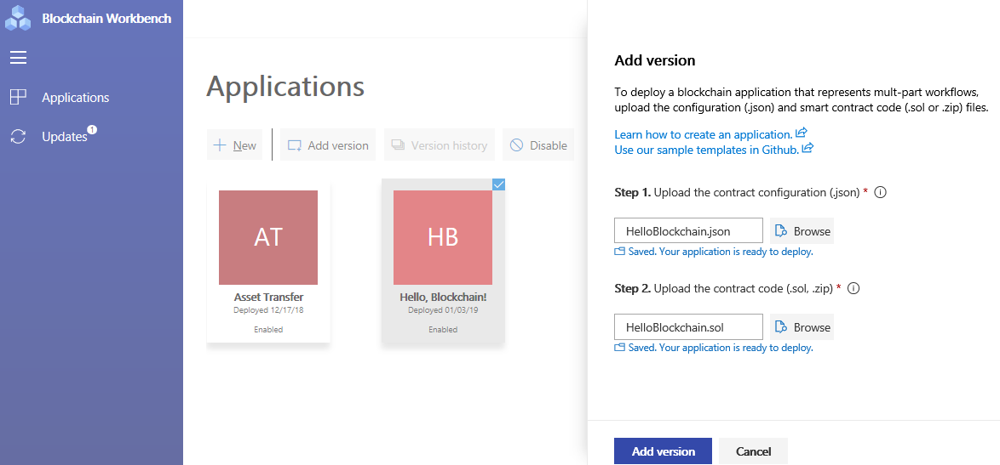

# Azure Blockchain Workbench application versioning

You can create and use multiple versions of an Azure Blockchain Workbench app.

[!INCLUDE [quickstarts-free-trial-note](../../../includes/quickstarts-free-trial-note.md)]

## Prerequisites

* A Blockchain Workbench deployment. For more information, see [Azure Blockchain Workbench deployment](deploy.md) for details on deployment
* A deployed blockchain application in Blockchain Workbench. See [Create a blockchain application in Azure Blockchain Workbench](create-app.md)

## Add an app version

You can add new versions of an application to Blockchain Workbench. To add a new version, upload the new configuration and smart contract files to Blockchain Workbench. If multiple versions of the same application are uploaded, a version history is available and users can choose which version they want to use.

1. In a web browser, navigate to the Blockchain Workbench web address. For example, `https://{workbench URL}.azurewebsites.net/` For information on how to find your Blockchain Workbench web address, see [Blockchain Workbench Web URL](deploy.md#blockchain-workbench-web-url)
2. Sign in as a [Blockchain Workbench administrator](manage-users.md#manage-blockchain-workbench-administrators).
3. Select the blockchain application you want to update with another version.
4. Select **Add version**. The **Add version** pane is displayed.
5. Choose the new version contract configuration and contract code files to upload. The configuration file is automatically validated. Fix any validation errors before you deploy the application.
6. Select **Add version** to add the new blockchain application version.
    

Deployment of the blockchain application can take a few minutes. When deployment is finished, refresh the application page. Choosing the application and selecting the **Version history** button, displays the version history of the application.

> [!IMPORTANT]
> Previous versions will convert to read only. You can individually re-enable past versions.
>
> Member roles won't be carried over if you made changes to them.

## Using app versions

Select the version?

## Next steps

* [Azure Blockchain Workbench troubleshooting](troubleshooting.md)
