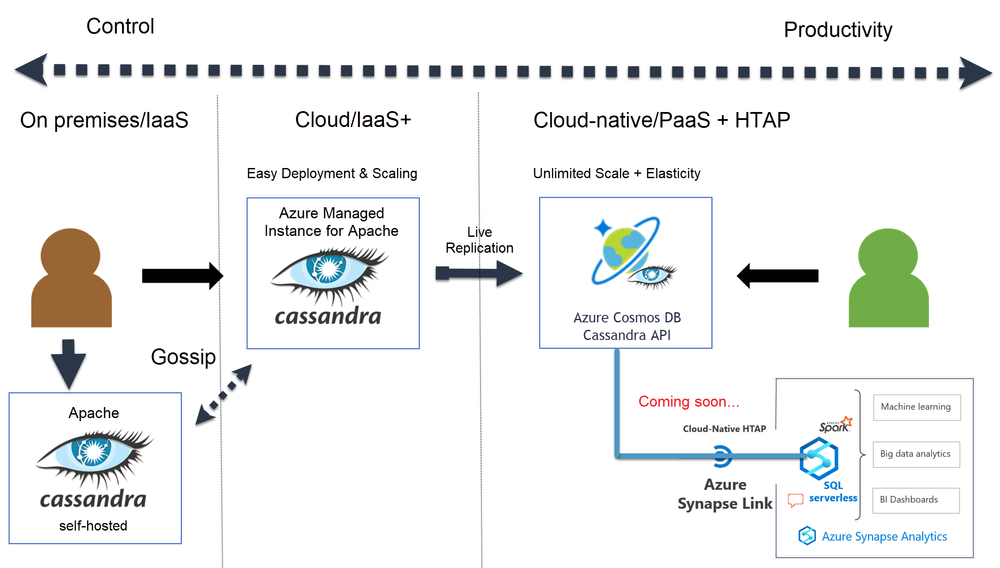

# Azure Managed Instance for Apache Cassandra Vs Azure Cosmos DB Cassandra API

In this article we will discuss the differences between Azure Managed Instance for Apache Cassandra and Azure Cosmos DB Cassandra API, and offer recommendations on how to choose between the two services, or host your own Apache Cassandra environment

<!-- :::image type="content" source="./media/introduction/managed-instance-cassandra.png" alt-text="Azure Managed Instance for Apache Cassandra is a managed service for Apache Cassandra." border="false"::: -->

## How to choose

Below is a table with some descriptions of common scenarios and aspirations which fit each deployment approach.

|Self-hosting Apache Cassandra on premises or in Azure | Azure Managed Instance for Apache Cassandra | Azure Cosmos DB Cassandra API |
|---------|---------|---------|
| You have a highly customized Apache Cassandra deployment with custom patches/snitches. | You have a standard open source Apache Cassandra deployment (no custom code). | You are content with a platform that is not Apache Cassandra underneath, but is complient with all open source client drivers at a [wire protocol](https://docs.microsoft.com/azure/cosmos-db/cassandra-support) level. |
| You have existing Cassandra SMEs who can deploy, configure, and maintain your clusters.  | You want to lower your operational overhead for your Apache Cassandra node health, but still maintain control over platform level configurations such as replication and consistency. | You want completely eliminate operational overhead by leveraging a fully managed Platform-as-as-service database in the cloud. |
| You have a requirement to maintain custom/golden Virtual Machine operating system images. | You can use vanilla images but want to have control over SKUs, memory, disks, and IOPS. | You want capacity provisioning to be simplified and expressed as a single normalised metric, with a one-to-one relationship to throughput, such as [request units](https://docs.microsoft.com/azure/cosmos-db/request-units) in Azure Cosmos DB |
| You want to leverage management software such as Datastax tooling and are happy with licensing costs| You prefer pure open source licensing and VM instance based pricing | You want to leverage cloud-native pricing including [autoscale](https://docs.microsoft.com/azure/cosmos-db/manage-scale-cassandra#use-autoscale) and [serverless](https://docs.microsoft.com/azure/cosmos-db/serverless) offers |
| You want full control over the provisioning of analytical pipelines regardless of overhead to build and maintain| You want to leverage cloud based analytical services like Azure Databricks | You want near real-time hybrid transactional analytics built into the platform with [Azure Synapse Link for Cosmos DB](https://docs.microsoft.com/azure/cosmos-db/synapse-link) |
| Your workload is fairly steady state and the requirement to scale nodes in the cluster is not frequent | Your workload is volatile and you need to be able to scale up or scale down nodes in a datacenter, or add/remove data centers easily | Your workload is often volatile and you need to be able to scale up or scale down very quickly and at significant volume |
| You are happy with your processes for maintaining SLAs on consistency, throughput, availability, and disaster recovery. | You are happy with your processes for maintaining SLAs on consistency, throughput, and availability, but need help with backups. | You want fully comprehensive SLAs on consistency, throughput, availability, and disaster recovery. |

## Next steps

Get started with with one of our quickstarts:

- [Get started](quickstart.md)