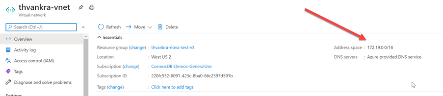
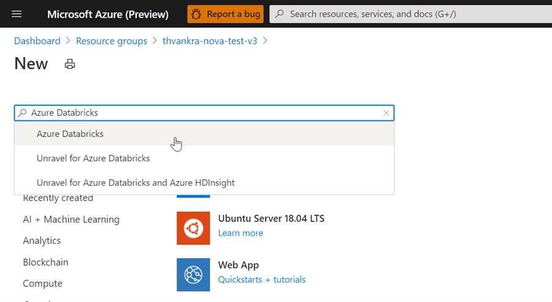
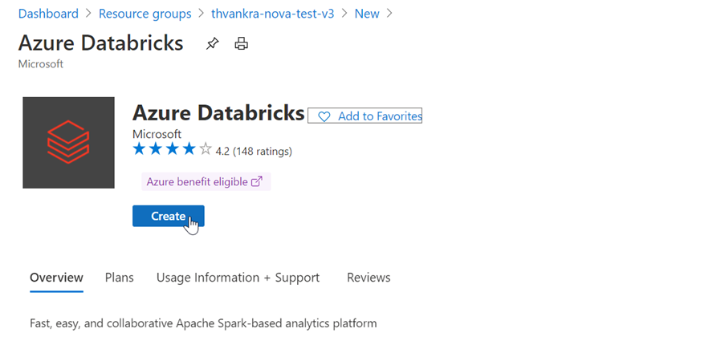
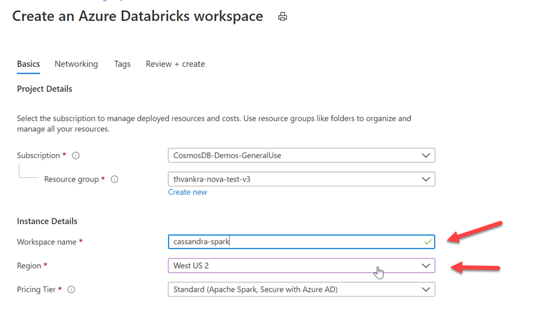
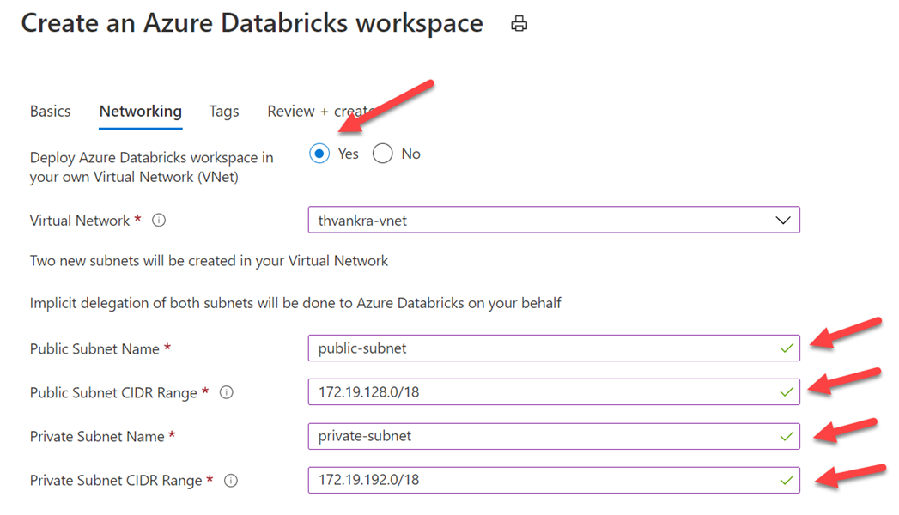
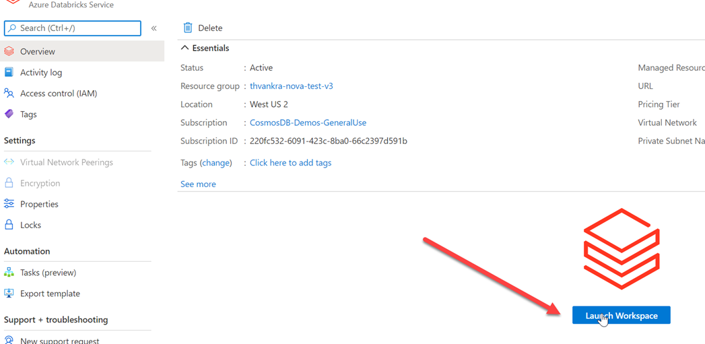

# Quickstart: Deploy a Managed Apache Spark Cluster with Azure Databricks

Azure Managed Instance for Apache Cassandra provides automated deployment and scaling operations for managed open-source Apache Cassandra datacenters, accelerating hybrid scenarios and reducing ongoing maintenance.

This quickstart demonstrates how to use the Azure portal to create a fully managed Apache Spark cluster inside the VNET of your Azure Managed Instance for Apache Cassandra cluster. 

You can also consult a more in-depth set of instructions on [Deploying Azure Databricks in your Azure Virtual Network (VNET Injection)](https://docs.microsoft.com/azure/databricks/administration-guide/cloud-configurations/azure/vnet-inject). 

## Installing Azure Databricks in a VNET with Azure Managed Instance for Apache Cassandra

First, take note of the address space in your VNET:



Search for Azure Databricks in the portal:



Select create:



Select a name for the Azure Databricks workspace, and ensure it's created in same region as your VNET:



Select the Networking tab, then check yes for deploying Azure Databricks to your VNET, and specify public and private subnet names and subnet ranges:



To avoid range collisions, ensure you select higher ranges. If necessary, use a visual subnet calculator like [this](https://www.fryguy.net/wp-content/tools/subnets.html) for dividing the ranges:


Click review and create, then create to deploy the work space. When created, launch workspace:



When creating a cluster, you'll need to select a version supported by the Cassandra Connector (Scala 2.11 or below):


Expand advanced options, and ensure you add config as follows (replacing node IP and credentials):

```java
spark.cassandra.connection.host <node1 IP>,<node 2 IP>, <node IP>
spark.cassandra.auth.password cassandra
spark.cassandra.connection.port 9042
spark.cassandra.auth.username cassandra
spark.cassandra.connection.ssl.enabled true
```

In Libraries, ensure you install the latest spark connector for Cassandra (and restart cluster):


## Next steps

In this quickstart, you learned how to create a fully managed Apache Spark cluster inside the VNET of your Azure Managed Instance for Apache Cassandra cluster. 

- [Overview of Azure Managed Instance for Apache Cassandra](introduction.md)