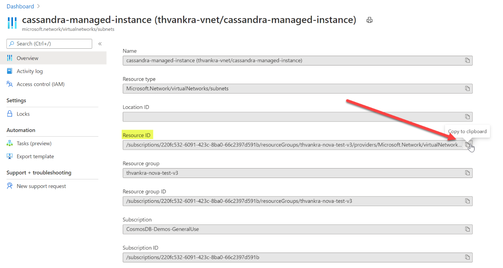

# Quickstart: Configure a hybrid cluster with Azure Managed Instance for Apache Cassandra (Preview)

Azure Managed Instance for Apache Cassandra provides automated deployment and scaling operations for managed open-source Apache Cassandra datacenters. This service helps you accelerate hybrid scenarios and reduce ongoing maintenance.

> [!IMPORTANT]
> Azure Managed Instance for Apache Cassandra is currently in public preview.
> This preview version is provided without a service level agreement, and it's not recommended for production workloads. Certain features might not be supported or might have constrained capabilities.
> For more information, see [Supplemental Terms of Use for Microsoft Azure Previews](https://azure.microsoft.com/support/legal/preview-supplemental-terms/).

This quickstart demonstrates how to use the Azure CLI commands to configure a hybrid cluster. If you have existing datacenters in an on-premise or self-hosted environment, you can use Azure Managed Instance for Apache Cassandra to add other datacenters to that cluster and maintain them.

[!INCLUDE [azure-cli-prepare-your-environment.md](../../includes/azure-cli-prepare-your-environment.md)]

* This article requires the Azure CLI version 2.12.1 or higher. If you are using Azure Cloud Shell, the latest version is already installed.

* [Azure Virtual Network](../virtual-network/virtual-networks-overview.md) with connectivity to your self-hosted or on-premise environment. For more information on connecting on premises environments to Azure, see the [Connect an on-premises network to Azure](https://docs.microsoft.com/azure/architecture/reference-architectures/hybrid-networking/) article.

## <a id="create-account"></a>Configure a hybrid cluster

1. Sign in to the [Azure portal](https://portal.azure.com/) and navigate to your Virtual Network resource.

1. Open the **Subnets** tab and create a new subnet. To learn more about the fields in the **Add subnet** form, see the [Virtual Network](../virtual-network/virtual-network-manage-subnet.md#add-a-subnet) article:

   :::image type="content" source="./media/configure-hybrid-cluster/subnet.png" alt-text="Add a new subnet to your Virtual Network." lightbox="./media/configure-hybrid-cluster/subnet.png" border="true":::
    <!--  -->

1. In Access control (IAM) of your VNET, ensure you add role assignment for "Azure Cosmos DB" to the role of "Network Administrator":

   :::image type="content" source="./media/configure-hybrid-cluster/network-admin.png" alt-text="Add Cosmos DB to role of network admin" lightbox="./media/configure-hybrid-cluster/network-admin.png" border="true":::

1. Click save, then click on role assignments and ensure that the highlighted roles appear twice per below when searching for “Azure Cosmos DB”:

   :::image type="content" source="./media/configure-hybrid-cluster/check-role.png" alt-text="Add Cosmos DB to role of network admin" lightbox="./media/configure-hybrid-cluster/check-role.png" border="true":::


1. Go back to the **Subnets** tab, and change the URL in the browser's address bar. In the URL, after *subnets/*, type the name of your new dedicated subnet, followed by */overview*. For example, if you subnet name is *managed-cassandra* then the updated URL would look like: `.../subnets/managed-cassandra/overview`. The new URL shows the details of the newly created subnet:

   :::image type="content" source="./media/configure-hybrid-cluster/subnet-overview.png" alt-text="Update the browser URL to include the subnet name to get the subnet overview." lightbox="./media/configure-hybrid-cluster/subnet-overview.png" border="true":::

1. Navigate to subnet overview pane, and copy the **Resource ID** of your subnet. you will use it in the next steps:

   :::image type="content" source="./media/configure-hybrid-cluster/resource-id.png" alt-text="Copy the resource ID of your subnet." lightbox="./media/configure-hybrid-cluster/resource-id.png" border="true":::
    <!--  -->

1. Next, configure resources for our hybrid cluster using Azure CLI. Since you already have a cluster, the cluster name here will only be a logical resource to identify the name of your existing cluster. Make sure to use the name of your existing cluster when defining `clusterName` and `clusterNameOverride` variables in the following script.

   You also need the seed nodes, public client certificates (if you have configured a public/private key on your cassandra endpoint), and gossip certificates of your existing cluster. You'll also need to use the resource ID you copied above to define the `delegatedManagementSubnetId` variable.

   ```azurecli-interactive
   resourceGroupName='MyResourceGroup'
   clusterName='cassandra-hybrid-cluster-legal-name'
   clusterNameOverride='cassandra-hybrid-cluster-illegal-name'
   location='eastus2'
   delegatedManagementSubnetId='/subscriptions/<Subscription_ID>/resourceGroups/customer-vnet-rg/providers/Microsoft.Network/virtualNetworks/customer-vnet/subnets/management'
    
   # You can override the cluster name if the original name is not legal for an Azure resource:
   # overrideClusterName='ClusterNameIllegalForAzureResource'
   # the default cassandra version will be v3.11
    
   az managed-cassandra cluster create \
      --cluster-name $clusterName \
      --resource-group $resourceGroupName \
      --location $location \
      --delegated-management-subnet-id $delegatedManagementSubnetId \
      --external-seed-nodes 10.52.221.2,10.52.221.3,10.52.221.4
      --client-certificates 'BEGIN CERTIFICATE-----\n...PEM format..\n-----END CERTIFICATE-----','BEGIN CERTIFICATE-----\n...PEM format...\n-----END CERTIFICATE-----' \
      --external-gossip-certificates 'BEGIN CERTIFICATE-----\n...PEM format 1...\n-----END CERTIFICATE-----','BEGIN CERTIFICATE-----\n...PEM format 2...\n-----END CERTIFICATE-----'
   ```

    > [!NOTE]
    > You should know where your existing public and/or gossip certificates are kept. If you are uncertain, you should be able to run `keytool -list -keystore <keystore-path> -rfc -storepass <password>` to print the certs. 

1. After the cluster resource is created, run the following command to get the cluster setup details:

   ```azurecli-interactive
   resourceGroupName='MyResourceGroup'
   clusterName='cassandra-hybrid-cluster'
    
   az managed-cassandra cluster show \
       --cluster-name $clusterName \
       --resource-group $resourceGroupName \
   ```

1. The previous command returns information about the managed instance environment. You'll need the gossip certificates so that you can install them on the nodes in your existing datacenter. The following screenshot shows the output of the previous command and the format of certificates:

   :::image type="content" source="./media/configure-hybrid-cluster/show-cluster.png" alt-text="Get the certificate details from the cluster." lightbox="./media/configure-hybrid-cluster/show-cluster.png" border="true":::
    <!--  -->

1. Next, create a new datacenter in the hybrid cluster. Make sure to replace the variable values with your cluster details:

   ```azurecli-interactive
   resourceGroupName='MyResourceGroup'
   clusterName='cassandra-hybrid-cluster'
   dataCenterName='dc1'
   dataCenterLocation='eastus2'
   delegatedSubnetId= '/subscriptions/<Subscription_ID>/resourceGroups/customer-vnet-rg/providers/Microsoft.Network/virtualNetworks/customer-vnet/subnets/dc1-subnet'
    
   az managed-cassandra datacenter create \
       --resource-group $resourceGroupName \
       --cluster-name $clusterName \
       --data-center-name $dataCenterName \
       --data-center-location $dataCenterLocation \
       --delegated-subnet-id $delegatedSubnetId \
       --node-count 9 
   ```

1. Now that the new datacenter is created, run the show datacenter command to view its details:

   ```azurecli-interactive
   resourceGroupName='MyResourceGroup'
   clusterName='cassandra-hybrid-cluster'
   dataCenterName='dc1'
    
   az managed-cassandra datacenter show \
       --resource-group $resourceGroupName \
       --cluster-name $clusterName \
       --data-center-name $dataCenterName 
   ```

1. The previous command outputs the new datacenter's seed nodes. Add the new datacenter's seed nodes to your existing datacenter's configuration within the *cassandra.yaml* file. And install the managed instance gossip certificates that you collected earlier:

   :::image type="content" source="./media/configure-hybrid-cluster/show-datacenter.png" alt-text="Get datacenter details." lightbox="./media/configure-hybrid-cluster/show-datacenter.png" border="true":::
    <!--  -->

    > [!NOTE]
    > If you want to add more datacenters, you can repeat the above steps, but you only need the seed nodes. 

1. Finally, use the following SQL query to update the replication strategy in each keyspace to include all datacenters across the cluster:

   ```SQL
   ALTER KEYSPACE "ks" WITH REPLICATION = {'class': 'NetworkTopologyStrategy', ‘on-premise-dc': 3, ‘managed-instance-dc': 3};
   ```
   You also need to update the password tables:

   ```SQL
    ALTER KEYSPACE "system_auth" WITH REPLICATION = {'class': 'NetworkTopologyStrategy', ‘on-premise-dc': 3, ‘managed-instance-dc': 3}
   ```
    
## Next steps

In this how-to guide, you learned how to create a hybrid cluster using Azure CLI and Azure Managed Instance for Apache Cassandra. You can now start working with the cluster.

* [Overview of Azure Managed Instance for Apache Cassandra](introduction.md)
* [Deploy a Managed Apache Spark Cluster with Azure Databricks](deploy-cluster-databricks.md)
* [Manage Azure Managed Instance for Apache Cassandra resources using Azure CLI](manage-resources-cli.md)