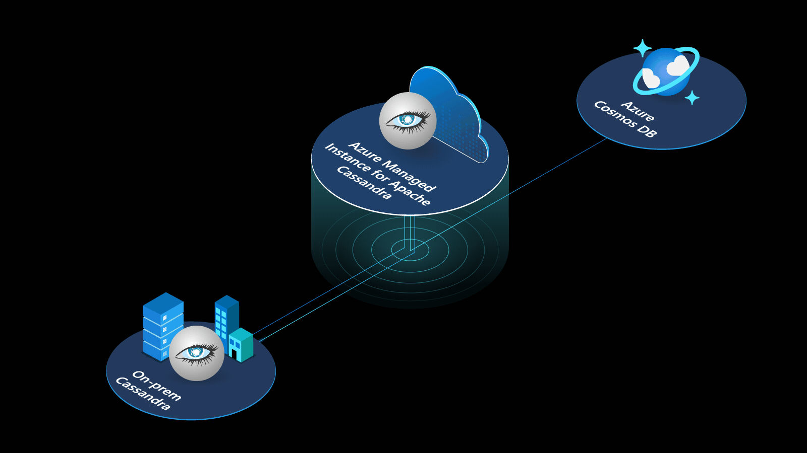

# Welcome to Azure Managed Instance for Apache Cassandra

The service provides automated deployment and scaling operations for managed open-source Apache Cassandra datacenters, accelerating hybrid scenarios and reducing ongoing maintenance. Delivered by the Azure Cosmos DB team, this service will also have deep integration and data movement capabilities with [Azure Cosmos DB Cassandra API](https://docs.microsoft.com/azure/cosmos-db/cassandra-introduction) upon its general release.

:::image type="content" source="./media/introduction/icon.gif" alt-text="Azure Managed Instance for Apache Cassandra is a managed service for Apache Cassandra." border="false":::
<!--  -->

## Key Benefits

### Hybrid Deployments

You can use the service to easily inject managed instances of Apache Cassandra datacenters (deployed automatically as virtual machine scale sets), into a new or existing Azure VNET. These datacenters can be added to your existing Apache Cassandra ring running on-premises (via [Azure ExpressRoute](https://docs.microsoft.com/azure/architecture/reference-architectures/hybrid-networking/expressroute)), in Azure, or another cloud environment. 

- Simplified deployment (once hybrid connectivity is established through gossip protocol).
- Hosted metrics in [Prometheus](https://prometheus.io/docs/introduction/overview/) to monitor activity across your cluster.

### Simplified Scaling

In Azure Managed Instance for Apache Cassandra, scaling up and scaling down nodes in a datacenter is fully managed. You enter how many nodes you need, and our scaling orchestrator takes care of establishing their proper operation within the Cassandra ring.

### Managed and cost-effective

The service provides management operations for the following common Apache Cassandra tasks:

- Provisioning a cluster
- Provisioning a datacenter
- Scaling a datacenter
- Deleting a datacenter
- Start a repair action on a keyspace
- Changing configuration of a datacenter
- Setting up backups
- Maintaining audit logs

Our flexible, on-demand, instance-based pricing model (with no licensing fees) allows you to adjust to your specific workloads needs, by defining number of cores, VM SKU, and memory/disk space.

## Next steps

Get started with one of our quickstarts:

- [Get started](quickstart.md)
