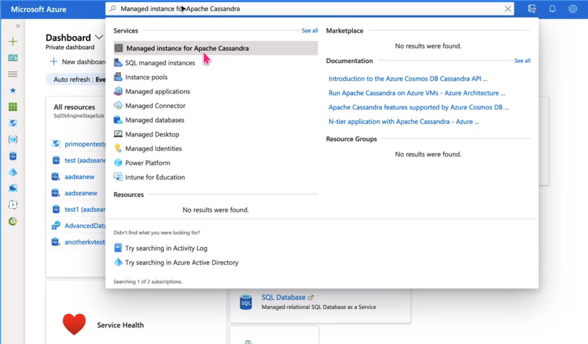
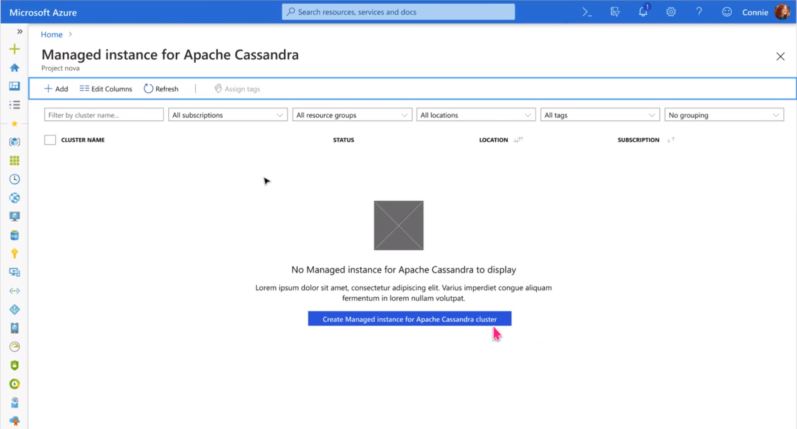
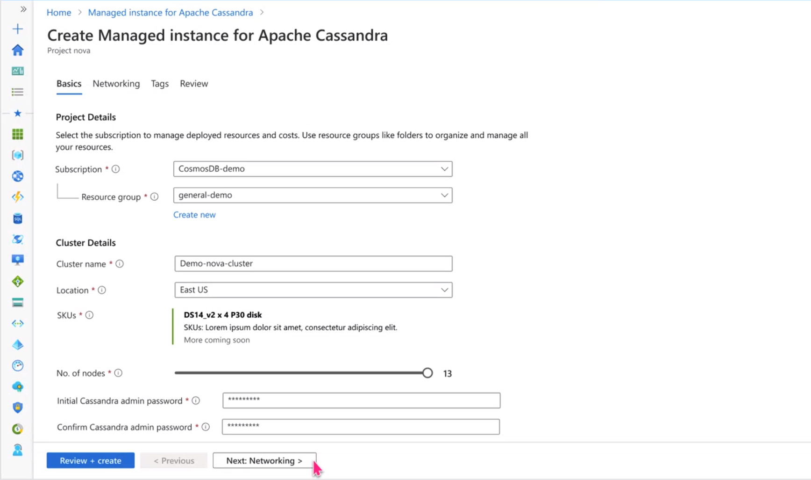
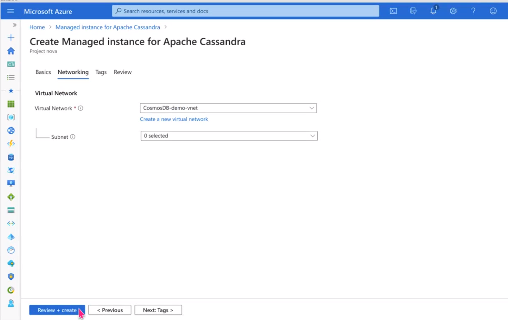
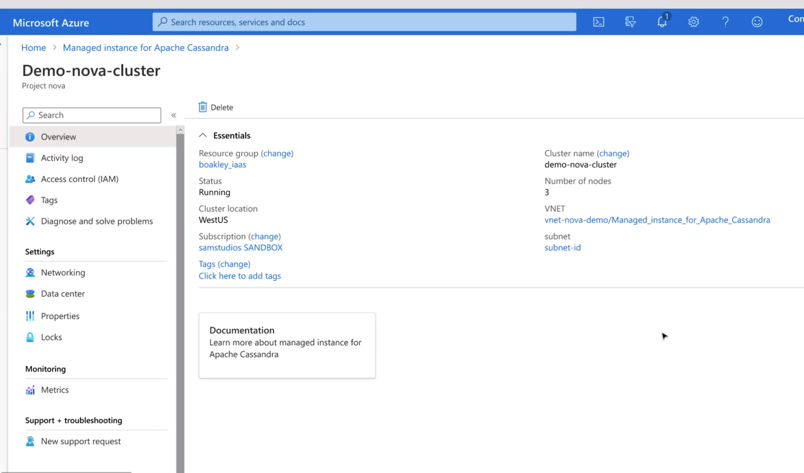
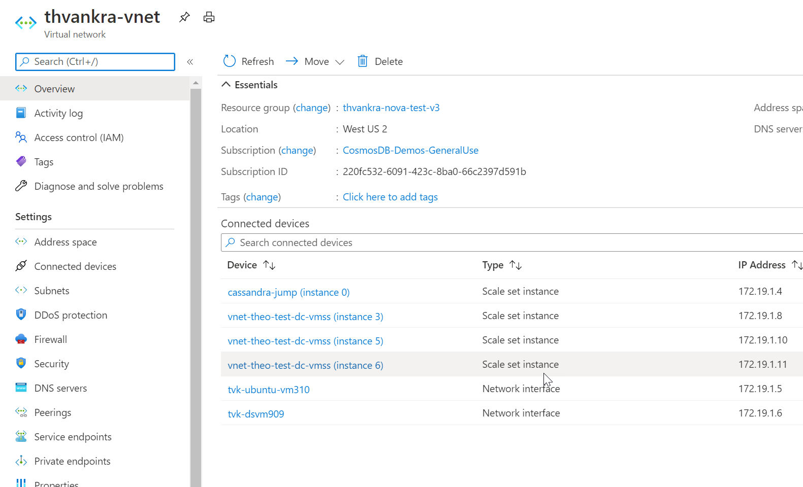

# Quickstart: Create an Azure Managed Instance for Apache Cassandra cluster from the Azure portal
 

Azure Managed Instance for Apache Cassandra provides automated deployment and scaling operations for managed open-source Apache Cassandra datacenters, accelerating hybrid scenarios and reducing ongoing maintenance.

This quickstart demonstrates how to use the Azure portal to create an Azure Managed Instance for Apache Cassandra cluster.

## Prerequisites

An Azure subscription or free Azure Cosmos DB trial account 

## Create a managed instance cluster

Go to the [Azure portal](https://portal.azure.com/). Search for and select **Managed Instance for Apache Cassandra**.

Click on **Create Managed Instance for Apache Cassandra cluster**.

On the **Create Managed Instance for Apache Cassandra** page, enter resource group, cluster name, number of nodes, and specify Cassandra admin password that will be created for the cluster. The click on **Next: Networking**.

On the **Networking** page, select Virtual Network or create a new one. Then click review and create.

Review and click create.

Once resources are created, the overview page should show cluster name and number of nodes.

You can review cluster nodes from within your existing or newly created VNET:

## Next steps

In this quickstart, you learned how to create an Azure Managed Instance for Apache Cassandra cluster using Azure portal. You can now start working with the cluster. 

- [Overview of Azure Managed Instance for Apache Cassandra](introduction.md)