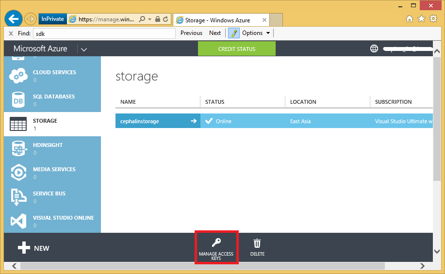

<properties linkid="cdn-serve-content-from-cdn-in-your-web-application" urlDisplayName="Use Content from a CDN in Your Web Application" pageTitle="Use Content from a CDN in Your Web Application" metaKeywords="Azure tutorial, Azure web app tutorial, ASP.NET, CDN" description="A tutorial that teaches you how to use content from a CDN to improve the performance of your Web application." metaCanonical="" services="cdn" documentationCenter=".NET" title="Use Content from a CDN in Your Web Application" authors="cephalin" solutions="" manager="" editor="" />

# Serve Content from Azure CDN in Your Web Application #
***By [Cephas Lin](https://twitter.com/Cephas_MSFT) Updated 14 July 2014.***

This tutorial shows you how to take advantage of Azure CDN to improve the reach and performance of your WEb application. Azure CDN can help improve the performance of your Web application when:

- You have many links to static or semi-static content on your pages
- Your application is accessed by clients globally
- You want to offload traffic from your Web server
- You want to increase the perceived load/refresh time of your pages

## What you will learn ##

In this tutorial, you will learn how to do the following:

-	[Serve static content from an Azure CDN endpoint](#deploy)
-	[Automating uploading content in your ASP.NET application to your CDN endpoint](#upload)
-	[Configure the CDN cache to reflect the desired content update](#update)
-	[Serve fresh content immediately using query strings](#query)

## What you will need ##

This tutorial has the following prerequisites:

-	An active [Microsoft Azure account](http://azure.microsoft.com/en-us/account/). You can sign up for a trial account
-	Visual Studio 2013 with [Azure SDK](http://go.microsoft.com/fwlink/p/?linkid=323510&clcid=0x409)
-	A simple ASP.NET MVC application to test CDN URLs. [Automating uploading content in your ASP.NET application to your CDN endpoint](#upload) uses an ASP.NET MVC application as an example.  

## Serve static content from an Azure CDN endpoint ##

In this tutorial section, you will learn how to create a CDN and use it to serve your static content. The major steps involved are:

1. Create a storage account
2. Create a CDN linked to the storage account
3. Create a blob container in your storage account
4. Upload content to your blob container
5. Link to the the content you uploaded using its CDN URL

Let's get to it. Follow the steps below to start using the Azure CDN:

1. To create a CDN endpoint, log into your [Azure management portal](http://manage.windowsazure.com/). 
1. Create a storage account by clicking **New > Data Services > Storage > Quick Create**. Specify a URL, a location, and click **Create Storage Account**. 

	

	>[WACOM.NOTE] Note that I'm using East Asia as the region as it is far enough away for me to test my CDN from North America later.

2. Once the new storage account's status is **Online**, create a new CDN endpoint that's tied to the storage account you created. Click **New > App Services > CDN > Quick Create**. Select the storage account you created and click **Create**.

	

	>[WACOM.NOTE] Once your CDN is created, the Azure portal will show you its URL and the origin domain that it's tied to. However, it can take awhile for the CDN endpoint's configuration to be fully propagated to all the node locations.  

3. Test your CDN endpoint to make sure that it's online by pinging it. If your CDN endpoint has not propagated to all the nodes, you will see a message similar to the one below.

	

	Wait another hour and test again. Once your CDN endpoint has finished propagating to the nodes, it should respond to your pings.

	

4. At this point, you can already see where the CDN endpoint determines to be the closest CDN node to you. From my desktop computer, the responding IP address is **93.184.215.201**. Plug it into a site like [www.ip-address.org](http://www.ip-address.org) and see that the server is located in Washington D.C.

	

	For a list of all CDN node locations, see [Azure Content Delivery Network (CDN) Node Locations](http://msdn.microsoft.com/en-us/library/azure/gg680302.aspx).

3. Back in the Azure portal, in the **CDN** tab, click the name of the CDN endpoint you just created.

	

3. Click **Enable Query String** to enable query strings in the Azure CDN cache. Once you enable this, the same link accessed with different query strings will be cached as separate entries.

	

	>[WACOM.TIP] While enabling the query string is not necessary for this part of the tutorial, you want to do this as early as possible for convenience sake since any change here is going to take time to propagate to the rest of the nodes, and you don't want any non-query-string-enabled content to clog up the CDN cache (updating CDN content will be discussed later). You will find out how to take advantage of this in [Serve fresh content immediately through query strings](#query).

6. In Visual Studio 2013, in Server Explorer, click the **Connect to Windows Azure** button.

	

7.  Follow the prompt to sign into your Azure account. 
8.  Once you sign in, expand the **Windows Azure > Storage > your storage account**. Right-click **Blob** and select **Create Blob Container**.

	

8.	Specify a blob container name and click **OK**.

	

9.	In Server Explorer, double-click the blob container you created to manage it. You should see the management interface in the center pane.

	

10.	Click the **Upload Blob** button to upload images, scripts, or stylesheets that are used by your Web pages into the blob container. The upload progress will be shown in the **Windows Azure Activity Log**, and the blobs will appear in the container view when they are uploaded. 

	

11.	Now that you have uploaded the blobs, you must make them public for you to access them. In Server Explorer, right-click the container and select **Properties**. Set the **Public Read Access** property to **Blob**.

	

12.	Test the public access of your blobs by navigating to the URL for one of the blobs in a browser. For example, I can test the first image in my uploaded list with `http://cephalinstorage.blob.core.windows.net/cdn/cephas_lin.png`.

	Note that I'm not using the HTTPS address given in the blob management interface in Visual Studio. By using HTTP, you test whether the content is publicly accessible, which is a requirement for Azure CDN.

13.	If you can see the blob rendered properly in your browser, change the URL from http://<storageaccountname>.blob.core.windows.net to the URL of your Azure CDN. In my case, to test the first image at my CDN endpoint, I would use `http://az623979.vo.msecnd.net/cdn/cephas_lin.png`.

	>[WACOM.NOTE] You can find the CDN endpoint's URL in the Azure management portal, in the CDN tab.

	If you compare the performance of direct blob access and CDN access, you can see the performance gain from using Azure CDN. Below is the Internet Explorer 11 F12 developer tools screenshot for blob URL access of my image:

	

	And for CDN URL access of the same image 

	

 	Pay attention to the numbers for the **Request** timing, which is the time to first byte, or the time taken to send the request and receive the first response from the server. When I access the blob, which is hosted in the East Asia region, it takes 266 ms for me - since the request must traverse the entire Pacific Ocean just to get to the server. However, when I access the Azure CDN, it takes only 16 ms, which is nearly a **20-fold gain in performance**!
	
15.	Now, it's just a matter of using the new link in your Web page, such as the following:

		

In this section, you have learned how to create a CDN endpoint, upload content to it, and link to CDN contentfrom any Web page.

## Automating uploading content in your ASP.NET application to your CDN endpoint ##

What if you want to easily upload all of the static content in your ASP.NET Web application to your CDN endpoint? With a little bit of coding, bulk-uploading content from an ASP.NET Web application project to Azure CDN is quite straightforward. [Maarten Balliauw](https://twitter.com/maartenballiauw) has provided an excellent way to do it with ASP.NET MVC in his video [Reducing latency on the web with the Windows Azure CDN](http://channel9.msdn.com/events/TechDays/Techdays-2014-the-Netherlands/Reducing-latency-on-the-web-with-the-Windows-Azure-CDN), which I will simply reproduce here. 

	>[WACOM.NOTE]These steps use the storage account and CDN that you already created in the previous tutorial.

1. Copy this action method to your Home controller (*Controllers\HomeController.cs*):  
	<pre class="prettyprint">
    public ActionResult Synchronize()
    {
		// Connect to your storage account
        var account = CloudStorageAccount.Parse(&quot;DefaultEndpointsProtocol=https;AccountName=<mark>&lt;storageAccountName&gt;</mark>;AccountKey=<mark>&lt;accountKey&gt;</mark>&quot;);
        var client = account.CreateCloudBlobClient();

		// Open/create the storage container and set the permissions to Public for all blobs in the container
        var container = client.GetContainerReference(&quot;<mark>&lt;containerName&gt;</mark>&quot;);
        container.CreateIfNotExists();
        container.SetPermissions(
            new BlobContainerPermissions
            {
                PublicAccess = BlobContainerPublicAccessType.Blob
            });

		// Discover all files in your \Content and \Scripts folders
        var approot = HostingEnvironment.MapPath(&quot;~/&quot;);
        var files = new List&lt;string&gt;();
        files.AddRange(Directory.EnumerateFiles(
            HostingEnvironment.MapPath(&quot;~/Content&quot;), &quot;*&quot;, SearchOption.AllDirectories));
        files.AddRange(Directory.EnumerateFiles(
            HostingEnvironment.MapPath(&quot;~/Scripts&quot;), &quot;*&quot;, SearchOption.AllDirectories));

		// Upload each discovered file to an Azure blob
        foreach (var file in files)
        {
			// Make sure that the content type is set properly for each file.
			// If you have additional content types, add it to the switch statement
			// (Such as &quot;image/jpeg&quot;).
            var contentType = &quot;application/octet-stream&quot;;  // Default content type
            switch (Path.GetExtension(file))
            {
                case &quot;.png&quot;:
                    contentType = &quot;image/png&quot;;
                    break;
                case &quot;.css&quot;:
                    contentType = &quot;text/css&quot;;
                    break;
                case &quot;.js&quot;:
                    contentType = &quot;text/javascript&quot;;
                    break;
            }

			// Upload the file to a blob
            var blob = container.GetBlockBlobReference(file.Replace(approot, &quot;&quot;));
            blob.Properties.ContentType = contentType;
            blob.UploadFromFile(file, FileMode.OpenOrCreate);
            blob.SetProperties();
        }

		// Indicate that the upload has been successful
        return Content(&quot;Content is synchronized with the blob container.&quot;);
    }
	</pre>

	This code uploads all files from your *\Content* and *\Scripts* folders to the specified storage account and container. This code has the following advantage:

	-	Automatically replicate the file structure of your Visual Studio project
	-	Automatically create blob containers as needed
	-	Reuse the same Azure storage account and CDN endpoint for multiple Web applications, each in a separate blob container
	-	Easily update the Azure CDN with new content. For more information on updating content, see [Configure the CDN cache to reflect the desired content update](#update).

2. You'll need to include the following namespaces in *Controllers\HomeController.cs* in order for the code to resolve properly:

		using Microsoft.WindowsAzure.Storage;
		using Microsoft.WindowsAzure.Storage.Blob;
		using System.Collections.Generic;
		using System.IO;
		using System.Web.Hosting;

3. You also need to specify the following parameters in the code:

	-   **&lt;storageAccountName>**  The name of your storage account.
	- 	**&lt;accountKey>**  Your account key. You can find the primary or secondary access key by selecting your storage account in the **Storage** tab and click **Manage Access Keys**.

		

	- 	**&lt;ContainerName>**  The name of the blob container. Whereas I used the generic "cdn" as the container name previously, it makes more sense to use the name of your Web app so that all the content for that Web app is organized into the same easily identifiable container.

4. Debug your MVC application by typing `F5`, then navigate to your action method, like `http://localhost:####/Home/Synchronize`.

	Once the content has finished uploading, you should see the message "Content is synchronized with the blob container." You can now link to anything in your *\Content* and *\Scripts* folder in your .cshtml files, using `http://<cdnName>.vo.msecnd.net/<containerName>`. Here is an example of something I can use in a Razor view: 

		

## Configure the CDN cache to reflect the desired content update ##

Now, suppose after you have uploaded the static files from your Web app in a blob container, you make a change to one of the files in your project and upload it to the blob container again. You may think that it's automatically updated to your CDN endpoint, but are actually puzzled why you don't see the update reflected when you access the content's CDN URL. 

The truth is that the CDN does indeed automatically update from your blob storage, but it does so by applying a default 7-day caching rule to the content. This means that once a CDN node pulls your content from blob storage, the same content is not refreshed until it expires in the cache.

The good news is that you can customize cache expiration. Similar to most browsers, Azure CDN respects the expiration time specified in the content's Cache-Control header. You can specify a custom Cache-Control header value by navigating to the blob container in the Azure portal and editing the blob properties. The screenshot below shows cache expiration set to 1 hour (3600 seconds). 

You can also do this programmatically to set all blobs' Cache-Control headers. In [Maarten Balliauw](https://twitter.com/maartenballiauw)'s code above, just add the following code before the `blob.UploadFromFile` method is executed.

	blob.Properties.CacheControl = "public, max-age=3600";

The complete blob upload code snippet then looks like the following:

	// Upload the file to a blob
    var blob = container.GetBlockBlobReference(file.Replace(approot, ""));
    blob.Properties.ContentType = contentType;
	blob.Properties.CacheControl = "public, max-age=3600";
    blob.UploadFromFile(file, FileMode.OpenOrCreate);
    blob.SetProperties();

You may still need to wait for the full 7-day cached content on your Azure CDN to expire before it pulls the new content, with the new Cache-Control header. This illustrates the fact that custom caching values do not help if you want your content update to go live immediately, such as JavaScript or CSS updates. However, you can work around this issue by versioning your content through query strings. For more information, see [Serve fresh content immediately using query strings](#query).

There is, of course, a time and place for caching. For example, you may have content that does not require the frequent update, such as the upcoming World Cup games that can be refreshed every 3 hours, but gets enough global traffic that you want to offload it from your own Web server. That can be a good candidate to use the Azure CDN caching.

## Serve fresh content immediately using query strings ##

In Azure CDN, you can enable query strings so that content from URLs with specific query strings are cached separately. This is a great feature to use if you want to push certain content updates to the client browsers immediately instead of waiting for the cached CDN content to expire. Suppose I publish my Web page with a version number in the URL.  
<pre class="prettyprint">
&lt;link href=&quot;http://az623979.vo.msecnd.net/MyMvcApp/Content/bootstrap.css<mark>?v=3.0.0</mark>&quot; rel=&quot;stylesheet&quot;/&gt;
</pre>

When I publish a CSS update and use a different version number in my CSS URL:  
<pre class="prettyprint">
&lt;link href=&quot;http://az623979.vo.msecnd.net/MyMvcApp/Content/bootstrap.css<mark>?v=3.1.1</mark>&quot; rel=&quot;stylesheet&quot;/&gt;
</pre>

To a CDN endpoint that has query strings enabled, the two URLs are unique to each other, and it will make a new request to my Web server to retrieve the new *bootstrap.css*. To a CDN endpoint that doesn't have query strings enabled, however, these are the same URL, and it will simply serve the cached *bootstrap.css*. 

The trick then is to update the version number automatically. In Visual Studio, this is easy to do. In a .cshtml file where you would use the link above, you can specify a version number based on the assembly number.  
<pre class="prettyprint">
@{
    <mark>var cdnVersion = System.Reflection.Assembly.GetAssembly(
        typeof(MyMvcApp.Controllers.HomeController))
        .GetName().Version.ToString();</mark>
}

...

&lt;link href=&quot;http://az623979.vo.msecnd.net/MyMvcApp/Content/bootstrap.css<mark>?v=@cdnVersion</mark>&quot; rel=&quot;stylesheet&quot;/&gt;
</pre>

If you change the assembly number as part of every publish cycle, then you can be sure to get a unique version number every time you publish your Web app, which will remain the same until the next publish cycle. Or, you can make Visual Studio automatically increment the assembly version number every time the Web app builds by opening *Properties\AssemblyInfo.cs* in your Visual Studio project and use * in `AssemblyVersion`. For example:

	[assembly: AssemblyVersion("1.0.0.*")]

## What about bundled scripts and CSS? ##

Currently, the only place you find adequate integration between ASP.NET bundling and Azure CDN is in [Azure Cloud Services](http://azure.microsoft.com/en-us/services/cloud-services/). Without Azure Cloud Services, it is possible to use Azure CDN for your script bundles, with the following caveats:

- You must manually upload the bundled scripts to blob storage. A programmatic solution is proposed at [stackoverflow](http://stackoverflow.com/a/13736433).
- In your .cshtml files, transform the rendered script/CSS tags to use the Azure CDN. For example:

		@Html.Raw(Styles.Render("~/Content/css").ToString().Insert(0, "http://az623979.vo.msecnd.net"))

For more information on integrating Azure CDN with Azure Cloud Services, see [Integrate a cloud application with Azure CDN](http://azure.microsoft.com/en-us/documentation/articles/cloud-services-how-to-create-deploy/).    

# More Information #
[Overview of the Azure Content Delivery Network (CDN)](http://msdn.microsoft.com/library/azure/ff919703.aspx)