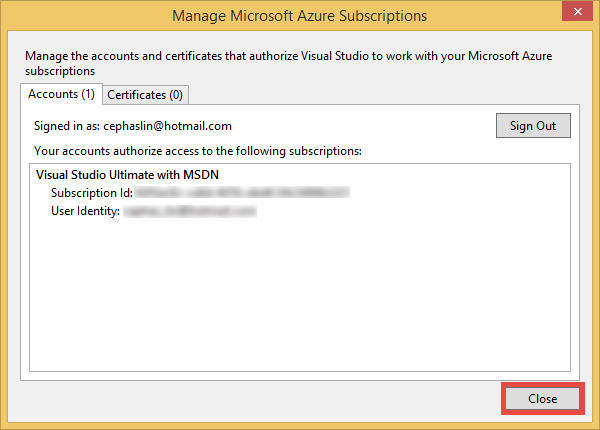
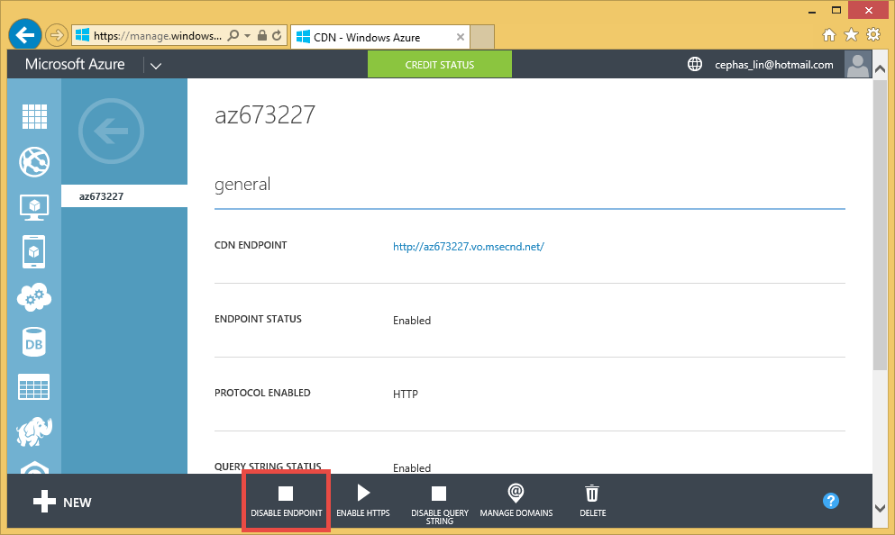

<properties 
	pageTitle="Use Azure CDN in Azure App Service" 
	description="A tutorial that teaches you how to deploy a web app to Azure App Service that serves content from an integrated Azure CDN endpoint" 
	services="app-service\web" 
	documentationCenter=".net" 
	authors="cephalin" 
	manager="wpickett" 
	editor="jimbe"/>

<tags 
	ms.service="app-service-web" 
	ms.workload="tbd" 
	ms.tgt_pltfrm="na" 
	ms.devlang="dotnet" 
	ms.topic="article" 
	ms.date="03/24/2015" 
	ms.author="cephalin"/>

# Use Azure CDN in Azure App Service

[App Service](http://go.microsoft.com/fwlink/?LinkId=529714) can be integrated with [Azure CDN](/services/cdn/), adding to the global scaling capabilities inherent in [App Service Web Apps](http://go.microsoft.com/fwlink/?LinkId=529714) by serving your web app content globally from server nodes near your customers (an updated list of all current node locations can be found [here](http://msdn.microsoft.com/library/azure/gg680302.aspx)). In scenarios like serving static images, this integration can dramatically increase the performance of your Azure App Service Web Apps and significantly improves your web app's user experience worldwide. 

Integrating Web Apps with Azure CDN gives you the following advantages:

- Integrate content deployment (images, scripts, and stylesheets) as part of your web app's [continuous deployment](web-sites-publish-source-control.md) process
- Easily upgrade the NuGet packages in your web app in Azure App Service, such as jQuery or Bootstrap versions 
- Manage your Web application and your CDN-served content from the same Visual Studio interface
- Integrate ASP.NET bundling and minification with Azure CDN

## What you will build ##

You will deploy a web app to Azure App Service using the default ASP.NET MVC template in Visual Studio, add code to serve content from an integrated Azure CDN, such as an image, controller action results, and the default JavaScript and CSS files, and also write code to configure the fallback mechanism for bundles served in the event that the CDN is offline.

## What you will need ##

This tutorial has the following prerequisites:

-	An active [Microsoft Azure account](/account/)
-	Visual Studio 2013 with the [Azure SDK for .NET](http://go.microsoft.com/fwlink/p/?linkid=323510&clcid=0x409)

> [AZURE.NOTE] You need an Azure account to complete this tutorial:
> + You can [open an Azure account for free](/pricing/free-trial/?WT.mc_id=A261C142F) - You get credits you can use to try out paid Azure services, and even after they're used up you can keep the account and use free Azure services, such as Web Apps.
> + You can [activate MSDN subscriber benefits](/pricing/member-offers/msdn-benefits-details/?WT.mc_id=A261C142F) - Your MSDN subscription gives you credits every month that you can use for paid Azure services.
>
> If you want to get started with Azure App Service before signing up for an Azure account, go to [Try App Service](http://go.microsoft.com/fwlink/?LinkId=523751), where you can immediately create a short-lived starter web app in App Service. No credit cards required; no commitments.

## Deploy a web app to Azure with an integrated CDN endpoint ##

In this section, you will deploy the default ASP.NET MVC application template in Visual Studio 2013 to App Service, and then integrate it with a new CDN endpoint. Follow the instructions below:

1. In Visual Studio 2013, create a new ASP.NET web application from the menu bar by going to **File > New > Project > Web > ASP.NET Web Application**. Give it a name and click **OK**.

	

3. Select **MVC** and click **Manage Subscriptions**.

	

4. Click **Sign In**.

	

6. In the sign-in page, sign in with the Microsoft account you used to activate your Azure account.
7. Once you're signed in, click **Close**. Then, click **OK** to continue.

	

8. Assuming that you haven't created a web app in Azure, Visual Studio can help you create it. In the **Configure Microsoft Azure Website** dialog, make sure your site name is unique. Then, click **OK**.

	<!--todo: need 2.5.1 screenshot-->
	

9. Once your ASP.NET application is created, publish it to Azure in the Web Publish Activity pane by clicking **Publish `<app name>` to this site now**. Click **Publish** to complete the process.

	<!--todo: need 2.5.1 screenshot-->
	

	You will see your published web app in the browser when publishing is complete. 

1. To create a CDN endpoint, log into the [Azure Portal](http://go.microsoft.com/fwlink/?LinkId=529715). 
2. Click **New** > **App Services** > **CDN** > **Quick Create**. Select **http://*&lt;sitename>*.azurewebsites.net/** and click **Create**.

	

	> [AZURE.NOTE] Once your CDN endpoint is created, the Azure portal will show you its URL and the origin domain that it's integrated with. However, it can take a while for the new CDN endpoint's configuration to be fully propagated to all the CDN node locations. 

3. Back in the Azure portal, in the **CDN** tab, click the name of the CDN endpoint you just created.

	

3. Click **Enable Query String** to enable query strings in the CDN cache. Once you enable this, the same link accessed with different query strings will be cached as separate entries.

	

	>[AZURE.NOTE] While enabling the query string is not necessary for this tutorial section, you want to do this as early as possible for convenience since any change here is going to take time to propagate to all the CDN nodes, and you don't want any non-query-string-enabled content to clog up the CDN cache (updating CDN content will be discussed later).

2. Now, click the CDN endpoint address. If the endpoint is ready, you should see your web app displayed. If you get an **HTTP 404** error, the CDN endpoint is not ready. You may need to wait up to an hour for the CDN configuration to be propagated to all the edge nodes. 

	

1. Next, try to access the **~/Content/bootstrap.css** file in your ASP.NET project. In the browser window, navigate to **http://*&lt;cdnName>*.vo.msecnd.net/Content/bootstrap.css**. In my setup, this URL is:

		http://az673227.vo.msecnd.net/Content/bootstrap.css

	Which corresponds to the following origin URL at the CDN endpoint:

		http://cdnwebapp.azurewebsites.net/Content/bootstrap.css

	When you navigate to **http://*&lt;cdnName>*.vo.msecnd.net/Content/bootstrap.css**, you will be prompted to download the bootstrap.css that came from your web app in Azure. 

	

You can similarly access any publicly accessible URL at **http://*&lt;serviceName>*.cloudapp.net/**, straight from your CDN endpoint. For example:

-	A .js file from the /Script path
-	Any content file from the /Content path
-	Any controller/action 
-	If the query string is enabled at your CDN endpoint, any URL with query strings
-	The entire Azure web app, if all content is public

Note that it may not be always a good idea (or generally a good idea) to serve an entire Azure web app through Azure CDN. Some of the caveats are:

-	This approach requires your entire site to be public, because Azure CDN cannot serve any private content.
-	If the CDN endpoint goes offline for any reason, whether scheduled maintenance or user error, your entire web app goes offline unless the customers can be redirected to the origin URL **http://*&lt;sitename>*.azurewebsites.net/**. 
-	Even with the custom Cache-Control settings (see [Configure caching options for static files in your Azure web app](#caching)), a CDN endpoint does not improve the performance of highly-dynamic content. If you tried to load the home page from your CDN endpoint as shown above, notice that it took at least 5 seconds to load the default home page the first time, which is a fairly simple page. Imagine what would happen to the client experience if this page contains dynamic content that must update every minute. Serving dynamic content from a CDN endpoint requires short cache expiration, which translates to frequent cache misses at the CDN endpoint. This hurts the performance of your Azure web app and defeats the purpose of a CDN.

The alternative is to determine which content to serve from Azure CDN on a case-by-case basis in your Azure web app. To that end, you have already seen how to access individual content files from the CDN endpoint. I will show you how to serve a specific controller action through the CDN endpoint in [Serve content from controller actions through Azure CDN](#controller).

## Configure caching options for static files in your Azure web app ##

With Azure CDN integration in your Azure web app, you can specify how you want static content to be cached in the CDN endpoint. To do this, open *Web.config* from your ASP.NET project (e.g. **cdnwebapp**) and add a `<staticContent>` element to `<system.webServer>`. The XML below configures the cache to expire in 3 days.  
<pre class="prettyprint">
&lt;system.webServer&gt;
  <mark>&lt;staticContent&gt;
    &lt;clientCache cacheControlMode=&quot;UseMaxAge&quot; cacheControlMaxAge=&quot;3.00:00:00&quot;/&gt;
  &lt;/staticContent&gt;</mark>
  ...
&lt;/system.webServer&gt;
</pre>

Once you do this, all static files in your Azure web app will observe the same rule in your CDN cache. For more granular control of cache settings, add a *Web.config* file into a folder and add your settings there. For example, add a *Web.config* file to the *\Content* folder and replace the content with the following XML:

	<?xml version="1.0"?>
	<configuration>
	  <system.webServer>
	    <staticContent>
	      <clientCache cacheControlMode="UseMaxAge" cacheControlMaxAge="15.00:00:00"/>
	    </staticContent>
	  </system.webServer>
	</configuration>

This setting causes all static files from the *\Content* folder to be cached for 15 days.

For more information on how to configure the `<clientCache>` element, see [Client Cache &lt;clientCache>](http://www.iis.net/configreference/system.webserver/staticcontent/clientcache).

In [Serve content from controller actions through Azure CDN](#controller), I will also show you how you can configure cache settings for controller action results in the CDN cache.

## Serve content from controller actions through Azure CDN ##

When you integrate Web Apps with Azure CDN, it is relatively easy to serve content from controller actions through the Azure CDN. Again, if you decide to serve the entire Azure web app through your CDN, you don't need to do this at all since all the controller actions are reachable through the CDN already. But for the reasons I already pointed out in [Deploy an Azure web app with an integrated CDN endpoint](#deploy), you may decide against this and choose instead to select the controller action you want to serve from Azure CDN. [Maarten Balliauw](https://twitter.com/maartenballiauw) shows you how to do it with a fun MemeGenerator controller in [Reducing latency on the web with the Azure CDN](http://channel9.msdn.com/events/TechDays/Techdays-2014-the-Netherlands/Reducing-latency-on-the-web-with-the-Windows-Azure-CDN). I will simply reproduce it here.

Suppose in your web app you want to generate memes based on a young Chuck Norris image (photo by [Alan Light](http://www.flickr.com/photos/alan-light/218493788/)) like this:

You have a simple `Index` action that allows the customers to specify the superlatives in the image, then generates the meme once they post to the action. Since it's Chuck Norris, you would expect this page to become wildly popular globally. This is a good example of serving semi-dynamic content with Azure CDN. 

Follow the steps above to setup this controller action:

1. In the *\Controllers* folder, create a new .cs file called *MemeGeneratorController.cs* and replace the content with the following code. Be sure to replace the highlighted portion with your your file path and CDN name.
	<pre class="prettyprint">
	using System;
	using System.Collections.Generic;
	using System.Diagnostics;
	using System.Drawing;
	using System.IO;
	using System.Net;
	using System.Web.Hosting;
	using System.Web.Mvc;
	using System.Web.UI;
	
	namespace cdnwebapp.Controllers
	{
	    public class MemeGeneratorController : Controller
	    {
	        static readonly Dictionary&lt;string, Tuple&lt;string ,string&gt;&gt; Memes = new Dictionary&lt;string, Tuple&lt;string, string&gt;&gt;();

	        public ActionResult Index()
	        {
	            return View();
	        }
	
	        [HttpPost, ActionName(&quot;Index&quot;)]
        	public ActionResult Index_Post(string top, string bottom)
	        {
	            var identifier = Guid.NewGuid().ToString();
	            if (!Memes.ContainsKey(identifier))
	            {
	                Memes.Add(identifier, new Tuple&lt;string, string&gt;(top, bottom));
	            }
	
	            return Content(&quot;&lt;a href=\&quot;&quot; + Url.Action(&quot;Show&quot;, new {id = identifier}) + &quot;\&quot;&gt;here&#39;s your meme&lt;/a&gt;&quot;);
	        }

	        [OutputCache(VaryByParam = &quot;*&quot;, Duration = 1, Location = OutputCacheLocation.Downstream)]
	        public ActionResult Show(string id)
	        {
	            Tuple&lt;string, string&gt; data = null;
	            if (!Memes.TryGetValue(id, out data))
	            {
	                return new HttpStatusCodeResult(HttpStatusCode.NotFound);
	            }
	
	            if (Debugger.IsAttached) // Preserve the debug experience
	            {
	                return Redirect(string.Format(&quot;/MemeGenerator/Generate?top={0}&bottom={1}&quot;, data.Item1, data.Item2));
	            }
	            else // Get content from Azure CDN
	            {
	                return Redirect(string.Format(&quot;http://<mark>&lt;yourCDNName&gt;</mark>.vo.msecnd.net/MemeGenerator/Generate?top={0}&amp;bottom={1}&quot;, data.Item1, data.Item2));
	            }
	        }

	        [OutputCache(VaryByParam = "*", Duration = 3600, Location = OutputCacheLocation.Downstream)]
	        public ActionResult Generate(string top, string bottom)
	        {
	            string imageFilePath = HostingEnvironment.MapPath(&quot;<mark>~/Content/chuck.bmp</mark>&quot;);
	            Bitmap bitmap = (Bitmap)Image.FromFile(imageFilePath);
	
	            using (Graphics graphics = Graphics.FromImage(bitmap))
	            {
	                SizeF size = new SizeF();
	                using (Font arialFont = FindBestFitFont(bitmap, graphics, top.ToUpperInvariant(), new Font("Arial Narrow", 100), out size))
	                {
	                    graphics.DrawString(top.ToUpperInvariant(), arialFont, Brushes.White, new PointF(((bitmap.Width - size.Width) / 2), 10f));
	                }
	                using (Font arialFont = FindBestFitFont(bitmap, graphics, bottom.ToUpperInvariant(), new Font("Arial Narrow", 100), out size))
	                {
	                    graphics.DrawString(bottom.ToUpperInvariant(), arialFont, Brushes.White, new PointF(((bitmap.Width - size.Width) / 2), bitmap.Height - 10f - arialFont.Height));
	                }
	            }
	
	            MemoryStream ms = new MemoryStream();
	            bitmap.Save(ms, System.Drawing.Imaging.ImageFormat.Png);
	            return File(ms.ToArray(), &quot;image/png&quot;);
	        }
	
	        private Font FindBestFitFont(Image i, Graphics g, String text, Font font, out SizeF size)
	        {
	            // Compute actual size, shrink if needed
	            while (true)
	            {
	                size = g.MeasureString(text, font);
	
	                // It fits, back out
	                if (size.Height &lt; i.Height &amp;&amp;
	                     size.Width &lt; i.Width) { return font; }
	
	                // Try a smaller font (90% of old size)
	                Font oldFont = font;
	                font = new Font(font.Name, (float)(font.Size * .9), font.Style);
	                oldFont.Dispose();
	            }
	        }
	    }
	}
	</pre>

2. Right-click in the default `Index()` action and select **Add View**.

	

3.  Accept the settings below and click **Add**.

	

4. Open the new *Views\MemeGenerator\Index.cshtml* and replace the content with the following simple HTML for submitting the superlatives:

		<h2>Meme Generator</h2>
		
		<form action="" method="post">
		    <input type="text" name="top" placeholder="Enter top text here" />
		     
		    <input type="text" name="bottom" placeholder="Enter bottom text here" />
		     
		    <input class="btn" type="submit" value="Generate meme" />
		</form>

5. Publish to the Azure web app again and navigate to **http://*&lt;serviceName>*.cloudapp.net/MemeGenerator/Index** in your browser. 

When you submit the form values to `/MemeGenerator/Index`, the `Index_Post` action method returns a link to the `Show` action method with the respective input identifier. When you click the link, you reach the following code:  
<pre class="prettyprint">
[OutputCache(VaryByParam = &quot;*&quot;, Duration = 1, Location = OutputCacheLocation.Downstream)]
public ActionResult Show(string id)
{
    Tuple&lt;string, string&gt; data = null;
    if (!Memes.TryGetValue(id, out data))
    {
        return new HttpStatusCodeResult(HttpStatusCode.NotFound);
    }

    if (Debugger.IsAttached) // Preserve the debug experience
    {
        return Redirect(string.Format(&quot;/MemeGenerator/Generate?top={0}&bottom={1}&quot;, data.Item1, data.Item2));
    }
    else // Get content from Azure CDN
    {
        return Redirect(string.Format(&quot;http://<mark>&lt;yourCDNName&gt;</mark>.vo.msecnd.net/MemeGenerator/Generate?top={0}&amp;bottom={1}&quot;, data.Item1, data.Item2));
    }
}
</pre>

If your local debugger is attached, then you will get the regular debug experience with a local redirect. If it's running in the Azure web app, then it will redirect to:

	http://<yourCDNName>.vo.msecnd.net/MemeGenerator/Generate?top=<formInput>&bottom=<formInput>

Which corresponds to the following origin URL at your CDN endpoint:

	http://<yourSiteName>.azurewebsites.net/cdn/MemeGenerator/Generate?top=<formInput>&bottom=<formInput>

After URL rewrite rule previously applied, the actual file that gets cached to your CDN endpoint is:

	http://<yourSiteName>.azurewebsites.net/MemeGenerator/Generate?top=<formInput>&bottom=<formInput>

You can then use the `OutputCacheAttribute` attribute on the `Generate` method to specify how the action result should be cached, which Azure CDN will honor. The code below specify a cache expiration of 1 hour (3,600 seconds).

    [OutputCache(VaryByParam = "*", Duration = 3600, Location = OutputCacheLocation.Downstream)]

Likewise, you can serve up content from any controller action in your Azure web app through your Azure CDN, with the desired caching option.

In the next section, I will show you how to serve the bundled and minified scripts and CSS through Azure CDN. 

## Integrate ASP.NET bundling and minification with Azure CDN ##

Scripts and CSS stylesheets change infrequently and are prime candidates for the Azure CDN cache. Serving the entire web app through your Azure CDN is the easiest way to integrate bundling and minification with Azure CDN. However, as you may elect against this approach for the reasons described in [Integrate an Azure CDN endpoint with your Azure web app and serve static content in your Web pages from Azure CDN](#deploy), I will show you how to do it while preserving the desired develper experience of ASP.NET bundling and minification, such as:

-	Great debug mode experience
-	Streamlined deployment
-	Immediate updates to clients for script/CSS version upgrades
-	Fallback mechanism when your CDN endpoint fails
-	Minimize code modification

In the ASP.NET project that you created in [Integrate an Azure CDN endpoint with your Azure web app and serve static content in your Web pages from Azure CDN](#deploy), open *App_Start\BundleConfig.cs* and take a look at the `bundles.Add()` method calls.

    public static void RegisterBundles(BundleCollection bundles)
    {
        bundles.Add(new ScriptBundle("~/bundles/jquery").Include(
                    "~/Scripts/jquery-{version}.js"));
		...
    }

The first `bundles.Add()` statement adds a script bundle at the virtual directory `~/bundles/jquery`. Then, open *Views\Shared\_Layout.cshtml* to see how the script bundle tag is rendered. You should be able to find the following line of Razor code:

    @Scripts.Render("~/bundles/jquery")

When this Razor code is run in the Azure web app, it will render a `

However, when it is run in Visual Studio by typing `F5`, it will render each script file in the bundle individually (in the case above, only one script file is in the bundle):

    

This enables you to debug the JavaScript code in your development environment while reducing concurrent client connections (bundling) and improving file download performance (minification) in production. It's a great feature to preserve with Azure CDN integration. Furthermore, since the rendered bundle already contains an automatically generated version string, you want to replicate that functionality so the whenever you update your jQuery version through NuGet, it can be updated at the client side as soon as possible.

Follow the steps below to integration ASP.NET bundling and minification with your CDN endpoint.

1. Back in *App_Start\BundleConfig.cs*, modify the `bundles.Add()` methods to use a different [Bundle constructor](http://msdn.microsoft.com/library/jj646464.aspx), one that specifies a CDN address. To do this, replace the `RegisterBundles` method definition with the following code:  
	<pre class="prettyprint">
	public static void RegisterBundles(BundleCollection bundles)
	{
	    <mark>bundles.UseCdn = true;
	    var version = System.Reflection.Assembly.GetAssembly(typeof(Controllers.HomeController))
	        .GetName().Version.ToString();
	    var cdnUrl = &quot;http://&lt;yourCDNName&gt;.vo.msecnd.net/{0}?v=&quot; + version;</mark>
	
	    bundles.Add(new ScriptBundle(&quot;~/bundles/jquery&quot;<mark>, string.Format(cdnUrl, &quot;bundles/jquery&quot;)</mark>).Include(
	                &quot;~/Scripts/jquery-{version}.js&quot;));
	
	    bundles.Add(new ScriptBundle(&quot;~/bundles/jqueryval&quot;<mark>, string.Format(cdnUrl, &quot;bundles/jqueryval&quot;)</mark>).Include(
	                &quot;~/Scripts/jquery.validate*&quot;));
	
	    // Use the development version of Modernizr to develop with and learn from. Then, when you&#39;re
	    // ready for production, use the build tool at http://modernizr.com to pick only the tests you need.
	    bundles.Add(new ScriptBundle(&quot;~/bundles/modernizr&quot;<mark>, string.Format(cdnUrl, &quot;bundles/modernizer&quot;)</mark>).Include(
	                &quot;~/Scripts/modernizr-*&quot;));
	
	    bundles.Add(new ScriptBundle(&quot;~/bundles/bootstrap&quot;<mark>, string.Format(cdnUrl, &quot;bundles/bootstrap&quot;)</mark>).Include(
	                &quot;~/Scripts/bootstrap.js&quot;,
	                &quot;~/Scripts/respond.js&quot;));
	
	    bundles.Add(new StyleBundle(&quot;~/Content/css&quot;<mark>, string.Format(cdnUrl, &quot;Content/css&quot;)</mark>).Include(
	                &quot;~/Content/bootstrap.css&quot;,
	                &quot;~/Content/site.css&quot;));
	}
	</pre>

	Be sure to replace `<yourCDNName>` with the name of your Azure CDN.

	In plain words, you are setting `bundles.UseCdn = true` and added a carefully crafted CDN URL to each bundle. For example, the first constructor in the code:

		new ScriptBundle("~/bundles/jquery", string.Format(cdnUrl, "bundles/jquery"))

	is the same as: 

		new ScriptBundle("~/bundles/jquery", string.Format(cdnUrl, "http://<yourCDNName>.vo.msecnd.net/bundles/jquery?v=<W.X.Y.Z>"))

	This constructor tells ASP.NET bundling and minification to render individual script files when debugged locally, but use the specified CDN address to access the script in question. However, note two important characteristics with this carefully crafted CDN URL:
	
	-	The origin for this CDN URL is `http://<yourSiteName>.azurewebsites.net/bundles/jquery?v=<W.X.Y.Z>`, which is actually the virtual directory of the script bundle in your Web application.
	-	Since you are using CDN constructor, the CDN script tag for the bundle no longer contains the automatically generated version string in the rendered URL. You must manually generate a unique version string every time the script bundle is modified to force a cache miss at your Azure CDN. At the same time, this unique version string must remain constant through the life of the deployment to maximize cache hits at your Azure CDN after the bundle is deployed.
	-	The query string v=<W.X.Y.Z> pulls from *Properties\AssemblyInfo.cs* in your ASP.NET project. You can have a deployment workflow that includes incrementing the assembly version every time you publish to Azure. Or, you can just modify *Properties\AssemblyInfo.cs* in your project to automatically increment the version string every time you build, using the wildcard character '*'. For example:
	
			[assembly: AssemblyVersion("1.0.0.*")]
	
		Any other strategy to streamline generating a unique string for the life of a deployment will work here.

3. Republish the ASP.NET application and access the home page.
 
4. View the HTML code for the page. You should be able to see the CDN URL rendered, with a unique version string every time you republish changes to your Azure web app. For example:  
	<pre class="prettyprint">
	...

    &lt;link href=&quot;http://az673227.vo.msecnd.net/Content/css?v=1.0.0.25449&quot; rel=&quot;stylesheet&quot;/&gt;

    &lt;script src=&quot;http://az673227.vo.msecnd.net/bundles/modernizer?v=1.0.0.25449&quot;&gt;&lt;/script&gt;

	...

    &lt;script src=&quot;http://az673227.vo.msecnd.net/bundles/jquery?v=1.0.0.25449&quot;&gt;&lt;/script&gt;

    &lt;script src=&quot;http://az673227.vo.msecnd.net/bundles/bootstrap?v=1.0.0.25449&quot;&gt;&lt;/script&gt;

	...</pre>

5. In Visual Studio, debug the ASP.NET application in Visual Studio by typing `F5`., 

6. View the HTML code for the page. You will still see each script file individually rendered so that you can have a consistent debug experience in Visual Studio.  
	<pre class="prettyprint">
	...
	
	    &lt;link href=&quot;/Content/bootstrap.css&quot; rel=&quot;stylesheet&quot;/&gt;
	&lt;link href=&quot;/Content/site.css&quot; rel=&quot;stylesheet&quot;/&gt;
	
	    &lt;script src=&quot;/Scripts/modernizr-2.6.2.js&quot;&gt;&lt;/script&gt;
	
	...
	
	    &lt;script src=&quot;/Scripts/jquery-1.10.2.js&quot;&gt;&lt;/script&gt;
	
	    &lt;script src=&quot;/Scripts/bootstrap.js&quot;&gt;&lt;/script&gt;
	&lt;script src=&quot;/Scripts/respond.js&quot;&gt;&lt;/script&gt;
	
	...    
	</pre>

## Fallback mechanism for CDN URLs ##

When your Azure CDN endpoint fails for any reason, you want your Web page to be smart enough to access your origin Web server as the fallback option for loading JavaScript or Bootstrap. It's serious enough to lose images on your web app due to CDN unavailability, but much more severe to lose crucial page functionality provided by your scripts and stylesheets.

The [Bundle](http://msdn.microsoft.com/library/system.web.optimization.bundle.aspx) class contains a property called [CdnFallbackExpression](http://msdn.microsoft.com/library/system.web.optimization.bundle.cdnfallbackexpression.aspx) that enables you to configure the fallback mechanism for CDN failure. To use this property, follow the steps below:

1. In your ASP.NET project, open *App_Start\BundleConfig.cs*, where you added a CDN URL in each [Bundle constructor](http://msdn.microsoft.com/library/jj646464.aspx), and make the following highlighted changes to add fallback mechanism to the default bundles:  
	<pre class="prettyprint">
	public static void RegisterBundles(BundleCollection bundles)
	{
	    var version = System.Reflection.Assembly.GetAssembly(typeof(BundleConfig))
	        .GetName().Version.ToString();
	    var cdnUrl = &quot;http://cdnurl.vo.msecnd.net/.../{0}?&quot; + version;
	    bundles.UseCdn = true;
	
	    bundles.Add(new ScriptBundle(&quot;~/bundles/jquery&quot;, string.Format(cdnUrl, &quot;bundles/jquery&quot;)) 
					<mark>{ CdnFallbackExpression = &quot;window.jquery&quot; }</mark>
	                .Include(&quot;~/Scripts/jquery-{version}.js&quot;));
	
	    bundles.Add(new ScriptBundle(&quot;~/bundles/jqueryval&quot;, string.Format(cdnUrl, &quot;bundles/jqueryval&quot;)) 
					<mark>{ CdnFallbackExpression = &quot;$.validator&quot; }</mark>
	            	.Include(&quot;~/Scripts/jquery.validate*&quot;));
	
	    // Use the development version of Modernizr to develop with and learn from. Then, when you&#39;re
	    // ready for production, use the build tool at http://modernizr.com to pick only the tests you need.
	    bundles.Add(new ScriptBundle(&quot;~/bundles/modernizr&quot;, string.Format(cdnUrl, &quot;bundles/modernizer&quot;)) 
					<mark>{ CdnFallbackExpression = &quot;window.Modernizr&quot; }</mark>
					.Include(&quot;~/Scripts/modernizr-*&quot;));
	
	    bundles.Add(new ScriptBundle(&quot;~/bundles/bootstrap&quot;, string.Format(cdnUrl, &quot;bundles/bootstrap&quot;)) 	
					<mark>{ CdnFallbackExpression = &quot;$.fn.modal&quot; }</mark>
	        		.Include(
		              		&quot;~/Scripts/bootstrap.js&quot;,
		              		&quot;~/Scripts/respond.js&quot;));
	
	    bundles.Add(new StyleBundle(&quot;~/Content/css&quot;, string.Format(cdnUrl, &quot;Content/css&quot;)).Include(
	                &quot;~/Content/bootstrap.css&quot;,
	                &quot;~/Content/site.css&quot;));
	}</pre>

	When `CdnFallbackExpression` is not null, script is injected into the HTML to test whether the bundle is loaded successfully and, if not, access the bundle directly from the origin Web server. This property needs to be set to a JavaScript expression that tests whether the respective CDN bundle is loaded properly. The expression needed to test each bundle differs according to the content. For the default bundles above:
	
	-	`window.jquery` is defined in jquery-{version}.js
	-	`$.validator` is defined in jquery.validate.js
	-	`window.Modernizr` is defined in modernizer-{version}.js
	-	`$.fn.modal` is defined in bootstrap.js
	
	You might have noticed that I did not set CdnFallbackExpression for the `~/Cointent/css` bundle. This is because currently there is a [bug in System.Web.Optimization](https://aspnetoptimization.codeplex.com/workitem/104) that injects a `

	But since the first part of the || expression will always return true (in the line directly above that), the document.write() function will never run.

6. To test whether the fallback script is working, go back to the your CDN endpoint's dashboard and click **Disable Endpoint**.

	

7. Refresh your browser window for the Azure web app. You should now see that the all scripts and stylesheets are properly loaded.

# More Information #
- [Overview of the Azure Content Delivery Network (CDN)](http://msdn.microsoft.com/library/azure/ff919703.aspx)
- [Serve Content from Azure CDN in Your Web Application](cdn-serve-content-from-cdn-in-your-web-application.md)
- [Integrate a cloud service with Azure CDN](cdn-cloud-service-with-cdn.md)
- [ASP.NET Bundling and Minification](http://www.asp.net/mvc/tutorials/mvc-4/bundling-and-minification)
- [Using CDN for Azure](cdn-how-to-use.md)

## What's changed
* For a guide to the change from Websites to App Service see: [Azure App Service and Its Impact on Existing Azure Services](http://go.microsoft.com/fwlink/?LinkId=529714)
* For a guide to the change of the old portal to the new portal see: [Reference for navigating the preview portal](http://go.microsoft.com/fwlink/?LinkId=529715)
