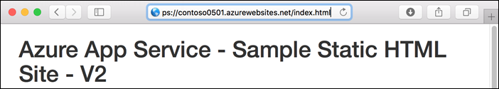

# Tutorial: Add Azure Content Delivery Network to an Azure App Service web app

This tutorial shows how to add [Azure Content Delivery Network](cdn-overview.md) to a [web app in Azure App Service](../app-service/overview.md). Web apps are services for hosting web applications, REST APIs, and mobile back ends.

Here's the home page of the sample static HTML site that you work with:


What you learn:

> [!div class="checklist"]
> - Create a content delivery network endpoint.
> - Refresh cached assets.
> - Use query strings to control cached versions.

## Prerequisites

To complete this tutorial:

- [Install Git](https://git-scm.com/)
- [Install the Azure CLI](/cli/azure/install-azure-cli)

[!INCLUDE [quickstarts-free-trial-note](../../includes/quickstarts-free-trial-note.md)]

## Create the web app

To create the web app that you work with, follow the [static HTML quickstart](../app-service/quickstart-html.md) through the **Browse to the app** step.

## Sign in to the Azure portal

Open a browser and sign in to the [Azure portal](https://portal.azure.com).

### Dynamic site acceleration optimization

If you want to optimize your content delivery network endpoint for dynamic site acceleration (DSA), you should use the [content delivery network portal](cdn-create-new-endpoint.md) to create your profile and endpoint. With [DSA optimization](cdn-dynamic-site-acceleration.md), the performance of web pages with dynamic content is measurably improved. For instructions about how to optimize a content delivery network endpoint for DSA from the content delivery network portal, see [content delivery network endpoint configuration to accelerate delivery of dynamic files](cdn-dynamic-site-acceleration.md#cdn-endpoint-configuration-to-accelerate-delivery-of-dynamic-files).
Otherwise, if you don't want to optimize your new endpoint, you can use the web app portal to create it by following the steps in the next section. For **Azure CDN from Edgio** profiles, you can't change the optimization of a content delivery network endpoint after it has been created.

<a name='create-a-cdn-profile-and-endpoint'></a>

## Create a content delivery network profile and endpoint

In the left navigation, select **App Services**, and then select the app that you created in the [static HTML quickstart](../app-service/quickstart-html.md).

:::image type="content" source="./media/cdn-add-to-web-app/portal-select-app-services.png" alt-text="Screenshot of select an App Service app in the portal.":::

In the **App Service** page, in the **Settings** section, select **Networking > Azure CDN**.

:::image type="content" source="./media/cdn-add-to-web-app/portal-select-cdn.png" alt-text="Screenshot of select Azure Content Delivery Network from networking setting of an App Service.":::

In the **Azure Content Delivery Network** page, provide the **New endpoint** settings as specified in the table.

:::image type="content" source="./media/cdn-add-to-web-app/portal-new-endpoint.png" alt-text="Screenshot of create Azure Content Delivery Network profile and endpoint in the portal.":::

| Setting | Suggested value | Description |
| ------- | --------------- | ----------- |
| **content delivery network profile** | myCDNProfile | A content delivery network profile is a collection of content delivery network endpoints with the same pricing tier. |
| **Pricing tier** | Microsoft content delivery network (classic) | The [pricing tier](cdn-features.md) specifies the provider and available features. |
| **content delivery network endpoint name** | Any name that is unique in the azureedge.net domain | You access your cached resources at the domain *&lt;endpointname&gt;*.azureedge.net.

Select **Create** to create a content delivery network profile.

Azure creates the profile and endpoint. The new endpoint appears in the **Endpoints** list, and when it's provisioned, the status is **Running**.

:::image type="content" source="./media/cdn-add-to-web-app/portal-new-endpoint-in-list.png" alt-text="Screenshot of new Azure Content Delivery Network endpoint in list.":::

<a name='test-the-cdn-endpoint'></a>

### Test the content delivery network endpoint

Because it takes time for the registration to propagate, the endpoint isn't immediately available for use:
   - For **Azure CDN Standard from Microsoft (classic)** profiles, propagation usually completes in 10 minutes.
   - For **Azure CDN Standard from Edgio** and **Azure CDN Premium from Edgio** profiles, propagation usually completes within 90 minutes.

The sample app has an *index.html* file and *css*, *img*, and *js* folders that contain other static assets. The content paths for all of these files are the same at the content delivery network endpoint. For example, both of the following URLs access the *bootstrap.css* file in the *css* folder:

`http://<appname>.azurewebsites.net/css/bootstrap.css`

`http://<endpointname>.azureedge.net/css/bootstrap.css`

Navigate a browser to the following URL:

`http://<endpointname>.azureedge.net/index.html`

:::image type="content" source="media/cdn-add-to-web-app/sample-app-home-page-cdn.png" alt-text="Screenshot of sample app home page served from content delivery network.":::


You see the same page that you ran earlier in an Azure web app. Azure Content Delivery Network has retrieved the origin web app's assets and is serving them from the content delivery network endpoint

To ensure that this page is cached in the content delivery network, refresh the page. Two requests for the same asset are sometimes required for the content delivery network to cache the requested content.

For more information about creating Azure Content Delivery Network profiles and endpoints, see [Getting started with Azure Content Delivery Network](cdn-create-new-endpoint.md).

<a name='purge-the-cdn'></a>

## Purge the content delivery network

The content delivery network periodically refreshes its resources from the origin web app based on the time to live (TTL) configuration. The default TTL is seven days.

At times you might need to refresh the content delivery network before the TTL expiration; for example, when you deploy updated content to the web app. To trigger a refresh, manually purge the content delivery network resources.

In this section of the tutorial, you deploy a change to the web app and purge the content delivery network to trigger the content delivery network to refresh its cache.

### Deploy a change to the web app

Open the *index.html* file and add *- V2* to the H1 heading, as shown in the following example:

`<h1>Azure App Service - Sample Static HTML Site - V2</h1>`

Commit your change and deploy it to the web app.

```bash
git commit -am "version 2"
git push azure main
```

Once deployment has completed, browse to the web app URL to see the change.

`http://<appname>.azurewebsites.net/index.html`



If you browse to the content delivery network endpoint URL for the home page, you don't see the changes because the cached version in the content delivery network hasn't expired yet.

`http://<endpointname>.azureedge.net/index.html`

:::image type="content" source="media/cdn-add-to-web-app/no-v2-in-cdn-title.png" alt-text="Screenshot of No V2 in title in content delivery network.":::

<a name='purge-the-cdn-in-the-portal'></a>

### Purge the content delivery network in the portal

To trigger the content delivery network to update its cached version, purge the content delivery network.

In the portal left navigation, select **Resource groups**, and then select the resource group that you created for your web app (myResourceGroup).

:::image type="content" source="./media/cdn-add-to-web-app/portal-select-group.png" alt-text="Screenshot of selecting resource group from left menu pane in the portal.":::

In the list of resources, select your content delivery network endpoint.

:::image type="content" source="./media/cdn-add-to-web-app/portal-select-endpoint.png" alt-text="Screenshot of Azure Content Delivery Network endpoint from resource group.":::

At the top of the **Endpoint** page, select **Purge**.

:::image type="content" source="./media/cdn-add-to-web-app/portal-select-purge.png" alt-text="Screenshot of purge button in an Azure Content Delivery Network profile.":::

Enter the content paths you want to purge. You can pass a complete file path to purge an individual file, or a path segment to purge and refresh all content in a folder. Because you changed *index.html*, ensure that is in one of the paths.

At the bottom of the page, select **Purge**.

:::image type="content" source="./media/cdn-add-to-web-app/app-service-web-purge-cdn.png" alt-text="Screenshot of purge page in an Azure Content Delivery Network profile.":::

<a name='verify-that-the-cdn-is-updated'></a>

### Verify that the content delivery network is updated

Wait until the purge request finishes processing, which is typically a couple of minutes. To see the current status, select the bell icon at the top of the page.

:::image type="content" source="./media/cdn-add-to-web-app/portal-purge-notification.png" alt-text="Screenshot of purge notification for an Azure Content Delivery Network profile.":::

When you browse to the content delivery network endpoint URL for *index.html*, you see the *V2* that you added to the title on the home page, which indicates that the content delivery network cache has been refreshed.

`http://<endpointname>.azureedge.net/index.html`

:::image type="content" source="media/cdn-add-to-web-app/v2-in-cdn-title.png" alt-text="Screenshot of V2 in title in content delivery network.":::

For more information, see [Purge an Azure Content Delivery Network endpoint](../cdn/cdn-purge-endpoint.md).

## Use query strings to version content

Azure Content Delivery Network offers the following caching behavior options:

- Ignore query strings
- Bypass caching for query strings
- Cache every unique URL

The first option is the default, which means there's only one cached version of an asset regardless of the query string in the URL.

In this section of the tutorial, you change the caching behavior to cache every unique URL.

### Change the cache behavior

In the Azure portal **CDN Endpoint** page, select **Cache**.

Select **Cache every unique URL** from the **Query string caching behavior** dropdown list.

Select **Save**.

:::image type="content" source="./media/cdn-add-to-web-app/portal-select-caching-behavior.png" alt-text="Screenshot of cache rules settings for an Azure Content Delivery Network profile.":::

### Verify that unique URLs are cached separately

In a browser, navigate to the home page at the content delivery network endpoint, and include a query string:

`http://<endpointname>.azureedge.net/index.html?q=1`

Azure Content Delivery Network returns the current web app content, which includes *V2* in the heading.

To ensure that this page is cached in the content delivery network, refresh the page.

Open *index.html*, change *V2* to *V3*, then deploy the change.

```bash
git commit -am "version 3"
git push azure main
```

In a browser, go to the content delivery network endpoint URL with a new query string, such as `q=2`. Azure Content Delivery Network gets the current *index.html* file and displays *V3*. However, if you navigate to the content delivery network endpoint with the `q=1` query string, you see *V2*.

`http://<endpointname>.azureedge.net/index.html?q=2`

:::image type="content" source="media/cdn-add-to-web-app/v3-in-cdn-title-qs2.png" alt-text="Screenshot of V3 in title in content delivery network, query string 2.":::

`http://<endpointname>.azureedge.net/index.html?q=1`

:::image type="content" source="media/cdn-add-to-web-app/v2-in-cdn-title-qs1.png" alt-text="Screenshot of V2 in title in content delivery network, query string 1.":::

This output shows that each query string is treated differently:

- q=1 was used before, so cached contents are returned (V2).
- q=2 is new, so the latest web app contents are retrieved and returned (V3).

For more information, see [Control Azure Content Delivery Network caching behavior with query strings](../cdn/cdn-query-string.md).

[!INCLUDE [cli-samples-clean-up](../../includes/cli-samples-clean-up.md)]

## Next steps

What you learned:

> [!div class="checklist"]
> - Create a content delivery network endpoint.
> - Refresh cached assets.
> - Use query strings to control cached versions.

Learn how to optimize content delivery network performance in the following articles:

> [!div class="nextstepaction"]
> [Tutorial: Optimize Azure Content Delivery Network for the type of content delivery](cdn-optimization-overview.md).
