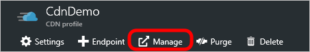
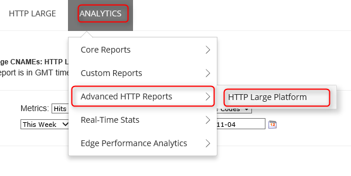

# Analyze usage statistics with Azure CDN advanced HTTP reports

## Overview

This document explains advanced HTTP reporting in Microsoft Azure CDN. These reports provide detailed information on CDN activity.

[!INCLUDE [cdn-premium-feature](../../includes/cdn-premium-feature.md)]

## Accessing advanced HTTP reports

1. From the CDN profile page, select the **Manage** button.

    

    The CDN management portal opens.
2. Hover over the **Analytics** tab, then hover over the **Advanced HTTP Reports** flyout. Select on **HTTP Large Platform**.

    

    Report options are displayed.

## Geography Reports (Map-Based)

There are five reports that take advantage of a map to indicate the regions from which your content is being requested. These reports are World Map, United States Map, Canada Map, Europe Map, and Asia Pacific Map.

Each map-based report ranks geographic entities (for example, countries/regions, a map is provided to help you visualize the locations from which your content is being requested. It's able to do so by color-coding each region according to the amount of demand experienced in that region. Lighter shaded regions indicate lower demand for your content, while darker regions indicate higher levels of demand for your content.

Detailed traffic and bandwidth information for each region is provided directly below the map. This information allows you to view the total number of hits, the percentage of hits, the total amount of data transferred (in gigabytes), and the percentage of data transferred for each region. View a description for each of these metrics. Finally, when you hover over a region (for example, country/region, state, or province), the name and the percentage of hits that occurred in the region gets displayed as a tooltip.

A brief description is provided for each type of map-based geography report.

| Report Name | Description |
| --- | --- |
| World Map |This report allows you to view the worldwide demand for your CDN content. Each country/region is color-coded on the world map to indicate the percentage of hits that originated from that region. |
| United States Map |This report allows you to view the demand for your CDN content in the United States. Each state is color-coded on this map to indicate the percentage of hits that originated from that region. |
| Canada Map |This report allows you to view the demand for your CDN content in Canada. Each province is color-coded on this map to indicate the percentage of hits that originated from that region. |
| Europe Map |This report allows you to view the demand for your CDN content in Europe. Each country/region is color-coded on this map to indicate the percentage of hits that originated from that region. |
| Asia Pacific Map |This report allows you to view the demand for your CDN content in Asia. Each country/region is color-coded on this map to indicate the percentage of hits that originated from that region. |

## Geography Reports (Bar Charts)

There are two more reports that provide statistical information according to geography, which is Top Cities and Top Countries. These reports rank cities and countries/regions, respectively, according to the number of hits that originated from those countries/regions. A bar chart indicates the top 10 cities or countries/regions that requested content over a specific platform. This bar chart allows you to quickly assess the regions that generate the highest number of requests for your content.

The left-hand side of the graph (y-axis) indicates how many hits occurred in the specified region. Directly below the graph (x-axis), you find a label for each of the top 10 regions.

### Using the bar charts

- If you hover over a bar, the name and the total number of hits that occurred in the region gets displayed as a tooltip.
- The tooltip for the Top Cities report identifies a city by its name, state/province, and country/region abbreviation.
- If the city or region (for example, state/province) from which a request originated couldn't be determined, then it indicates that they're unknown. If the country/region is unknown, then two question marks (for example, ??) gets displayed.
- A report might include metrics for "Europe" or the "Asia/Pacific Region." Those items aren't meant to provide statistical information on all IP addresses in those regions. Rather, they only apply to requests that originate from IP addresses that are spread out over Europe or Asia/Pacific instead of to a specific city or country/region.

The data that was used to generate the bar chart can be viewed below it. There you find the total number of hits, the percentage of hits, the amount of data transferred (in gigabytes), and the percentage of data transferred for the top 250 regions. View a description for each of these metrics.

A brief description is provided for both types of reports in the following table.

| Report Name | Description |
| --- | --- |
| Top Cities |This report ranks cities according to the number of hits that originated from that region. |
| Top Countries |This report ranks countries/regions according to the number of hits that originated from that country/region. |

## Daily Summary

The Daily Summary report allows you to view the total number of hits and data transferred over a particular platform on a daily basis. This information can be used to quickly discern CDN activity patterns. For example, this report can help you detect which days experienced higher or lower than expected traffic.

Once you generate this report, a bar chart provides a visual indication as to the amount of platform-specific demand experienced on a daily basis over the time period covered by the report. It does so by displaying a bar for each day in the report. For example, selecting the time period called "Last Week" generates a bar chart with seven bars. Each bar indicates the total number of hits experienced on that day.

The left-hand side of the graph (y-axis) indicates how many hits occurred on the specified date. Directly below the graph (x-axis), you find a label that indicates the date (Format: YYYY-MM-DD) for each day included in the report.

> [!TIP]
> If you hover over a bar, the total number of hits that occurred on that date will be displayed as a tooltip.
>
>

The data that was used to generate the bar chart can be viewed below it. There you find the total number of hits and the amount of data transferred (in gigabytes) for each day covered by the report.

## By Hour

The By Hour report allows you to view the total number of hits and data transferred over a particular platform on an hourly basis. This information can be used to quickly discern CDN activity patterns. For example, this report can help you detect the time periods during the day that experience higher or lower than expected traffic.

In this report, you see a bar chart provides a visual indication as to the amount of platform-specific demand experienced on an hourly basis over the time period covered by the report. It does so by displaying a bar for each hour covered by the report. For example, selecting a 24 hour time period generates a bar chart with 24 bars. Each bar indicates the total number of hits experienced during that hour.

The left-hand side of the graph (y-axis) indicates how many hits occurred on the specified hour. Directly below the graph (x-axis), you find a label that indicates the date/time (Format: YYYY-MM-DD hh:mm) for each hour included in the report. Time is reported using 24 hour format and it's specified using the UTC/GMT time zone.

> [!TIP]
> If you hover over a bar, the total number of hits that occurred during that hour will be displayed as a tooltip.
>
>

The data that was used to generate the bar chart can be viewed below it. There you find the total number of hits and the amount of data transferred (in gigabytes) for each hour covered by the report.

## By File

The By File report allows you to view the amount of demand and the traffic incurred over a particular platform for the most requested assets. When you generate this report, a bar chart is generated on the top 10 most requested assets over the specified time period.

> [!NOTE]
> For the purposes of this report, edge CNAME URLs are converted to their equivalent CDN URLs. This allows an accurate tally for the total number of hits associated with an asset regardless of the CDN or edge CNAME URL used to request it.
>
>

The left-hand side of the graph (y-axis) indicates the number of requests for each asset over the specified time period. Directly below the graph (x-axis), you find a label that indicates the file name for each of the top 10 requested assets.

The data that was used to generate the bar chart can be viewed below it. There you find the following information for each of the top 250 requested assets: relative path, the total number of hits, the percentage of hits, the amount of data transferred (in gigabytes), and the percentage of data transferred.

## By File Detail

The By File Detail report allows you to view the amount of demand and the traffic incurred over a particular platform for a specific asset. At the top of this report, you find the File Details For option. This option provides a list of your most requested assets on the selected platform. In order to generate a By File Detail report, you need to select the desired asset from the File Details For option. After which, a bar chart will indicate the amount of daily demand that it generated over the specified time period.

The left-hand side of the graph (y-axis) indicates the total number of requests that an asset experienced on a particular day. Directly below the graph (x-axis), you find a label that indicates the date (Format: YYYY-MM-DD) for which CDN demand for the asset was reported.

The data that was used to generate the bar chart can be viewed below it. There you find the total number of hits and the amount of data transferred (in gigabytes) for each day covered by the report.

## By File Type

The By File Type report allows you to view the amount of demand and the traffic incurred by file type. With this report, a donut chart indicates the percentage of hits generated by the top 10 file types.

> [!TIP]
> If you hover over a slice in the donut chart, the Internet media type of that file type will be displayed as a tooltip.
>
>

The data that was used to generate the donut chart can be viewed below it. There you find the file name extension/Internet media type, the total number of hits, the percentage of hits, the amount of data transferred (in gigabytes), and the percentage of data transferred for each of the top 250 file types.

## By Directory

The By Directory report allows you to view the amount of demand and the traffic incurred over a particular platform for content from a specific directory. Upon generating this type of report, a bar chart indicates the total number of hits generated by content in the top 10 directories.

### Using the bar chart

- Hover over a bar to view the relative path to the corresponding directory.
- Content stored in a subfolder of a directory doesn't count when calculating demand by directory. This calculation relies solely on the number of requests generated for content stored in the actual directory.
- For the purposes of this report, edge CNAME URLs are converted to their equivalent CDN URLs. This allows an accurate tally for all statistics associated with an asset regardless of the CDN or edge CNAME URL used to request it.

The left-hand side of the graph (y-axis) indicates the total number of requests for the content stored in your top 10 directories. Each bar on the chart represents a directory. Use the color-coding scheme to match up a bar to a directory listed in the Top 250 Full Directories section.

The data that was used to generate the bar chart can be viewed below it. There you find the following information for each of the top 250 directories: relative path, the total number of hits, the percentage of hits, the amount of data transferred (in gigabytes), and the percentage of data transferred.

## By Browser

The By Browser report allows you to view which browsers were used to request content. When you generate this report, a pie chart indicates the percentage of requests handled by the top 10 browsers.

### Using the pie chart

- Hover over a slice in the pie chart to view a browser's name and version.
- For the purposes of this report, each unique browser/version combination is considered a different browser.
- The slice called "Other" indicates the percentage of requests handled by all other browsers and versions.

The data that was used to generate the pie chart can be viewed below it. There you find the browser type/version number, the total number of hits and the percentage of hits for each of the top 250 browsers.

## By Referrer

The By Referrer report allows you to view the top referrers to content on the selected platform. A referrer indicates the hostname from which a request was generated. Once you generate this report, a bar chart indicates the amount of demand (for example, hits) generated by the top 10 referrers.

The left-hand side of the graph (y-axis) indicates the total number of requests that an asset experienced for each referrer. Each bar on the chart represents a referrer. Use the color-coding scheme to match up a bar to a referrer listed in the Top 250 Referrer section.

The data that was used to generate the bar chart can be viewed below it. There you find the URL, the total number of hits, and the percentage of hits generated from each of the top 250 referrers.

## By Download

The By Download report allows you to analyze download patterns for your most requested content. The top of the report contains a bar chart that compares attempted downloads with completed downloads for the top 10 requested assets. Each bar is color-coded according to whether it's an attempted download (blue) or a completed download (green).

> [!NOTE]
> For the purposes of this report, edge CNAME URLs are converted to their equivalent CDN URLs. This allows an accurate tally for all statistics associated with an asset regardless of the CDN or edge CNAME URL used to request it.
>
>

The left-hand side of the graph (y-axis) indicates the file name for each of the top 10 requested assets. Directly below the graph (x-axis), you find labels that indicate the total number of attempted/completed downloads.

Directly below the bar chart, the following information is listed for the top 250 requested assets: relative path (including file name), the number of times that it gets downloaded to completion, the number of times that it gets requested, and the percentage of requests that resulted in a complete download.

> [!TIP]
> Our content delivery network is not informed by an HTTP client (that is, browser) when an asset has been completely downloaded. As a result, we have to calculate whether an asset has been completely downloaded according to status codes and byte-range requests. The first thing we look for when making this calculation is whether a request results in a 200 OK status code. If so, then we look at byte-range requests to ensure that they cover the entire asset. Finally, we compare the amount of data transferred to the size of the requested asset. If the data transferred is equal to or greater than the file size and the byte-range requests are appropriate for that asset, then the hit will be counted as a complete download.
>
> Due to the interpretive nature of this report, you should keep in mind the following points that may alter the consistency and accuracy of this report.
>
> - Traffic patterns cannot be accurately predicted when user-agents behave differently. This might produce completed download results that are greater than 100%.
> - Assets that take advantage of HTTP Progressive Download might not be accurately represented by this report. This is due to users seeking to different positions in a video.
>
>

## By 404 Errors

The By 404 Errors report allows you to identify the type of content that generates the most number of 404 Not Found status codes. The top of the report contains a bar chart for the top 10 assets for which a 404 Not Found status code was returned. This bar chart compares the total number of requests with requests that resulted in a 404 Not Found status code for those assets. Each bar is color-coded. A yellow bar is used to indicate that the request resulted in a 404 Not Found status code. A red bar is used to indicate the total number of requests for the asset.

> [!NOTE]
> For the purposes of this report, note the following:
>
> - A hit represents any request for an asset regardless of status code.
> - Edge CNAME URLs are converted to their equivalent content delivery network URLs. This allows an accurate tally for all statistics associated with an asset regardless of the content delivery network or edge CNAME URL used to request it.
>
>

The left-hand side of the graph (y-axis) indicates the file name for each of the top 10 requested assets that resulted in a 404 Not Found status code. Directly below the graph (x-axis), you find labels that indicate the total number of requests and the number of requests that resulted in a 404 Not Found status code.

Directly below the bar chart, the following information is listed for the top 250 requested assets: relative path (including file name), the number of requests that resulted in a 404 Not Found status code, the total number of times that the asset gets requested, and the percentage of requests that resulted in a 404 Not Found status code.

## See also

- [Azure Content Delivery Network Overview](cdn-overview.md)
- [Real-time stats in Microsoft Azure Content Delivery Network](cdn-real-time-stats.md)
- [Overriding default HTTP behavior using the rules engine](./cdn-verizon-premium-rules-engine.md)
- [Analyze Edge Performance](cdn-edge-performance.md)
