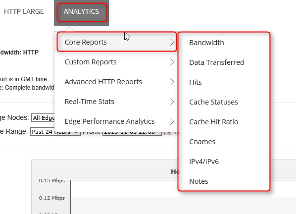
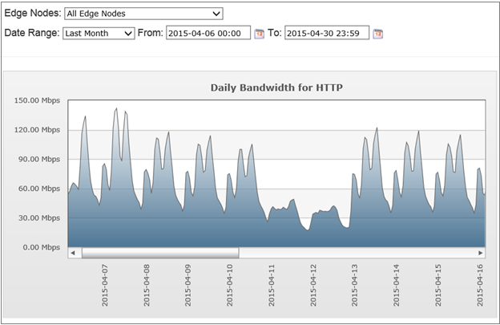
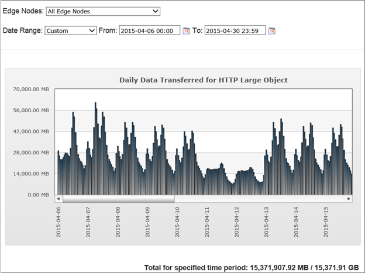
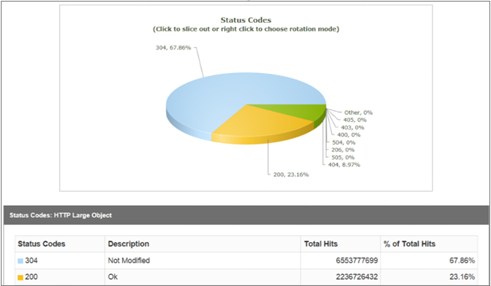
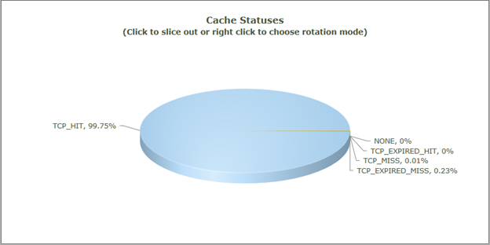
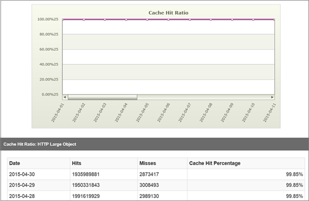
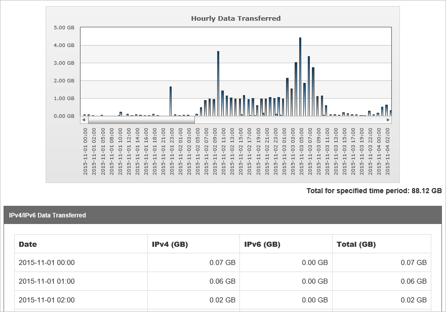

# Core Reports from Edgio

[!INCLUDE [cdn-verizon-only](../../includes/cdn-verizon-only.md)]

By using Edgio Core Reports via the Manage portal for Edgio profiles, you can view usage patterns for your CDN with the following reports:

* Bandwidth
* Data Transferred
* Hits
* Cache Statuses
* Cache Hit Ratio
* IPV4/IPV6 Data Transferred

## Accessing Edgio Core Reports
1. From the CDN profile blade, click the **Manage** button.
   
    
   
    The CDN management portal opens.
2. Hover over the **Analytics** tab, then hover over the **Core Reports** flyout. Click on a report in the menu.
   
    

3. For each report, select a date range from the **Date Range** list. You can either select a pre-defined date range, such as **Today** or **This Week**, or you can select **Custom** and manually enter a date range by clicking the calendar icons. 

4. After you have selected a date range, click **Go** to generate the report. 

4. If you want to export the data in Excel format, click the Excel icon above the **Go** button.

## Bandwidth
The bandwidth report consists of a graph and data table that indicates the CDN bandwidth usage for HTTP and HTTPS over a particular time period, in Mbps. You can view the bandwidth usage across all POPs or for a particular POP. This report allows you to view the traffic spikes and distribution for POPs.

From the **Edge Nodes** list, select **All Edge Nodes** to see traffic from all nodes or select a specific region.

The report is updated every five minutes.

## Data transferred
This report consists of a graph and data table that indicates the CDN traffic usage for HTTP and HTTPS over a particular time period, in GB. You can view the traffic usage across all POPs or for a particular POP. This report allows you to view the traffic spikes and distribution across POPs.

From the **Edge Nodes** list, select **All Edge Nodes** to see traffic from all nodes or select a specific region.

The report is updated every five minutes.

## Hits (status codes)
This report describes the distribution of request status codes for your content. Every request for content generates an HTTP status code. The status code describes how edge POPs handled the request. For example, a 2xx status code indicates that the request was successfully served to a client, while a 4xx status code indicates that an error occurred. For more information about HTTP status codes, see [List of HTTP status codes](https://en.wikipedia.org/wiki/List_of_HTTP_status_codes).

## Cache statuses
This report describes the distribution of cache hits and cache misses for client requests. Because the fastest performance results from cache hits, you can optimize data delivery speeds by minimizing cache misses and expired cache hits. 

To reduce cache misses, configure your origin server to minimize the use of the following: 
 * `no-cache` response headers
 * Query-string caching, unless strictly needed  
 * Non-cacheable response codes

To reduce expired cache hits, set an asset's `max-age` to a long period to minimize the number of requests to the origin server.

### Main cache statuses include:
* TCP_HIT: Served from edge server. The object was in the cache and has not exceeded its max-age.
* TCP_MISS: Served from origin server. The object was not in the cache and the response was back to origin.
* TCP_EXPIRED _MISS: Served from origin server after revalidation with origin. The object was in the cache, but had exceeded its max-age. A revalidation with origin resulted in the cache object being replaced by a new response from origin.
* TCP_EXPIRED _HIT: Served from Edge after revalidation with origin. The object was in cache but had exceeded its max-age. A revalidation with the origin server resulted in the cache object being unmodified.

### Full list of cache statuses
* TCP_HIT - This status is reported when a request is served directly from the POP to the client. An asset is immediately served from a POP when it is cached on the POP closest to the client and has a valid time-to-live (TTL). TTL is determined by the following response headers:
  
  * Cache-Control: s-maxage
  * Cache-Control: max-age
  * Expires
* TCP_MISS: This status indicates that a cached version of the requested asset was not found on the POP closest to the client. The asset is requested from either an origin server or an origin shield server. If the origin server or the origin shield server returns an asset, it is served to the client and cached on both the client and the edge server. Otherwise, a non-200 status code (for example, 403 Forbidden or 404 Not Found) is returned.
* TCP_EXPIRED_HIT: This status is reported when a request that targets an asset with an expired TTL was served directly from the POP to the client. For example, when the asset's max-age has expired. 
  
   An expired request typically results in a revalidation request to the origin server. For a TCP_EXPIRED_HIT status to occur,the origin server must indicate that a newer version of the asset does not exist. This situation typically results in an update of the asset's Cache-Control and Expires headers.
* TCP_EXPIRED_MISS: This status is reported when a newer version of an expired cached asset is served from the POP to the client. This status occurs when the TTL for a cached asset is expired (for example, expired max-age) and the origin server returns a newer version of that asset. This new version of the asset is served to the client instead of the cached version. Additionally, it is cached on the edge server and the client.
* CONFIG_NOCACHE: This status indicates that a customer-specific configuration the edge POP prevented the asset from being cached.
* NONE - This status indicates that a cache content freshness check was not performed.
* TCP_CLIENT_REFRESH_MISS: This status is reported when an HTTP client, such as a browser, forces an edge POP to retrieve a new version of a stale asset from the origin server. By default, the servers prevent an HTTP client from forcing the edge servers to retrieve a new version of the asset from the origin server.
* TCP_PARTIAL_HIT: This status is reported when a byte range request results in a hit for a partially cached asset. The requested byte range is immediately served from the POP to the client.
* UNCACHEABLE: This status is reported when an asset's `Cache-Control` and `Expires` headers indicate that it should not be cached on a POP or by the HTTP client. These types of requests are served from the origin server.

## Cache Hit Ratio
This report indicates the percentage of cached requests that were served directly from cache.

The report provides the following details:

* The requested content was cached on the POP closest to the requester.
* The request was served directly from the edge of our network.
* The request did not require revalidation with the origin server.

The report doesn't include:

* Requests that are denied due to country/region filtering options.
* Requests for assets whose headers indicate that they should not be cached. For example, `Cache-Control: private`, `Cache-Control: no-cache`, or `Pragma: no-cache` headers prevent an asset from being cached.
* Byte range requests for partially cached content.

The formula is: (TCP_ HIT/(TCP_ HIT+TCP_MISS))*100

## IPV4/IPV6 Data transferred
This report shows the traffic usage distribution in IPV4 vs IPV6.

## Considerations
Reports can only be generated within the last 18 months.
