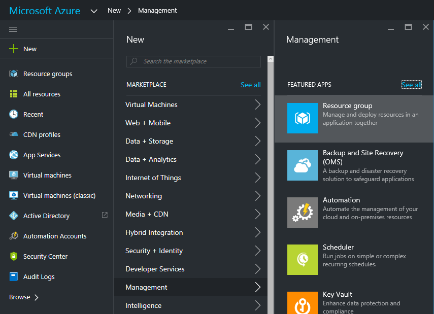
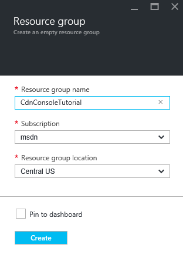
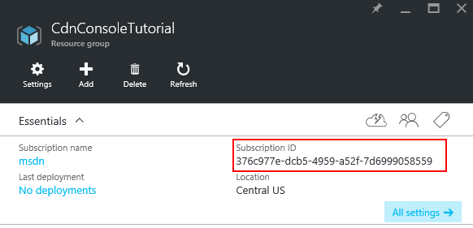
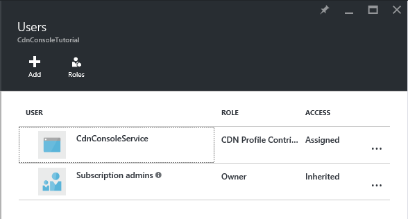
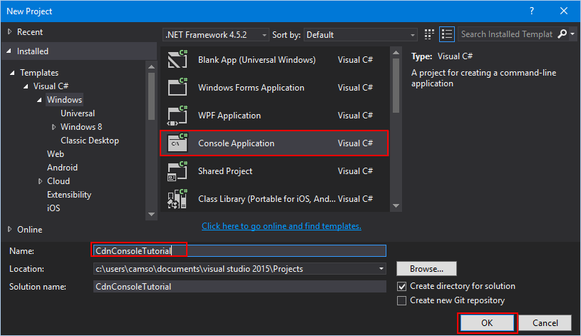
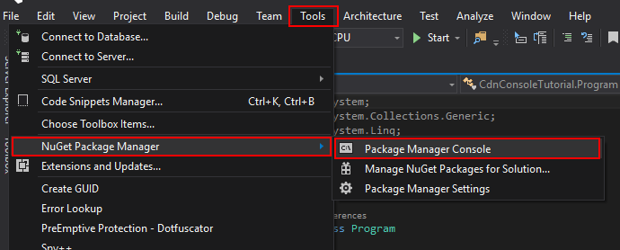
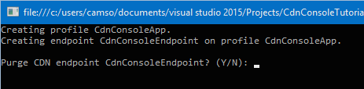
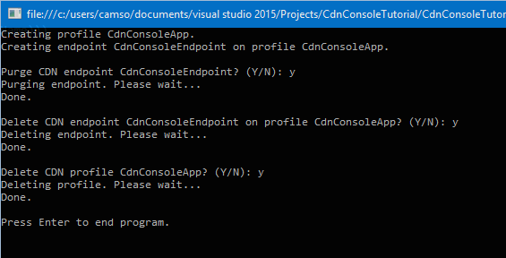

<properties
	pageTitle="Get started with the Azure CDN Library for .NET"
	description="Learn how to write .NET applications to manage Azure CDN using Visual Studio."
	services="cdn"
	documentationCenter=".net"
	authors="camsoper"
	manager="erikre"
	editor=""/>

<tags
	ms.service="cdn"
	ms.workload="tbd"
	ms.tgt_pltfrm="na"
	ms.devlang="na"
	ms.topic="article"
	ms.date="06/10/2016"
	ms.author="casoper"/>

# Get started with the Azure CDN Library for .NET

You can use the [Azure CDN Library for .NET](https://msdn.microsoft.com/library/mt657769.aspx) to automate creation and management of CDN profiles and endpoints.  This tutorial will walk through the creation of a simple .NET console application that demonstrates several of the available operations.  This tutorial is not intended to describe all aspects of the Azure CDN Library for .NET in detail.

You will need Visual Studio 2015 to complete this tutorial.  [Visual Studio Community 2015](https://www.visualstudio.com/products/visual-studio-community-vs.aspx) is freely available for download.

A completed example of this tutorial can be found [here](https://code.msdn.microsoft.com/Azure-CDN-Management-1f2fba2c).

## Create a resource group and service principal

The first thing we're going to do is create a resource group to contain the CDN profile we create in this tutorial.  This resource group will also be the security boundary for the service principal we are going to create next.

### Creating the resource group

1. Log into the [Azure Portal](https://portal.azure.com).

2. Click the **New** button in the upper left, and then **Management**, and **Resource Group**.
	
	

3. Call your resource group *CdnConsoleTutorial*.  Select your subscription and choose a location near you.  If you wish, you may click the **Pin to dashboard** checkbox to pin the resource group to the dashboard in the portal.  This will make it easier to find later.  After you've made your selections, click **Create**.

	

4. After the resource group is created, if you didn't pin it to your dashboard, you can find it by clicking **Browse**, then **Resource Groups**.  Click the resource group to open it.  Make a note of your **Subscription ID**.  We'll need it later.

	 

### Creating the service principal

After the resource group is created, we need to create a service principal.  This is the identity that we will give permission to carry out our CDN tasks within Azure.

Creating a service principal consists of several steps, including creating an Azure Active Directory application.  To do this, we're going to [follow this tutorial](../resource-group-create-service-principal-portal.md).

> [AZURE.IMPORTANT] Be sure to follow all the steps in the linked tutorial.  It is *extremely important* that you complete it exactly as described.  Make sure to note your **tenant ID**, **client ID**, and **client authentication key**, as we will need these later.
> 	
> When you get to the step named [Configure multi-tenant application](../resource-group-create-service-principal-portal.md#configure-multi-tenant-application), select **No**.
> 
> When you get to the step [Assign application to role](../resource-group-create-service-principal-portal.md#assign-application-to-role), use the resource group we created earlier,  *CdnConsoleTutorial*, but instead of the **Reader** role, assign the **CDN Profile Contributor** role instead.  After you assign the application the **CDN Profile Contributor** role on your resource group, return to this tutorial. 

Once you've created your service principal and assigned the **CDN Profile Contributor** role, the **Users** blade for your resource group should look similar to this.



## Create your project and add Nuget packages

Now that we've created a resource group for our CDN profiles and given our service principal permission to manage CDN profiles and endpoints within that group, we can start creating our application.

From within Visual Studio 2015, click **File**, **New**, **Project...** to open the new project dialog.  Expand **Visual C#**, then select **Windows** in the pane on the left.  Click **Console Application** in the center pane.  Name your project, then click **OK**.  



Our project is going to use some Azure libraries contained in Nuget packages.  Let's add those to the project.

1. Click the **Tools** menu, **Nuget Package Manager**, then **Package Manager Console**.

	

2. In the Package Manager Console, execute the following command to install the **Active Directory Authentication Library (ADAL)**:

	`Install-Package Microsoft.IdentityModel.Clients.ActiveDirectory`

3. Execute the following to install the **Azure CDN Management Library**:

	`Install-Package Microsoft.Azure.Management.Cdn`

## Directives, constants, main method, and helper methods

Let's get the basic structure of our program written.

1. Back in the Program.cs tab, replace the `using` directives at the top with the following:

	```
	using System;
	using System.Collections.Generic;
	using Microsoft.Azure.Management.Cdn;
	using Microsoft.Azure.Management.Cdn.Models;
	using Microsoft.Azure.Management.Resources;
	using Microsoft.Azure.Management.Resources.Models;
	using Microsoft.IdentityModel.Clients.ActiveDirectory;
	using Microsoft.Rest;
	```

2. We need to define some constants our methods will use.  In the `Program` class, but before the `Main` method, add the following.  Be sure to replace the placeholders, including the **&lt;angle brackets&gt;**, with your own values as needed.

	```
	//Tenant app constants
	private const string clientID = "<YOUR CLIENT ID>";
	private const string clientSecret = "<YOUR CLIENT AUTHENTICATION KEY>";
	private const string authority = "https://login.microsoftonline.com/<YOUR TENANT ID>";

	//Application constants
	private const string subscriptionId = "<YOUR SUBSCRIPTION ID>";
	private const string profileName = "CdnConsoleApp";
	private const string endpointName = "<A UNIQUE NAME FOR YOUR CDN ENDPOINT>";
	private const string resourceGroupName = "CdnConsoleTutorial";
	private const string resourceLocation = "<YOUR PREFERRED AZURE LOCATION, SUCH AS Central US>";
	```

3. Also at the class level, define these two variables.  We'll use these later to determine if our profile and endpoint already exist.

	```
	static bool profileAlreadyExists = false;
    static bool endpointAlreadyExists = false;
	```

4.  Replace the `Main` method as follows:

	```
	static void Main(string[] args)
	{
		//Get a token
		AuthenticationResult authResult = GetAccessToken();

		// Create CDN client
		CdnManagementClient cdn = new CdnManagementClient(new TokenCredentials(authResult.AccessToken))
			{ SubscriptionId = subscriptionId };

		ListProfilesAndEndpoints(cdn);

		// Create CDN Profile
		CreateCdnProfile(cdn);

		// Create CDN Endpoint
		CreateCdnEndpoint(cdn);
		
		Console.WriteLine();

		// Purge CDN Endpoint
		PromptPurgeCdnEndpoint(cdn);

		// Delete CDN Endpoint
		PromptDeleteCdnEndpoint(cdn);

		// Delete CDN Profile
		PromptDeleteCdnProfile(cdn);

		Console.WriteLine("Press Enter to end program.");
		Console.ReadLine();
	}
	```

5. Some of our other methods are going to prompt the user with "Yes/No" questions.  Add the following method to make that a little easier:

	```
	private static bool PromptUser(string Question)
	{
		Console.Write(Question + " (Y/N): ");
		var response = Console.ReadKey();
		Console.WriteLine();
		if (response.Key == ConsoleKey.Y)
		{
			return true;
		}
		else if (response.Key == ConsoleKey.N)
		{
			return false;
		}
		else
		{
			// They're not pressing Y or N.  Let's ask them again.
			return PromptUser(Question);
		}
	}
	```

Now that the basic structure of our program is written, we should create the methods called by the `Main` method.

## Authentication

Before we can use the Azure CDN Management Library, we need to authenticate our service principal and obtain an authentication token.  This method uses ADAL to retrieve the token.

```
private static AuthenticationResult GetAccessToken()
{
	AuthenticationContext authContext = new AuthenticationContext(authority); 
	ClientCredential credential = new ClientCredential(clientID, clientSecret);
	AuthenticationResult authResult = 
		authContext.AcquireTokenAsync("https://management.core.windows.net/", credential).Result;

	return authResult;
}
``` 

## List CDN profiles and endpoints

Now we're ready to perform CDN operations.  The first thing our method does is list all the profiles and endpoints in our resource group, and if it finds a match for the profile and endpoint names specified in our constants, makes a note of that for later so we don't try to create duplicates.

```
private static void ListProfilesAndEndpoints(CdnManagementClient cdn)
{
	// List all the CDN profiles in this resource group
	var profileList = cdn.Profiles.ListByResourceGroup(resourceGroupName);
	foreach (Profile p in profileList)
	{
		Console.WriteLine("CDN profile {0}", p.Name);
		if (p.Name.Equals(profileName, StringComparison.OrdinalIgnoreCase))
		{
			// Hey, that's the name of the CDN profile we want to create!
			profileAlreadyExists = true;
		}

		//List all the CDN endpoints on this CDN profile
		Console.WriteLine("Endpoints:");
		var endpointList = cdn.Endpoints.ListByProfile(p.Name, resourceGroupName);
		foreach (Endpoint e in endpointList)
		{
			Console.WriteLine("-{0} ({1})", e.Name, e.HostName);
			if (e.Name.Equals(endpointName, StringComparison.OrdinalIgnoreCase))
			{
				// The unique endpoint name already exists.
				endpointAlreadyExists = true;
			}
		}
		Console.WriteLine();
	}
}
```

## Create CDN profiles and endpoints

Next, we'll create a profile.

```
private static void CreateCdnProfile(CdnManagementClient cdn)
{
	if (profileAlreadyExists)
	{
		Console.WriteLine("Profile {0} already exists.", profileName);
	}
	else
	{
		Console.WriteLine("Creating profile {0}.", profileName);
		ProfileCreateParameters profileParms =
			new ProfileCreateParameters() { Location = resourceLocation, Sku = new Sku(SkuName.StandardVerizon) };
		cdn.Profiles.Create(profileName, profileParms, resourceGroupName);
	}
}
```

Once the profile is created, we'll create an endpoint.

```
private static void CreateCdnEndpoint(CdnManagementClient cdn)
{
	if (endpointAlreadyExists)
	{
		Console.WriteLine("Profile {0} already exists.", profileName);
	}
	else
	{
		Console.WriteLine("Creating endpoint {0} on profile {1}.", endpointName, profileName);
		EndpointCreateParameters endpointParms =
			new EndpointCreateParameters()
			{
				Origins = new List<DeepCreatedOrigin>() { new DeepCreatedOrigin("Contoso", "www.contoso.com") },
				IsHttpAllowed = true,
				IsHttpsAllowed = true,
				Location = resourceLocation
			};
		cdn.Endpoints.Create(endpointName, endpointParms, profileName, resourceGroupName);
	}
}
```

>[AZURE.NOTE] The example above assigns the endpoint an origin named *Contoso* with a hostname `www.contoso.com`.  You should change this to point to your own origin's hostname.

## Purge an endpoint

Assuming the endpoint has been created, one common task that we might want to perform in our program is purging the content in our endpoint.

```
private static void PromptPurgeCdnEndpoint(CdnManagementClient cdn)
{
	if (PromptUser(String.Format("Purge CDN endpoint {0}?", endpointName)))
	{
		Console.WriteLine("Purging endpoint. Please wait...");
		cdn.Endpoints.PurgeContent(endpointName, profileName, resourceGroupName, new List<string>() { "/*" });
		Console.WriteLine("Done.");
		Console.WriteLine();
	}
}
```

>[AZURE.NOTE] In the example above, the string `/*`, denotes that I want to purge everything in the root of the endpoint path.  This is equivalent to checking **Purge All** in the Azure Portal's "purge" dialog. In the `CreateCdnProfile` method, I created our profile as an **Azure CDN from Verizon** profile using the code `Sku = new Sku(SkuName.StandardVerizon)`, so this will be successful.  However, **Azure CDN from Akamai** profiles do not support **Purge All**, so if I was using an Akamai profile for this tutorial, I would need to include specific paths to purge.

## Delete CDN profiles and endpoints

The last methods we will include delete our endpoint and profile.

```
private static void PromptDeleteCdnEndpoint(CdnManagementClient cdn)
{
	if(PromptUser(String.Format("Delete CDN endpoint {0} on profile {1}?", endpointName, profileName)))
	{
		Console.WriteLine("Deleting endpoint. Please wait...");
		cdn.Endpoints.DeleteIfExists(endpointName, profileName, resourceGroupName);
		Console.WriteLine("Done.");
		Console.WriteLine();
	}
}

private static void PromptDeleteCdnProfile(CdnManagementClient cdn)
{
	if(PromptUser(String.Format("Delete CDN profile {0}?", profileName)))
	{
		Console.WriteLine("Deleting profile. Please wait...");
		cdn.Profiles.DeleteIfExists(profileName, resourceGroupName);
		Console.WriteLine("Done.");
		Console.WriteLine();
	}
}
```

## Running the program

We can now compile and run the program by clicking the **Start** button in Visual Studio.



When the program reaches the above prompt, you should be able to return to your resource group in the Azure Portal and see that the profile has been created.


We can then confirm the prompts to run the rest of the program.




## Additional information

The completed project from this tutorial can be found [here](https://code.msdn.microsoft.com/Azure-CDN-Management-1f2fba2c).

Addition documentation on the Azure CDN Management Library for .NET is available on [MSDN](https://msdn.microsoft.com/library/mt657769.aspx).


