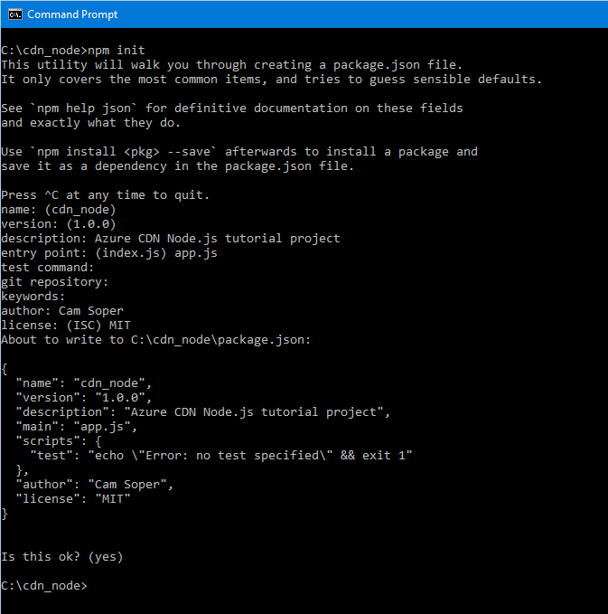

<properties
	pageTitle="Get started with the Azure CDN SDK for Node.js | Microsoft Azure"
	description="Learn how to write Node.js applications to manage Azure CDN."
	services="cdn"
	documentationCenter=".net"
	authors="camsoper"
	manager="erikre"
	editor=""/>

<tags
	ms.service="cdn"
	ms.workload="tbd"
	ms.tgt_pltfrm="na"
	ms.devlang="na"
	ms.topic="article"
	ms.date="06/16/2016"
	ms.author="casoper"/>

# Get started with the Azure CDN SDK for Node.js

You can use the [Azure CDN SDK for Node.js](https://www.npmjs.com/package/azure-arm-cdn) to automate creation and management of CDN profiles and endpoints.  This tutorial will walk through the creation of a simple Node.js console application that demonstrates several of the available operations.  This tutorial is not intended to describe all aspects of the Azure CDN SDK for Node.js in detail.

To complete this tutorial, you should already have [Node.js](http://www.nodejs.org) **4.x.x** or higher installed and configured.  You can use any text editor you want to create your Node.js application.  To write this tutorial, I used [Visual Studio Code](https://code.visualstudio.com).  

A completed example of this tutorial can be found [here]().

[AZURE.INCLUDE [cdn-app-dev-prep](../../includes/cdn-app-dev-prep.md)]

## Create your project and add NPM dependencies

Now that we've created a resource group for our CDN profiles and given our Azure AD application permission to manage CDN profiles and endpoints within that group, we can start creating our application.

Create a folder to store your application.  From a console with the Node.js tools in your current path, set your current location to this new folder and initialize your project by executing:
```
npm init
```
You will then be presented a series of questions to initialize your project.  For **entry point**, this tutorial will use *app.js*.  You can see my other choices in the example below.



Our project is now initialized with a *packages.json* file.  Our project is going to use some Azure libraries contained in NPM packages.  Let's add those to the project as dependencies.
``` 
npm install --save ms-rest-azure
npm install --save azure-arm-cdn
```

Assuming the packages installed with no errors, if we view the *package.json* file, it should look similar to this (version numbers may differ):

```
{
  "name": "cdn_node",
  "version": "1.0.0",
  "description": "Azure CDN Node.js tutorial project",
  "main": "app.js",
  "scripts": {
    "test": "echo \"Error: no test specified\" && exit 1"
  },
  "author": "Cam Soper",
  "license": "MIT",
  "dependencies": {
    "azure-arm-cdn": "^0.2.1",
    "ms-rest-azure": "^1.14.4"
  }
}
```

Finally, using your text editor, create a blank text file and save it in the root of our project folder as *app.js*.  We're now ready to begin writing code.

## 

## Running the program

We can now compile and run the program by clicking the **Start** button in Visual Studio.


When the program reaches the above prompt, you should be able to return to your resource group in the Azure Portal and see that the profile has been created.


We can then confirm the prompts to run the rest of the program.


## Next Steps

To see the completed project from this walkthrough, [download the sample](https://code.msdn.microsoft.com/Azure-CDN-Management-1f2fba2c).

To find additional documentation on the Azure CDN Management Library for .NET, view the [reference on MSDN](https://msdn.microsoft.com/library/mt657769.aspx).


