# Azure diagnostic logs

With Azure diagnostic logs, you can view core analytics and save them into one or more destinations including:

 - Azure Storage account
 - Azure Event Hubs
 - [Log Analytics workspace](https://docs.microsoft.com/azure/log-analytics/log-analytics-get-started)
 
This feature is available on CDN endpoints for all pricing tiers. 

Azure diagnostics logs allow you to export basic usage metrics from your CDN endpoint to a variety of sources so that you can consume them in a customized way. For example, you can do the following types of data export:

- Export data to blob storage, export to CSV, and generate graphs in Excel.
- Export data to Event Hubs and correlate with data from other Azure services.
- Export data to Azure Monitor logs and view data in your own Log Analytics workspace

The following diagram shows a typical CDN core analytics view of data.

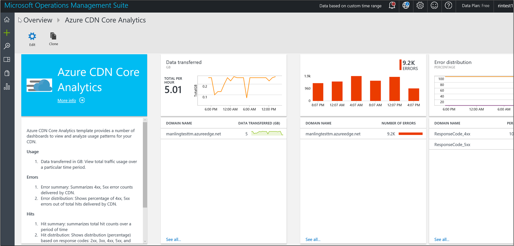

*Figure 1 - CDN core analytics view*

For more information about diagnostic logs, see [Diagnostic Logs](https://docs.microsoft.com/azure/monitoring-and-diagnostics/monitoring-overview-of-diagnostic-logs).

[!INCLUDE [azure-monitor-log-analytics-rebrand](../../includes/azure-monitor-log-analytics-rebrand.md)]

## Enable logging with the Azure portal

Follow these steps enable logging with CDN core analytics:

Sign in to the [Azure portal](https://portal.azure.com). If you don't already have enabled CDN for your workflow, [Create an Azure CDN profile and endpoint](cdn-create-new-endpoint.md) before you continue.

1. In the Azure portal, navigate to **CDN profile**.

2. In the Azure portal, search for a CDN profile or select one from your dashboard. Then, select the CDN endpoint for which you want to enable diagnostics logs.

	

3. Select **Diagnostics logs** in the MONITORING section.

   The **Diagnostics logs** page appears.

	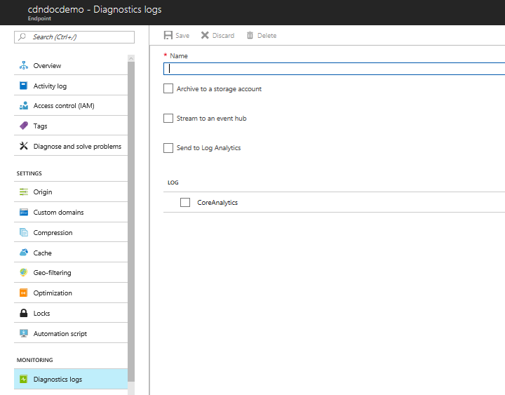

### Enable logging with Azure Storage

To use a storage account to store the logs, follow these steps:
	
1. For **Name**, enter a name for your diagnostic log settings.
 
2. Select **Archive to a storage account**, then select **CoreAnalytics**. 

2. For **Retention (days)**, choose the number of retention days. A retention of zero days stores the logs indefinitely. 

    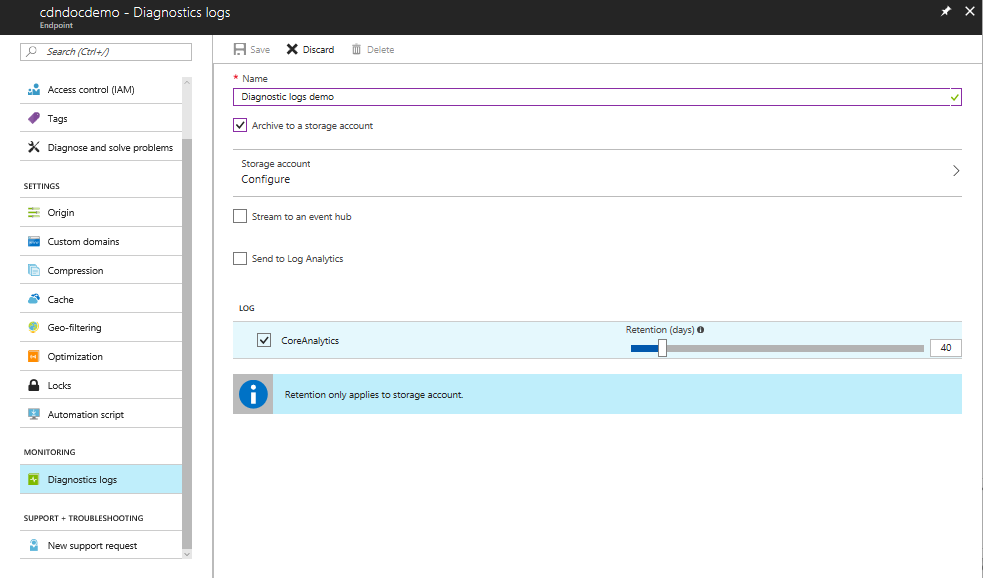 

3. Select **Storage account**.

    The **Select a storage account** page appears.

4. Select a storage account from the drop-down list, then select **OK**.

    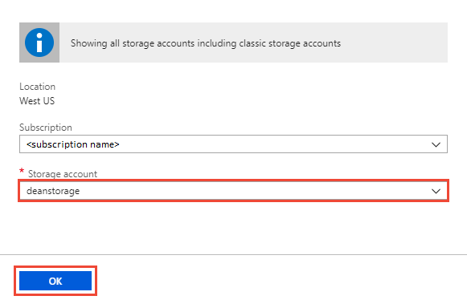

5. After you have finished making your diagnostic log settings, select **Save**.

### Logging with Azure Monitor

To use Azure Monitor to store the logs, follow these steps:

1. From the **Diagnostics logs** page, select **Send to Log Analytics**. 

    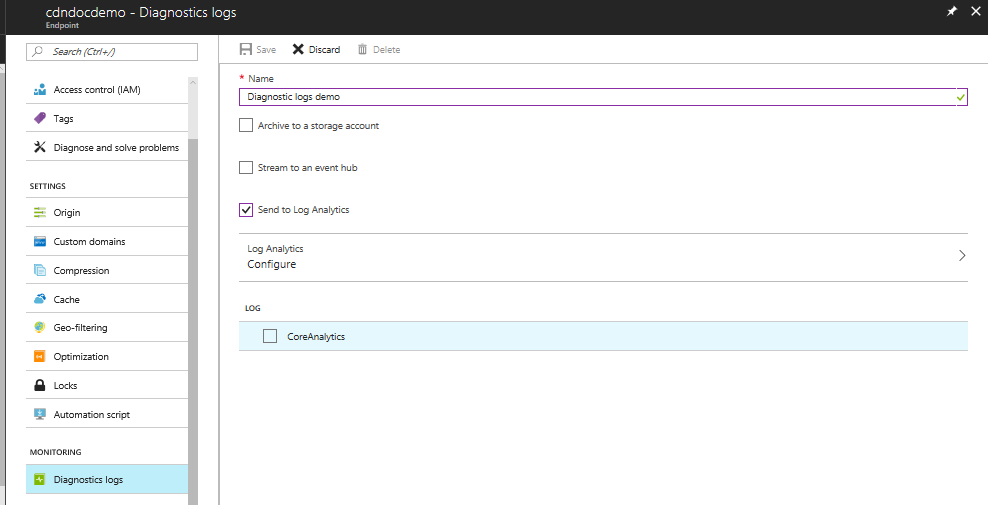    

2. Select **Configure** to configure Azure Monitor logging. 

   The **Log Analytics workspaces** page appears.

    >[!NOTE] 
    >OMS workspaces are now referred to as Log Analytics workspaces.

    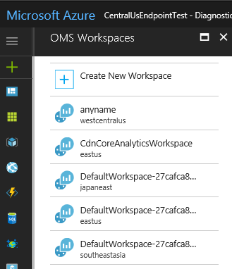

3. Select **Create New Workspace**.

    The **Log Analytics workspace** page appears.

    >[!NOTE] 
    >OMS workspaces are now referred to as Log Analytics workspaces.

    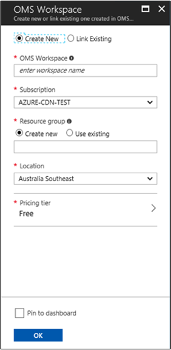

4. For **Log Analytics workspace**, enter a Log Analytics workspace name. The Log Analytics workspace name must be unique and contain only letters, numbers, and hyphens; spaces and underscores are not allowed. 

5. For **Subscription**, select an existing subscription from the drop-down list. 

6. For **Resource group**, create a new resource group or select an existing one.

7. For **Location**, select a location from the list.

8. Select **Pin to dashboard** if you want to save the log configuration to your dashboard. 

9. Select **OK** to complete the configuration.

10. After your workspace is created, you're returned to the **Diagnostic logs** page. Confirm the name of your new Log Analytics workspace.

    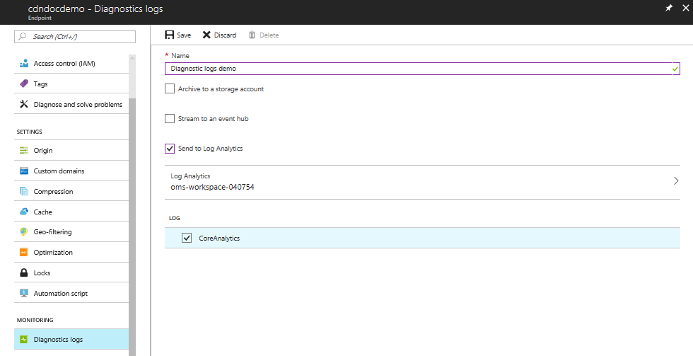

11. Select **CoreAnalytics**, then select **Save**.

12. To view the new Log Analytics workspace, select **Core analytics** from your CDN endpoint page.

     

    Your Log Analytics workspace is now ready to log data. In order to consume that data, you must use a [Azure Monitor logs solution](#consuming-diagnostics-logs-from-a-log-analytics-workspace), covered later in this article.

For more information about log data delays, see [Log data delays](#log-data-delays).

## Enable logging with PowerShell

The following example shows how to enable diagnostic logs via the Azure PowerShell Cmdlets.

[!INCLUDE [updated-for-az](../../includes/updated-for-az.md)]

### Enabling diagnostic logs in a storage account

1. Log in and select a subscription:

    Connect-AzAccount 

    Select-AzureSubscription -SubscriptionId 

2. To enable Diagnostic Logs in a Storage account, enter this command:

    ```powershell
    Set-AzDiagnosticSetting -ResourceId "/subscriptions/{subscriptionId}/resourcegroups/{resourceGroupName}/providers/Microsoft.Cdn/profiles/{profileName}/endpoints/{endpointName}" -StorageAccountId "/subscriptions/{subscriptionId}/resourceGroups/{resourceGroupName}/providers/Microsoft.ClassicStorage/storageAccounts/{storageAccountName}" -Enabled $true -Categories CoreAnalytics
    ```

3. To enable diagnostics logs in a Log Analytics workspace, enter this command:

    ```powershell
    Set-AzDiagnosticSetting -ResourceId "/subscriptions/`{subscriptionId}<subscriptionId>
    .<subscriptionName>" -WorkspaceId "/subscriptions/<workspaceId>.<workspaceName>" -Enabled $true -Categories CoreAnalytics 
    ```

## Consuming diagnostics logs from Azure Storage
This section describes the schema of CDN core analytics, how it is organized inside of an Azure storage account, and provides sample code to download the logs in a CSV file.

### Using Microsoft Azure Storage Explorer
Before you can access the core analytics data from an Azure storage account, you first need a tool to access the contents in a storage account. While there are several tools available in the market, the one that we recommend is the Microsoft Azure Storage Explorer. To download the tool, see [Azure Storage Explorer](https://storageexplorer.com/). After downloading and installing the software, configure it to use the same Azure storage account that was configured as a destination to the CDN Diagnostics Logs.

1.	Open **Microsoft Azure Storage Explorer**
2.	Locate the storage account
3.	Expand the **Blob Containers** node under this storage account.
4.	Select the container named *insights-logs-coreanalytics*.
5.	Results show up on the right-hand pane, starting with the first level, as *resourceId=*. Continue selecting each level until you find the file *PT1H.json*. For an explanation of the path, see [Blob path format](cdn-azure-diagnostic-logs.md#blob-path-format).
6.	Each blob *PT1H.json* file represents the analytics logs for one hour for a specific CDN endpoint or its custom domain.
7.	The schema of the contents of this JSON file is described in the section schema of the core analytics logs.


#### Blob path format

Core analytics logs are generated every hour and the data is collected and stored inside a single Azure blob as a JSON payload. Because the Storage explorer tool interprets '/' as a directory separator and shows the hierarchy, the path to the Azure blob appears as if there is a hierarchical structure and represents the blob name. The name of the blob follows the following naming convention:	

```resourceId=/SUBSCRIPTIONS/{Subscription Id}/RESOURCEGROUPS/{Resource Group Name}/PROVIDERS/MICROSOFT.CDN/PROFILES/{Profile Name}/ENDPOINTS/{Endpoint Name}/ y={Year}/m={Month}/d={Day}/h={Hour}/m={Minutes}/PT1H.json```

**Description of fields:**

|Value|Description|
|-------|---------|
|Subscription ID	|ID of the Azure subscription in Guid format.|
|Resource Group Name |Name of the resource group to which the CDN resources belong.|
|Profile Name |Name of the CDN Profile|
|Endpoint Name |Name of the CDN Endpoint|
|Year|	Four-digit representation of the year, for example, 2017|
|Month|	Two-digit representation of the month number. 01=January ... 12=December|
|Day|	Two-digit representation of the day of the month|
|PT1H.json|	Actual JSON file where the analytics data is stored|

### Exporting the core analytics data to a CSV file

To make it easy to access core analytics, sample code for a tool is provided. This tool allows downloading the JSON files into a flat comma-separated file format, which can be used to create charts or other aggregations.

Here's how you can use the tool:

1.	Visit the GitHub link: [https://github.com/Azure-Samples/azure-cdn-samples/tree/master/CoreAnalytics-ExportToCsv](https://github.com/Azure-Samples/azure-cdn-samples/tree/master/CoreAnalytics-ExportToCsv)
2.	Download the code.
3.	Follow the instructions to compile and configure.
4.	Run the tool.
5.	The resulting CSV file shows the analytics data in a simple flat hierarchy.

## Consuming diagnostics logs from a Log Analytics workspace
Azure Monitor is an Azure service that monitors your cloud and on-premises environments to maintain their availability and performance. It collects data generated by resources in your cloud and on-premises environments and from other monitoring tools to provide analysis across multiple sources. 

To use Azure Monitor, you must [enable logging](#enable-logging-with-azure-storage) to the Azure Log Analytics workspace, which is discussed earlier in this article.

### Using the Log Analytics workspace

 The following diagram shows the architecture of the inputs and outputs of the repository:

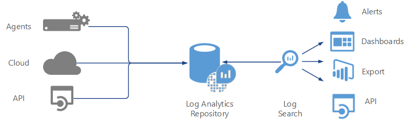

*Figure 3 - Log Analytics Repository*

You can display the data in a variety of ways by using Management Solutions. You can obtain Management Solutions from the [Azure Marketplace](https://azuremarketplace.microsoft.com/marketplace/apps/category/monitoring-management?page=1&subcategories=management-solutions).

You can install monitoring solutions from Azure marketplace by selecting the **Get it now** link at the bottom of each solution.

### Add an Azure Monitor CDN monitoring solution

Follow these steps to add an Azure Monitor monitoring solution:

1.   Sign in to the Azure portal using your Azure subscription and go to your dashboard.
    

2. In the **New** page, under **Marketplace**, select **Monitoring + management**.

    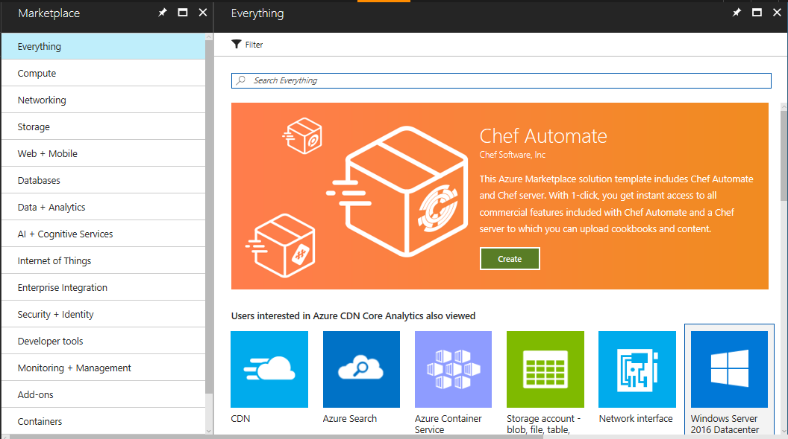

3. In the **Monitoring + management** page, select **See all**.

    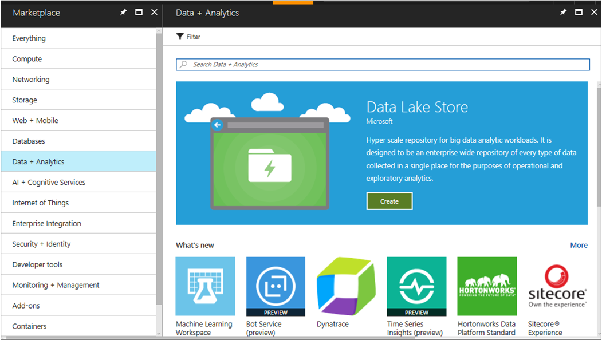

4. Search for CDN in the search box.

    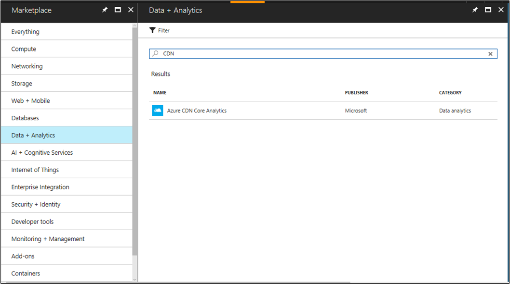

5. Select **Azure CDN Core Analytics**. 

    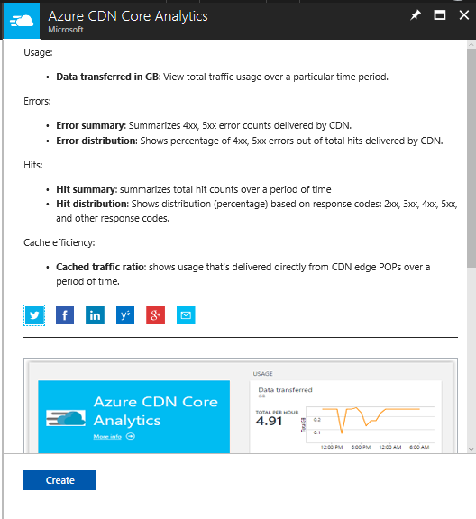

6. After you select **Create**, you are asked to create a new Log Analytics workspace or use an existing one. 

    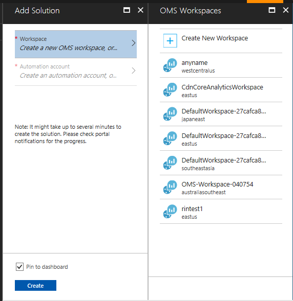

7. Select the workspace you created before. You then need to add an automation account.

    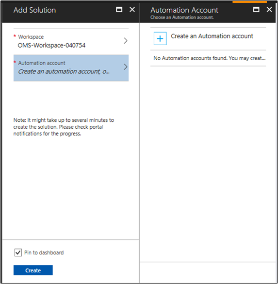

8. The following screen shows the automation account form you must fill out. 

    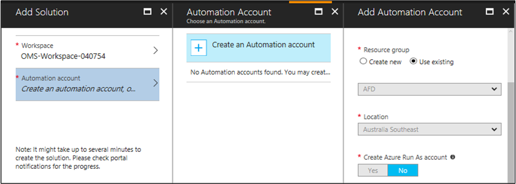

9. Once you have created the automation account, you are ready to add your solution. Select the **Create** button.

    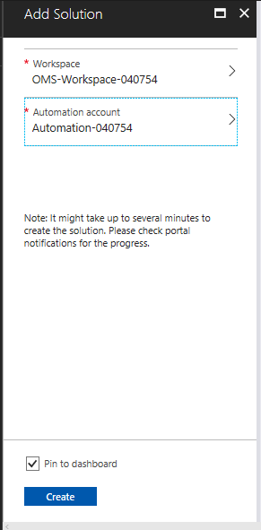

10. Your solution has now been added to your workspace. Return to your Azure portal dashboard.

    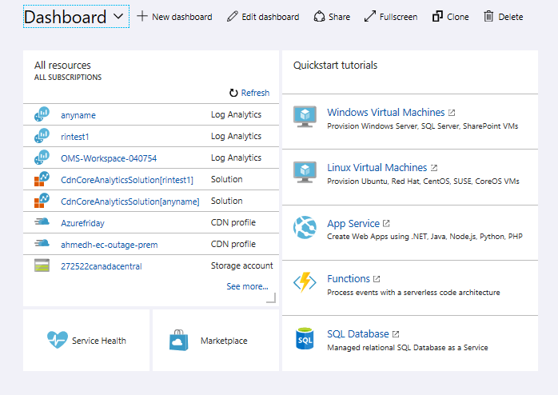

    Select the Log Analytics workspace you created to go to your workspace. 

11. Select the **OMS Portal** tile to see your new solution.

    

12. Your portal should now look like the following screen:

    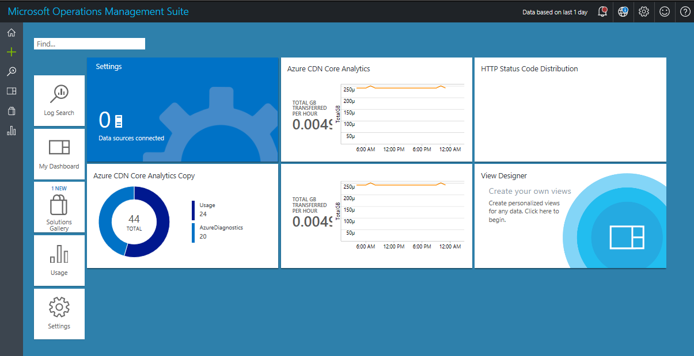

    Select one of the tiles to see several views into your data.

    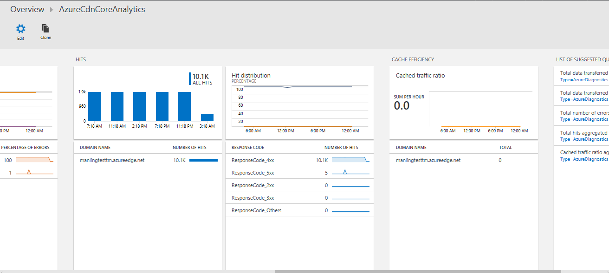

    You can scroll left or right to see further tiles representing individual views into the data. 

    Select one of the tiles to see more details about your data.

     

### Offers and pricing tiers

You can see offers and pricing tiers for management solutions [here](https://docs.microsoft.com/azure/log-analytics/log-analytics-add-solutions).

### Customizing views

You can customize the view into your data by using the **View Designer**. To begin designing, go to your Log Analytics workspace and select the **View Designer** tile.

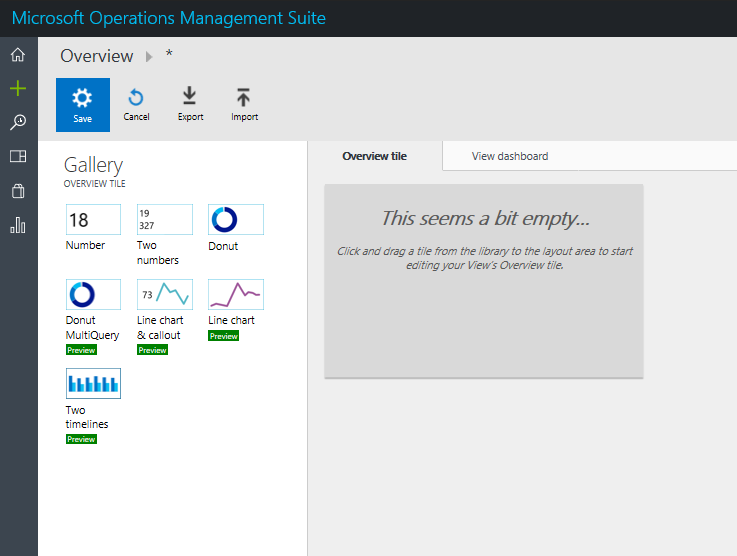

Drag-and-drop the types of charts and fill in the data details you want to analyze.

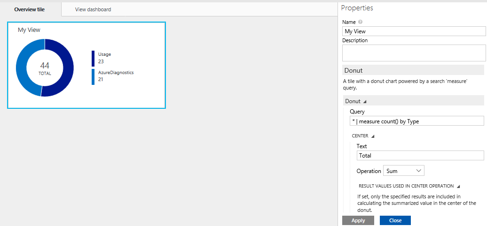

	
## Log data delays

The following table shows log data delays for **Azure CDN Standard from Microsoft**, **Azure CDN Standard from Akamai**, and **Azure CDN Standard/Premium from Verizon**.

Microsoft log data delays | Verizon log data delays | Akamai log data delays
--- | --- | ---
Delayed by 1 hour. | Delayed by 1 hour and can take up to 2 hours to start appearing after endpoint propagation completion. | Delayed by 24 hours; if it was created more than 24 hours ago, it takes up to 2 hours to start appearing. If it was recently created, it can take up to 25 hours for the logs to start appearing.

## Diagnostic log types for CDN core analytics

Microsoft currently offers core analytics logs only, which contain metrics showing HTTP response statistics and egress statistics as seen from the CDN POPs/edges.

### Core analytics metrics details
The following table shows a list of metrics available in the core analytics logs for **Azure CDN Standard from Microsoft**, **Azure CDN Standard from Akamai**, and **Azure CDN Standard/Premium from Verizon**. Not all metrics are available from all providers, although such differences are minimal. The table also displays whether a given metric is available from a provider. The metrics are available for only those CDN endpoints that have traffic on them.


|Metric                     | Description | Microsoft | Verizon | Akamai |
|---------------------------|-------------|-----------|---------|--------|
| RequestCountTotal         | Total number of request hits during this period. | Yes | Yes |Yes |
| RequestCountHttpStatus2xx | Count of all requests that resulted in a 2xx HTTP code (for example, 200, 202). | Yes | Yes |Yes |
| RequestCountHttpStatus3xx | Count of all requests that resulted in a 3xx HTTP code (for example, 300, 302). | Yes | Yes |Yes |
| RequestCountHttpStatus4xx | Count of all requests that resulted in a 4xx HTTP code (for example, 400, 404). | Yes | Yes |Yes |
| RequestCountHttpStatus5xx | Count of all requests that resulted in a 5xx HTTP code (for example, 500, 504). | Yes | Yes |Yes |
| RequestCountHttpStatusOthers | Count of all other HTTP codes (outside of 2xx-5xx). | Yes | Yes |Yes |
| RequestCountHttpStatus200 | Count of all requests that resulted in a 200 HTTP code response. | Yes | No  |Yes |
| RequestCountHttpStatus206 | Count of all requests that resulted in a 206 HTTP code response. | Yes | No  |Yes |
| RequestCountHttpStatus302 | Count of all requests that resulted in a 302 HTTP code response. | Yes | No  |Yes |
| RequestCountHttpStatus304 | Count of all requests that resulted in a 304 HTTP code response. | Yes | No  |Yes |
| RequestCountHttpStatus404 | Count of all requests that resulted in a 404 HTTP code response. | Yes | No  |Yes |
| RequestCountCacheHit | Count of all requests that resulted in a Cache hit. The asset was served directly from the POP to the client. | Yes | Yes | No  |
| RequestCountCacheMiss | Count of all requests that resulted in a Cache miss. A Cache miss means the asset was not found on the POP closest to the client, and therefore was retrieved from the Origin. | Yes | Yes | No |
| RequestCountCacheNoCache | Count of all requests to an asset that are prevented from being cached due to a user configuration on the edge. | Yes | Yes | No |
| RequestCountCacheUncacheable | Count of all requests to assets that are prevented from being cached by the asset's Cache-Control and Expires headers, which indicate that it should not be cached on a POP or by the HTTP client. | Yes | Yes | No |
| RequestCountCacheOthers | Count of all requests with cache status not covered by above. | No | Yes | No  |
| EgressTotal | Outbound data transfer in GB | Yes |Yes |Yes |
| EgressHttpStatus2xx | Outbound data transfer* for responses with 2xx HTTP status codes in GB. | Yes | Yes | No  |
| EgressHttpStatus3xx | Outbound data transfer for responses with 3xx HTTP status codes in GB. | Yes | Yes | No  |
| EgressHttpStatus4xx | Outbound data transfer for responses with 4xx HTTP status codes in GB. | Yes | Yes | No  |
| EgressHttpStatus5xx | Outbound data transfer for responses with 5xx HTTP status codes in GB. | Yes | Yes | No |
| EgressHttpStatusOthers | Outbound data transfer for responses with other HTTP status codes in GB. | Yes | Yes | No  |
| EgressCacheHit | Outbound data transfer for responses that were delivered directly from the CDN cache on the CDN POPs/Edges. | Yes | Yes | No |
| EgressCacheMiss. | Outbound data transfer for responses that were not found on the nearest POP server, and retrieved from the origin server. | Yes | Yes | No |
| EgressCacheNoCache | Outbound data transfer for assets that are prevented from being cached due to a user configuration on the edge. | Yes | Yes | No |
| EgressCacheUncacheable | Outbound data transfer for assets that are prevented from being cached by the asset's Cache-Control and/or Expires headers. Indicates that it should not be cached on a POP or by the HTTP client. | Yes | Yes | No |
| EgressCacheOthers | Outbound data transfers for other cache scenarios. | No | Yes | No |

*Outbound data transfer refers to traffic delivered from CDN POP servers to the client.


### Schema of the core analytics logs 

All logs are stored in JSON format and each entry has string fields according to the following schema:

```json
    "records": [
        {
            "time": "2017-04-27T01:00:00",
            "resourceId": "<ARM Resource Id of the CDN Endpoint>",
            "operationName": "Microsoft.Cdn/profiles/endpoints/contentDelivery",
            "category": "CoreAnalytics",
            "properties": {
                "DomainName": "<Name of the domain for which the statistics is reported>",
                "RequestCountTotal": integer value,
                "RequestCountHttpStatus2xx": integer value,
                "RequestCountHttpStatus3xx": integer value,
                "RequestCountHttpStatus4xx": integer value,
                "RequestCountHttpStatus5xx": integer value,
                "RequestCountHttpStatusOthers": integer value,
                "RequestCountHttpStatus200": integer value,
                "RequestCountHttpStatus206": integer value,
                "RequestCountHttpStatus302": integer value,
                "RequestCountHttpStatus304": integer value,
                "RequestCountHttpStatus404": integer value,
                "RequestCountCacheHit": integer value,
                "RequestCountCacheMiss": integer value,
                "RequestCountCacheNoCache": integer value,
                "RequestCountCacheUncacheable": integer value,
                "RequestCountCacheOthers": integer value,
                "EgressTotal": double value,
                "EgressHttpStatus2xx": double value,
                "EgressHttpStatus3xx": double value,
                "EgressHttpStatus4xx": double value,
                "EgressHttpStatus5xx": double value,
                "EgressHttpStatusOthers": double value,
                "EgressCacheHit": double value,
                "EgressCacheMiss": double value,
                "EgressCacheNoCache": double value,
                "EgressCacheUncacheable": double value,
                "EgressCacheOthers": double value,
            }
        }

    ]
}
```

Where *time* represents the start time of the hour boundary for which the statistics is reported. When a metric is not supported by a CDN provider, instead of a double or integer value, there is a null value. This null value indicates the absence of a metric, and is different from a value of 0. There is one set of these metrics per domain configured on the endpoint.

Example properties:

```json
{
     "DomainName": "manlingakamaitest2.azureedge.net",
     "RequestCountTotal": 480,
     "RequestCountHttpStatus2xx": 480,
     "RequestCountHttpStatus3xx": 0,
     "RequestCountHttpStatus4xx": 0,
     "RequestCountHttpStatus5xx": 0,
     "RequestCountHttpStatusOthers": 0,
     "RequestCountHttpStatus200": 480,
     "RequestCountHttpStatus206": 0,
     "RequestCountHttpStatus302": 0,
     "RequestCountHttpStatus304": 0,
     "RequestCountHttpStatus404": 0,
     "RequestCountCacheHit": null,
     "RequestCountCacheMiss": null,
     "RequestCountCacheNoCache": null,
     "RequestCountCacheUncacheable": null,
     "RequestCountCacheOthers": null,
     "EgressTotal": 0.09,
     "EgressHttpStatus2xx": null,
     "EgressHttpStatus3xx": null,
     "EgressHttpStatus4xx": null,
     "EgressHttpStatus5xx": null,
     "EgressHttpStatusOthers": null,
     "EgressCacheHit": null,
     "EgressCacheMiss": null,
     "EgressCacheNoCache": null,
     "EgressCacheUncacheable": null,
     "EgressCacheOthers": null
}

```

## Additional resources

* [Azure Diagnostic logs](https://docs.microsoft.com/azure/monitoring-and-diagnostics/monitoring-overview-of-diagnostic-logs)
* [Core analytics via Azure CDN supplemental portal](https://docs.microsoft.com/azure/cdn/cdn-analyze-usage-patterns)
* [Azure Monitor logs](https://docs.microsoft.com/azure/log-analytics/log-analytics-overview)
* [Azure Log Analytics REST API](https://docs.microsoft.com/rest/api/loganalytics)


