<properties
	pageTitle="Integrate a cloud service with Azure CDN | Microsoft Azure"
	description="A tutorial that teaches you how to deploy a cloud service that serves content from an integrated Azure CDN endpoint"
	services="cdn, cloud-services"
	documentationCenter=".net"
	authors="camsoper"
	manager="erikre"
	editor="tysonn"/>

<tags
	ms.service="cdn"
	ms.workload="tbd"
	ms.tgt_pltfrm="na"
	ms.devlang="dotnet"
	ms.topic="article"
	ms.date="07/28/2016"
	ms.author="casoper"/>

#  Integrate a cloud service with Azure CDN

A cloud service can be integrated with Azure CDN, serving any content from the cloud service's location. This approach gives you the following advantages:

- Easily deploy and update images, scripts, and stylesheets in your cloud service's project directories
- Easily upgrade the NuGet packages in your cloud service, such as jQuery or Bootstrap versions
- Manage your Web application and your CDN-served content all from the same Visual Studio interface
- Unified deployment workflow for your Web application and your CDN-served content
- Integrate ASP.NET bundling and minification with Azure CDN

## What you will learn ##

In this tutorial, you will learn how to:

-	[Integrate an Azure CDN endpoint with your cloud service and serve static content in your Web pages from Azure CDN](#deploy)
-	[Configure cache settings for static content in your cloud service](#caching)
-	[Serve content from controller actions through Azure CDN](#controller)
-	[Serve bundled and minified content through Azure CDN while preserving the script debugging experience in Visual Studio](#bundling)
-	[Configure fallback your scripts and CSS when your Azure CDN is offline](#fallback)

## What you will build ##

You will deploy a cloud service Web role using the default ASP.NET MVC template, add code to serve content from an integrated Azure CDN, such as an image, controller action results, and the default JavaScript and CSS files, and also write code to configure the fallback mechanism for bundles served in the event that the CDN is offline.

## What you will need ##

This tutorial has the following prerequisites:

-	An active [Microsoft Azure account](/account/)
-	Visual Studio 2015 with [Azure SDK](http://go.microsoft.com/fwlink/?linkid=518003&clcid=0x409)

> [AZURE.NOTE] You need an Azure account to complete this tutorial:
> + You can [open an Azure account for free](/pricing/free-trial/) - You get credits you can use to try out paid Azure services, and even after they're used up you can keep the account and use free Azure services, such as Websites.
> + You can [activate MSDN subscriber benefits](/pricing/member-offers/msdn-benefits-details/) - Your MSDN subscription gives you credits every month that you can use for paid Azure services.

## Deploy a cloud service ##

In this section, you will deploy the default ASP.NET MVC application template in Visual Studio 2015 to a cloud service Web role, and then integrate it with a new CDN endpoint. Follow the instructions below:

1. In Visual Studio 2015, create a new Azure cloud service from the menu bar by going to **File > New > Project > Cloud > Azure Cloud Service**. Give it a name and click **OK**.

	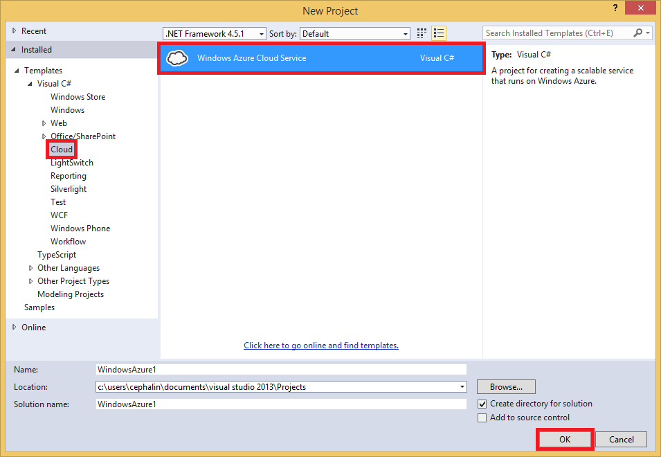

2. Select **ASP.NET Web Role** and click the **>** button. Click OK.

	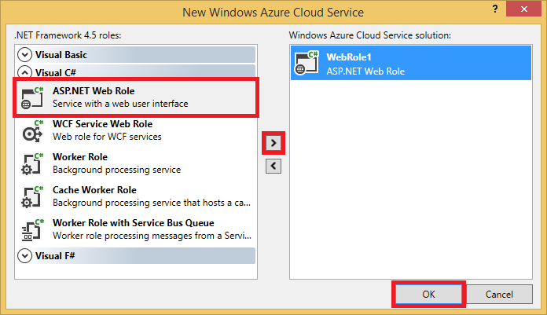

3. Select **MVC** and click **OK**.

	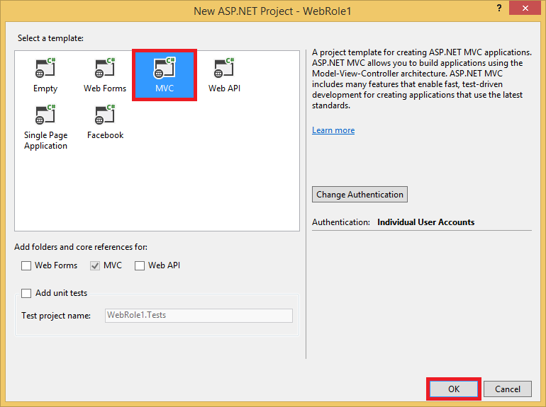

4. Now, publish this Web role to an Azure cloud service. Right-click the cloud service project and select **Publish**.

	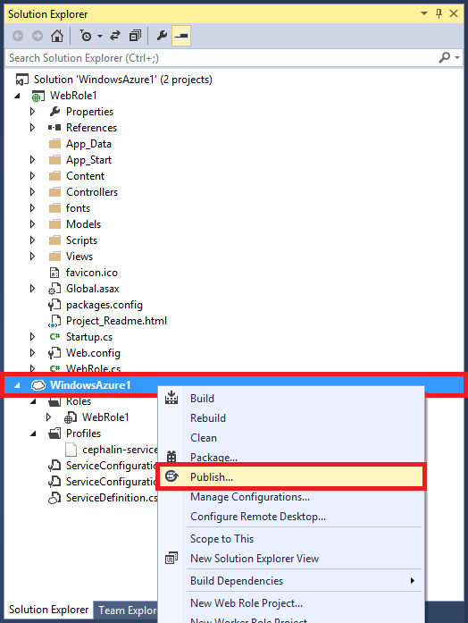

5. If you have not yet signed into Microsoft Azure, click the **Add an account...** dropdown and click the **Add an account** menu item.

	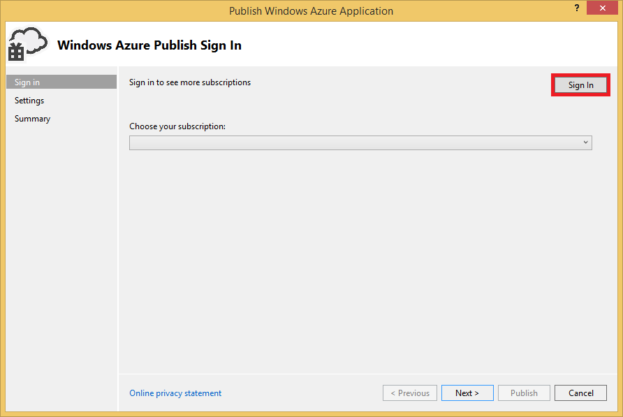

6. In the sign-in page, sign in with the Microsoft account you used to activate your Azure account.
7. Once you're signed in, click **Next**.

	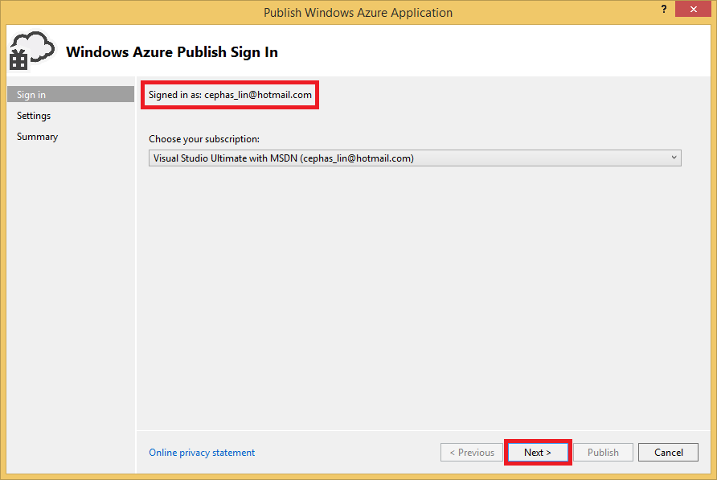

8. Assuming that you haven't created a cloud service or storage account, Visual Studio will help you create both. In the **Create Cloud Service and Account** dialog, type the desired service name and select the desired region. Then, click **Create**.

	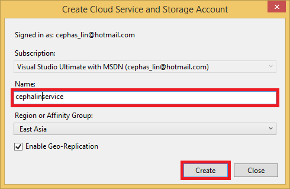

9. In the publish settings page, verify the configuration and click **Publish**.

	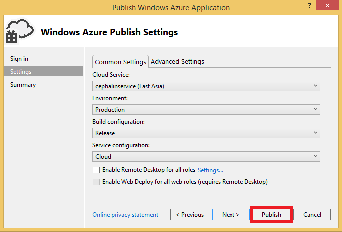

	>[AZURE.NOTE] The publishing process for cloud services takes a long time. The Enable Web Deploy for all roles option can make debugging your cloud service much quicker by providing fast (but temporary) updates to your Web roles. For more information on this option, see [Publishing a Cloud Service using the Azure Tools](http://msdn.microsoft.com/library/ff683672.aspx).

	When the **Microsoft Azure Activity Log** shows that publishing status is **Completed**, you will create a CDN endpoint that's integrated with this cloud service.

	>[AZURE.WARNING] If, after publishing, the deployed cloud service displays an error screen, it's likely because the cloud service you've deployed is using a [guest OS that does not include .NET 4.5.2](../cloud-services/cloud-services-guestos-update-matrix.md#news-updates).  You can work around this issue by [deploying .NET 4.5.2 as a startup task](../cloud-services/cloud-services-dotnet-install-dotnet.md).

## Create a new CDN profile

A CDN profile is a collection of CDN endpoints.  Each profile contains one or more CDN endpoints.  You may wish to use multiple profiles to organize your CDN endpoints by internet domain, web application, or some other criteria.

> [AZURE.TIP] If you already have a CDN profile that you want to use for this tutorial, proceed to [Create a new CDN endpoint](#create-a-new-cdn-endpoint).

[AZURE.INCLUDE [cdn-create-profile](../../includes/cdn-create-profile.md)]

## Create a new CDN endpoint

**To create a new CDN endpoint for your storage account**

1. In the [Azure Management Portal](https://portal.azure.com), navigate to your CDN profile.  You may have pinned it to the dashboard in the previous step.  If you not, you can find it by clicking **Browse**, then **CDN profiles**, and clicking on the profile you plan to add your endpoint to.

    The CDN profile blade appears.

    ![CDN profile][cdn-profile-settings]

2. Click the **Add Endpoint** button.

    ![Add endpoint button][cdn-new-endpoint-button]

    The **Add an endpoint** blade appears.

    ![Add endpoint blade][cdn-add-endpoint]

3. Enter a **Name** for this CDN endpoint.  This name will be used to access your cached resources at the domain `<EndpointName>.azureedge.net`.

4. In the **Origin type** dropdown, select *Cloud service*.  

5. In the **Origin hostname** dropdown, select your cloud service.

6. Leave the defaults for **Origin path**, **Origin host header**, and **Protocol/Origin port**.  You must specify at least one protocol (HTTP or HTTPS).

7. Click the **Add** button to create the new endpoint.

8. Once the endpoint is created, it appears in a list of endpoints for the profile. The list view shows the URL to use to access cached content, as well as the origin domain.

    ![CDN endpoint][cdn-endpoint-success]

    > [AZURE.NOTE] The endpoint will not immediately be available for use.  It can take up to 90 minutes for the registration to propagate through the CDN network. Users who try to use the CDN domain name immediately may receive status code 404 until the content is available via the CDN.

## Test the CDN endpoint

When the publishing status is **Completed**, open a browser window and navigate to **http://<cdnName>*.azureedge.net/Content/bootstrap.css**. In my setup, this URL is:

	http://camservice.azureedge.net/Content/bootstrap.css

Which corresponds to the following origin URL at the CDN endpoint:

	http://camcdnservice.cloudapp.net/Content/bootstrap.css

When you navigate to **http://*&lt;cdnName>*.azureedge.net/Content/bootstrap.css**, depending on your browser, you will be prompted to download or open the bootstrap.css that came from your published Web app.

You can similarly access any publicly accessible URL at **http://*&lt;serviceName>*.cloudapp.net/**, straight from your CDN endpoint. For example:

-	A .js file from the /Script path
-	Any content file from the /Content path
-	Any controller/action
-	If the query string is enabled at your CDN endpoint, any URL with query strings

In fact, with the above configuration, you can host the entire cloud service from **http://*&lt;cdnName>*.azureedge.net/**. If I navigate to **http://camservice.azureedge.net/**, I get the action result from Home/Index.

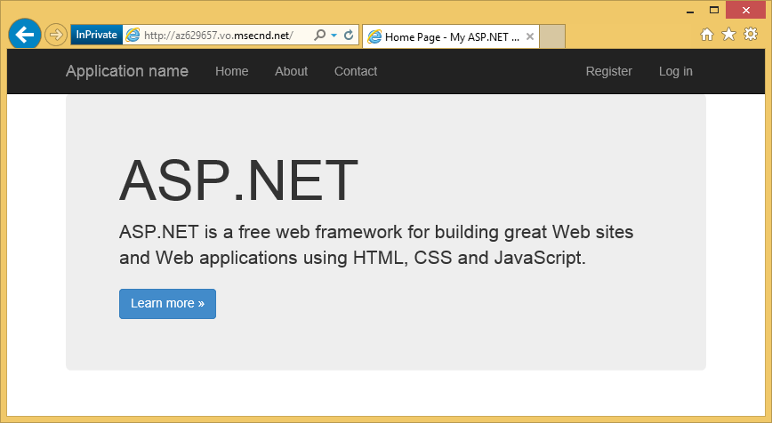

This does not mean, however, that it's always a good idea (or generally a good idea) to serve an entire cloud service through Azure CDN. Some of the caveats are:

-	This approach requires your entire site to be public, because Azure CDN cannot serve any private content at this time.
-	If the CDN endpoint goes offline for any reason, whether scheduled maintenance or user error, your entire cloud service goes offline unless the customers can be redirected to the origin URL **http://*&lt;serviceName>*.cloudapp.net/**.
-	Even with the custom Cache-Control settings (see [Configure caching options for static files in your cloud service](#caching)), a CDN endpoint does not improve the performance of highly-dynamic content. If you tried to load the home page from your CDN endpoint as shown above, notice that it took at least 5 seconds to load the default home page the first time, which is a fairly simple page. Imagine what would happen to the client experience if this page contains dynamic content that must update every minute. Serving dynamic content from a CDN endpoint requires short cache expiration, which translates to frequent cache misses at the CDN endpoint. This hurts the performance of your cloud service and defeats the purpose of a CDN.

The alternative is to determine which content to serve from Azure CDN on a case-by-case basis in your cloud service. To that end, you have already seen how to access individual content files from the CDN endpoint. I will show you how to serve a specific controller action through the CDN endpoint in [Serve content from controller actions through Azure CDN](#controller).

## Configure caching options for static files in your cloud service ##

With Azure CDN integration in your cloud service, you can specify how you want static content to be cached in the CDN endpoint. To do this, open *Web.config* from your Web role project (e.g. WebRole1) and add a `<staticContent>` element to `<system.webServer>`. The XML below configures the cache to expire in 3 days.  

	<system.webServer>
	  <staticContent>
	    <clientCache cacheControlMode="UseMaxAge" cacheControlMaxAge="3.00:00:00"/>
	  </staticContent>
	  ...
	</system.webServer>

Once you do this, all static files in your cloud service will observe the same rule in your CDN cache. For more granular control of cache settings, add a *Web.config* file into a folder and add your settings there. For example, add a *Web.config* file to the *\Content* folder and replace the content with the following XML:

	<?xml version="1.0"?>
	<configuration>
	  <system.webServer>
	    <staticContent>
	      <clientCache cacheControlMode="UseMaxAge" cacheControlMaxAge="15.00:00:00"/>
	    </staticContent>
	  </system.webServer>
	</configuration>

This setting causes all static files from the *\Content* folder to be cached for 15 days.

For more information on how to configure the `<clientCache>` element, see [Client Cache &lt;clientCache>](http://www.iis.net/configreference/system.webserver/staticcontent/clientcache).

In [Serve content from controller actions through Azure CDN](#controller), I will also show you how you can configure cache settings for controller action results in the CDN cache.

## Serve content from controller actions through Azure CDN ##

When you integrate a cloud service Web role with Azure CDN, it is relatively easy to serve content from controller actions through the Azure CDN. Other than serving your cloud service directly through Azure CDN (demonstrated above), [Maarten Balliauw](https://twitter.com/maartenballiauw) shows you how to do it with a fun MemeGenerator controller in [Reducing latency on the web with the Azure CDN](http://channel9.msdn.com/events/TechDays/Techdays-2014-the-Netherlands/Reducing-latency-on-the-web-with-the-Windows-Azure-CDN). I will simply reproduce it here.

Suppose in your cloud service you want to generate memes based on a young Chuck Norris image (photo by [Alan Light](http://www.flickr.com/photos/alan-light/218493788/)) like this:

You have a simple `Index` action that allows the customers to specify the superlatives in the image, then generates the meme once they post to the action. Since it's Chuck Norris, you would expect this page to become wildly popular globally. This is a good example of serving semi-dynamic content with Azure CDN.

Follow the steps above to setup this controller action:

1. In the *\Controllers* folder, create a new .cs file called *MemeGeneratorController.cs* and replace the content with the following code. Be sure to replace the highlighted portion with your CDN name.  

		using System;
		using System.Collections.Generic;
		using System.Diagnostics;
		using System.Drawing;
		using System.IO;
		using System.Net;
		using System.Web.Hosting;
		using System.Web.Mvc;
		using System.Web.UI;

		namespace WebRole1.Controllers
		{
		    public class MemeGeneratorController : Controller
		    {
		        static readonly Dictionary<string, Tuple<string ,string>> Memes = new Dictionary<string, Tuple<string, string>>();

		        public ActionResult Index()
		        {
		            return View();
		        }

		        [HttpPost, ActionName("Index")]
		        public ActionResult Index_Post(string top, string bottom)
		        {
		            var identifier = Guid.NewGuid().ToString();
		            if (!Memes.ContainsKey(identifier))
		            {
		                Memes.Add(identifier, new Tuple<string, string>(top, bottom));
		            }

		            return Content("<a href=\"" + Url.Action("Show", new {id = identifier}) + "\">here's your meme</a>");
		        }

		        [OutputCache(VaryByParam = "*", Duration = 1, Location = OutputCacheLocation.Downstream)]
		        public ActionResult Show(string id)
		        {
		            Tuple<string, string> data = null;
		            if (!Memes.TryGetValue(id, out data))
		            {
		                return new HttpStatusCodeResult(HttpStatusCode.NotFound);
		            }

		            if (Debugger.IsAttached) // Preserve the debug experience
		            {
		                return Redirect(string.Format("/MemeGenerator/Generate?top={0}&bottom={1}", data.Item1, data.Item2));
		            }
		            else // Get content from Azure CDN
		            {
		                return Redirect(string.Format("http://<yourCdnName>.azureedge.net/MemeGenerator/Generate?top={0}&bottom={1}", data.Item1, data.Item2));
		            }
		        }

		        [OutputCache(VaryByParam = "*", Duration = 3600, Location = OutputCacheLocation.Downstream)]
		        public ActionResult Generate(string top, string bottom)
		        {
		            string imageFilePath = HostingEnvironment.MapPath("~/Content/chuck.bmp");
		            Bitmap bitmap = (Bitmap)Image.FromFile(imageFilePath);

		            using (Graphics graphics = Graphics.FromImage(bitmap))
		            {
		                SizeF size = new SizeF();
		                using (Font arialFont = FindBestFitFont(bitmap, graphics, top.ToUpperInvariant(), new Font("Arial Narrow", 100), out size))
		                {
		                    graphics.DrawString(top.ToUpperInvariant(), arialFont, Brushes.White, new PointF(((bitmap.Width - size.Width) / 2), 10f));
		                }
		                using (Font arialFont = FindBestFitFont(bitmap, graphics, bottom.ToUpperInvariant(), new Font("Arial Narrow", 100), out size))
		                {
		                    graphics.DrawString(bottom.ToUpperInvariant(), arialFont, Brushes.White, new PointF(((bitmap.Width - size.Width) / 2), bitmap.Height - 10f - arialFont.Height));
		                }
		            }

		            MemoryStream ms = new MemoryStream();
		            bitmap.Save(ms, System.Drawing.Imaging.ImageFormat.Png);
		            return File(ms.ToArray(), "image/png");
		        }

		        private Font FindBestFitFont(Image i, Graphics g, String text, Font font, out SizeF size)
		        {
		            // Compute actual size, shrink if needed
		            while (true)
		            {
		                size = g.MeasureString(text, font);

		                // It fits, back out
		                if (size.Height < i.Height &&
		                     size.Width < i.Width) { return font; }

		                // Try a smaller font (90% of old size)
		                Font oldFont = font;
		                font = new Font(font.Name, (float)(font.Size * .9), font.Style);
		                oldFont.Dispose();
		            }
		        }
		    }
		}

2. Right-click in the default `Index()` action and select **Add View**.

	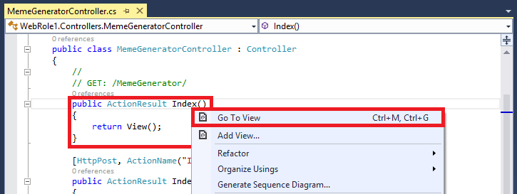

3.  Accept the settings below and click **Add**.

	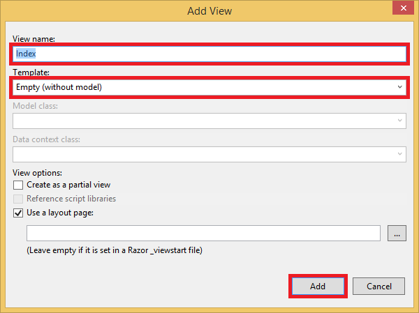

4. Open the new *Views\MemeGenerator\Index.cshtml* and replace the content with the following simple HTML for submitting the superlatives:

		<h2>Meme Generator</h2>

		<form action="" method="post">
		    <input type="text" name="top" placeholder="Enter top text here" />
		     
		    <input type="text" name="bottom" placeholder="Enter bottom text here" />
		     
		    <input class="btn" type="submit" value="Generate meme" />
		</form>

5. Publish the cloud service again and navigate to **http://*&lt;serviceName>*.cloudapp.net/MemeGenerator/Index** in your browser.

When you submit the form values to `/MemeGenerator/Index`, the `Index_Post` action method returns a link to the `Show` action method with the respective input identifier. When you click the link, you reach the following code:  

	[OutputCache(VaryByParam = "*", Duration = 1, Location = OutputCacheLocation.Downstream)]
	public ActionResult Show(string id)
	{
		Tuple<string, string> data = null;
		if (!Memes.TryGetValue(id, out data))
		{
			return new HttpStatusCodeResult(HttpStatusCode.NotFound);
		}

		if (Debugger.IsAttached) // Preserve the debug experience
		{
			return Redirect(string.Format("/MemeGenerator/Generate?top={0}&bottom={1}", data.Item1, data.Item2));
		}
		else // Get content from Azure CDN
		{
			return Redirect(string.Format("http://<yourCDNName>.azureedge.net/MemeGenerator/Generate?top={0}&bottom={1}", data.Item1, data.Item2));
		}
	}

If your local debugger is attached, then you will get the regular debug experience with a local redirect. If it's running in the cloud service, then it will redirect to:

	http://<yourCDNName>.azureedge.net/MemeGenerator/Generate?top=<formInput>&bottom=<formInput>

Which corresponds to the following origin URL at your CDN endpoint:

	http://<youCloudServiceName>.cloudapp.net/MemeGenerator/Generate?top=<formInput>&bottom=<formInput>

You can then use the `OutputCacheAttribute` attribute on the `Generate` method to specify how the action result should be cached, which Azure CDN will honor. The code below specify a cache expiration of 1 hour (3,600 seconds).

    [OutputCache(VaryByParam = "*", Duration = 3600, Location = OutputCacheLocation.Downstream)]

Likewise, you can serve up content from any controller action in your cloud service through your Azure CDN, with the desired caching option.

In the next section, I will show you how to serve the bundled and minified scripts and CSS through Azure CDN.

## Integrate ASP.NET bundling and minification with Azure CDN ##

Scripts and CSS stylesheets change infrequently and are prime candidates for the Azure CDN cache. Serving the entire Web role through your Azure CDN is the easiest way to integrate bundling and minification with Azure CDN. However, as you may not want to do this, I will show you how to do it while preserving the desired develper experience of ASP.NET bundling and minification, such as:

-	Great debug mode experience
-	Streamlined deployment
-	Immediate updates to clients for script/CSS version upgrades
-	Fallback mechanism when your CDN endpoint fails
-	Minimize code modification

In the **WebRole1** project that you created in [Integrate an Azure CDN endpoint with your Azure website and serve static content in your Web pages from Azure CDN](#deploy), open *App_Start\BundleConfig.cs* and take a look at the `bundles.Add()` method calls.

    public static void RegisterBundles(BundleCollection bundles)
    {
        bundles.Add(new ScriptBundle("~/bundles/jquery").Include(
                    "~/Scripts/jquery-{version}.js"));
		...
    }

The first `bundles.Add()` statement adds a script bundle at the virtual directory `~/bundles/jquery`. Then, open *Views\Shared\_Layout.cshtml* to see how the script bundle tag is rendered. You should be able to find the following line of Razor code:

    @Scripts.Render("~/bundles/jquery")

When this Razor code is run in the Azure Web role, it will render a `

However, when it is run in Visual Studio by typing `F5`, it will render each script file in the bundle individually (in the case above, only one script file is in the bundle):

    

This enables you to debug the JavaScript code in your development environment while reducing concurrent client connections (bundling) and improving file download performance (minification) in production. It's a great feature to preserve with Azure CDN integration. Furthermore, since the rendered bundle already contains an automatically generated version string, you want to replicate that functionality so the whenever you update your jQuery version through NuGet, it can be updated at the client side as soon as possible.

Follow the steps below to integration ASP.NET bundling and minification with your CDN endpoint.

1. Back in *App_Start\BundleConfig.cs*, modify the `bundles.Add()` methods to use a different [Bundle constructor](http://msdn.microsoft.com/library/jj646464.aspx), one that specifies a CDN address. To do this, replace the `RegisterBundles` method definition with the following code:  

		public static void RegisterBundles(BundleCollection bundles)
		{
		    bundles.UseCdn = true;
		    var version = System.Reflection.Assembly.GetAssembly(typeof(Controllers.HomeController))
		        .GetName().Version.ToString();
		    var cdnUrl = "http://<yourCDNName>.azureedge.net/{0}?v=" + version;

		    bundles.Add(new ScriptBundle("~/bundles/jquery", string.Format(cdnUrl, "bundles/jquery")).Include(
		                "~/Scripts/jquery-{version}.js"));

		    bundles.Add(new ScriptBundle("~/bundles/jqueryval", string.Format(cdnUrl, "bundles/jqueryval")).Include(
		                "~/Scripts/jquery.validate*"));

		    // Use the development version of Modernizr to develop with and learn from. Then, when you're
		    // ready for production, use the build tool at http://modernizr.com to pick only the tests you need.
		    bundles.Add(new ScriptBundle("~/bundles/modernizr", string.Format(cdnUrl, "bundles/modernizer")).Include(
		                "~/Scripts/modernizr-*"));

		    bundles.Add(new ScriptBundle("~/bundles/bootstrap", string.Format(cdnUrl, "bundles/bootstrap")).Include(
		                "~/Scripts/bootstrap.js",
		                "~/Scripts/respond.js"));

		    bundles.Add(new StyleBundle("~/Content/css", string.Format(cdnUrl, "Content/css")).Include(
		                "~/Content/bootstrap.css",
		                "~/Content/site.css"));
		}

	Be sure to replace `<yourCDNName>` with the name of your Azure CDN.

	In plain words, you are setting `bundles.UseCdn = true` and added a carefully crafted CDN URL to each bundle. For example, the first constructor in the code:

		new ScriptBundle("~/bundles/jquery", string.Format(cdnUrl, "bundles/jquery"))

	is the same as:

		new ScriptBundle("~/bundles/jquery", string.Format(cdnUrl, "http://<yourCDNName>.azureedge.net/bundles/jquery?v=<W.X.Y.Z>"))

	This constructor tells ASP.NET bundling and minification to render individual script files when debugged locally, but use the specified CDN address to access the script in question. However, note two important characteristics with this carefully crafted CDN URL:

	-	The origin for this CDN URL is `http://<yourCloudService>.cloudapp.net/bundles/jquery?v=<W.X.Y.Z>`, which is actually the virtual directory of the script bundle in your cloud service.
	-	Since you are using CDN constructor, the CDN script tag for the bundle no longer contains the automatically generated version string in the rendered URL. You must manually generate a unique version string every time the script bundle is modified to force a cache miss at your Azure CDN. At the same time, this unique version string must remain constant through the life of the deployment to maximize cache hits at your Azure CDN after the bundle is deployed.
	-	The query string v=<W.X.Y.Z> pulls from *Properties\AssemblyInfo.cs* in your Web role project. You can have a deployment workflow that includes incrementing the assembly version every time you publish to Azure. Or, you can just modify *Properties\AssemblyInfo.cs* in your project to automatically increment the version string every time you build, using the wildcard character '*'. For example:

			[assembly: AssemblyVersion("1.0.0.*")]

		Any other strategy to streamline generating a unique string for the life of a deployment will work here.

3. Republish the cloud service and access the home page.

4. View the HTML code for the page. You should be able to see the CDN URL rendered, with a unique version string every time you republish changes to your cloud service. For example:  

		...

		<link href="http://camservice.azureedge.net/Content/css?v=1.0.0.25449" rel="stylesheet"/>

		

		...

		

		

		...

5. In Visual Studio, debug the cloud service in Visual Studio by typing `F5`.,

6. View the HTML code for the page. You will still see each script file individually rendered so that you can have a consistent debug experience in Visual Studio.  

		...

		    <link href="/Content/bootstrap.css" rel="stylesheet"/>
		<link href="/Content/site.css" rel="stylesheet"/>

		    

		...

		    

		    
		

		...   

## Fallback mechanism for CDN URLs ##

When your Azure CDN endpoint fails for any reason, you want your Web page to be smart enough to access your origin Web server as the fallback option for loading JavaScript or Bootstrap. It's serious enough to lose images on your website due to CDN unavailability, but much more severe to lose crucial page functionality provided by your scripts and stylesheets.

The [Bundle](http://msdn.microsoft.com/library/system.web.optimization.bundle.aspx) class contains a property called [CdnFallbackExpression](http://msdn.microsoft.com/library/system.web.optimization.bundle.cdnfallbackexpression.aspx) that enables you to configure the fallback mechanism for CDN failure. To use this property, follow the steps below:

1. In your Web role project, open *App_Start\BundleConfig.cs*, where you added a CDN URL in each [Bundle constructor](http://msdn.microsoft.com/library/jj646464.aspx), and make the following highlighted changes to add fallback mechanism to the default bundles:  

		public static void RegisterBundles(BundleCollection bundles)
		{
		    var version = System.Reflection.Assembly.GetAssembly(typeof(BundleConfig))
		        .GetName().Version.ToString();
		    var cdnUrl = "http://cdnurl.azureedge.net/.../{0}?" + version;
		    bundles.UseCdn = true;

		    bundles.Add(new ScriptBundle("~/bundles/jquery", string.Format(cdnUrl, "bundles/jquery"))
						{ CdnFallbackExpression = "window.jquery" }
		                .Include("~/Scripts/jquery-{version}.js"));

		    bundles.Add(new ScriptBundle("~/bundles/jqueryval", string.Format(cdnUrl, "bundles/jqueryval"))
						{ CdnFallbackExpression = "$.validator" }
		            	.Include("~/Scripts/jquery.validate*"));

		    // Use the development version of Modernizr to develop with and learn from. Then, when you&#39;re
		    // ready for production, use the build tool at http://modernizr.com to pick only the tests you need.
		    bundles.Add(new ScriptBundle("~/bundles/modernizr", string.Format(cdnUrl, "bundles/modernizer"))
						{ CdnFallbackExpression = "window.Modernizr" }
						.Include("~/Scripts/modernizr-*"));

		    bundles.Add(new ScriptBundle("~/bundles/bootstrap", string.Format(cdnUrl, "bundles/bootstrap")) 	
						{ CdnFallbackExpression = "$.fn.modal" }
		        		.Include(
			              		"~/Scripts/bootstrap.js",
			              		"~/Scripts/respond.js"));

		    bundles.Add(new StyleBundle("~/Content/css", string.Format(cdnUrl, "Content/css")).Include(
		                "~/Content/bootstrap.css",
		                "~/Content/site.css"));
		}

	When `CdnFallbackExpression` is not null, script is injected into the HTML to test whether the bundle is loaded successfully and, if not, access the bundle directly from the origin Web server. This property needs to be set to a JavaScript expression that tests whether the respective CDN bundle is loaded properly. The expression needed to test each bundle differs according to the content. For the default bundles above:

	-	`window.jquery` is defined in jquery-{version}.js
	-	`$.validator` is defined in jquery.validate.js
	-	`window.Modernizr` is defined in modernizer-{version}.js
	-	`$.fn.modal` is defined in bootstrap.js

	You might have noticed that I did not set CdnFallbackExpression for the `~/Cointent/css` bundle. This is because currently there is a [bug in System.Web.Optimization](https://aspnetoptimization.codeplex.com/workitem/104) that injects a `

		    
		

		...

		    
		

		    
		

		...

	Note that injected script for the CSS bundle still contains the errant remnant from the `CdnFallbackExpression` property in the line:

        }())||document.write('

	But since the first part of the || expression will always return true (in the line directly above that), the document.write() function will never run.

## More Information ##
- [Overview of the Azure Content Delivery Network (CDN)](http://msdn.microsoft.com/library/azure/ff919703.aspx)
- [Using Azure CDN](cdn-create-new-endpoint.md)
- [ASP.NET Bundling and Minification](http://www.asp.net/mvc/tutorials/mvc-4/bundling-and-minification)

[new-cdn-profile]: ./media/cdn-cloud-service-with-cdn/cdn-new-profile.png
[cdn-profile-settings]: ./media/cdn-cloud-service-with-cdn/cdn-profile-settings.png
[cdn-new-endpoint-button]: ./media/cdn-cloud-service-with-cdn/cdn-new-endpoint-button.png
[cdn-add-endpoint]: ./media/cdn-cloud-service-with-cdn/cdn-add-endpoint.png
[cdn-endpoint-success]: ./media/cdn-cloud-service-with-cdn/cdn-endpoint-success.png
