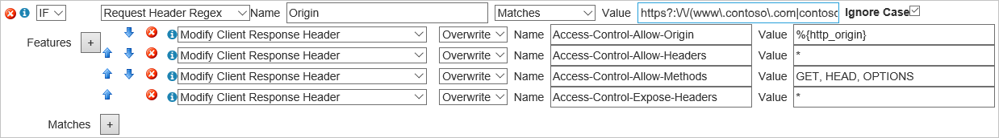
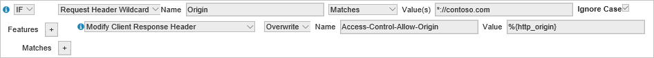

# Using Azure CDN with CORS

## What is CORS?

CORS (Cross Origin Resource Sharing) is an HTTP feature that enables a web application running under one domain to access resources in another domain. In order to reduce the possibility of cross-site scripting attacks, all modern web browsers implement a security restriction known as [same-origin policy](https://www.w3.org/Security/wiki/Same_Origin_Policy). This restriction prevents a web page from calling APIs in a different domain. CORS provides a secure way to allow one origin (the origin domain) to call APIs in another origin.

## How it works

There are two types of CORS requests, *simple requests* and *complex requests.*

### For simple requests:

1. The browser sends the CORS request with an extra **Origin** HTTP request header. The value of the request header is the origin that served the parent page, which is defined as the combination of *protocol,* *domain,* and *port.*  When a page from https\://www.contoso.com attempts to access a user's data in the fabrikam.com origin, the following request header would be sent to fabrikam.com:

   `Origin: https://www.contoso.com`

2. The server may respond with any of the following headers:

   * An **Access-Control-Allow-Origin** header in its response indicating which origin site is allowed. For example:

     `Access-Control-Allow-Origin: https://www.contoso.com`

   * An HTTP error code such as 403 if the server doesn't allow the cross-origin request after checking the Origin header

   * An **Access-Control-Allow-Origin** header with a wildcard that allows all origins:

     `Access-Control-Allow-Origin: *`

### For complex requests:

A complex request is a CORS request where the browser is required to send a *preflight request* (that is, a preliminary probe) before sending the actual CORS request. The preflight request asks the server permission if the original CORS request can proceed and is an `OPTIONS` request to the same URL.

> [!TIP]
> For more details on CORS flows and common pitfalls, view the [Guide to CORS for REST APIs](https://www.moesif.com/blog/technical/cors/Authoritative-Guide-to-CORS-Cross-Origin-Resource-Sharing-for-REST-APIs/).
>
>

## Wildcard or single origin scenarios

CORS on Azure CDN works automatically without extra configurations when the **Access-Control-Allow-Origin** header is set to wildcard (*) or a single origin.  CDN cache the first response and subsequent requests use the same header.

If requests have already been made to the CDN prior to CORS being set on your origin, you need to purge content on your endpoint content to reload the content with the **Access-Control-Allow-Origin** header.

## Multiple origin scenarios
If you need to allow a specific list of origins to be allowed for CORS, things get a little more complicated. The problem occurs when the CDN caches the **Access-Control-Allow-Origin** header for the first CORS origin.  When a different CORS origin makes a subsequent request, the CDN serves the cached **Access-Control-Allow-Origin** header, which doesn't match. There are several ways to correct this problem.

### Azure CDN standard profiles
On Azure CDN Standard from Microsoft, you can create a rule in the [Standard rules engine](cdn-standard-rules-engine-reference.md) to check the **Origin** header on the request. If it's a valid origin, your rule set the **Access-Control-Allow-Origin** header with the desired value. In this case, the **Access-Control-Allow-Origin** header from the file's origin server is ignored and the CDN's rules engine completely manages the allowed CORS origins.


> [!TIP]
> You can add additional actions to your rule to modify additional response headers, such as **Access-Control-Allow-Methods**.
> 

On **Azure CDN Standard from Akamai**, the only mechanism to allow for multiple origins without the use of the wildcard origin is to use [query string caching](cdn-query-string.md). Enable the query string setting for the CDN endpoint and then use a unique query string for requests from each allowed domain. Doing so results in the CDN caching a separate object for each unique query string. This approach isn't ideal, however, as it results in multiple copies of the same file cached on the CDN.  

<a name='azure-cdn-premium-from-verizon'></a>

### Azure CDN Premium from Edgio

Using the Edgio Premium rules engine, you need to [create a rule](./cdn-verizon-premium-rules-engine.md) to check the **Origin** header on the request.  If it's a valid origin, your rule sets the **Access-Control-Allow-Origin** header with the origin provided in the request. If the origin specified in the **Origin** header isn't allowed, your rule should omit the **Access-Control-Allow-Origin** header, which causes the browser to reject the request. 

There are two ways to resolve this problem with the Premium rules engine. In both cases, the **Access-Control-Allow-Origin** header from the file's origin server is ignored and the CDN's rules engine completely manages the allowed CORS origins.

#### One regular expression with all valid origins

In this case, you create a regular expression that includes all of the origins you want to allow: 

```http
https?:\/\/(www\.contoso\.com|contoso\.com|www\.microsoft\.com|microsoft.com\.com)$
```

> [!TIP]
> **Azure CDN Premium from Edgio** uses [Perl Compatible Regular Expressions](https://pcre.org/) as its engine for regular expressions.  You can use a tool like [Regular Expressions 101](https://regex101.com/) to validate your regular expression.  Note that the "/" character is valid in regular expressions and doesn't need to be escaped, however, escaping that character is considered a best practice and is expected by some regex validators.
> 
> 

If the regular expression matches, your rule replaces the **Access-Control-Allow-Origin** header (if any) from the origin with the origin that sent the request.  You can also add extra CORS headers, such as **Access-Control-Allow-Methods**.



#### Request header rule for each origin.
Rather than regular expressions, you can instead create a separate rule for each origin you wish to allow using the **Request Header Wildcard** [match condition](/previous-versions/azure/mt757336(v=azure.100)#match-conditions). As with the regular expression method, the rules engine alone sets the CORS headers. 



> [!TIP]
> In the example, the use of the wildcard character * tells the rules engine to match both HTTP and HTTPS.
> 
>
