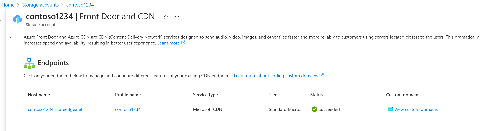

# Quickstart: Integrate an Azure Storage account with Azure Content Delivery Network

In this quickstart, you enable [Azure Content Delivery Network](cdn-overview.md) to cache content from Azure Storage. Azure Content Delivery Network offers developers a global solution for delivering high-bandwidth content. It can cache blobs and static content of compute instances at physical nodes in the United States, Europe, Asia, Australia, and South America.

## Prerequisites

- An Azure account with an active subscription. [Create an account for free](https://azure.microsoft.com/free/?ref=microsoft.com&utm_source=microsoft.com&utm_medium=docs&utm_campaign=visualstudio).

## Sign in to the Azure portal

Sign in to the [Azure portal](https://portal.azure.com) with your Azure account.

## Create a storage account

A storage account gives access to Azure Storage services. The storage account represents the highest level of the namespace for accessing each of the Azure Storage service components: Azure Blob, Queue, and Table storage. For more information, see [Introduction to Microsoft Azure Storage](../storage/common/storage-introduction.md).

To create a storage account, you must be either the service administrator or a coadministrator for the associated subscription.

1. In the Azure portal, select **Create a resource** on the upper left. The **Create a resource** pane appears.

1. Search for **Storage account** and select **Storage account** from the list. Then select **Create**:

    :::image type="content" source="./media/cdn-create-a-storage-account-with-cdn/cdn-select-new-storage-account.png" alt-text="Screenshot of create a storage account.":::

1. In the **Create storage account pane**, enter the following details:

    | Setting | Value |
    | --- | --- |
    | Resource group | Select **Create new** and use the name *CDNQuickstart-rg*. You can also use an existing resource group if you prefer. |
    | Storage account name | Enter a name for the account using 3-24 lowercase letters and numbers only. The name must be unique across Azure, and becomes the host name in the URL that's used to address blob, queue, or table resources for the subscription. To address a container resource in Blob storage, use a URI in the following format: HTTP://*&lt;storageaccountname&gt;*.blob.core.windows.net/*&lt;container-name&gt;*.
    | Region | Select an Azure region near you from the dropdown list. |

    Leave all other details set to the defaults, then select **Review + create**.

1. Creating the storage account might take several minutes to complete. Once creation is complete, select **Go to resource** to open the storage account's page for the next step.

## Enable Azure Content Delivery Network for the storage account

1. On the page for your storage account, select **Security + Networking** > **Front Door and CDN** from the left menu. The **Front Door and CDN** page appears.

    :::image type="content" source="./media/cdn-create-a-storage-account-with-cdn/azure-cdn-storage-endpoint-configuration.png" alt-text="Screenshot of create a content delivery network endpoint." lightbox="./media/cdn-create-a-storage-account-with-cdn/azure-cdn-storage-endpoint-configuration.png":::

1. In the **New endpoint** section, enter the following information:

    | Setting  | Value |
    | -------- | ----- |
    | **Service type** | **Azure Content Delivery Network** |
    | **Create new/use existing profile** | **Create new** |
    | **Profile name** | Enter your profile name, for example, *cdn-profile-123*. A profile is a collection of endpoints. |
    | **content delivery network endpoint name** | Enter your endpoint hostname, such as *cdn-endpoint-123*. This name must be globally unique across Azure because it's to access your cached resources at the URL *&lt;endpoint-name&gt;*.azureedge.net. |
    | **Origin hostname** | By default, a new content delivery network endpoint uses the hostname of your storage account as the origin server. |
    | **Pricing tier** | Select one of the options, such as **Microsoft CDN (classic)**. |

1. Select **Create**. After the endpoint is created, it appears in the endpoint list.

	[ .](./media/cdn-create-a-storage-account-with-cdn/azure-cdn-storage-new-endpoint-list.png#lightbox)

> [!TIP]
> If you want to specify advanced configuration settings for your content delivery network endpoint, such as [large file download optimization](cdn-optimization-overview.md#large-file-download), you can instead use the [Azure Content Delivery Network extension](cdn-create-new-endpoint.md) to create a content delivery network profile and endpoint.

## Enable additional content delivery network features

From the storage account **Azure CDN** page, select the content delivery network endpoint from the list to open the content delivery network endpoint configuration page.

From this page, you can enable additional content delivery network features for your delivery, such as [compression](cdn-improve-performance.md), [query string caching](cdn-query-string.md), and [geo filtering](cdn-restrict-access-by-country-region.md).

## Enable SAS

If you want to grant limited access to private storage containers, you can use the Shared Access Signature (SAS) feature of your Azure Storage account. A SAS is a URI that grants restricted access rights to your Azure Storage resources without exposing your account key. For more information, see [Using Azure Content Delivery Network with SAS](cdn-sas-storage-support.md).

## Access content delivery network content

To access cached content on the content delivery network, use the content delivery network URL provided in the portal. The address for a cached blob has the following format:

HTTP://<*endpoint-name*\>.azureedge.net/<*myPublicContainer*\>/<*BlobName*\>

> [!NOTE]
> After you enable Azure Content Delivery Network access to a storage account, all publicly available objects are eligible for content delivery network POP caching. If you modify an object that's currently cached in the content delivery network, the new content will not be available via Azure Content Delivery Network until Azure Content Delivery Network refreshes its content after the time to live period for the cached content expires.

## Remove content from Azure Content Delivery Network

If you no longer want to cache an object in Azure Content Delivery Network, you can take one of the following steps:

- Make the container private instead of public. For more information, see [Manage anonymous read access to containers and blobs](../storage/blobs/anonymous-read-access-configure.md).
- Disable or delete the content delivery network endpoint by using the Azure portal.
- Modify your hosted service to no longer respond to requests for the object.

An object that's already cached in Azure Content Delivery Network remains cached until the time to live period for the object expires or until the endpoint is [purged](cdn-purge-endpoint.md). When the time to live period expires, Azure Content Delivery Network determines whether the content delivery network endpoint is still valid and the object is still anonymously accessible. If they are not, the object will no longer be cached.

## Clean up resources

In the preceding steps, you created a content delivery network profile and an endpoint in a resource group. Save these resources if you want to go to [Next steps](#next-steps) and learn how to add a custom domain to your endpoint. However, if you don't expect to use these resources in the future, you can delete them by deleting the resource group, thus avoiding additional charges:

1. From the left-hand menu in the Azure portal, select **Resource groups** and then select *CDNQuickstart-rg**.

2. On the **Resource group** page, select **Delete resource group**, enter *CDNQuickstart-rg* in the text box, then select **Delete**.

    This action will delete the resource group, profile, and endpoint that you created in this quickstart.

3. To delete your storage account, select it from the dashboard, then select **Delete** from the top menu.

## Next steps

> [!div class="nextstepaction"]
> [Tutorial: Add a custom domain to your Azure Content Delivery Network endpoint](cdn-map-content-to-custom-domain.md)
