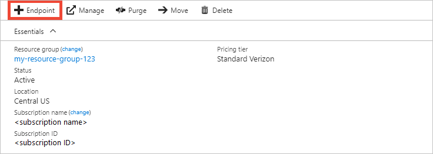
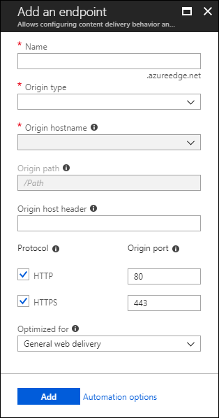

# Create an Azure CDN endpoint
This article describes all the settings for creating an [Azure Content Delivery Network (CDN)](cdn-overview.md) endpoint in an existing CDN profile. After you've created a profile and an endpoint, you can start delivering content to your customers. For a quickstart on creating a profile and endpoint, see [Quickstart: Create an Azure CDN profile and endpoint](cdn-create-new-endpoint.md).

## Prerequisites
Before you can create a CDN endpoint, you must have created at least one CDN profile, which can contain one or more CDN endpoints. To organize your CDN endpoints by internet domain, web application, or some other criteria, you can use multiple profiles. Because CDN pricing is applied at the CDN profile level, you must create multiple CDN profiles if you want to use a mix of Azure CDN pricing tiers. To create a CDN profile, see [Create a new CDN profile](cdn-create-new-endpoint.md#create-a-new-cdn-profile).

## Log in to the Azure portal
Log in to the [Azure portal](https://portal.azure.com) with your Azure account.

## Create a new CDN endpoint

1. In the [Azure portal](https://portal.azure.com), navigate to your CDN profile. You may have pinned it to the dashboard in the previous step. If not, you can find it by selecting **All services**, then selecting **CDN profiles**. In the **CDN profiles** pane, select the profile to which you plan to add your endpoint. 
   
    The CDN profile pane appears.

2. Select **Endpoint**.
   
    
   
    The **Add an endpoint** page appears.
   
    

3. For **Name**, enter a unique name for the new CDN endpoint. This name is used to access your cached resources at the domain _\<endpointname>_.azureedge.net.

4. For **Origin type**, choose one of the following origin types: 
   - **Storage** for Azure Storage
   - **Cloud service** for Azure Cloud Services
   - **Web App** for Azure Web Apps
   - **Custom origin** for any other publicly accessible origin web server (hosted in Azure or elsewhere)

5. For **Origin hostname**, select or enter your origin server domain. The drop-down lists all available origin servers of the type you specified in step 4. If you selected **Custom origin** as your origin type, enter the domain of your custom origin server.
    
6. For **Origin path**, enter the path to the resources that you want to cache. To allow caching of any resource at the domain you specified in step 5, leave this setting blank.
    
7. For **Origin host header**, enter the host header you want Azure CDN to send with each request, or leave the default.
   
   > [!NOTE]
   > Some types of origins, such as Azure Storage and Web Apps, require the host header to match the domain of the origin. Unless you have an origin that requires a host header different from its domain, you should leave the default value.
   > 
    
8. For **Protocol** and **Origin port**, specify the protocols and ports to use to access your resources at the origin server. At least one protocol (HTTP or HTTPS) must be selected. Use the CDN-provided domain (_\<endpointname>_.azureedge.net) to access HTTPS content. 
   
   > [!NOTE]
   > The **Origin port** value determines only the port the endpoint uses to retrieve information from the origin server. The endpoint itself is available only to end clients on the default HTTP and HTTPS ports (80 and 443), regardless of the **Origin port** value.  
   > 
   > Endpoints in **Azure CDN from Akamai** profiles do not allow the full TCP port range for origin ports. For a list of origin ports that are not allowed, see [Azure CDN from Akamai Allowed Origin Ports](/previous-versions/azure/mt757337(v=azure.100)).  
   > 
   > HTTPS support for Azure CDN custom domains is not supported on **Azure CDN from Akamai** products. For more information, see [Configure HTTPS on an Azure CDN custom domain](cdn-custom-ssl.md).
    
9. For **Optimized for**, select an optimization type that best matches the scenario and type of content that you want the endpoint to deliver. For more information, see [Optimize Azure CDN for the type of content delivery](cdn-optimization-overview.md).

    The following optimization type settings are supported, according to profile type:
    - **Azure CDN Standard from Microsoft** profiles:
       - [**General web delivery**](cdn-optimization-overview.md#general-web-delivery)

    - **Azure CDN Standard from Verizon** and **Azure CDN Premium from Verizon** profiles:
       - [**General web delivery**](cdn-optimization-overview.md#general-web-delivery)
       - [**Dynamic site acceleration**](cdn-optimization-overview.md#dynamic-site-acceleration)

    - **Azure CDN Standard from Akamai** profiles:
       - [**General web delivery**](cdn-optimization-overview.md#general-web-delivery)
       - [**General media streaming**](cdn-optimization-overview.md#general-media-streaming)
       - [**Video on demand media streaming**](cdn-optimization-overview.md#video-on-demand-media-streaming)
       - [**Large file download**](cdn-optimization-overview.md#large-file-download)
       - [**Dynamic site acceleration**](cdn-optimization-overview.md#dynamic-site-acceleration)

10. Select **Add** to create the new endpoint.
   
    After the endpoint is created, it appears in the list of endpoints for the profile.
    
    
    
    Because it takes time for the registration to propagate, the endpoint isn't immediately available for use: 
    - For **Azure CDN Standard from Microsoft** profiles, propagation usually completes in 10 minutes. 
    - For **Azure CDN Standard from Akamai** profiles, propagation usually completes within one minute. 
    - For **Azure CDN Standard from Verizon** and **Azure CDN Premium from Verizon** profiles, propagation usually completes within 90 minutes. 
   
    If you attempt to use the CDN domain name before the endpoint configuration has propagated to the point-of-presence (POP) servers, you might receive an HTTP 404 response status. If it's been several hours since you created your endpoint and you're still receiving a 404 response status, see [Troubleshooting Azure CDN endpoints that return a 404 status code](cdn-troubleshoot-endpoint.md).

## Clean up resources
To delete an endpoint when it is no longer needed, select it and then select **Delete**. 

## Next steps
To learn about custom domains, continue to the tutorial for adding a custom domain to your CDN endpoint.

> [!div class="nextstepaction"]
> [Add a custom domain](cdn-map-content-to-custom-domain.md)

