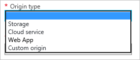

<properties
	 pageTitle="Using Azure CDN | Microsoft Azure"
	 description="This topic shows how to enable the Content Delivery Network (CDN) for Azure. The tutorial walks through the creation of a new CDN profile and endpoint."
	 services="cdn"
	 documentationCenter=""
	 authors="camsoper"
	 manager="erikre"
	 editor=""/>
<tags
	 ms.service="cdn"
	 ms.workload="media"
	 ms.tgt_pltfrm="na"
	 ms.devlang="na"
	 ms.topic="get-started-article"
	 ms.date="07/28/2016" 
	 ms.author="casoper"/>

# Using Azure CDN  

This topic walks through enabling Azure CDN by creating a new CDN profile and endpoint.

>[AZURE.IMPORTANT] For an introduction to how CDN works, as well as a list of features, see the [CDN Overview](./cdn-overview.md).

## Create a new CDN profile

A CDN profile is a collection of CDN endpoints.  Each profile contains one or more CDN endpoints.  You may wish to use multiple profiles to organize your CDN endpoints by internet domain, web application, or some other criteria.

> [AZURE.NOTE] By default, a single Azure subscription is limited to eight CDN profiles. Each CDN profile is limited to ten CDN endpoints.
>
> CDN pricing is applied at the CDN profile level. If you wish to use a mix of Azure CDN pricing tiers, you will need multiple CDN profiles.

[AZURE.INCLUDE [cdn-create-profile](../../includes/cdn-create-profile.md)]

## Create a new CDN endpoint

**To create a new CDN endpoint**

1. In the [Azure Portal](https://portal.azure.com), navigate to your CDN profile.  You may have pinned it to the dashboard in the previous step.  If you not, you can find it by clicking **Browse**, then **CDN profiles**, and clicking on the profile you plan to add your endpoint to.

    The CDN profile blade appears.

    ![CDN profile][cdn-profile-settings]

2. Click the **Add Endpoint** button.

    ![Add endpoint button][cdn-new-endpoint-button]

    The **Add an endpoint** blade appears.

    ![Add endpoint blade][cdn-add-endpoint]

3. Enter a **Name** for this CDN endpoint.  This name will be used to access your cached resources at the domain `<endpointname>.azureedge.net`.

4. In the **Origin type** dropdown, select your origin type.  Select **Storage** for an Azure Storage account, **Cloud service** for an Azure Cloud Service, **Web App** for an Azure Web App, or **Custom origin** for any other publicly accessible web server origin (hosted in Azure or elsewhere).

	
		
5. In the **Origin hostname** dropdown, select or type your origin domain.  The dropdown will list all available origins of the type you specified in step 4.  If you selected *Custom origin* as your **Origin type**, you will type in the domain of your custom origin.

6. In the **Origin path** text box, enter the path to the resources you want to cache, or leave blank to allow cache any resource at the domain you specified in step 5.

7. In the **Origin host header**, enter the host header you want the CDN to send with each request, or leave the default.

	> [AZURE.WARNING] Some types of origins, such as Azure Storage and Web Apps, require the host header to match the domain of the origin. Unless you have an origin that requires a host header different from its domain, you should leave the default value.

8. For **Protocol** and **Origin port**, specify the protocols and ports used to access your resources at the origin.  At least one protocol (HTTP or HTTPS) must be selected.
	
	> [AZURE.NOTE] The **Origin port** only affects what port the endpoint uses to retrieve information from the origin.  The endpoint itself will only be available to end clients on the default HTTP and HTTPS ports (80 and 443), regardless of the **Origin port**.  
	>
	> **Azure CDN from Akamai** endpoints do not allow the full TCP port range for origins.  For a list of origin ports that are not allowed, see [Azure CDN from Akamai behavior details](cdn-akamai-behavior-details.md).  
	>
	> Accessing CDN content using HTTPS has the following constraints:
	> 
	> - You must use the SSL certificate provided by the CDN. Third party certificates are not supported.
	> - You must use the CDN-provided domain (`<endpointname>.azureedge.net`) to access HTTPS content. HTTPS support is not available for custom domain names (CNAMEs) since the CDN does not support custom certificates at this time.

9. Click the **Add** button to create the new endpoint.

10. Once the endpoint is created, it appears in a list of endpoints for the profile. The list view shows the URL to use to access cached content, as well as the origin domain.

    ![CDN endpoint][cdn-endpoint-success]

    > [AZURE.IMPORTANT] The endpoint will not immediately be available for use, as it takes time for the registration to propagate through the CDN.  For <b>Azure CDN from Akamai</b> profiles, propagation will usually complete within one minute.  For <b>Azure CDN from Verizon</b> profiles, propagation will usually complete within 90 minutes, but in some cases can take longer.
	>	 
	> Users who try to use the CDN domain name before the endpoint configuration has propagated to the POPs will receive HTTP 404 response codes.  If it's been several hours since you created your endpoint and you're still receiving 404 responses, please see [Troubleshooting CDN endpoints returning 404 statuses](cdn-troubleshoot-endpoint.md).

##See Also
- [Controlling caching behavior of requests with query strings](cdn-query-string.md)
- [How to Map CDN Content to a Custom Domain](cdn-map-content-to-custom-domain.md)
- [Pre-load assets on an Azure CDN endpoint](cdn-preload-endpoint.md)
- [Purge an Azure CDN Endpoint](cdn-purge-endpoint.md)
- [Troubleshooting CDN endpoints returning 404 statuses](cdn-troubleshoot-endpoint.md)

[cdn-profile-settings]: ./media/cdn-create-new-endpoint/cdn-profile-settings.png
[cdn-new-endpoint-button]: ./media/cdn-create-new-endpoint/cdn-new-endpoint-button.png
[cdn-add-endpoint]: ./media/cdn-create-new-endpoint/cdn-add-endpoint.png
[cdn-endpoint-success]: ./media/cdn-create-new-endpoint/cdn-endpoint-success.png
