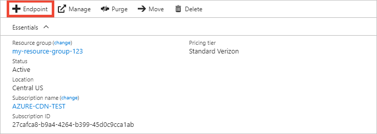
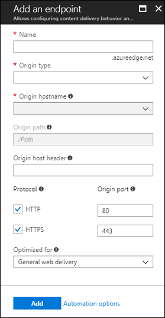
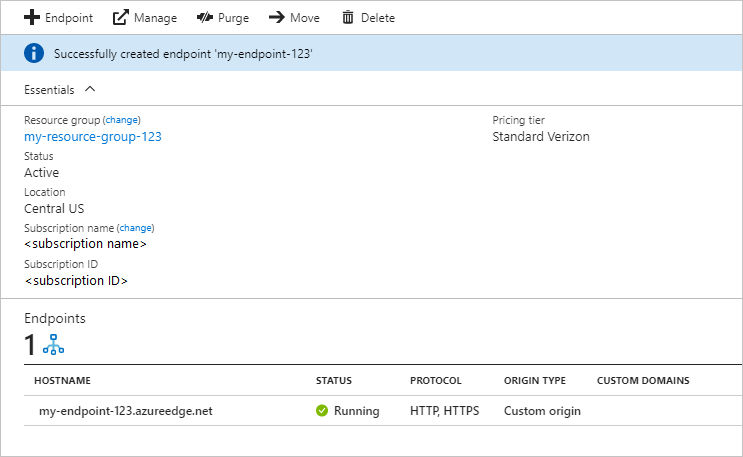

# Quickstart: Create an Azure CDN profile and endpoint

In this quickstart, you enable Azure Content Delivery Network (CDN) by creating a new CDN profile, which is a collection of one or more CDN endpoints. After you have created a profile and an endpoint, you can start delivering content to your customers.

## Prerequisites

- An Azure account with an active subscription. [Create an account for free](https://azure.microsoft.com/free/?ref=microsoft.com&utm_source=microsoft.com&utm_medium=docs&utm_campaign=visualstudio).
- An Azure Storage account named *cdnstorageacct123*, which you use for the origin hostname. To complete this requirement, see [Integrate an Azure Storage account with Azure CDN](cdn-create-a-storage-account-with-cdn.md).

## Sign in to the Azure portal

Sign in to the [Azure portal](https://portal.azure.com) with your Azure account.

[!INCLUDE [cdn-create-profile](../../includes/cdn-create-profile.md)]

## Create a new CDN endpoint

After you've created a CDN profile, you use it to create an endpoint.

1. In the Azure portal, select in your dashboard the CDN profile that you created. If you can't find it, you can either open the resource group in which you created it, or use the search bar at the top of the portal, enter the profile name, and select the profile from the results.
   
1. On the CDN profile page, select **+ Endpoint**.
   
    
   
    The **Add an endpoint** pane appears.

3. Enter the following setting values:

    | Setting | Value |
    | ------- | ----- |
    | **Name** | Enter *cdn-endpoint-123* for your endpoint hostname. This name must be globally unique across Azure; if it's already in use, enter a different name. This name is used to access your cached resources at the domain _&lt;endpoint-name&gt;_.azureedge.net.|
    | **Origin type** | Select **Storage**. | 
    | **Origin hostname** | Select the host name of the Azure Storage account you're using from the drop-down list, such as *cdnstorageacct123.blob.core.windows.net*. |
    | **Origin path** | Leave blank. |
    | **Origin host header** | Leave the default value (which is the host name for the storage account). |  
    | **Protocol** | Leave the default **HTTP** and **HTTPS** options selected. |
    | **Origin port** | Leave the default port values. | 
    | **Optimized for** | Leave the default selection, **General web delivery**. |

    

3. Select **Add** to create the new endpoint. After the endpoint is created, it appears in the list of endpoints for the profile.
    
   
    
   The time it takes for the endpoint to propagate depends on the pricing tier selected when you created the profile. **Standard Akamai** usually completes within one minute, **Standard Microsoft** in 10 minutes, and **Standard Verizon** and **Premium Verizon** in up to 90 minutes.

## Clean up resources

In the preceding steps, you created a CDN profile and an endpoint in a resource group. Save these resources if you want to go to [Next steps](#next-steps) and learn how to add a custom domain to your endpoint. However, if you don't expect to use these resources in the future, you can delete them by deleting the resource group, thus avoiding additional charges:

1. From the left-hand menu in the Azure portal, select **Resource groups** and then select **CDNQuickstart-rg**.

2. On the **Resource group** page, select **Delete resource group**, enter *CDNQuickstart-rg* in the text box, then select **Delete**. This action delete the resource group, profile, and endpoint that you created in this quickstart.

## Next steps

> [!div class="nextstepaction"]
> [Tutorial: Use CDN to server static content from a web app](cdn-add-to-web-app.md)

> [!div class="nextstepaction"]
> [Tutorial: Add a custom domain to your Azure CDN endpoint](cdn-map-content-to-custom-domain.md)
