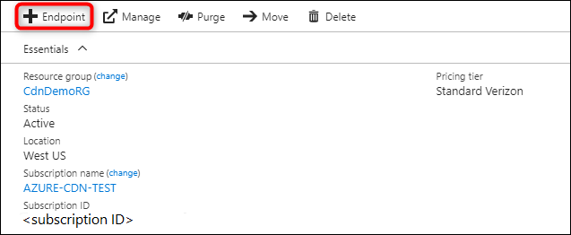

# Quickstart: Create an Azure CDN profile and endpoint
In this quickstart, you wsill enable Azure Content Delivery Network (CDN) by creating a new CDN profile and CDN endpoint. After you have created a profile and an endpoint, you can start delivering content to your customers.

[!INCLUDE [quickstarts-free-trial-note](../../includes/quickstarts-free-trial-note.md)]

## Log in to the Azure portal
Log in to the [Azure portal](https://portal.azure.com) with your Azure account.

[!INCLUDE [cdn-create-profile](../../includes/cdn-create-profile.md)]

## Create a new CDN endpoint

After you've created a CDN profile, you can use it to create an endpoint.

1. In the [Azure portal](https://portal.azure.com), select the CDN profile that you just created in your dashboard. If you can't find it, select **All services**, then select **CDN profiles**. In the **CDN profiles** page, select the profile that you want to use. 
   
    The CDN profile page appears.

2. Select **Endpoint**.
   
    
   
    The **Add an endpoint** page appears.

    Use the settings specified in the table following the image.
   
    

    | Setting | Value |
    | ------- | --------------- |
    | **Name** | Enter *my-endpoint-123* for your endpoint name. This name must be globally unique; if it is already in use, you may use a different one. This name is used to access your cached resources at the domain `<endpointname>.azureedge.net`.|
    | **Origin type** | Select **Custom origin**. | 
    | **Origin hostname** | Enter *my-hostname-123.net* for your hostname. This name must be globally unique; if it is already in use, you may use a different one |
    | **Origin path** | Leave blank. |
    | **Origin host header** | Leave the default generated value. |  
    | **Protocol** | Leave the defalut **HTTP** and **HTTPS** options selected. |
    | **Origin port** | Leave the default port values. | 
    | **Optimized for** | Leave the default selection, **General web delivery**. |
    
3. Select **Add** to create the new endpoint.
   
   After the endpoint is created, it appears in the list of endpoints for the profile.
    
   
    
   Because it takes time for the registration to propagate, the endpoint isn't immediately available for use. 

## Clean up resources
To delete a profile or endpoint when it is no longer needed, select it and then select **Delete**. 

## Next steps
In this quickstart, you’ve created a CDN profile and an endpoint. To learn about custom domains, continue to the tutorial for adding a custom domain to your CDN endpoint.

> [!div class="nextstepaction"]
> [Add a custom domain](cdn-map-content-to-custom-domain.md)

