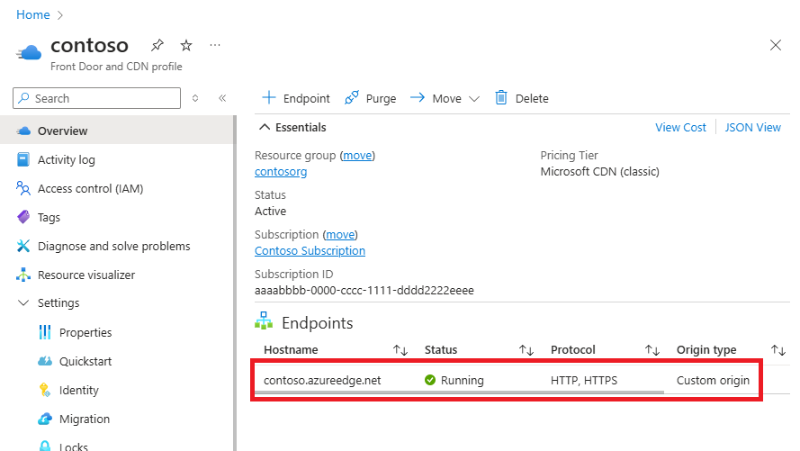
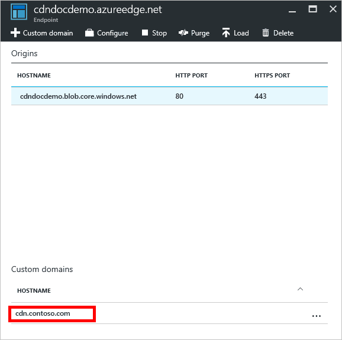
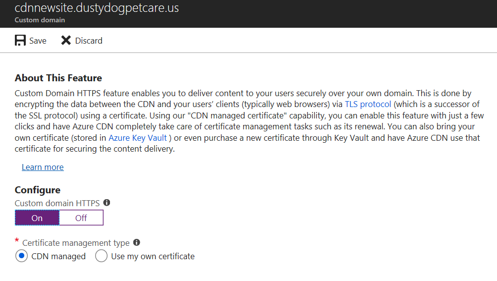
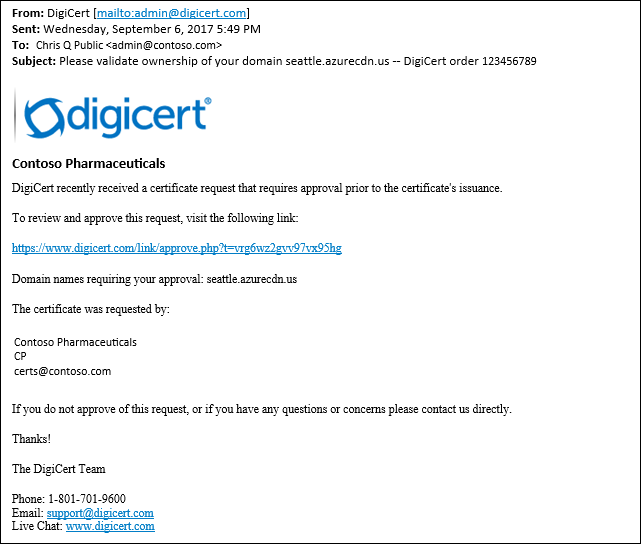
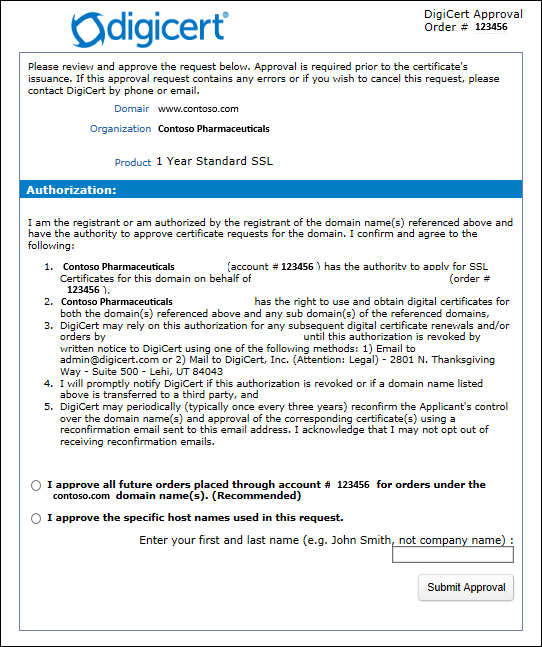
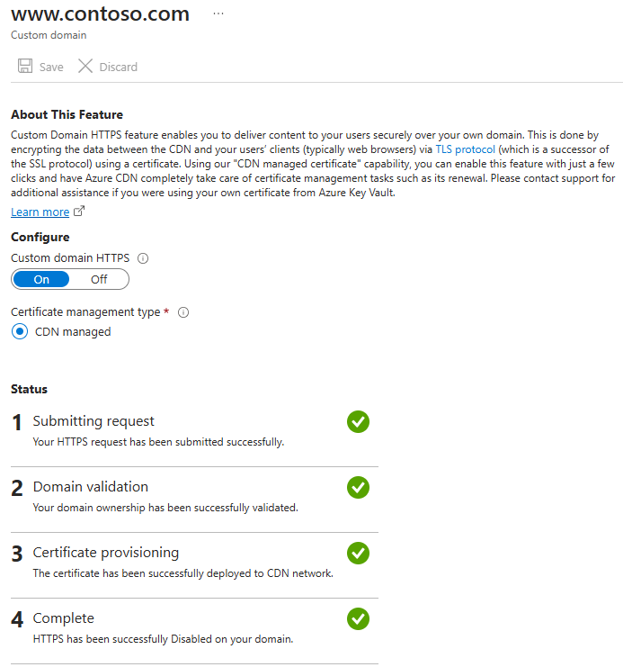
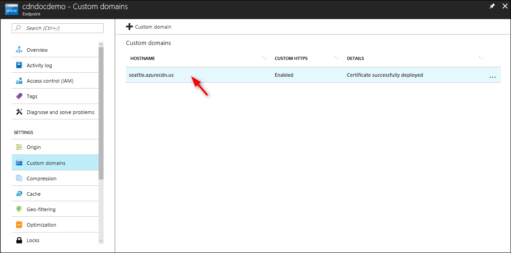
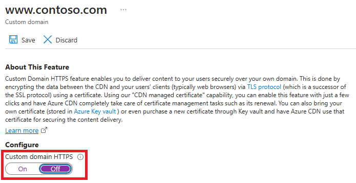
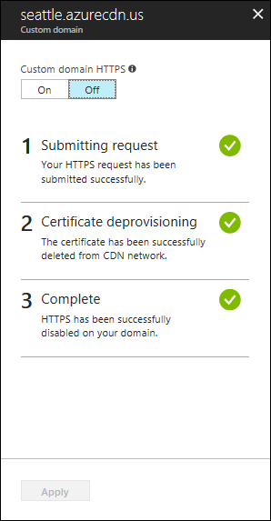

# Tutorial: Configure HTTPS on an Azure CDN custom domain

This tutorial shows how to enable the HTTPS protocol for a custom domain that's associated with an Azure CDN endpoint.

The HTTPS protocol on your custom domain (for example, https:\//www.contoso.com), ensures your sensitive data is delivered securely via TLS/SSL. When your web browser is connected via HTTPS, the browser validates the web site’s certificate. The browser verifies it’s issued by a legitimate certificate authority. This process provides security and protects your web applications from attacks.

Azure CDN supports HTTPS on a CDN endpoint hostname, by default. For example, if you create a CDN endpoint (such as https:\//contoso.azureedge.net), HTTPS is automatically enabled.

Some of the key attributes of the custom HTTPS feature are:

- No extra cost: There aren't costs for certificate acquisition or renewal and no extra cost for HTTPS traffic. You pay only for GB egress from the CDN.

- Simple enablement: One-click provisioning is available from the [Azure portal](https://portal.azure.com). You can also use REST API or other developer tools to enable the feature.

- Complete certificate management is available:
    * All certificate procurement and management is handled for you.
    * Certificates are automatically provisioned and renewed before expiration.

In this tutorial, you learn how to:
> [!div class="checklist"]
> - Enable the HTTPS protocol on your custom domain.
> - Use a CDN-managed certificate
> - Use your own certificate
> - Validate the domain
> - Disable the HTTPS protocol on your custom domain.

## Prerequisites

[!INCLUDE [updated-for-az](../../includes/updated-for-az.md)]

Before you can complete the steps in this tutorial, create a CDN profile and at least one CDN endpoint. For more information, see [Quickstart: Create an Azure CDN profile and endpoint](cdn-create-new-endpoint.md).

Associate an Azure CDN custom domain on your CDN endpoint. For more information, see [Tutorial: Add a custom domain to your Azure CDN endpoint](cdn-map-content-to-custom-domain.md).

> [!IMPORTANT]
> CDN-managed certificates are not available for root or apex domains. If your Azure CDN custom domain is a root or apex domain, you must use the Bring your own certificate feature.
>

---

## TLS/SSL certificates

To enable HTTPS on an Azure CDN custom domain, you use a TLS/SSL certificate. You choose to use a certificate that is managed by Azure CDN or use your certificate.

# [Option 1 (default): Enable HTTPS with a CDN-managed certificate](#tab/option-1-default-enable-https-with-a-cdn-managed-certificate)

Azure CDN handles certificate management tasks such as procurement and renewal. After you enable the feature, the process starts immediately.

If the custom domain is already mapped to the CDN endpoint, no further action is needed. Azure CDN will process the steps and complete your request automatically.

If your custom domain is mapped elsewhere, use email to validate your domain ownership.

To enable HTTPS on a custom domain, follow these steps:

1. Go to the [Azure portal](https://portal.azure.com) to find a certificate managed by your Azure CDN. Search for and select **CDN profiles**.

2. Choose your profile:
    * **Azure CDN Standard from Microsoft**
    * **Azure CDN Standard from Akamai**
    * **Azure CDN Standard from Verizon**
    * **Azure CDN Premium from Verizon**

3. In the list of CDN endpoints, select the endpoint containing your custom domain.

    

    The **Endpoint** page appears.

4. In the list of custom domains, select the custom domain for which you want to enable HTTPS.

    

    The **Custom domain** page appears.

5. Under Certificate management type, select **CDN managed**.

6. Select **On** to enable HTTPS.

    

7. Continue to [Validate the domain](#validate-the-domain).


# [Option 2: Enable HTTPS with your own certificate](#tab/option-2-enable-https-with-your-own-certificate)

> [!IMPORTANT]
> This option is available only with **Azure CDN from Microsoft** and **Azure CDN from Verizon** profiles.
>

You can use your own certificate to enable the HTTPS feature. This process is done through an integration with Azure Key Vault, which allows you to store your certificates securely. Azure CDN uses this secure mechanism to get your certificate and it requires a few extra steps. When you create your TLS/SSL certificate, you must create a complete certificate chain with an allowed certificate authority (CA) that is part of the [Microsoft Trusted CA List](https://ccadb-public.secure.force.com/microsoft/IncludedCACertificateReportForMSFT). If you use a non-allowed CA, your request will be rejected.  If a certificate without complete chain is presented, the requests which involve that certificate are not guaranteed to work as expected. For Azure CDN from Verizon, any valid CA will be accepted.

### Prepare your Azure Key vault account and certificate

1. Azure Key Vault: You must have a running Azure Key Vault account under the same subscription as the Azure CDN profile and CDN endpoints that you want to enable custom HTTPS. Create an Azure Key Vault account if you don’t have one.

2. Azure Key Vault certificates: If you have a certificate, upload it directly to your Azure Key Vault account. If you don't have a certificate, create a new certificate directly through Azure Key Vault.

> [!NOTE]
> * Azure CDN only supports PFX certificates.
> * The certificate must have a complete certificate chain with leaf and intermediate certificates, and root CA must be part of the [Microsoft Trusted CA List](https://ccadb-public.secure.force.com/microsoft/IncludedCACertificateReportForMSFT).

### Register Azure CDN

Register Azure CDN as an app in your Azure Active Directory.

> [!NOTE]
> * `205478c0-bd83-4e1b-a9d6-db63a3e1e1c8` is the service principal for `Microsoft.AzureFrontDoor-Cdn`.
> * You need to have the **Global Administrator** role to run this command.
> * The service principal name was changed from `Microsoft.Azure.Cdn` to `Microsoft.AzureFrontDoor-Cdn`.

#### Azure PowerShell

1. If needed, install [Azure PowerShell](/powershell/azure/install-azure-powershell) on your local machine.

2. In PowerShell, run the following command:

     `New-AzADServicePrincipal -ApplicationId "205478c0-bd83-4e1b-a9d6-db63a3e1e1c8"`

    ```
    New-AzADServicePrincipal -ApplicationId "205478c0-bd83-4e1b-a9d6-db63a3e1e1c8"

    Secret                :
    ServicePrincipalNames : {205478c0-bd83-4e1b-a9d6-db63a3e1e1c8,
				https://microsoft.onmicrosoft.com/033ce1c9-f832-4658-b024-ef1cbea108b8}
    ApplicationId         : 205478c0-bd83-4e1b-a9d6-db63a3e1e1c8
    ObjectType            : ServicePrincipal
    DisplayName           : Microsoft.AzureFrontDoor-Cdn
    Id                    : abcdef12-3456-7890-abcd-ef1234567890
    Type                  :
    ```

#### Azure CLI

1. If needed, install [Azure CLI](/cli/azure/install-azure-cli) on your local machine.

1. Use the Azure CLI to run the following command:

     ```azurecli-interactive
     az ad sp create --id 205478c0-bd83-4e1b-a9d6-db63a3e1e1c8
     ```

### Grant Azure CDN access to your key vault

Grant Azure CDN permission to access the certificates (secrets) in your Azure Key Vault account.

1. In your key vault in the **Settings** section, select **Access policies**. In the right pane, select **+ Add Access Policy**:

    :::image type="content" source="./media/cdn-custom-ssl/cdn-new-access-policy.png" alt-text="Create keyvault access policy for CDN" border="true":::

2. In the **Add access policy** page, select **None selected** next to **Select principal**. In the **Principal** page, enter **205478c0-bd83-4e1b-a9d6-db63a3e1e1c8**. Select **Microsoft.AzureFrontdoor-Cdn**.  Choose **Select**:

3. In **Select principal**, search for **205478c0-bd83-4e1b-a9d6-db63a3e1e1c8**, choose **Microsoft.AzureFrontDoor-Cdn**. Choose **Select**.

    :::image type="content" source="./media/cdn-custom-ssl/cdn-access-policy-settings.png" alt-text="Select service principal of Azure CDN" border="true":::

4. Select **Certificate permissions**. Select the check box for **Get** to allow CDN permissions to get the certificates.

5. Select **Secret permissions**. Select the check box for **Get** to allow CDN permissions to get the secrets:

    :::image type="content" source="./media/cdn-custom-ssl/cdn-vault-permissions.png" alt-text="Select permissions for CDN to keyvault" border="true":::

6. Select **Add**.

> [!NOTE]
> Azure CDN can now access this key vault and the certificates (secrets) that are stored in this key vault. Any CDN instance created in this subscription will have access to the certificates in this key vault.

### Select the certificate for Azure CDN to deploy

1. Return to the Azure CDN portal and select the profile and CDN endpoint you want to enable custom HTTPS.

2. In the list of custom domains, select the custom domain for which you want to enable HTTPS.

    The **Custom domain** page appears.

3. Under Certificate management type, select **Use my own certificate**.

    :::image type="content" source="./media/cdn-custom-ssl/cdn-configure-your-certificate.png" alt-text="Screenshot of how to configure certificate for cdn endpoint.":::

4. Select a key vault, Certificate/Secret, and Certificate/Secret version.

    Azure CDN lists the following information:
    - The key vault accounts for your subscription ID.
    - The certificates/secrets under the selected key vault.
    - The available certificate/secret versions.

    > [!NOTE]
    > * Azure CDN only supports PFX certificates.
    > * In order for the certificate to be automatically rotated to the latest version when a newer version of the certificate is available in your Key Vault, please set the certificate/secret version to 'Latest'. If a specific version is selected, you have to re-select the new version manually for certificate rotation. It takes up to 72 hours for the new version of the certificate/secret to be deployed. Only Standard Microsoft SKU supports certificate auto rotation.

5. Select **On** to enable HTTPS.

6. When you use your certificate, domain validation isn't required. Continue to [Wait for propagation](#wait-for-propagation).

---

## Validate the domain

If you have a custom domain in use mapped to your custom endpoint with a CNAME record or you're using your own certificate, continue to [Custom domain mapped to your CDN endpoint](#custom-domain-is-mapped-to-your-cdn-endpoint-by-a-cname-record).

Otherwise, if the CNAME record entry for your endpoint no longer exists or it contains the cdnverify subdomain, continue to [Custom domain not mapped to your CDN endpoint](#custom-domain-isnt-mapped-to-your-cdn-endpoint).

### Custom domain is mapped to your CDN endpoint by a CNAME record

When you added a custom domain to your endpoint, you created a CNAME record in the DNS domain registrar mapped to your CDN endpoint hostname.

If that CNAME record still exists and doesn't contain the cdnverify subdomain, the DigiCert CA uses it to automatically validate ownership of your custom domain.

If you're using your own certificate, domain validation isn't required.

Your CNAME record should be in the following format:

* *Name* is your custom domain name.
* *Value* is your CDN endpoint hostname.

| Name            | Type  | Value                 |
|-----------------|-------|-----------------------|
| <www.contoso.com> | CNAME | contoso.azureedge.net |

For more information about CNAME records, see [Create the CNAME DNS record](./cdn-map-content-to-custom-domain.md).

If your CNAME record is in the correct format, DigiCert automatically verifies your custom domain name and creates a certificate for your domain. DigitCert won't send you a verification email and you won't need to approve your request. The certificate is valid for one year and will be autorenewed before it expires. Continue to [Wait for propagation](#wait-for-propagation).

Automatic validation typically takes a few hours. If you don’t see your domain validated in 24 hours, open a support ticket.

>[!NOTE]
>If you have a Certificate Authority Authorization (CAA) record with your DNS provider, it must include the appropriate CA(s) for authorization. DigiCert is the CA for Microsoft and Verizon profiles. Akamai profile obtains certificates from three CAs: GeoTrust, Let's Encrypt and DigiCert. If a CA receives an order for a certificate for a domain that has a CAA record and that CA is not listed as an authorized issuer, it is prohibited from issuing the certificate to that domain or subdomain. For  information about managing CAA records, see [Manage CAA records](https://support.dnsimple.com/articles/manage-caa-record/). For a CAA record tool, see [CAA Record Helper](https://sslmate.com/caa/).

### Custom domain isn't mapped to your CDN endpoint

>[!NOTE]
>If you are using **Azure CDN from Akamai**, the following CNAME should be set up to enable automated domain validation. "_acme-challenge.&lt;custom domain hostname&gt; -> CNAME -> &lt;custom domain hostname&gt;.ak-acme-challenge.azureedge.net"

If the CNAME record entry contains the cdnverify subdomain, follow the rest of the instructions in this step.

DigiCert sends a verification email to the following email addresses. Verify that you can approve directly from one of the following addresses:

* **admin@your-domain-name.com**
* **administrator@your-domain-name.com**
* **webmaster@your-domain-name.com**
* **hostmaster@your-domain-name.com**
* **postmaster@your-domain-name.com**

You should receive an email in a few minutes for you to approve the request. In case you're using a spam filter, add verification@digicert.com to its allowlist. If you don't receive an email within 24 hours, contact Microsoft support.



When you select the approval link, you're directed to the following online approval form:



Follow the instructions on the form; you have two verification options:

- You can approve all future orders placed through the same account for the same root domain; for example, contoso.com. This approach is recommended if you plan to add other custom domains for the same root domain.

- You can approve just the specific host name used in this request. Another approval is required for later requests.

After approval, DigiCert completes the certificate creation for your custom domain name. The certificate is valid for one year and will be autorenewed before it's expired.

## Wait for propagation

After the domain name is validated, it can take up to 6-8 hours for the custom domain HTTPS feature to be activated. When the process completes, the custom HTTPS status in the Azure portal is changed to **Enabled**. The four operation steps in the custom domain dialog are marked as complete. Your custom domain is now ready to use HTTPS.



### Operation progress

The following table shows the operation progress that occurs when you enable HTTPS. After you enable HTTPS, four operation steps appear in the custom domain dialog. As each step becomes active, other substep details appear under the step as it progresses. Not all of these substeps will occur. After a step successfully completes, a green check mark appears next to it.

| Operation step | Operation substep details |
| --- | --- |
| 1 Submitting request | Submitting request |
| | Your HTTPS request is being submitted. |
| | Your HTTPS request has been submitted successfully. |
| 2 Domain validation | Domain is automatically validated if it's CNAME mapped to the CDN Endpoint. Otherwise, a verification request will be sent to the email listed in your domain’s registration record (WHOIS registrant).|
| | Your domain ownership has been successfully validated. |
| | Domain ownership validation request expired (customer likely didn't respond within 6 days). HTTPS won't be enabled on your domain. * |
| | Domain ownership validation request was rejected by the customer. HTTPS won't be enabled on your domain. * |
| 3 Certificate provisioning | The certificate authority is currently issuing the certificate needed to enable HTTPS on your domain. |
| | The certificate has been issued and is currently being deployed to CDN network. This could take up to 6 hours. |
| | The certificate has been successfully deployed to CDN network. |
| 4 Complete | HTTPS has been successfully enabled on your domain. |

\* This message doesn't appear unless an error has occurred.

If an error occurs before the request is submitted, the following error message is displayed:

<code>
We encountered an unexpected error while processing your HTTPS request. Please try again and contact support if the issue persists.
</code>


## Clean up resources - disable HTTPS

In this section, you learn how to disable HTTPS for your custom domain.

### Disable the HTTPS feature

1. In the [Azure portal](https://portal.azure.com), search for and select **CDN profiles**.

2. Choose your **Azure CDN Standard from Microsoft**, **Azure CDN Standard from Verizon**, or **Azure CDN Premium from Verizon** profile.

3. In the list of endpoints, pick the endpoint containing your custom domain.

4. Choose the custom domain for which you want to disable HTTPS.

    

5. Choose **Off** to disable HTTPS, then select **Apply**.

    

### Wait for propagation

After the custom domain HTTPS feature is disabled, it can take up to 6-8 hours for it to take effect. When the process is complete, the custom HTTPS status in the Azure portal is changed to **Disabled**. The three operation steps in the custom domain dialog are marked as complete. Your custom domain can no longer use HTTPS.



#### Operation progress

The following table shows the operation progress that occurs when you disable HTTPS. After you disable HTTPS, three operation steps appear in the custom domain dialog. When a step becomes active, details appear under the step. After a step successfully completes, a green check mark appears next to it.

| Operation progress | Operation details |
| --- | --- |
| 1 Submitting request | Submitting your request |
| 2 Certificate deprovisioning | Deleting certificate |
| 3 Complete | Certificate deleted |

## Frequently asked questions

1. *Who is the certificate provider and what type of certificate is used?*

    A dedicated certificate provided by Digicert is used for your custom domain for:

    * **Azure CDN from Verizon**
    * **Azure CDN from Microsoft**

2. *Do you use IP-based or SNI TLS/SSL?*

    Both **Azure CDN from Verizon** and **Azure CDN Standard from Microsoft** use SNI TLS/SSL.

3. *What if I don't receive the domain verification email from DigiCert?*

    If you aren't using the *cdnverify* subdomain and your CNAME entry is for your endpoint hostname, you won't receive a domain verification email.

    Validation occurs automatically. Otherwise, if you don't have a CNAME entry and you haven't received an email within 24 hours, contact Microsoft support.

4. *Is using a SAN certificate less secure than a dedicated certificate?*

	A SAN certificate follows the same encryption and security standards as a dedicated certificate. All issued TLS/SSL certificates use SHA-256 for enhanced server security.

5. *Do I need a Certificate Authority Authorization record with my DNS provider?*

    Certificate Authority Authorization record isn't currently required. However, if you do have one, it must include DigiCert as a valid CA.

6. *On June 20, 2018, Azure CDN from Verizon started using a dedicated certificate with SNI TLS/SSL by default. What happens to my existing custom domains using Subject Alternative Names (SAN) certificate and IP-based TLS/SSL?*

    Your existing domains will be gradually migrated to single certificate in the upcoming months if Microsoft analyzes that only SNI client requests are made to your application.

    If non-SNI clients are detected, your domains stay in the SAN certificate with IP-based TLS/SSL. Requests to your service or clients that are non-SNI, are unaffected.

7. *How do cert renewals work with Bring Your Own Certificate?*

    To ensure a newer certificate is deployed to PoP infrastructure, upload your new certificate to Azure KeyVault. In your TLS settings on Azure CDN, choose the newest certificate version and select save. Azure CDN will then propagate your new updated cert.
    
    For **Azure CDN from Verizon** profiles, if you use the same Azure Key Vault certificate on several custom domains (e.g. a wildcard certificate), ensure you update all of your custom domains that use that same certificate to the newer certificate version.

8. *Do I need to re-enable HTTPS after the endpoint restarts?*

    Yes. If you're using **Azure CDN from Akamai**, if the endpoint stops and restarts, you must re-enable the HTTPS setting if the setting was active before.


## Next steps

In this tutorial, you learned how to:

> [!div class="checklist"]
> - Enable the HTTPS protocol on your custom domain.
> - Use a CDN-managed certificate
> - Use your own certificate
> - Validate the domain.
> - Disable the HTTPS protocol on your custom domain.

Advance to the next tutorial to learn how to configure caching on your CDN endpoint.

> [!div class="nextstepaction"]
> [Tutorial: Set Azure CDN caching rules](cdn-caching-rules-tutorial.md)
