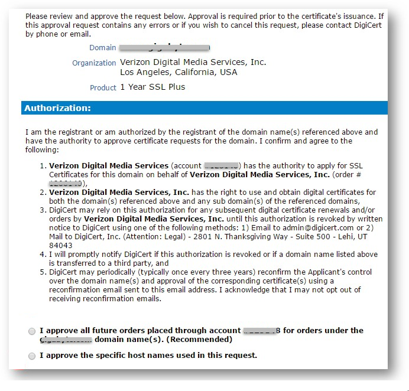

# Enable HTTPS on an Azure CDN custom domain

[!INCLUDE [cdn-verizon-only](../../includes/cdn-verizon-only.md)]

HTTPS support for Azure CDN custom domains enables you to deliver secure content via SSL using your own domain name to improve the security of data while in transit. The end-to-end workflow to enable HTTPS for your custom domain is simplified via one-click enablement, complete certificate management, and all with no additional cost.

It's critical to ensure the privacy and data integrity of all of your web applications sensitive data while in transit. Using the HTTPS protocol ensures that your sensitive data is encrypted when it is sent across the internet. It provides trust, authentication and protects your web applications from attacks. Currently, Azure CDN supports HTTPS on a CDN endpoint. For example, if you create a CDN endpoint from Azure CDN (e.g. https://contoso.azureedge.net), HTTPS is enabled by default. Now, with custom domain HTTPS, you can enable secure delivery for a custom domain (e.g. https://www.contoso.com) as well. 

Some of the key attributes of HTTPS feature are:

- No additional cost: There are no costs for certificate acquisition or renewal and no additional cost for HTTPS traffic. You just pay for GB egress from the CDN.

- Simple enablement: One click provisioning is available from the [Azure portal](https://portal.azure.com). You can also use REST API or other developer tools to enable the feature.

- Complete certificate management: All certificate procurement and management is handled for you. Certificates are automatically provisioned and renewed prior to expiration. This completely removes the risks of service interruption as a result of a certificate expiring.

>[!NOTE] 
>Prior to enabling HTTPS support, you must have already established an [Azure CDN custom domain](./cdn-map-content-to-custom-domain.md).

## Step 1: Enabling the feature 

1. In the [Azure portal](https://portal.azure.com), browse to your Verizon standard or premium CDN profile.

2. In the list of endpoints, click the endpoint containing your custom domain.

3. Click the custom domain for which you want to enable HTTPS.

    

4. Click **On** to enable HTTPS and save the change.

    

## Step 2: Domain validation

>[!IMPORTANT] 
>You must complete domain validation before HTTPS will be active on your custom domain. You have 6 business days to approve the domain. Request will be canceled with no approval within 6 business days.  

After enabling HTTPS on your custom domain, our HTTPS certificate provider DigiCert will validate ownership of your domain by contacting the registrant for your domain, based on WHOIS registrant information, via email (by default) or phone. DigiCert will also send the verification email to the below addresses. If WHOIS registrant information is private, make sure you can approve directly from one of these addresses.

>admin@<your-domain-name.com>
>administrator@<your-domain-name.com>  
>webmaster@<your-domain-name.com>  
>hostmaster@<your-domain-name.com>  
>postmaster@<your-domain-name.com>

Upon receiving the email, you have two verification options:

1. You can approve all future orders placed through the same account for the same root domain, e.g. consoto.com. This is a recommended approach if you are planning to add additional custom domains in the future for the same root domain.
 
2. You can just approve the specific host name used in this request. Additional approval will be required for subsequent requests.

	Example email:
	
	

After approval, DigiCert will add your custom domain name to the SAN certificate. The certificate will be valid for one year and will be auto renewed before it's expired.

## Step 3: Wait for the propagation then start using your feature

After the domain name is validated it will take up to 6-8 hours for the custom domain HTTPS feature to be active. After the process is complete, the "custom HTTPS" status in the Azure portal will be set to "Enabled". HTTPS with your custom domain is now ready for your use.

## Frequently asked questions

1. *Who is the certificate provider and what type of certificate is used?*

    We use Subject Alternative Names (SAN) certificate provided by DigiCert. A SAN certificate can secure multiple fully qualifIed domain names with one certificate.

2. *Can I use my dedicated certificate?*
    
    Not currently, but it's on the roadmap.

3. *What if I don't receive the domain verification email from DigiCert?*

    Please contact Microsoft if you don't receive an email within 24 hours.

4. *Is using a SAN certificate less secure than a dedicated certificate?*
	
	A SAN cert follows the same encryption and security standards as a dedicated cert. All issued SSL certificates are using SHA-256 for enhanced server security.

5. *Can I use custom domain HTTPS with Azure CDN from Akamai?*

	Currently, this feature is only available with Azure CDN from Verizon. We are working on supporting this feature with Azure CDN from Akamai in the coming months.

## Next steps

- Learn how to set up a [custom domain on your Azure CDN endpoint](./cdn-map-content-to-custom-domain.md)

