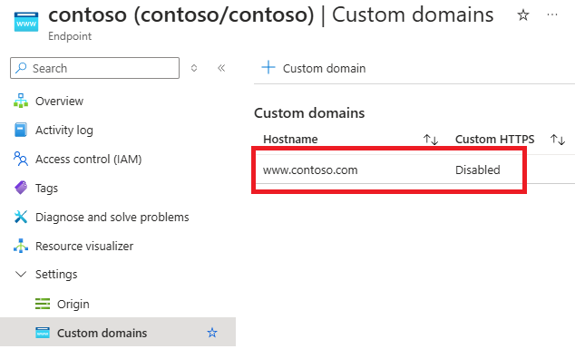
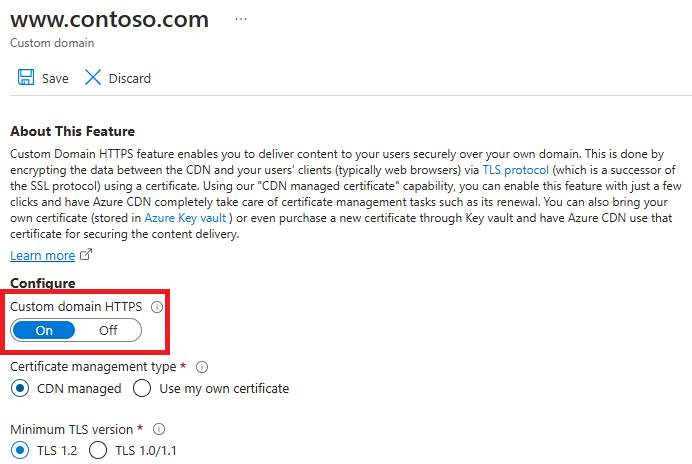
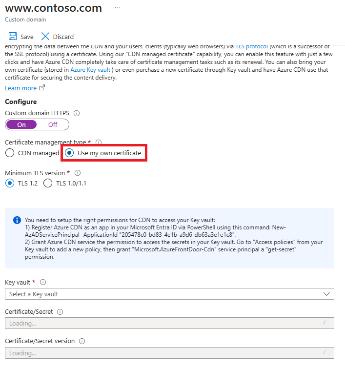

# Tutorial: Configure HTTPS on an Azure CDN custom domain

This tutorial shows how to enable the HTTPS protocol for a custom domain that's associated with an Azure CDN endpoint. By using the HTTPS protocol on your custom domain (for example, https:\//www.contoso.com), you ensure that your sensitive data is delivered securely via TLS/SSL encryption when it is sent across the internet. When your web browser is connected to a web site via HTTPS, it validates the web site’s security certificate and verifies it’s issued by a legitimate certificate authority. This process provides security and protects your web applications from attacks.

Azure CDN supports HTTPS on a CDN endpoint hostname, by default. For example, if you create a CDN endpoint (such as https:\//contoso.azureedge.net), HTTPS is automatically enabled.  

Some of the key attributes of the custom HTTPS feature are:

- No additional cost: There are no costs for certificate acquisition or renewal and no additional cost for HTTPS traffic. You pay only for GB egress from the CDN.

- Simple enablement: One-click provisioning is available from the [Azure portal](https://portal.azure.com). You can also use REST API or other developer tools to enable the feature.

- Complete certificate management is available: All certificate procurement and management is handled for you. Certificates are automatically provisioned and renewed prior to expiration, which removes the risks of service interruption due to a certificate expiring.

In this tutorial, you learn how to:
> [!div class="checklist"]
> - Enable the HTTPS protocol on your custom domain.
> - Use a CDN-managed certificate 
> - Use your own certificate
> - Validate the domain
> - Disable the HTTPS protocol on your custom domain.

## Prerequisites

[!INCLUDE [updated-for-az](../../includes/updated-for-az.md)] 

Before you can complete the steps in this tutorial, you must first create a CDN profile and at least one CDN endpoint. For more information, see [Quickstart: Create an Azure CDN profile and endpoint](cdn-create-new-endpoint.md).

In addition, you must associate an Azure CDN custom domain on your CDN endpoint. For more information, see [Tutorial: Add a custom domain to your Azure CDN endpoint](cdn-map-content-to-custom-domain.md) 

> [!IMPORTANT]
> CDN-managed certificates are not available for root or apex domains. If your Azure CDN custom domain is a root or apex domain, you must use the Bring your own certificate feature. 
>

---

## SSL certificates
To enable the HTTPS protocol for securely delivering content on an Azure CDN custom domain, you must use an SSL certificate. You can choose to use a certificate that is managed by Azure CDN or use your own certificate.

# [Option 1 (default): Enable HTTPS with a CDN-managed certificate](#tab/option-1-default-enable-https-with-a-cdn-managed-certificate)

When you use a CDN-managed certificate, the HTTPS feature can be turned on with just a few clicks. Azure CDN completely handles certificate management tasks such as procurement and renewal. After you enable the feature, the process starts immediately. If the custom domain is already mapped to the CDN endpoint, no further action is required. Azure CDN will process the steps and complete your request automatically. However, if your custom domain is mapped elsewhere, you must use email to validate your domain ownership.

To enable HTTPS on a custom domain, follow these steps:

1. In the [Azure portal](https://portal.azure.com), browse to your **Azure CDN Standard from Microsoft**, **Azure CDN Standard from Akamai**, **Azure CDN Standard from Verizon** or **Azure CDN Premium from Verizon** profile.

2. In the list of CDN endpoints, select the endpoint containing your custom domain.

    

    The **Endpoint** page appears.

3. In the list of custom domains, select the custom domain for which you want to enable HTTPS.

    

    The **Custom domain** page appears.

4. Under Certificate management type, select **CDN managed**.

5. Select **On** to enable HTTPS.

    

6. Proceed to [Validate the domain](#validate-the-domain).

# [Option 2: Enable HTTPS with your own certificate](#tab/option-2-enable-https-with-your-own-certificate)

> [!IMPORTANT]
> This option is available only with **Azure CDN from Microsoft** and **Azure CDN from Verizon** profiles. 
>
 
You can use your own certificate to enable the HTTPS feature. This process is done through an integration with Azure Key Vault, which allows you to store your certificates securely. Azure CDN uses this secure mechanism to get your certificate and it requires a few additional steps. When you create your SSL certificate, you must create it with an allowed certificate authority (CA). Otherwise, if you use a non-allowed CA, your request will be rejected. For a list of allowed CAs, see [Allowed certificate authorities for enabling custom HTTPS on Azure CDN](cdn-troubleshoot-allowed-ca.md).For **Azure CDN from Verizon**, any valid CA will be accepted. 

### Prepare your Azure Key vault account and certificate
 
1. Azure Key Vault: You must have a running Azure Key Vault account under the same subscription as the Azure CDN profile and CDN endpoints that you want to enable custom HTTPS. Create an Azure Key Vault account if you don’t have one.
 
2. Azure Key Vault certificates: If you already have a certificate, you can upload it directly to your Azure Key Vault account or you can create a new certificate directly through Azure Key Vault from one of the partner CAs that Azure Key Vault integrates with. 

### Register Azure CDN

Register Azure CDN as an app in your Azure Active Directory via PowerShell.

1. If needed, install [Azure PowerShell](/powershell/azure/install-az-ps) on your local machine.

2. In PowerShell, run the following command:

     `New-AzADServicePrincipal -ApplicationId "205478c0-bd83-4e1b-a9d6-db63a3e1e1c8"`

    
              

### Grant Azure CDN access to your key vault
 
Grant Azure CDN permission to access the certificates (secrets) in your Azure Key Vault account.

1. In your key vault account, under SETTINGS, select **Access policies**, then select **Add new** to create a new policy.

    

2. In **Select principal**, search for **205478c0-bd83-4e1b-a9d6-db63a3e1e1c8**, and choose **Microsoft.Azure.Cdn**. Click **Select**.

    

3. In **Secret permissions**, select **Get** to allow CDN to perform these permissions to get and list the certificates. 

4. Select **OK**. 

    Azure CDN can now access this key vault and the certificates (secrets) that are stored in this key vault.
 
### Select the certificate for Azure CDN to deploy
 
1. Return to the Azure CDN portal and select the profile and CDN endpoint you want to enable custom HTTPS. 

2. In the list of custom domains, select the custom domain for which you want to enable HTTPS.

    The **Custom domain** page appears.

3. Under Certificate management type, select **Use my own certificate**. 

    

4. Select a key vault, certificate (secret), and certificate version.

    Azure CDN lists the following information: 
    - The key vault accounts for your subscription ID. 
    - The certificates (secrets) under the selected key vault. 
    - The available certificate versions. 
 
5. Select **On** to enable HTTPS.
  
6. When you use your own certificate, domain validation is not required. Proceed to [Wait for propagation](#wait-for-propagation).

---

## Validate the domain

If you already have a custom domain in use that is mapped to your custom endpoint with a CNAME record or you're using your own certificate, proceed to  
[Custom domain is mapped to your CDN endpoint](#custom-domain-is-mapped-to-your-cdn-endpoint-by-a-cname-record). Otherwise, if the CNAME record entry for your endpoint no longer exists or it contains the cdnverify subdomain, proceed to [Custom domain is not mapped to your CDN endpoint](#custom-domain-is-not-mapped-to-your-cdn-endpoint).

### Custom domain is mapped to your CDN endpoint by a CNAME record

When you added a custom domain to your endpoint, you created a CNAME record in the DNS table of your domain registrar to map it to your CDN endpoint hostname. If that CNAME record still exists and does not contain the cdnverify subdomain, the DigiCert CA uses it to automatically validate ownership of your custom domain. 

If you're using your own certificate, domain validation is not required.

Your CNAME record should be in the following format, where *Name* is your custom domain name and *Value* is your CDN endpoint hostname:

| Name            | Type  | Value                 |
|-----------------|-------|-----------------------|
| <www.contoso.com> | CNAME | contoso.azureedge.net |

For more information about CNAME records, see [Create the CNAME DNS record](https://docs.microsoft.com/azure/cdn/cdn-map-content-to-custom-domain).

If your CNAME record is in the correct format, DigiCert automatically verifies your custom domain name and creates a dedicated certificate for your domain name. DigitCert won't send you a verification email and you won't need to approve your request. The certificate is valid for one year and will be auto-renewed before it expires. Proceed to [Wait for propagation](#wait-for-propagation). 

Automatic validation typically takes a few hours. If you don’t see your domain validated in 24 hours, open a support ticket.

>[!NOTE]
>If you have a Certificate Authority Authorization (CAA) record with your DNS provider, it must include DigiCert as a valid CA. A CAA record allows domain owners to specify with their DNS providers which CAs are authorized to issue certificates for their domain. If a CA receives an order for a certificate for a domain that has a CAA record and that CA is not listed as an authorized issuer, it is prohibited from issuing the certificate to that domain or subdomain. For  information about managing CAA records, see [Manage CAA records](https://support.dnsimple.com/articles/manage-caa-record/). For a CAA record tool, see [CAA Record Helper](https://sslmate.com/caa/).

### Custom domain is not mapped to your CDN endpoint

>[!NOTE]
>Email validation of custom domain ownership is currently unavailable for **Azure CDN from Akamai** profiles. If you are using **Azure CDN from Akamai**, your custom domain must be mapped to your cdn enpoint with a CNAME record as stated above.  This feature is currently in our backlog. 

If the CNAME record entry contains the cdnverify subdomain, follow the rest of the instructions in this step.

After you submit a request to enable HTTPS on your custom domain, the DigiCert CA validates ownership of your domain by contacting its registrant, according to the domain's [WHOIS](http://whois.domaintools.com/) registrant information. Contact is made via the email address (by default) or the phone number listed in the WHOIS registration. You must complete domain validation before HTTPS will be active on your custom domain. You have six business days to approve the domain. Requests that are not approved within six business days are automatically canceled. 

DigiCert also sends a verification email to additional email addresses. If the WHOIS registrant information is private, verify that you can approve directly from one of the following addresses:

admin@&lt;your-domain-name.com&gt;  
administrator@&lt;your-domain-name.com&gt;  
webmaster@&lt;your-domain-name.com&gt;  
hostmaster@&lt;your-domain-name.com&gt;  
postmaster@&lt;your-domain-name.com&gt;  

You should receive an email in a few minutes, similar to the following example, asking you to approve the request. If you are using a spam filter, add admin@digicert.com to its whitelist. If you don't receive an email within 24 hours, contact Microsoft support.
    

When you click on the approval link, you are directed to the following online approval form: 
	

Follow the instructions on the form; you have two verification options:

- You can approve all future orders placed through the same account for the same root domain; for example, contoso.com. This approach is recommended if you plan to add additional custom domains for the same root domain.

- You can approve just the specific host name used in this request. Additional approval is required for subsequent requests.

After approval, DigiCert completes the certificate creation for your custom domain name. The certificate is valid for one year and will be auto-renewed before it's expired.

## Wait for propagation

After the domain name is validated, it can take up to 6-8 hours for the custom domain HTTPS feature to be activated. When the process is complete, the custom HTTPS status in the Azure portal is set to **Enabled** and the four operation steps in the custom domain dialog are marked as complete. Your custom domain is now ready to use HTTPS.

### Operation progress

The following table shows the operation progress that occurs when you enable HTTPS. After you enable HTTPS, four operation steps appear in the custom domain dialog. As each step becomes active, additional substep details appear under the step as it progresses. Not all of these substeps will occur. After a step successfully completes, a green check mark appears next to it. 

| Operation step | Operation substep details | 
| --- | --- |
| 1 Submitting request | Submitting request |
| | Your HTTPS request is being submitted. |
| | Your HTTPS request has been submitted successfully. |
| 2 Domain validation | Domain is automatically validated if it is CNAME mapped to the CDN Endpoint. Otherwise, a verification request will be sent to the email listed in your domain’s registration record (WHOIS registrant). Please verify the domain as soon as possible. |
| | Your domain ownership has been successfully validated. |
| | Domain ownership validation request expired (customer likely didn't respond within 6 days). HTTPS will not be enabled on your domain. * |
| | Domain ownership validation request was rejected by the customer. HTTPS will not be enabled on your domain. * |
| 3 Certificate provisioning | The certificate authority is currently issuing the certificate needed to enable HTTPS on your domain. |
| | The certificate has been issued and is currently being deployed to CDN network. This could take up to 6 hours. |
| | The certificate has been successfully deployed to CDN network. |
| 4 Complete | HTTPS has been successfully enabled on your domain. |

\* This message doesn't appear unless an error has occurred. 

If an error occurs before the request is submitted, the following error message is displayed:

<code>
We encountered an unexpected error while processing your HTTPS request. Please try again and contact support if the issue persists.
</code>

## Clean up resources - disable HTTPS

In the preceding steps, you enabled the HTTPS protocol on your custom domain. If you no longer want to use your custom domain with HTTPS, you can disable HTTPS by performing theses steps:

### Disable the HTTPS feature 

1. In the [Azure portal](https://portal.azure.com), browse to your **Azure CDN Standard from Microsoft**, **Azure CDN Standard from Verizon** or **Azure CDN Premium from Verizon** profile.

2. In the list of endpoints, click the endpoint containing your custom domain.

3. Click the custom domain for which you want to disable HTTPS.

    

4. Click **Off** to disable HTTPS, then click **Apply**.

    

### Wait for propagation

After the custom domain HTTPS feature is disabled, it can take up to 6-8 hours for it to take effect. When the process is complete, the custom HTTPS status in the Azure portal is set to **Disabled** and the three operation steps in the custom domain dialog are marked as complete. Your custom domain can no longer use HTTPS.

#### Operation progress

The following table shows the operation progress that occurs when you disable HTTPS. After you disable HTTPS, three operation steps appear in the Custom domain dialog. As each step becomes active, additional details appear under the step. After a step successfully completes, a green check mark appears next to it. 

| Operation progress | Operation details | 
| --- | --- |
| 1 Submitting request | Submitting your request |
| 2 Certificate deprovisioning | Deleting certificate |
| 3 Complete | Certificate deleted |

## Frequently asked questions

1. *Who is the certificate provider and what type of certificate is used?*

    For both **Azure CDN from Verizon** and **Azure CDN from Microsoft**, a dedicated/single certificate provided by Digicert is used for your custom domain. 

2. *Do you use IP-based or SNI TLS/SSL?*

    Both **Azure CDN from Verizon** and **Azure CDN Standard from Microsoft** use SNI TLS/SSL.

3. *What if I don't receive the domain verification email from DigiCert?*

    If you have a CNAME entry for your custom domain that points directly to your endpoint hostname (and you are not using the cdnverify subdomain name), you won't receive a domain verification email. Validation occurs automatically. Otherwise, if you don't have a CNAME entry and you haven't received an email within 24 hours, contact Microsoft support.

4. *Is using a SAN certificate less secure than a dedicated certificate?*
	
	A SAN certificate follows the same encryption and security standards as a dedicated certificate. All issued SSL certificates use SHA-256 for enhanced server security.

5. *Do I need a Certificate Authority Authorization record with my DNS provider?*

    No, a Certificate Authority Authorization record is not currently required. However, if you do have one, it must include DigiCert as a valid CA.

6. *On June 20, 2018, Azure CDN from Verizon started using a dedicated certificate with SNI TLS/SSL by default. What happens to my existing custom domains using Subject Alternative Names (SAN) certificate and IP-based TLS/SSL?*

    Your existing domains will be gradually migrated to single certificate in the upcoming months if Microsoft analyzes that only SNI client requests are made to your application. If Microsoft detects there some non-SNI client requests made to your application, your domains will stay in the SAN certificate with IP-based TLS/SSL. In any case, there will be no interruption to your service or support to your client requests regardless of whether those requests are SNI or non-SNI.

## Next steps

In this tutorial, you learned how to:

> [!div class="checklist"]
> - Enable the HTTPS protocol on your custom domain.
> - Use a CDN-managed certificate 
> - Use your own certificate
> - Validate the domain.
> - Disable the HTTPS protocol on your custom domain.

Advance to the next tutorial to learn how to configure caching on your CDN endpoint.

> [!div class="nextstepaction"]
> [Tutorial: Set Azure CDN caching rules](cdn-caching-rules-tutorial.md)

