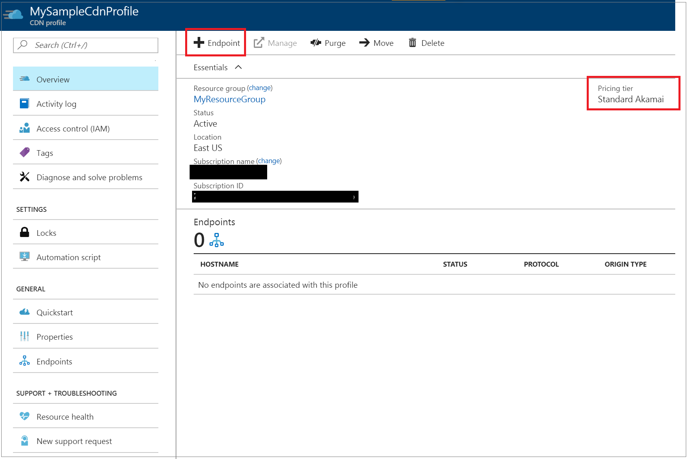
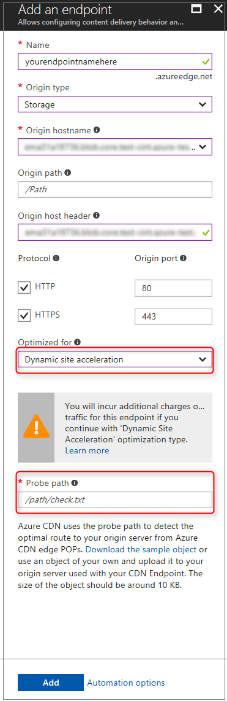

# Dynamic Site Acceleration via Azure CDN

With the explosion of social media, electronic commerce, and the hyper-personalized web, a rapidly increasing percentage of the content served to end users is generated in real-time. Users expect fast, reliable, and personalized web experiences, independent of their browser, location, device, or network. However, the very innovations that make these experiences so engaging also slow page downloads and put the quality of the consumer experience at risk. 

Standard CDN capability includes the ability to cache files closer to end users to speed up delivery of static files. However, with dynamic web applications, caching that content in edge locations isn't possible because the server generates the content in response to user behavior. Speeding up the delivery of such content is more complex than traditional edge caching and requires an end-to-end solution that finely tunes each element along the entire data path from inception to delivery. With Azure CDN Dynamic Site Acceleration (DSA), the performance of web pages with dynamic content is significantly improved.

Azure CDN from Akamai offers DSA optimization through the **Optimized for** menu during endpoint creation. This feature is not available yet for Verizon profiles, but will be coming in the near future. 

## Configuring CDN endpoint to accelerate delivery of dynamic files

You can configure your CDN endpoint to optimize delivery of dynamic files via Azure Portal by selecting the **Dynamic site acceleration** option under the **Optimized for** property selection during the endpoint creation. You can also use our REST APIs or any of the client SDKs to do this. 

### Probe path
Probe path is a feature specific to Dynamic Site Acceleration, and a valid one is required for creation. DSA uses a small *probe path* file placed on the origin to optimize network routing configurations for the CDN. You can download and upload our sample file to your site, or use an existing asset on your origin that is roughly 10KB for the probe path instead if it exists.

> [!Note]
> DSA will incur extra charges. Please see the pricing page for more information.

The screenshots below illustrate the process via Azure Portal.
 
 

*Figure 1: Adding a new CDN endpoint from the CDN Profile*
 
  

*Figure 2: Creating a CDN Endpoint with Dynamic site acceleration Optimization selected*

Once the CDN endpoint is created, it will apply the DSA optimizations for all files that match certain criteria. The following section describes this in detail.

## DSA Optimization using Azure CDN from Akamai

Dynamic Site Acceleration on Azure CDN from Akamai speeds up delivery of dynamic assets using the following techniques:

-	Route Optimization
-	TCP Optimizations
-	Object Prefetch

### Route Optimization

Route optimization is important because the internet is a very dynamic place, where traffic and temporarily outages are constantly changing the network topology. The Border Gateway Protocol (BGP) is the routing protocol of the internet, but there may be faster routes via intermediary Akamai servers. 

Route optimization chooses the most optimal path to the origin so that a site is continuously accessible and dynamic content is delivered to end-users via the fastest and most reliable route possible. The Akamai network uses techniques to collect real-time data and compare various paths through different nodes in the Akamai server, as well as the default BGP route across the open internet to determine the fastest route between the origin and the CDN edge. This avoids Internet congestion points and unnecessarily long routes. 
 
As a result, fully dynamic and transactional content is delivered more quickly and more reliably to end-users, even when it is un-cacheable. 

### TCP Optimizations

Transmission Control Protocol (TCP) is a standard of the Internet protocol suite used to deliver information between applications on an IP network.  By default, there are several back and forth requests required to setup a TCP connection, as well as limits to avoid network congestions which result in inefficiencies at scale. Azure CDN from Akamai deals with this by optimizing in 3 areas: 

 - eliminating slow start
 - leveraging persistent connections
 - tuning TCP packet parameters

#### Eliminating slow start

*Slow start* is a part of the TCP protocol that prevents network congestion by limiting the amount of data sent over the network. It starts off with small congestion window sizes between sender and receiver until the maximum is reached or packet loss is detected.

Azure CDN from Akamai eliminates slow start in 3 steps:
1.	The distributed network of edge servers reports their usage, connection health, bandwidth, and other parameters to Akamai’s Network Monitoring Systems regularly. 
2.	The consolidated reports are shared with all the Edge servers on the platform. By doing so, all Edge servers become aware of the health of the Edge servers around them. 
3.	The CDN edge servers are now able to make assumptions about some transmission parameters, such as what the optimal window size should be when communicating with other CDN edge servers in its proximity. This means that the initial congestion window size can be increased if the health of the connection between the CDN edge servers is capable of higher packet data transfers. 

#### Leveraging persistent connections

Using a CDN, fewer unique machines connect to your origin server directly compared with users connecting directly to your origin. Azure CDN from Akamai also pools user requests together to establish fewer connections with the origin.

As mentioned earlier, TCP connections take several requests back and forth in a handshake to establish a new connection. Persistent connections, also known as ‘HTTP Keep-Alive’, will reuse existing TCP connections for multiple HTTP requests to save round trip times and speed up delivery. 

#### Tuning TCP packet parameters
Azure CDN from Akamai also tunes the parameters that govern server-to-server connections, and reduces the amount of long haul round trips required to retrieve content embedded in the site by doing the following:
1.	Increasing the initial congestion window so that more packets can be went without waiting for an acknowledgement.
2.	Decreasing the initial retransmit timeout so that a loss is detected, and retransmission occurs more quickly.
3.	Decreasing the minimum and maximum retransmit timeout to reduce the wait time before assuming packets were lost in transmission.

### Object Prefetch
Most websites consist of an HTML page which references various other resources such as images and scripts. Typically, when a client requests a webpage, the browser will first download and parse the HTML object, and then make additional requests to linked assets that are required to fully load the page. 

*Prefetch* is a technique to retrieve images and scripts embedded in the HTML page while the HTML is served to the browser, and before the browser even makes these object requests. 

With prefetch the **prefetch** option turned on at the time when the CDN serves the HTML base page to the client’s browser, the CDN will parse the HTML file and make additional requests for any linked resources and store it in its cache. When the client makes the requests for the linked assets, the CDN edge server will already have the requested objects and can serve it immediately without a round trip to the origin. This optimization will benefit both cacheable and non-cacheable content.

