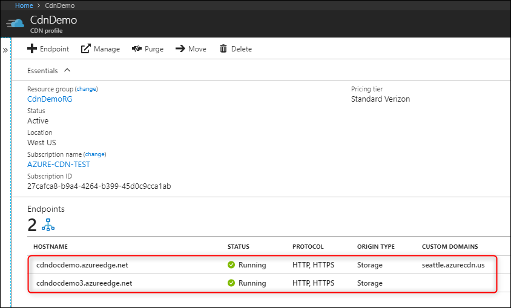
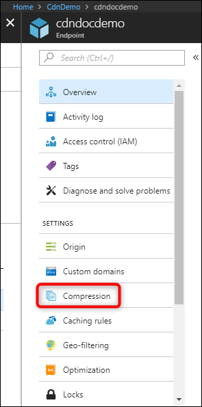
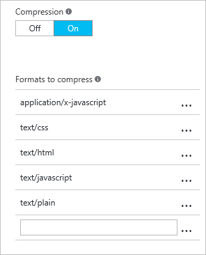
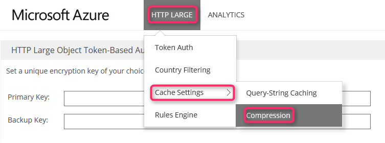
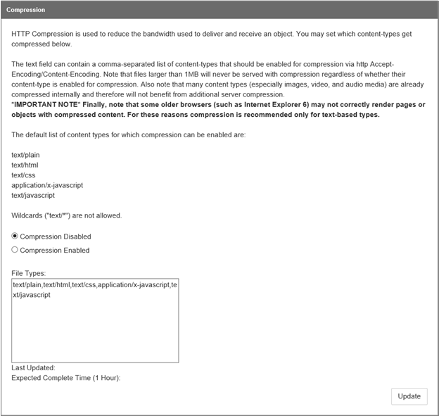

# Improve performance by compressing files in Azure CDN
File compression is a simple and effective method to improve file transfer speed and increase page-load performance by reducing a file's size before it's sent from the server. File compression can reduce bandwidth costs and provide a more responsive experience for your users.

There are two ways to enable file compression:

- Enable compression on your origin server. In this case, Azure CDN passes along the compressed files and delivers them to clients that request them.
- Enable compression directly on the CDN POP servers (*compression on the fly*). In this case, the CDN compresses the files and serves them to the end users, even if they don't get compressed by the origin server.

> [!IMPORTANT]
> Azure CDN configuration changes can take some time to propagate through the network: 
> - For **Azure CDN Standard from Microsoft** profiles, propagation usually completes in 10 minutes. 
> - For **Azure CDN Standard from Akamai** profiles, propagation usually completes within one minute. 
> - For **Azure CDN Standard from Edgio** and **Azure CDN Premium from Edgio** profiles, propagation usually completes in 10 minutes. 
> 
> If you're setting up compression for the first time for your CDN endpoint, consider waiting 1-2 hours before you troubleshoot to ensure the compression settings have propagated to the POPs.

## Enabling compression
The standard and premium CDN tiers provide the same compression functionality, but the user interface differs. For more information about the differences between standard and premium CDN tiers, see [Azure CDN Overview](cdn-overview.md).

### Standard CDN profiles 
> [!NOTE]
> This section applies to **Azure CDN Standard from Microsoft**, **Azure CDN Standard from Edgio**, and **Azure CDN Standard from Akamai** profiles.
> 
> 

1. From the CDN profile page, select the CDN endpoint you want to manage.

    

    The CDN endpoint page opens.
2. Select **Compression**.

    

    The compression page opens.
3. Select **On** to turn on compression.

    
4. Use the default MIME types, or modify the list by adding or removing MIME types.

   > [!TIP]
   > Although it is possible, it is not recommended to apply compression to compressed formats. For example, ZIP, MP3, MP4, or JPG.
   > 

5. After making your changes, select **Save**.

### Premium CDN profiles
> [!NOTE]
> This section applies only to **Azure CDN Premium from Edgio** profiles.
> 

1. From the CDN profile page, select **Manage**.

    

    The CDN management portal opens.
2. Hover over the **HTTP Large** tab, then hover over the **Cache Settings** flyout. Select **Compression**.

    

    The compression options are displayed.

    
3. Enable compression by selecting **Compression Enabled**. Enter the MIME types you want to compress as a comma-delimited list (no spaces) in the **File Types** box.

   > [!TIP]
   > Although it is possible, it is not recommended to apply compression to compressed formats. For example, ZIP, MP3, MP4, or JPG.
   > 

4. After making your changes, select **Update**.

## Compression rules

### Azure CDN Standard from Microsoft profiles

For **Azure CDN Standard from Microsoft** profiles, only eligible files are compressed. To be eligible for compression, a file must:
- Be of a MIME type that has been [configured for compression](#enabling-compression)
- Have only "identity" *Content-Encoding* headers in the origin response
- Be larger than 1 KB
- Be smaller than 8 MB

These profiles support the following compression encodings:
- gzip (GNU zip)
- brotli 

If the request supports more than one compression type, brotli compression takes precedence.

When a request for an asset specifies gzip compression and the request results in a cache miss, Azure CDN performs gzip compression of the asset directly on the POP server. Afterward, the compressed file is served  from the cache.

If the origin uses Chunked Transfer Encoding (CTE) to send compressed data to the CDN POP, then response sizes greater than 8 MB aren't supported. 

### Azure CDN from Edgio profiles

For **Azure CDN Standard from Edgio** and **Azure CDN Premium from Edgio** profiles, only eligible files are compressed. To be eligible for compression, a file must:
- Be larger than 128 bytes
- Be smaller than 3 MB

These profiles support the following compression encodings:
- gzip (GNU zip)
- DEFLATE
- bzip2
- brotli

When the HTTP request has the header `Accept-Encoding: br`, the CDN responds with an uncompressed response.

### Azure CDN Standard from Akamai profiles

For **Azure CDN Standard from Akamai** profiles, all files are eligible for compression. However, a file must be of a MIME type that has been [configured for compression](#enabling-compression).

These profiles support gzip compression encoding only. When a profile endpoint requests a gzip-encoded file, it's always requested from the origin, regardless of the client request. 

## Compression behavior tables
The following tables describe Azure CDN compression behavior for every scenario:

### Compression is disabled or file is ineligible for compression
| Client-requested format (via Accept-Encoding header) | Cached-file format | The CDN response to the client | Notes&nbsp;&nbsp;&nbsp;&nbsp;&nbsp;&nbsp;&nbsp;&nbsp;&nbsp;&nbsp;&nbsp;&nbsp;&nbsp;&nbsp;&nbsp;&nbsp;&nbsp;&nbsp;&nbsp;&nbsp;&nbsp;&nbsp;&nbsp;&nbsp;&nbsp;&nbsp;&nbsp;&nbsp;&nbsp;&nbsp;&nbsp;&nbsp;&nbsp;&nbsp;&nbsp;&nbsp;&nbsp;&nbsp;&nbsp;&nbsp;&nbsp;&nbsp;&nbsp;&nbsp;&nbsp;&nbsp;&nbsp;&nbsp;&nbsp;&nbsp; &nbsp;&nbsp;&nbsp;&nbsp;&nbsp;&nbsp;&nbsp;&nbsp;|
| --- | --- | --- | --- |
| Compressed |Compressed |Compressed | |
| Compressed |Uncompressed |Uncompressed | |
| Compressed |Not cached |Compressed or Uncompressed |The origin response determines whether CDN performs a compression. |
| Uncompressed |Compressed |Uncompressed | |
| Uncompressed |Uncompressed |Uncompressed | |
| Uncompressed |Not cached |Uncompressed | |

### Compression is enabled and file is eligible for compression
| Client-requested format (via Accept-Encoding header) | Cached-file format | CDN response to the client | Notes |
| --- | --- | --- | --- |
| Compressed |Compressed |Compressed |CDN transcodes between supported formats.  **Azure CDN from Microsoft** doesn't support transcoding between formats and instead fetches data from origin, compresses and caches separately for the format. |
| Compressed |Uncompressed |Compressed |CDN performs a compression. |
| Compressed |Not cached |Compressed |CDN performs a compression if the origin returns an uncompressed file.  **Azure CDN from Edgio** passes the uncompressed file on the first request and then compresses and caches the file for subsequent requests.  Files with the `Cache-Control: no-cache` header are never compressed. |
| Uncompressed |Compressed |Uncompressed |CDN performs a decompression.  **Azure CDN from Microsoft** doesn't support decompression and instead fetches data from origin and caches separately for uncompressed clients. |
| Uncompressed |Uncompressed |Uncompressed | |
| Uncompressed |Not cached |Uncompressed | |

## Media Services CDN Compression
For endpoints enabled for Media Services CDN streaming, compression is enabled by default for the following MIME types: 
- application/vnd.ms-sstr+xml 
- application/dash+xml
- application/vnd.apple.mpegurl
- application/f4m+xml 

## See also
* [Troubleshooting CDN file compression](cdn-troubleshoot-compression.md)    
