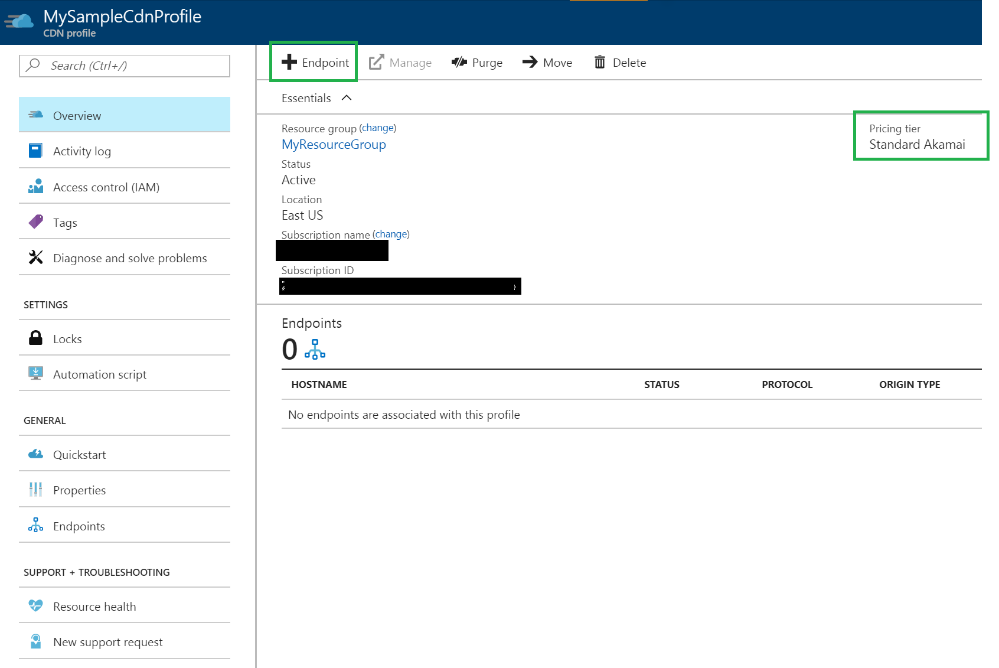
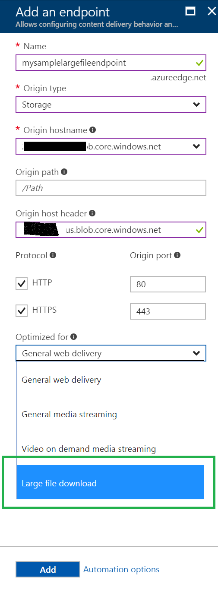

# Large File Download Optimization via Azure CDN

File sizes of content delivered over the internet have been growing steadily due to enhanced functionality, improved graphics, and riche media content. This is driven by many factors, including broadband penetration, larger inexpensive storage devices, proliferation of high-definition video, internet connected devices (IoT) etc.  Providing a faster and efficient delivery mechanism for such large files is critical to ensure smooth and enjoyable consumer experience. 

There are several challenges inherent in delivering large files. First, the average time to download a large file can be significant many applications may not download all data sequentially. In some cases, applications may download the last part of a file before the first. Therefore, when only a small amount of a file is requested, or a user pauses a download, it can result in the download either failing or being delayed until after the entire file has been retrieved from the Origin by the CDN. 

Secondly, with the proliferation of large files on the Internet, users often observe that the latency between user and the file ultimately dictates throughput or the speed at which users can view content. In addition, network congestion and capacity problems further impact throughput, and these problems, coupled with the greater distance between server and end user, create additional opportunities for packet loss to occur, further reducing quality. The reduction in quality caused by limited throughput and increased packet loss may manifest itself in a significantly increased wait time for a file download to complete. 

Finally, many large files are not  delivered in their entirety. Users may cancel a download halfway through, or watch the only the first few minutes of a long MP4 video. Therefore, it is helpful to many software and media delivery companies to deliver only the portion of a file that is requested by end user. This way, only the requested portions will be efficiently distributed to the farthest reaches of the Internet thereby reducing the egress traffic from the origin and therefore the memory and IO pressure on the origin server. 

Azure CDN from Akamai now offers a feature catered to delivering large files efficiently to end users across the globe at scale and reduced latencies while reducing the load on the origin servers. This feature is available through the “Optimized For” feature on Azure CDN Endpoint created under an Azure CDN Profile with “Standard Akamai” pricing tier.

## Configuring CDN Endpoint to optimize delivery of large files

You can configure your CDN endpoint to optimize delivery for large files via Azure Portal by simply selecting the “Large File Download” option under the “Optimized For” property selection during the endpoint creation. You can also use our REST APIs or any of the client SDKs to do this. The screenshots below illustrate the process via Azure Portal.

	
 
*Figure 1: Adding a new CDN endpoint from the CDN Profile*
 

*Figure 2: Creating a CDN Endpoint with Large File Download Optimization selected*

Once the CDN endpoint is created, it will apply the large file optimizations for all files that match certain criteria. The following section describes this in detail.

## Optimizing for delivery of large files with Azure CDN from Akamai

For Azure CDN from Akamai, you can use the large file optimization type feature to turn on network optimizations and configurations that make delivering large files faster and more responsive. General web delivery with Akamai is only able to cache files below 1.8GB, and can tunnel (not cache) files up to 150GB, while large file optimization allows files up to 150GB to be cached.

Large File Optimization is effective when certain conditions are satisfied with respect to how the origin server operates, types of files requested, and the size of the files requested. Before we get into details on each of these, it is important to understand a high-level overview of how the optimization works. 

### Object Chunking 

Azure CDN from Akamai employs a technique a  called object chunking where the CDN retrieves smaller pieces of the file from the Origin when a large file is requested. When the CDN edge/POP server receives a full or byte range file request from an end user, it first checks to see if the file type belongs to the list of file types supported for this optimization, and whether it meets the file size requirements. If the file size is greater than 10 MB, the CDN edge server starts requesting the file from the origin server in chunks of 2MB. Once the chunk arrives at the CDN edge, it gets cached and immediately gets served to the end user, while the CDN ‘pre-fetches’ the next chunk in parallel This “prefetch” ensures the content is available sooner by staying one chunk ahead of the user and reducing latency to the end user. This process continues until the entire file is downloaded (if the end user requested the entire file),  until all requested byte ranges are available (if the end user requested byte ranges), or the client terminates the connection. 

Details of the byte range request can be found in the [RFC 7233](https://tools.ietf.org/html/rfc7233).

The CDN will cache any chunks as they are received, and doesn’t require the entire file be cached on the CDN cache. Subsequent requests for the file or byte ranges will be served from the CDN cache, and will use ‘prefetch’ to request chunks from the origin if not all chunks are cached on the CDN. As can be seen, this optimization relies on the origin server supporting byte range requests. _If the origin server does not support byte range requests, this optimization will not be effective._ 

### Caching
Large Files use different default caching expiration times than for General Delivery. It differentiates between positive caching and negative caching based on HTTP response codes. If the origin specifies a time using an expiration time via Cache-Control or Expires header in the response, the CDN will always honor that value. When the origin doesn’t specify, and the file matches the file type and file size conditions list for this optimization type, the CDN will use the default values for large file optimization. Otherwise, the CDN will use defaults for general web delivery.

 
|    | General web | Large file optimization 
--- | --- | --- 
Caching - Positive   HTTP 200, 203, 300,   301, 302, and 410 | 7 days |1 day  
Caching - Negative   HTTP 204, 305, 404,   and 405 | none | 1 second 

### Dealing with Origin Failure

In the large file optimization type, the origin read-timeout length is increased from 2 seconds in general web delivery to 2 minutes to account for the larger file sizes to not prematurely timeout a connection.

As with general web delivery, when a connection times out, we will retry a certain number of times before sending a 504 Gateway Time-out error to the client. 

### Conditions for large file optimization

The following table lists the set of criteria to be satisfied for large file optimization:

Condition | Values 
--- | --- 
Supported File Types | 3g2, 3gp, asf, avi, bz2, dmg, exe, f4v, flv,   gz, hdp, iso, jxr, m4v, mkv, mov, mp4,   mpeg, mpg, mts, pkg, qt, rm, swf, tar,   tgz, wdp, webm, webp, wma, wmv, zip  
Minimum File Size | 10 MB 
Maximum File Size | 150 GB 
Origin Server Characteristics | Must support byte range requests 

## Optimizing for delivery of large files with Azure CDN from Verizon

Azure CDN from Verizon is able to delivery large files without a cap on file size, and has various features that make delivery of large files faster turned on by default.

### Complete Cache Fill

Azure CDN from Verizon has a default feature called Complete Cache Fill in which the CDN will pull a file into cache when the initial request is abandoned or lost. 

This feature is most useful for large assets where users will not typically download them from start to finish (e.g., progressive download videos). As a result, this feature is enabled by default with Azure CDN from Verizon. This default behavior is to force the edge server to initiate a background fetch of the asset from the origin server. After which, the asset will be in the edge server's local cache. Once the full object is in cache, the edge can fulfill byte-range requests to the CDN for the cached object.

The default Complete Cache Fill behavior can be disabled through Rules Engine in the Verizon Premium tier.

### Peer Cache Fill Hotfiling

This is a default feature of Azure CDN from Verizon, in which a sophisticated proprietary algorithm may leverage additional edge caching servers based on metrics such as bandwidth and aggregate requests to fulfill client requests for large, highly popular objects. This prevents a situation in which large numbers of extra requests would be sent to a customer’s origin server. 

## Conditions for large file optimization

The optimization features for Verizon are turned on by default, and there are no limits on maximum file size. 

## Additional Considerations

There are a few additional aspects to be considered while using this optimization type.
 
### Azure CDN from Akamai

- The chunking process results in additional requests to the origin server, but the overall volume of data delivered from the origin will be considerably smaller since chunking results in better caching characteristics at the CDN.
- There will also be an added benefit of reduced memory and IO pressure at the origin because of delivering smaller pieces of the file. 
- For the chunks that are cached at the CDN, there will not be additional requests to the origin until the content expires from the cache or it is evicted from the cache due to other reasons. 
- The user can make range requests to the CDN and they will just be treated like any normal file. Optimization will only apply if it is a valid file type and the byte range is between 10MB and 150GB.If your average file size requested is smaller than 10MB, you may want to use general web delivery instead.

### Azure CDN from Verizon

The general web delivery optimization is capable of delivery large files.
