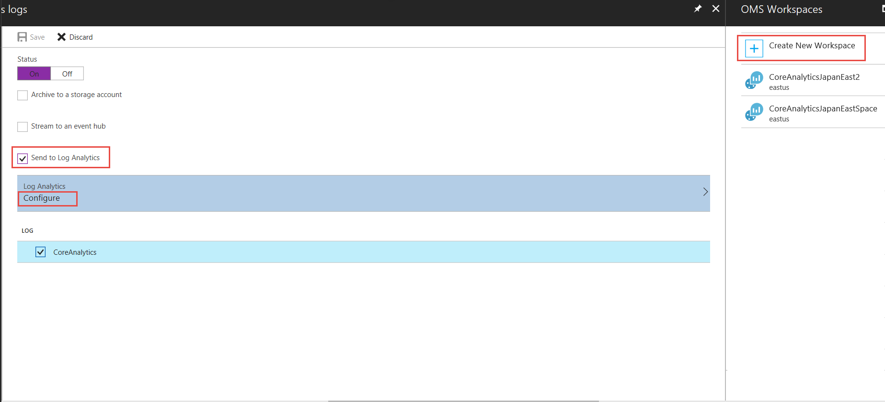

# Log analytics for Azure CDN

After enabling CDN for your application, you will likely want to monitor the CDN usage, check the health of your delivery and troubleshoot potential issues. Azure CDN provides these capabilities and metrics with core analytics. 

As a current Azure CDN user with Verizon standard or premium profile, you can view core analytics in the supplemental portal accessible via "Manage" from the Azure portal. With this new [Diagnostic logs](https://docs.microsoft.com/azure/monitoring-and-diagnostics/monitoring-overview-of-diagnostic-logs) feature, you can now save core analytics as logs in a storage account, event hub, and/or [log analytics (OMS) workspace](https://docs.microsoft.com/en-us/azure/log-analytics/log-analytics-get-started) for both Azure CDN from Verizon and Akamai users.


## Enable logging with Azure portal

The diagnostics logs are turned **off** by default. Follow the steps below to enable them:


Sign in to the [Azure portal](http://portal.azure.com). If you don't already have CDN enabled for your workflow, [Enable Azure CDN](cdn-create-new-endpoint.md) before you continue.

1. In the portal, navigate to **CDN profile**.
2. Select a CDN profile, then select the CDN endpoint that you want to enable **Diagnostics Logs**.
	
3. Go to **Diagnostics Logs** blade Under **Monitoring**, then change the status to **On**.
	
4. Select and configure the desired archival target (storage account, event hub, Log Analytics). 
	
	In this example, Log Analytics is used to store the logs, select **Send to Log Analytics**, click **Configure** under **Log Analytics** to configure your OMS workspace. And click **CoreAnalytics** under **Log**.
	
5.  Save the new diagnostics configuration.

	Once saved, the configuration will take about 10 minutes to take effect and after that logs will start appearing in the configured archival target.

## Enable logging with PowerShell

Below are two examples on how to enable and get Diagnostic Logs via the Azure PowerShell Cmdlets.

###Enabling Diagnostic Logs in a Storage Account

To Enable Diagnostic Logs in a Storage Account, use this command:

```powershell
    Set-AzureRmDiagnosticSetting -ResourceId "/subscriptions/{subscriptionId}/resourcegroups/{resourceGroupName}/providers/Microsoft.Cdn/profiles/{profileName}/endpoints/{endpointName}" -StorageAccountId "/subscriptions/{subscriptionId}/resourceGroups/{resourceGroupName}/providers/Microsoft.ClassicStorage/storageAccounts/{storageAccountName}" -Enabled $true -Categories CoreAnalytics
```

To Get Diagnostic Logs from a Storage Account, use this command:

```powershell
    Get-AzureRmDiagnosticSetting -ResourceId "/subscriptions/{subscriptionId}/resourcegroups/{resourceGroupName}/providers/Microsoft.Cdn/profiles/{profileName}/endpoints/{endpintName}"
```

###Enabling Diagnostic Logs in an OMS workspace (Log Analytics)


To Enable Diagnostic Logs in an OMS workspace, use this command:

```powershell
    Set-AzureRmDiagnosticSetting -ResourceId "/subscriptions/{subscriptionId}/resourcegroups/{resourceGroupName}/providers/Microsoft.Cdn/profiles/{profileName}/endpoints/{endpointName}" -WorkspaceId "/subscriptions/{subscriptionId}/resourceGroups/{resourceGroupName}/providers/Microsoft.OperationalInsights/workspaces/{omsWorkspaceName}" -Enabled $true -Categories CoreAnalytics
```

To Get Diagnostic Logs from an OMS workspace, use this command:

```powershell
    Get-AzureRmDiagnosticSetting -ResourceId "/subscriptions/{subscriptionId}/resourcegroups/{resourceGroupName}/providers/Microsoft.Cdn/profiles/{profileName}/endpoints/{endpointName}"
```

## Diagnostic logs category

The available log category with Azure CDN is CoreAnalytics.

**CoreAnalytics:** capture the metrics of your CDN delivery, including usage, errors, hits, cache efficiency, etc, for a richer view into CDN core analytics. Core analytics has hourly granularity for both Azure CDN from Verizon and Akamai. Data is delayed for one hour with Verizon and 24 hour with Akamai. 

## Diagnostic logs schema
All logs are stored in JSON format and each entry has string fields following the below format:

#### Example Archive log

```json
{
     "DomainName": "manlingakamaitest2.azureedge.net",
     "RequestCountTotal": 480,
     "RequestCountHttpStatus2xx": 480,
     "RequestCountHttpStatus3xx": 0,
     "RequestCountHttpStatus4xx": 0,
     "RequestCountHttpStatus5xx": 0,
     "RequestCountHttpStatusOthers": 0,
     "RequestCountHttpStatus200": 480,
     "RequestCountHttpStatus206": 0,
     "RequestCountHttpStatus302": 0,
     "RequestCountHttpStatus304": 0,
     "RequestCountHttpStatus404": 0,
     "RequestCountCacheHit": null,
     "RequestCountCacheMiss": null,
     "RequestCountCacheNoCache": null,
     "RequestCountCacheUncacheable": null,
     "RequestCountCacheOthers": null,
     "EgressTotal": 0.09,
     "EgressHttpStatus2xx": null,
     "EgressHttpStatus3xx": null,
     "EgressHttpStatus4xx": null,
     "EgressHttpStatus5xx": null,
     "EgressHttpStatusOthers": null,
     "EgressCacheHit": null,
     "EgressCacheMiss": null,
     "EgressCacheNoCache": null,
     "EgressCacheUncacheable": null,
     "EgressCacheOthers": null
}

```
## Additional resources

* [Azure Diagnostic logs](https://docs.microsoft.com/azure/monitoring-and-diagnostics/monitoring-overview-of-diagnostic-logs)
* [Core analytics via Azure CDN supplemental portal](https://docs.microsoft.com/en-us/azure/cdn/cdn-analyze-usage-patterns)


