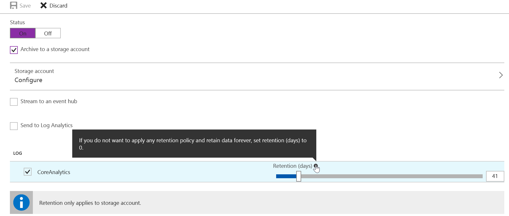

# Diagnostics Logs for Azure CDN

After enabling CDN for your application, you will likely want to monitor the CDN usage, check the health of your delivery, and troubleshoot potential issues. Azure CDN provides these capabilities with [core analytics](cdn-analyze-usage-patterns.md).

As a current Azure CDN user with Verizon standard or premium profile, you are already able to view core analytics in the supplemental portal accessible via the "Manage" option from the Azure portal. With this new [Diagnostic Logs](https://docs.microsoft.com/azure/monitoring-and-diagnostics/monitoring-overview-of-diagnostic-logs) feature, you can now view core analytics and save them into one or more destinations including Azure Storage account, Azure Event hub, and/or [Log Analytics (OMS) workspace](https://docs.microsoft.com/azure/log-analytics/log-analytics-get-started). This feature is available for all CDN endpoints belonging to Verizon (Standard & Premium) and Akamai (Standard) CDN Profiles.

Diagnostics logs allows you to export basic usage metrics from your CDN endpoint to a variety of sources so that you can consume them in a customized way. For example you can do the following:

- Export data to blob storage, export to CSV, and generate graphs in excel.
- Export data to event hubs and correlate with data from other azure services.
- Export data to log analytics and view data in your own OMS work space


The walkthrough below will go through the schema of the core analytics data, steps involved in enabling the feature and delivering them to various destinations, and consuming from these destinations.

## Enable logging with Azure portal

The diagnostics logs are turned **off** by default. Follow the steps below to enable them:


Sign in to the [Azure portal](http://portal.azure.com). If you don't already have CDN enabled for your workflow, [Enable Azure CDN](cdn-create-new-endpoint.md) before you continue.

1. In the portal, navigate to **CDN profile**.
2. Select a CDN profile, then select the CDN endpoint that you want to enable **Diagnostics Logs**.
	
3. Go to **Diagnostics Logs** blade Under **Monitoring** section, then change the status to **On**.
	
4. Select and configure the desired archival target (Storage Account, Event Hub, Log Analytics). 
	
	In this example, Azure Storage is used to store the logs, select **Archive to a storage account**, select retention days, and click **CoreAnalytics** under **Log**. We only offer **CoreAnalytics** currently, but more log types will be coming in the future. See below for schema, aggregation, and delay information on CoreAnalytics. 

	
5.  Save the new diagnostics configuration.
	
	Verizon log data is 1 hour delayed, and take up to 2 hours to start appearing after endpoint propagation completion.
	Akamai log data is 24 hours delayed, and takes up to 2 hours to start appearing if it was created more than 24 hours ago. If it was just created, it can take up to 25 hours for the logs to start appearing.

## Enable logging with PowerShell

Below are two examples on how to enable and get Diagnostic Logs via the Azure PowerShell Cmdlets.

###Enabling Diagnostic Logs in a Storage Account

To Enable Diagnostic Logs in a Storage Account, use this command:

```powershell
    Set-AzureRmDiagnosticSetting -ResourceId "/subscriptions/{subscriptionId}/resourcegroups/{resourceGroupName}/providers/Microsoft.Cdn/profiles/{profileName}/endpoints/{endpointName}" -StorageAccountId "/subscriptions/{subscriptionId}/resourceGroups/{resourceGroupName}/providers/Microsoft.ClassicStorage/storageAccounts/{storageAccountName}" -Enabled $true -Categories CoreAnalytics
```

## Consuming logs from storage
This section describes the schema of the CDN core analytics, how these are organized inside of an Azure Storage Account and provides sample code to download the logs into a CSV file.

### Using Microsoft Azure Storage Explorer
Before you can access the core analytics data from the Azure Storage Account, you first need a tool to access the contents in a storage account. While there are several tools available in the market, the one that we recommend is the Microsoft Azure Storage Explorer. You can download the tool from [here](http://storageexplorer.com/). After downloading and installing the software, please configure to use the same Azure Storage Account that was configured as a destination to the CDN Diagnostics Logs.

1.	Open **Microsoft Azure Storage Explorer**
2.	Locate the storage account
3.	Go to the **“Blob Containers”** node under this storage account and expand the node
4.	Select the container named **“insights-logs-coreanalytics”** and double click on it
5.	Results show up on the right-hand pane starting with the first level which looks like **“resourceId=”**. Continue clicking all the way until you see the file **PT1H.json**. See note below for explanation of the path.
6.	Each blob **PT1H.json** represents the analytics logs for one hour for a specific CDN endpoint or its custom domain.
7.	The schema of the contents of this JSON file is described in the section Schema of the Core Analytics Logs


> [!NOTE]
> **Blob path format**
> 
> Core Analytics logs are generated every hour. All data for an hour are collected and stored inside a single Azure Blob as a JSON payload. The path to this Azure Blob appears as if there is a hierarchical structure. This is because the Storage explorer tool interprets '/' as a directory separator and shows the hierarchy for convenience. Actually, the whole path just represents the blob name. This name of the blob follows the following naming convention	
	
	resourceId=/SUBSCRIPTIONS/{Subscription Id}/RESOURCEGROUPS/{Resource Group Name}/PROVIDERS/MICROSOFT.CDN/PROFILES/{Profile Name}/ENDPOINTS/{Endpoint Name}/ y={Year}/m={Month}/d={Day}/h={Hour}/m={Minutes}/PT1H.json

**Description of fields:**

|value|description|
|-------|---------|
|Subscription Id	|Id of the Azure Subscription. This is in the Guid format.|
|Resource |Group Name	Name of the resource group to which the CDN resources belong.|
|Profile Name |Name of the CDN Profile|
|Endpoint Name |Name of the CDN Endpoint|
|Year|	4 digit representation of the year e.g. 2017|
|Month|	2 digit representation of the month number. 01=January.. 12=December|
|Day|	2 digit representation of the day of the month|
|PT1H.json|	Actual JSON file where the analytics data is stored|

### Exporting the Core Analytics Data to a CSV File

To make it easy to access the Core Analytics, we provide a sample code for a tool, which allows downloading the JSON files into a flat comma separated file format which can be used to easily create charts or other aggregations.

Here is how you can use the tool:

1.	Visit the github link: [https://github.com/Azure-Samples/azure-cdn-samples/tree/master/CoreAnalytics-ExportToCsv ](https://github.com/Azure-Samples/azure-cdn-samples/tree/master/CoreAnalytics-ExportToCsv )
2.	Download the code
3.	Follow instructions to compile and configure
4.	Run the tool
5.	Resulting CSV file shows the analytics data in a simple flat hierarchy.

## Diagnostic logs types

We currently offer only the Core Analytics logs which contains metrics showing HTTP response statistics and egress statistics as seen from the CDN POPs/edges. Over time, we will add additional types of logs.

### Core Analytics Metrics Details
Below is a list of metrics available in the Core Analytics logs. Not all metrics are available from all providers, although such differences are minimal. The table below also shows if a given metric is available from a provider. Please note that the metrics are available for only those CDN endpoints that have traffic on them.


|Metric                     | Description   | Verizon  | Akamai 
|---------------------------|---------------|---|---|
| RequestCountTotal         |Total number of request hits during this period| Yes  |Yes   |
| RequestCountHttpStatus2xx |Count of all requests that resulted in a 2xx HTTP code (e.g. 200, 202)              | Yes  |Yes   |
| RequestCountHttpStatus3xx | Count of all requests that resulted in a 3xx HTTP code (e.g. 300, 302)              | Yes  |Yes   |
| RequestCountHttpStatus4xx |Count of all requests that resulted in a 4xx HTTP code (e.g. 400, 404)               | Yes   |Yes   |
| RequestCountHttpStatus5xx | Count of all requests that resulted in a 5xx HTTP code (e.g. 500, 504)              | Yes  |Yes   |
| RequestCountHttpStatusOthers |  Count of all other HTTP codes (outside of 2xx-5xx) | Yes  |Yes   |
| RequestCountHttpStatus200 | Count of all requests that resulted in a 200 HTTP code response              |No   |Yes   |
| RequestCountHttpStatus206 | Count of all requests that resulted in a 206 HTTP code response              |No   |Yes   |
| RequestCountHttpStatus302 | Count of all requests that resulted in a 302 HTTP code response              |No   |Yes   |
| RequestCountHttpStatus304 |  Count of all requests that resulted in a 304 HTTP code response             |No   |Yes   |
| RequestCountHttpStatus404 | Count of all requests that resulted in a 404 HTTP code response              |No   |Yes   |
| RequestCountCacheHit |Count of all requests that resulted in a Cache Hit. This means the asset was served directly from the POP to the Client.               | Yes  |No   |
| RequestCountCacheMiss | Count of all requests that resulted in a Cache Miss. This means the asset was not found on the POP closest to the client, and therefore was retrieved from the Origin.              |Yes   | No  |
| RequestCountCacheNoCache | Count of all requests to an asset that are prevented from being cached due to a user configuration on the edge.              |Yes   | No  |
| RequestCountCacheUncacheable | Count of all requests to assets that are prevented from being cached by the asset's Cache-Control and Expires headers, which indicate that it should not be cached on a POP or by the HTTP client                |Yes   |No   |
| RequestCountCacheOthers | Count of all requests with cache status not covered by above.              |Yes   | No  |
| EgressTotal | Outbound data transfer in GB              |Yes   |Yes   |
| EgressHttpStatus2xx | Outbound data transfer* for responses with 2xx HTTP status codes in GB            |Yes   |No   |
| EgressHttpStatus3xx | Outbound data transfer for responses with 3xx HTTP status codes in GB              |Yes   |No   |
| EgressHttpStatus4xx | Outbound data transfer for responses with 4xx HTTP status codes in GB               |Yes   | No  |
| EgressHttpStatus5xx | Outbound data transfer for responses with 5xx HTTP status codes in GB               |Yes   |  No |
| EgressHttpStatusOthers | Outbound data transfer for responses with other HTTP status codes in GB                |Yes   |No   |
| EgressCacheHit |  Outbound data transfer for responses that were delivered directly from the CDN cache on the CDN POPs/Edges	|Yes   |  No |
| EgressCacheMiss | Outbound data transfer for responses that were not found on the nearest POP server, and retrieved from the origin server              |Yes   |  No |
| EgressCacheNoCache | Outbound data transfer for assets that are prevented from being cached due to a user configuration on the edge.                |Yes   |No   |
| EgressCacheUncacheable | Outbound data transfer for assets that are prevented from being cached by the asset's Cache-Control and/or Expires headers, which indicate that it should not be cached on a POP or by the HTTP client                    |Yes   | No  |
| EgressCacheOthers |  Outbound data transfers for other cache scenarios.             |Yes   | No  |

*Outbound data transfer refers to traffic delivered from CDN POP servers to the client.


### Schema of the Core Analytics Logs 

All logs are stored in JSON format and each entry has string fields following the below schema:

```json
    "records": [
        {
            "time": "2017-04-27T01:00:00",
            "resourceId": "<ARM Resource Id of the CDN Endpoint>",
            "operationName": "Microsoft.Cdn/profiles/endpoints/contentDelivery",
            "category": "CoreAnalytics",
            "properties": {
                "DomainName": "<Name of the domain for which the statistics is reported>",
                "RequestCountTotal": integer value,
                "RequestCountHttpStatus2xx": integer value,
                "RequestCountHttpStatus3xx": integer value,
                "RequestCountHttpStatus4xx": integer value,
                "RequestCountHttpStatus5xx": integer value,
                "RequestCountHttpStatusOthers": integer value,
                "RequestCountHttpStatus200": integer value,
                "RequestCountHttpStatus206": integer value,
                "RequestCountHttpStatus302": integer value,
                "RequestCountHttpStatus304": integer value,
                "RequestCountHttpStatus404": integer value,
                "RequestCountCacheHit": integer value,
                "RequestCountCacheMiss": integer value,
                "RequestCountCacheNoCache": integer value,
                "RequestCountCacheUncacheable": integer value,
                "RequestCountCacheOthers": integer value,
                "EgressTotal": double value,
                "EgressHttpStatus2xx": double value,
                "EgressHttpStatus3xx": double value,
                "EgressHttpStatus4xx": double value,
                "EgressHttpStatus5xx": double value,
                "EgressHttpStatusOthers": double value,
                "EgressCacheHit": double value,
                "EgressCacheMiss": double value,
                "EgressCacheNoCache": double value,
                "EgressCacheUncacheable": double value,
                "EgressCacheOthers": double value,
            }
        }

    ]
}
```

Where the ‘time’ represents the start time of the hour boundary for which the statistics is reported. Please note that when a metric is not supported by a CDN provider, instead of a double or integer value, there will be a null value. This null value indicates the absence of a metric, and this is different from a 0 value. Also note that there will be one set of these metrics per domain configured on the endpoint.

Example properties below:

```json
{
     "DomainName": "manlingakamaitest2.azureedge.net",
     "RequestCountTotal": 480,
     "RequestCountHttpStatus2xx": 480,
     "RequestCountHttpStatus3xx": 0,
     "RequestCountHttpStatus4xx": 0,
     "RequestCountHttpStatus5xx": 0,
     "RequestCountHttpStatusOthers": 0,
     "RequestCountHttpStatus200": 480,
     "RequestCountHttpStatus206": 0,
     "RequestCountHttpStatus302": 0,
     "RequestCountHttpStatus304": 0,
     "RequestCountHttpStatus404": 0,
     "RequestCountCacheHit": null,
     "RequestCountCacheMiss": null,
     "RequestCountCacheNoCache": null,
     "RequestCountCacheUncacheable": null,
     "RequestCountCacheOthers": null,
     "EgressTotal": 0.09,
     "EgressHttpStatus2xx": null,
     "EgressHttpStatus3xx": null,
     "EgressHttpStatus4xx": null,
     "EgressHttpStatus5xx": null,
     "EgressHttpStatusOthers": null,
     "EgressCacheHit": null,
     "EgressCacheMiss": null,
     "EgressCacheNoCache": null,
     "EgressCacheUncacheable": null,
     "EgressCacheOthers": null
}

```
## Additional resources

* [Azure Diagnostic logs](https://docs.microsoft.com/azure/monitoring-and-diagnostics/monitoring-overview-of-diagnostic-logs)
* [Core analytics via Azure CDN supplemental portal](https://docs.microsoft.com/azure/cdn/cdn-analyze-usage-patterns)

